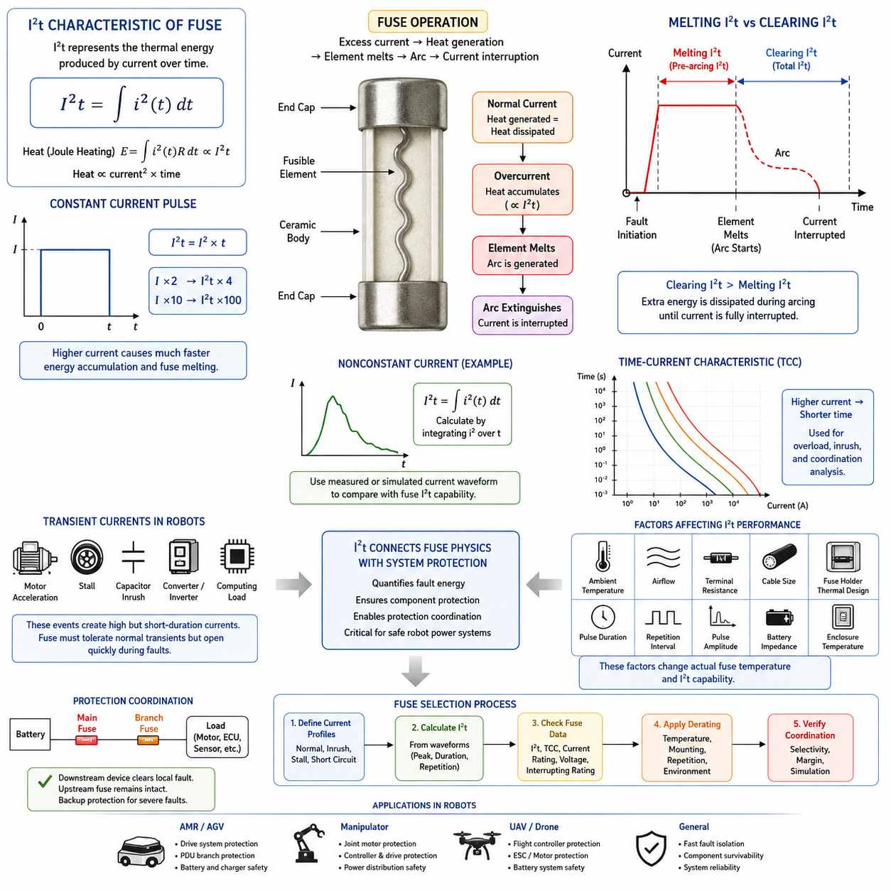
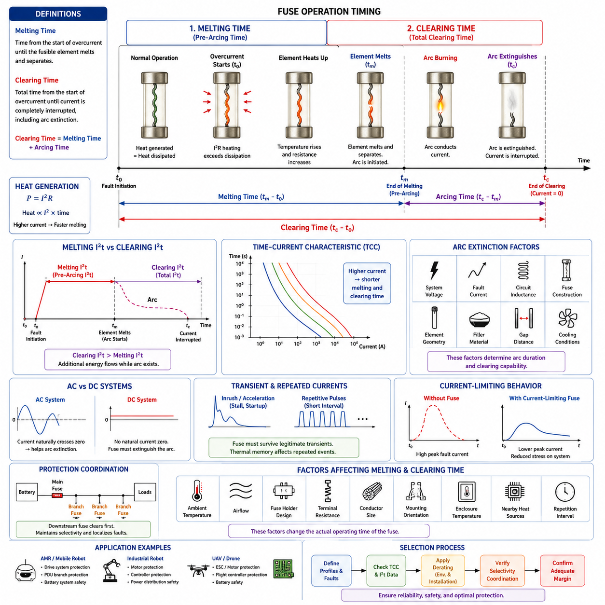
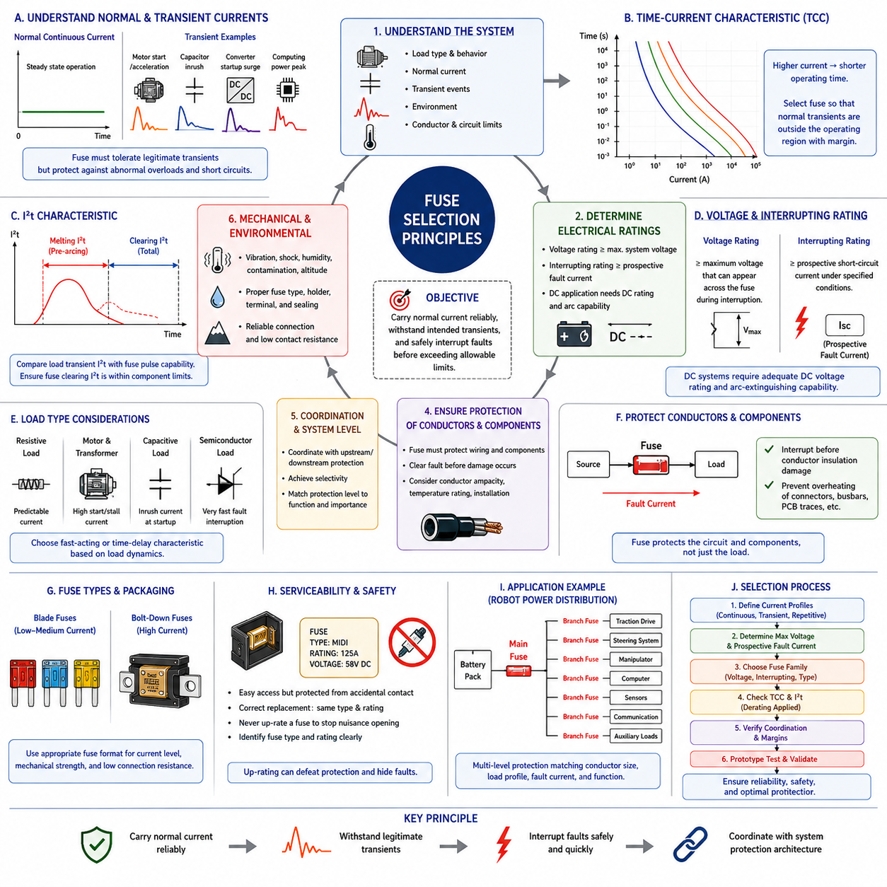
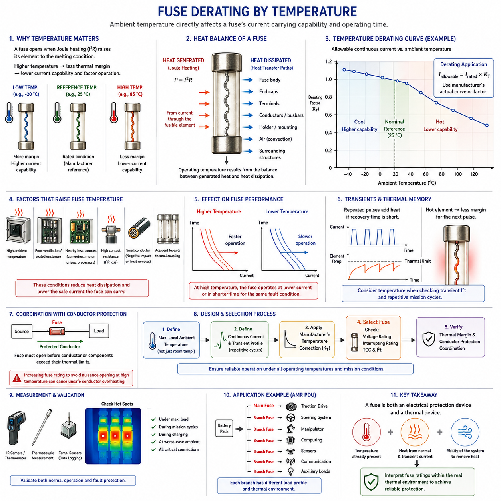
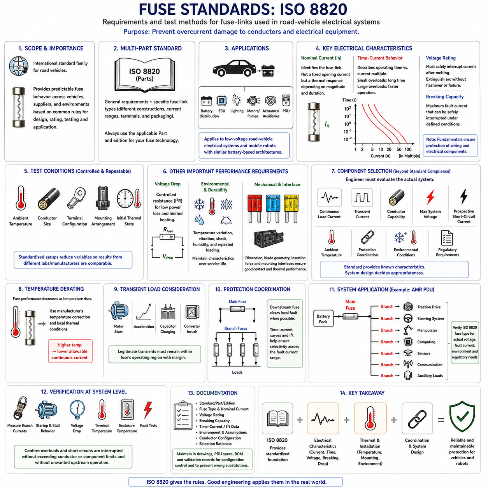

**Volume 04. Fuse, Relay, and Power Distribution Unit**

# Chapter 01. Fuse Theory

## 01.01. I²t Characteristic

{width="7.268055555555556in" height="7.268055555555556in"}

I²t 특성(I²t characteristic)은 과전류(overcurrent)가 퓨즈(fuse)에 가하는 열에너지(thermal energy)를 설명하는 특성으로, 퓨즈의 동작을 이해하는 데 사용되는 가장 기본적인 매개변수 중 하나이다. 이 용어는 시간에 대한 전류 제곱의 적분을 의미하며, 수학적으로 I²t = ∫i²(t)dt로 표현된다. 저항 발열(resistive heating)은 전류의 제곱에 비례하기 때문에 비교적 짧은 고전류 펄스(high-current pulse)도 퓨즈 소자(fuse element)에 상당한 열에너지를 발생시킬 수 있다.

퓨즈(fuse)는 과도한 전류를 의도적으로 설계된 가용 소자(fusible element) 내부의 열로 변환하여 전기 회로를 보호한다. 정상 동작 조건에서는 발생하는 열이 퓨즈 본체, 단자, 배선 및 주변 환경으로 방출되는 열과 균형을 이룬다. 그러나 전류가 충분히 증가하면 열이 방출되는 속도보다 빠르게 축적되고, 이에 따라 소자의 온도가 융점(melting point)까지 상승하여 결국 회로를 차단하게 된다.

I²t의 물리적 기반은 줄 발열(Joule heating)과 연관하여 이해할 수 있다. 저항 R에 전류 i(t)가 흐르는 경우 발생하는 열에너지는 대략 E = ∫i²(t)Rdt로 표현된다. 짧은 시간 동안 퓨즈 저항이 거의 일정하다고 가정하면 에너지는 I²t에 비례한다. 그러나 실제 퓨즈의 저항은 소자가 가열되면서 크게 변화하므로, I²t는 퓨즈의 완전한 열역학 모델(thermodynamic model)이라기보다 실용적인 보호 매개변수(protection parameter)로 이해해야 한다.

일정한 전류 펄스(constant current pulse)의 경우 관계식은 I²t = I² × t로 단순화된다. 이 관계는 전류의 크기가 퓨즈 동작에 얼마나 강한 영향을 미치는지를 직접적으로 보여준다. 전류가 두 배가 되면 동일한 시간 동안 축적되는 I²t는 네 배가 되고, 전류가 열 배가 되면 I²t는 백 배가 된다. 따라서 심각한 단락(short circuit)은 지속 시간이 수 밀리초에 불과하더라도 퓨즈 소자를 매우 빠르게 용단시킬 수 있다.

퓨즈 사양에서는 일반적으로 용단 I²t(melting I²t)와 차단 I²t(clearing I²t)를 구분한다. 때때로 아크 발생 전 I²t(pre-arcing I²t)라고도 하는 용단 I²t는 고장이 시작된 시점부터 퓨즈 소자가 녹아 아크(arc)가 발생하기 시작하는 시점까지 축적된 전류 제곱-시간 적분값을 의미한다. 차단 I²t는 고장 발생부터 전류가 완전히 차단될 때까지의 전체 적분값을 의미한다.

이러한 구분이 중요한 이유는 퓨즈 소자가 용단되었다고 해서 전류가 즉시 0이 되는 것은 아니기 때문이다. 도전성 소자가 분리된 후에도 특히 고전류 또는 고전압 회로에서는 개방된 간극 사이에서 전기 아크(electrical arc)가 지속될 수 있다. 퓨즈는 전류 차단을 완료하기 전에 이 아크를 소호해야 한다. 따라서 전체 차단 I²t(total clearing I²t)는 일반적으로 용단 I²t보다 크며, 보호 대상 부품에 가해지는 열적 스트레스(thermal stress)를 평가할 때 두 값 모두 중요할 수 있다.

I²t 정격(I²t rating)은 독립적인 하나의 수치로 해석하기보다 퓨즈의 시간-전류 특성(time-current characteristic)과 함께 해석해야 한다. 시간-전류 곡선(time-current curve)은 정격 전류의 다양한 배수에서 퓨즈가 얼마나 빠르게 동작하는지를 나타내며, I²t는 고장 사건을 에너지 관점에서 표현한다. 시간-전류 곡선은 특히 과부하(overload) 동작을 평가하는 데 유용하고, I²t는 단시간 서지(short-duration surge), 반도체 보호, 단락 및 보호장치 간 협조를 분석할 때 특히 유용하다.

올바르게 선정된 퓨즈는 정상적인 과도 전류(transient current)를 불필요한 차단 없이 견딜 수 있어야 한다. 모터, DC/DC 컨버터(DC/DC converter), 용량성 부하(capacitive load), 인버터(inverter), 컴퓨팅 시스템 및 액추에이터 드라이브(actuator drive)는 정상 정상상태 전류보다 상당히 높은 일시적 전류를 발생시킬 수 있다. 과도 상태의 I²t가 퓨즈의 허용 펄스 능력에 접근하거나 이를 초과하면 정상 동작 전류가 정격 범위에 있더라도 반복적인 기동 과정에서 퓨즈 소자가 열화되거나 불필요하게 차단될 수 있다.

이러한 특성은 로봇 전력 시스템(robotic power system)에서 특히 중요하다. 모터 드라이브(motor drive)는 가속 피크(acceleration peak), 휠 스톨(wheel stall), 회생 전환(regenerative transition), 급격한 토크 변화 과정에서 높은 전류를 발생시킬 수 있기 때문이다. 동시에 DC 링크 커패시터(DC-link capacitor)와 전자 부하는 시스템에 전원이 인가될 때 상당한 돌입 전류(inrush current)를 발생시킬 수 있다. 따라서 퓨즈 선정에서는 단순히 퓨즈의 전류 정격과 로봇의 평균 소비전류를 비교하는 것이 아니라 실제 전류 파형을 평가해야 한다.

일정하지 않은 과도 전류 파형(nonconstant transient waveform)의 경우 I²t는 순간 전류(instantaneous current)의 제곱을 시간에 대해 적분하여 결정해야 한다. 공학적 계산에서는 측정된 전류 샘플을 충분히 작은 시간 간격으로 나누어 i²Δt를 합산하는 방식으로 근사할 수 있다. 이를 통해 기동 전류 측정값, 모터 전류 로그 또는 시뮬레이션된 고장 파형을 에너지 관련 값으로 변환하고, 지정된 동작 조건에 해당하는 제조업체의 퓨즈 데이터와 비교할 수 있다.

반복 펄스(repeated pulse)는 퓨즈가 각 사건 사이에서 초기 열 상태로 완전히 복귀하지 못할 수 있기 때문에 추가적인 검토가 필요하다. 하나의 펄스가 해당 I²t 한계보다 낮다는 사실만으로 무제한적인 반복 동작이 보장되지는 않는다. 펄스 크기, 지속시간, 반복 간격, 주변 온도, 공기 흐름, 단자 저항, 도체 크기 및 퓨즈 홀더(fuse holder)의 열적 거동이 실제 소자 온도에 영향을 미친다. 따라서 반복 동작 응용에서는 적절한 열 및 펄스 디레이팅(thermal and pulse derating)이 필요하다.

주변 온도(ambient temperature) 역시 전류와 퓨즈 동작 사이의 실질적인 관계를 변화시킨다. 고온의 인클로저(enclosure)에서 동작하는 퓨즈는 이미 용단에 필요한 열 상태에 더 가까운 상태에서 시작하는 반면, 저온 환경의 퓨즈는 열을 더욱 효과적으로 방출할 수 있다. 배터리, 모터 컨트롤러, 컨버터 또는 밀폐형 전자장치 주변에 설치된 전력분배장치(PDU)는 실험실의 상온 조건과 크게 다른 온도에서 동작할 수 있으므로 제조업체의 온도 디레이팅(temperature derating) 정보를 반드시 고려해야 한다.

I²t는 보호 협조(protection coordination)에도 유용하다. 일반적으로 하위 보호장치(downstream protective device)가 국부적인 고장을 안전하게 차단할 수 있는 경우 상위 퓨즈(upstream fuse)는 정상 상태를 유지하면서 더욱 심각한 고장에는 백업 보호를 제공해야 한다. 시간-전류 동작과 적용 가능한 I²t 특성을 비교하면 보호 계층 간에 충분한 선택성(selectivity)이 확보되어 있는지를 판단할 수 있다. 이는 구동, 컴퓨팅, 센싱, 통신 및 보조 장치가 별도 분기된 PDU에서 특히 중요하다.

반도체 장치(semiconductor device)의 보호는 특히 까다로운 I²t 응용 분야이다. 전력 반도체(power semiconductor)는 극심한 과전류를 매우 짧은 시간 동안만 견딜 수 있기 때문이다. MOSFET, IGBT, 정류기(rectifier) 및 관련 장치는 일반적인 퓨즈가 고장을 차단하기 전에 접합부(junction) 또는 내부 연결부(interconnect)가 손상될 수 있다. 따라서 보호장치의 차단 특성을 반도체가 허용하는 과도 스트레스와 비교해야 하며, 반도체의 한계가 퓨즈 I²t 이외의 다른 매개변수로 규정될 수도 있다는 점을 고려해야 한다.

배터리 구동 로봇(battery-powered robot)에서는 리튬 배터리 팩(lithium battery pack)의 내부 임피던스가 비교적 낮기 때문에 예상 단락 전류(prospective short-circuit current)가 매우 높을 수 있다. 실제 단락 전류는 배터리 임피던스, 버스바(busbar), 케이블, 커넥터, 컨택터(contactor), 고장 위치 등에 의해 결정된다. 따라서 퓨즈는 적절한 I²t 동작뿐 아니라 충분한 전압 정격과 차단 용량(interrupting capability)을 가져야 한다. 빠르게 용단되더라도 발생한 아크를 안전하게 소호하지 못하는 퓨즈는 충분한 보호를 제공하지 못한다.

따라서 I²t 개념은 퓨즈 물리(fuse physics)와 시스템 수준 전기공학(system-level electrical engineering)을 연결한다. I²t는 고장 에너지, 과도 상태 내성, 부품 보호 및 보호 협조를 분석하기 위한 공통적인 프레임워크를 제공하지만 상세한 퓨즈 선정을 대체하지는 않는다. 정격 전류, 전압 정격, 차단 정격(interrupting rating), 시간-전류 특성, 주변 온도 디레이팅, 설치 조건, 노화(aging), 기계적 환경 및 제조업체별 특성을 함께 평가해야 한다.

AMR 또는 다른 피지컬 AI 플랫폼(Physical AI platform)의 경우 퓨즈 엔지니어링(fuse engineering)은 현실적인 전기적 동작 프로파일(electrical operating profile)을 정의하는 것에서 시작해야 한다. 정상 전류, 가속 전류, 모터 스톨 전류, 커패시터 충전 전류, 회생 동작, 반복 임무 주기 및 예상 가능한 단락 전류를 특성화해야 한다. 이후 이러한 전류의 크기와 지속시간을 퓨즈의 시간-전류 및 I²t 데이터와 연계하여 충분한 동작 마진을 확보하면서 위험한 고장을 신속하게 차단하도록 설계할 수 있다.

궁극적으로 I²t 특성(I²t characteristic)은 간단하지만 강력한 보호 원리를 나타낸다. 전기적 손상은 단순히 얼마나 큰 전류가 흐르는가에 의해서만 결정되는 것이 아니라 그 전류가 얼마나 오랫동안 지속되는가에도 영향을 받는다. 전류를 제곱하는 것은 심각한 과전류의 파괴적인 영향을 강조하고, 시간에 대한 적분은 그 지속시간을 반영한다. 이러한 관계에 대한 이해는 이후의 퓨즈 용단(fuse melting), 차단 시간(clearing time), 퓨즈 선정(fuse selection), 디레이팅(derating) 및 로봇 전력 보호 협조(coordinated robot power protection)를 이해하기 위한 기초가 된다.

## 01.02. Melting and Clearing Time

{width="7.268055555555556in" height="7.268055555555556in"}

용단 시간(Melting time)과 차단 시간(Clearing time)은 과전류(overcurrent) 또는 단락(short-circuit) 상황에서 발생하는 퓨즈 동작의 연속적인 두 단계를 설명한다. 용단 시간은 과도한 전류가 흐르기 시작한 시점부터 가용 소자(fusible element)가 실제로 녹아 분리될 때까지의 시간이다. 차단 시간은 이 시점을 넘어 퓨즈가 전류를 완전히 차단하는 데 필요한 전체 시간을 의미하며, 전기 아크(electrical arc)를 소호하는 데 필요한 추가 시간까지 포함한다.

퓨즈 소자(fuse element)에 과도한 전류가 흐르면 전기 저항에 의해 P = I²R의 근사 관계에 따른 줄 발열(Joule heating)이 발생한다. 정상 전류에서는 발생한 열이 용융 온도(melting temperature)에 도달하지 않은 상태로 퓨즈 본체, 단자, 도체 및 주변 환경으로 전달된다. 그러나 과부하(overload)가 발생하면 열 발생량이 열 방출량을 초과하고, 소자의 온도는 재료가 용융되는 조건에 도달할 때까지 점진적으로 상승한다.

따라서 용단 과정(melting process)은 하나의 보편적인 특정 전류값에서 발생하는 것이 아니다. 동작 시간은 인가된 전류의 크기와 지속시간에 크게 의존한다. 중간 수준의 과부하는 충분한 열이 축적될 때까지 수 초 또는 그 이상의 시간이 필요할 수 있지만, 심각한 단락은 수 밀리초 이내에 소자를 용단시킬 만큼 충분한 에너지를 발생시킬 수 있다. 이러한 고장 전류 크기와 동작 시간 사이의 역관계가 퓨즈의 시간-전류 특성(time-current characteristic)의 물리적 기반을 형성한다.

용단 시간(Melting time)은 퓨즈 소자가 분리되고 전기 아크가 발생하기 시작하는 시점에서 종료되므로 아크 발생 전 시간(pre-arcing time)이라고도 한다. 이 기간에는 금속 소자를 통해 전류가 계속 흐르면서 소자의 온도와 저항이 증가한다. 이러한 전환 시점까지 축적된 에너지는 용단 I²t(melting I²t), 즉 아크 발생 전 I²t(pre-arcing I²t)로 나타낼 수 있으며, 이를 통해 용단 과정은 퓨즈 엔지니어링에서 사용하는 열에너지 개념과 직접적으로 연결된다.

가용 소자가 물리적으로 분리되었다고 해서 회로의 전류가 즉시 차단되는 것은 아니다. 소자가 녹아 분리되면 새롭게 형성된 간극(gap)에 걸리는 전압이 이온화된 물질을 유지하면서 전기 아크(electrical arc)를 발생시킬 수 있다. 이 아크는 전기적으로 도전성을 가지므로 원래의 금속 전류 경로가 끊어진 이후에도 일시적으로 전류가 계속 흐를 수 있다. 따라서 고장을 완전히 제거하려면 퓨즈가 추가적인 아크 소호(arc extinction) 과정을 수행해야 한다.

차단 시간(Clearing time)은 전체 차단 시간(total clearing time)이라고도 하며, 용단 시간과 그 이후의 아크 지속 시간(arcing time)을 모두 포함한다. 따라서 개념적으로 전체 차단 시간 = 용단 시간 + 아크 지속 시간으로 표현할 수 있다. 이에 대응하는 전체 차단 I²t(total clearing I²t) 역시 두 단계에서 축적되는 에너지를 모두 포함한다. 따라서 아크가 존재하는 동안 추가적인 고장 에너지가 회로를 통과하기 때문에 차단 I²t(clearing I²t)는 일반적으로 용단 I²t보다 크다.

아크 지속 시간(Arc duration)은 여러 전기적·물리적 조건의 영향을 받는다. 시스템 전압, 가용 고장 전류(available fault current), 회로 인덕턴스(circuit inductance), 퓨즈 구조, 소자 형상, 충전재(filler material), 그리고 용단된 부분 사이에 형성되는 거리 등이 아크가 얼마나 빠르게 소호될 수 있는지를 결정한다. 고에너지 퓨즈(high-energy fuse)에서는 실리카 기반 충전재(silica-based filler)와 같은 재료가 열을 흡수하고 아크 소호를 지원하여 높은 예상 단락 전류를 안전하게 차단할 수 있도록 한다.

직류 시스템(DC system)은 직류 전류에 자연적인 주기적 영점 통과(zero crossing)가 존재하지 않기 때문에 특별한 주의가 필요하다. 교류 회로(AC circuit)에서는 매 전기적 주기마다 전류가 0을 통과하므로 아크 소호에 도움이 될 수 있다. 그러나 직류 배터리 시스템에서는 퓨즈 자체가 아크를 소호할 수 있는 조건을 형성해야 한다. 따라서 배터리 기반 로봇과 이동 플랫폼에서는 충분한 직류 전압 정격(DC voltage rating), 퓨즈 형상, 아크 소호 능력(arc-quenching capability), 차단 정격(interrupting rating)이 특히 중요하다.

용단과 차단의 차이는 민감한 전자 부품(electronic component)을 보호할 때 특히 중요해진다. 반도체(semiconductor)는 퓨즈 소자가 용단될 때까지는 견딜 수 있지만 이후의 아크 지속 구간에서 전달되는 에너지에 의해 손상될 수도 있다. 따라서 보호 성능 평가는 소자가 용단되는 순간에 보호가 완료된다고 가정해서는 안 되며 전체 차단 동작을 고려해야 한다. 하위 부품(downstream component)에 가해지는 스트레스를 평가할 때 전체 차단 시간과 차단 I²t가 더욱 중요한 값이 되는 경우가 많다.

시간-전류 특성 곡선(Time-current characteristic curve)은 퓨즈의 동작 특성을 시각적으로 이해할 수 있는 실용적인 방법을 제공한다. 이러한 곡선은 일반적으로 전류를 암페어 또는 정격 전류의 배수로 표현하고 동작 시간과 함께 로그 스케일(logarithmic scale)로 나타낸다. 비교적 작은 과부하에서는 퓨즈 동작에 오랜 시간이 걸릴 수 있지만 고장 전류가 증가하면 용단 시간과 차단 시간이 급격하게 감소한다. 제조 공차와 열적 조건으로 인해 정확한 하나의 동작점이 아니라 일정한 범위의 특성 밴드(characteristic band)로 표현되는 것이 일반적이다.

이러한 동작 밴드(operating band)는 퓨즈와 정상적인 과도 부하(transient load)를 협조시킬 때 중요하다. 전기 모터는 높은 가속 전류 또는 스톨 전류(stall current)를 발생시킬 수 있으며, DC 링크 커패시터(DC-link capacitor), 컨버터(converter), 컴퓨터 및 모터 컨트롤러는 기동 과정에서 상당한 돌입 전류(inrush current)를 발생시킬 수 있다. 퓨즈는 정상적인 단시간 과도 현상에서는 유지되면서도 비정상적인 지속 과부하와 단락은 배선, 커넥터, 전력전자 장치 및 기타 부품을 보호할 수 있을 정도로 신속하게 차단해야 한다.

퓨즈 응답은 고장이 발생하기 전에 존재하는 열적 상태(thermal state)의 영향을 받는다. 상당한 연속 전류가 흐르는 퓨즈는 무부하 상태의 퓨즈보다 이미 높은 온도에 있으므로 용단 조건에 도달하는 데 필요한 추가 에너지가 더 적다. 따라서 주변 온도(ambient temperature), 공기 흐름(airflow), 퓨즈 홀더 구조, 단자 저항, 도체 단면적, 장착 방향, 인클로저 온도 및 주변 발열 부품은 실제 시스템에서 관찰되는 용단 시간을 변화시킬 수 있다.

반복적인 과도 전류(repeated transient current)는 또 다른 중요한 영향을 발생시킨다. 연속적인 펄스가 퓨즈 소자가 완전히 냉각되기 전에 발생하면 이전 사건에서 남아 있는 잔류 열(residual heat)이 다음 펄스의 초기 조건을 변화시킨다. 이에 따른 용단 동작은 각각의 펄스를 독립적인 사건으로 간주하여 예측한 결과와 크게 달라질 수 있다. 따라서 반복적인 가속, 제동, 리프팅, 조향 또는 액추에이터 동작을 수행하는 로봇에서는 열 회복(thermal recovery)과 반복 펄스 허용 능력(repetitive pulse capability)을 고려해야 한다.

예상 고장 전류(Prospective fault current)는 퓨즈 동작 과정에서 실제로 통과하도록 허용되는 전류와도 구분해야 한다. 고성능 전류 제한 퓨즈(current-limiting fuse)는 신속하게 용단을 시작하고 아크 전압(arc voltage)을 형성하여 실제 고장 전류의 피크값을 퓨즈가 없는 회로에서 발생할 수 있는 값보다 낮게 제한할 수 있다. 이러한 특성은 심각한 단락 상황에서 버스바, 케이블, 커넥터, 컨택터(contactor), 반도체 장치 및 배터리 연결부에 가해지는 열적·전기역학적 스트레스(electrodynamic stress)를 감소시킬 수 있다.

보호 협조(Protection coordination)는 보호장치 사이의 용단 및 차단 동작 차이에 크게 의존한다. 하위 분기 회로(downstream branch)에서 고장이 발생하면 이상적으로는 상위 메인 퓨즈(upstream main fuse)가 동작하기 전에 해당 분기 퓨즈(branch fuse)가 고장을 차단해야 한다. 이러한 선택성(selectivity)을 확보하려면 시간-전류 곡선을 비교해야 하며, 고전류 고장의 경우 관련 I²t 특성도 함께 검토하여 전체 전기 시스템을 불필요하게 정지시키지 않고 고장 구간만 선택적으로 차단할 수 있어야 한다.

예를 들어 AMR 전력 분배 아키텍처(power distribution architecture)에서는 메인 배터리 퓨즈(main battery fuse)가 전체 전력 버스를 보호하고 개별 분기 퓨즈가 구동 드라이브, 조향 액추에이터, 컴퓨팅 장비, 센서, 통신 장치 및 보조 부하를 각각 보호할 수 있다. 분기 도체와 부품이 안전한 범위 내에서 고장 에너지를 견딜 수 있다면 구동 드라이브 고장은 메인 배터리 퓨즈가 동작하기 전에 해당 로컬 분기 보호장치에 의해 차단되는 것이 바람직하다.

모터 회로(Motor circuit)는 정상 전류와 비정상 전류의 프로파일이 서로 중첩될 수 있기 때문에 특히 까다로운 퓨즈 선정 문제를 발생시킨다. 높은 토크 요구는 과부하와 유사한 일시적인 전류 피크를 발생시킬 수 있는 반면, 회전자 구속(locked rotor) 또는 기계적 스톨(mechanical stall)은 차단이 필요한 지속적인 고전류를 발생시킬 수 있다. 따라서 퓨즈의 용단 및 차단 특성은 단순히 모터의 정격 전류만을 기준으로 선정해서는 안 되며 모터 컨트롤러 보호, 전류 제한, 열 모델(thermal model) 및 배선 허용 능력과 함께 협조되어야 한다.

배터리 단락(Battery short circuit)은 반대쪽 극단의 조건을 나타낸다. 배터리 팩과 전력 분배 도체의 임피던스가 매우 낮을 수 있기 때문에 극도로 높은 전류가 빠르게 발생할 수 있다. 이러한 조건에서 퓨즈는 신속하게 용단되고, 발생한 아크를 제어하며, 파열(rupture)이나 재점호(restrike) 없이 고장을 완전히 차단해야 한다. 따라서 필요한 퓨즈는 적절한 용단 특성과 함께 최대 예상 고장 조건을 만족하는 전체 차단 성능, 전압 정격 및 차단 용량(interrupting capacity)을 갖추어야 한다.

용단 시간과 차단 시간의 공학적 평가(engineering evaluation)는 현실적인 전류 프로파일과 고장 시나리오를 정의하는 것에서 시작해야 한다. 정상 연속 전류, 기동 돌입 전류, 가속 피크, 반복 펄스, 과부하 조건, 스톨 전류 및 예상 단락 전류를 제조업체의 시간-전류 곡선과 I²t 데이터와 비교해야 한다. 이후 환경 및 설치 조건에 따른 디레이팅(derating)을 적용하여 불필요한 퓨즈 동작을 방지하기 위한 마진과 필요한 보호 성능이 모두 충분한지를 확인해야 한다.

궁극적으로 용단 시간(Melting time)과 차단 시간(Clearing time)은 하나의 연속적인 전류 차단 과정에서 서로 다른 두 경계를 설명한다. 용단 시간은 가용 소자가 금속성 도전 경로(metallic conduction path)를 상실하는 시점을 나타내는 반면, 차단 시간은 실제 전류가 완전히 소멸한 시점을 나타낸다. 두 사건 사이의 시간 구간을 이해하는 것은 매우 중요하다. 퓨즈는 단순히 녹는 부품이 아니라 보호 대상 회로가 전기적으로 절연되었다고 판단할 수 있기 전에 고장 에너지를 안전하게 흡수하고 제어하며 소호해야 하는 공학적으로 설계된 차단 장치(engineered interruption device)이기 때문이다.

## 01.03. Fuse Selection Principles

{width="7.268055555555556in" height="7.268055555555556in"}

퓨즈 선정(Fuse selection)은 단순히 부하 전류(load current)와 퓨즈 전류 정격(fuse current rating)을 비교하는 것이 아니라 시스템 수준의 보호 결정(system-level protection decision)이다. 올바르게 선정된 퓨즈는 정상 동작 전류를 안정적으로 전달하고, 정상적인 과도 현상(transient event)을 견디며, 배선이나 보호 대상 부품이 안전 한계를 초과하기 전에 비정상 전류를 차단해야 한다. 따라서 선정 과정에서는 전기적 정격, 열적 거동, 고장 조건, 부하 특성 및 설치 환경을 종합적으로 고려해야 한다.

첫 번째로 고려해야 할 사항은 보호 대상 회로의 정상 연속 전류(normal continuous current)이다. 퓨즈 정격 전류는 정상 동작에서 과도한 발열이나 불필요한 차단(nuisance opening)이 발생하지 않도록 예상 정상상태 부하보다 충분한 마진을 가져야 한다. 그러나 측정된 부하 전류보다 바로 높은 정격의 퓨즈를 단순히 선택하는 것만으로는 충분하지 않다. 퓨즈의 전류 정격은 실제 동작 환경과 크게 다를 수 있는 특정 시험 조건에서 정의되기 때문이다.

연속 전류 마진(Continuous-current margin)은 퓨즈 디레이팅(fuse derating)과 설치 환경의 열적 특성을 고려해야 한다. 주변 온도, 인클로저 온도, 공기 흐름, 퓨즈 홀더 저항, 도체 크기, 단자 품질, 주변 발열원 및 장착 구조는 퓨즈 온도를 변화시킬 수 있다. 실험실 조건에서 안전하게 전류를 전달하는 퓨즈라도 배터리, 컨버터, 모터 컨트롤러 또는 기타 발열 장치 근처의 소형 전력분배장치(PDU) 내부에서는 용단 임계점(melting threshold)에 훨씬 가까운 상태로 동작할 수 있다.

시스템 전압(System voltage)은 또 다른 기본적인 선정 매개변수이다. 퓨즈의 전압 정격(voltage rating)은 차단 과정에서 퓨즈 양단에 발생할 수 있는 최대 전압과 같거나 그보다 높아야 한다. 전압 정격은 주로 퓨즈 소자가 용단된 이후 발생하는 아크를 소호하고 안전하게 억제하는 능력과 관련된다. 퓨즈의 허용 전압을 초과하여 사용하면 전류 정격이 적절하더라도 지속적인 아크, 재점호(restrike), 절연 파괴 또는 파괴적인 파열(destructive rupture)이 발생할 수 있다.

직류 응용(DC application)은 직류 전류가 교류 전류처럼 자연적으로 영점(zero)을 통과하지 않기 때문에 특별한 주의가 필요하다. 따라서 배터리 구동 로봇에서는 퓨즈 소자가 분리된 이후에도 아크가 지속될 수 있다. 48 V, 72 V 또는 그 이상의 직류 아키텍처에 사용되는 퓨즈는 적절한 직류 전압 정격(DC voltage rating)과 아크 소호 능력(arc-extinguishing capability)을 가져야 한다. 교류 정격(AC rating)이 동일한 수준의 안전한 직류 차단 능력을 제공한다고 자동적으로 가정해서는 안 된다.

차단 정격(Interrupting rating)은 차단 용량(breaking capacity)이라고도 하며, 규정된 조건에서 퓨즈가 안전하게 차단할 수 있는 최대 예상 고장 전류(prospective fault current)를 정의한다. 이 매개변수는 퓨즈의 정격 전류와는 서로 다른 개념이다. 예를 들어 20 A 퓨즈는 정상적으로 약 20 A 수준의 전류를 전달하더라도 단락 상황에서는 수백 또는 수천 암페어의 전류를 차단해야 할 수 있다. 따라서 차단 능력을 선정하기 전에 예상 고장 전류를 계산하거나 측정해야 한다.

예상 단락 전류(Prospective short-circuit current)는 전원과 전체 전력 분배 경로의 임피던스에 의해 결정된다. 배터리 시스템에서는 배터리 내부 저항, 셀 및 모듈 연결부, 버스바, 케이블, 커넥터, 컨택터(contactor), PDU 도체 및 고장 위치 등이 중요한 영향을 미친다. 대용량 리튬 배터리 팩은 매우 높은 단락 전류를 발생시킬 수 있으므로 AMR, 모바일 매니퓰레이터(mobile manipulator), UAV 전력 시스템 및 기타 배터리 구동 로봇 플랫폼에서는 충분한 차단 용량 확보가 필수적이다.

퓨즈를 선정하기 전에 부하의 과도 전류 프로파일(transient current profile)도 특성화해야 한다. 모터는 높은 가속 전류 또는 스톨 전류(stall current)를 발생시킬 수 있고, 커패시터는 충전 돌입 전류(charging inrush)를 발생시킬 수 있으며, 컨버터는 기동 서지(startup surge)를 나타낼 수 있다. 또한 컴퓨팅 시스템에서는 짧은 전력 수요 피크가 발생할 수 있다. 이러한 현상은 고장이 아니면서도 정상 연속 전류를 초과할 수 있으므로 퓨즈는 정상적인 과도 현상을 견디면서 비정상적인 지속 과부하와 단락에는 충분히 빠르게 동작해야 한다.

따라서 시간-전류 특성 곡선(Time-current characteristic curve)은 퓨즈 선정에서 핵심적인 역할을 한다. 이 곡선은 전류가 퓨즈 정격보다 증가함에 따라 동작 시간이 어떻게 변화하는지를 보여준다. 작은 과부하는 비교적 오랜 시간 동안 허용될 수 있지만 심각한 고장에서는 빠르게 동작한다. 예상 부하 전류 파형을 퓨즈 특성과 비교하여 기동, 가속 및 정상적인 피크 전류가 충분한 공학적 마진을 가지고 불필요한 동작 영역 밖에 위치하도록 해야 한다.

I²t 특성(I²t characteristic)은 특히 짧은 시간 동안 발생하는 고전류 사건을 평가할 때 중요한 또 하나의 선정 기준을 제공한다. 전류 파형으로부터 부하 과도 상태의 I²t를 추정하여 적절한 퓨즈 펄스 허용 능력과 비교할 수 있으며, 퓨즈의 용단 I²t(melting I²t)와 차단 I²t(clearing I²t)는 보호 대상 부품의 허용 능력과 비교할 수 있다. 이러한 에너지 기반 비교는 전력 반도체, 모터 드라이브, 배터리 회로 및 짧은 고장 에너지 펄스에 민감한 부품에서 특히 유용하다.

퓨즈의 주요 목적은 연결된 부하의 공칭 정격과 단순히 일치하는 것이 아니라 도체와 회로를 보호하는 것이다. 과부하 또는 단락이 발생하면 케이블 절연체, 커넥터 접점, 버스바, 인쇄회로기판 배선(PCB trace) 또는 기타 전류 전달 구조물이 손상될 수 있는 열적 조건에 도달하기 전에 퓨즈가 전류를 차단해야 한다. 따라서 도체 허용전류(ampacity), 온도 정격, 단면적, 설치 방식 및 허용 가능한 단락 에너지를 퓨즈 동작 특성과 함께 고려해야 한다.

부하 유형(Load type)은 적절한 퓨즈 특성을 결정하는 데 큰 영향을 미친다. 저항성 부하(resistive load)는 일반적으로 비교적 예측 가능한 전류 특성을 가지지만 모터와 변압기는 상당한 기동 전류 허용 능력이 필요할 수 있다. 용량성 전자 부하(capacitive electronic load)는 급격한 돌입 전류 펄스를 발생시킬 수 있고, 반도체 회로는 매우 빠른 고장 차단이 필요할 수 있다. 따라서 속단형 퓨즈(fast-acting fuse)와 지연형 퓨즈(time-delay fuse)는 서로 다른 목적을 가지며 실제 보호 대상 분기의 전기적 동특성에 맞추어 선정해야 한다.

여러 퓨즈 또는 보호장치가 계층적으로 연결된 경우 보호 협조(Protection coordination)가 필요하다. 하위 분기 회로에서 발생한 고장은 이상적으로 로컬 보호장치가 먼저 동작하고 상위 메인 보호장치는 정상 상태를 유지해야 한다. 이러한 선택성(selectivity)을 확보하려면 시간-전류 곡선과 필요한 경우 용단 및 차단 I²t 값을 비교해야 한다. 단순히 상위 퓨즈의 전류 정격을 더 크게 선정하는 것만으로 모든 고장 전류 조건에서 선택적 동작이 자동으로 보장되는 것은 아니다.

로봇 시스템에서는 기계적 및 환경적 요구사항도 퓨즈 선정의 일부이다. 진동, 충격, 습도, 오염, 고도, 열 사이클(thermal cycling) 및 정비 환경은 퓨즈와 연결부의 신뢰성에 영향을 미칠 수 있다. 퓨즈 구조, 장착 방식, 단자 형태, 홀더 고정력 및 환경 밀봉(environmental sealing)은 적용 환경에 적합해야 한다. 이동 로봇은 일반적인 고정형 전기 장비와 상당히 다른 기계적 환경에 노출되는 경우가 많다.

전류가 증가할수록 퓨즈 패키징(fuse packaging)과 연결 저항(connection resistance)의 중요성도 증가한다. 블레이드 퓨즈(blade fuse)는 다양한 저전류 및 중전류 분기에 적합할 수 있는 반면, 볼트 체결형 퓨즈(bolt-down fuse)는 고전류 배터리 및 구동 회로에서 더욱 강력한 기계적 고정과 낮은 저항의 연결을 제공할 수 있다. 연결부에서 발생하는 손실은 퓨즈와 주변 전력 분배 하드웨어의 열 상태를 변화시킬 수 있으므로 퓨즈 인터페이스는 과도한 단자 발열 없이 필요한 전류를 전달할 수 있어야 한다.

정비성(Serviceability)은 보호 무결성(protection integrity)과 균형을 이루어야 한다. 교체 가능한 퓨즈는 유지보수가 가능하도록 충분한 접근성을 확보하면서 우발적인 접촉, 잘못된 퓨즈 교체, 오염 및 기계적 손상으로부터 보호되어야 한다. 퓨즈 식별 정보에는 필요한 형식과 정격을 명확하게 표시해야 한다. 반복적인 퓨즈 동작을 방지하기 위해 더 높은 전류 정격의 퓨즈로 교체하는 것은 실제 문제를 해결하는 것이 아니라 도체 보호 기능을 무력화하고 근본적인 전기적 또는 기계적 고장을 숨길 수 있다.

로봇 전력 분배(Robot power distribution)에서는 보호 기능이 여러 단계로 구분되는 경우가 많다. 메인 배터리 퓨즈(main battery fuse)는 주 전력 분배 경로를 보호하고, 분기 퓨즈(branch fuse)는 구동 드라이브, 조향 시스템, 매니퓰레이터, 컴퓨터, 센서, 통신 장치, 조명 및 보조 부하를 보호한다. 각 보호 단계는 해당 분기의 도체 크기, 예상 부하 프로파일, 고장 전류 및 기능적 중요성에 대응하면서 상위 보호장치와 적절하게 협조되어야 한다.

모터 드라이브 분기(Motor-drive branch)는 전자식 전류 제한(electronic current limiting)과 퓨즈 보호가 서로 다른 기능을 수행하기 때문에 별도의 분석이 필요하다. 모터 컨트롤러는 다양한 동작 고장에서 과전류를 감지하고 출력을 신속하게 감소시키거나 차단할 수 있지만 내부 반도체 고장, 케이블 단락, 커넥터 고장 또는 스위칭 단계 상류에서 발생하는 고장을 항상 보호할 수 있는 것은 아니다. 따라서 퓨즈는 전자 제어 시스템이 안전하게 차단하지 못할 수 있는 고장에 대해 독립적인 하드웨어 보호 기능을 제공한다.

강건한 퓨즈 선정 과정(robust fuse selection process)은 최대 연속 전류, 정상적인 과도 전류 파형, 반복 펄스, 환경 온도 및 도체 허용 능력을 정의하는 것에서 시작한다. 이후 엔지니어는 최대 시스템 전압과 예상 고장 전류를 결정하고 적절한 퓨즈 계열을 선정한 다음 시간-전류 및 I²t 특성을 비교한다. 최종 승인 전에 전압 정격, 차단 용량, 디레이팅, 기계적 요구사항 및 인접 보호장치와의 협조를 검증해야 한다.

시제품 및 시스템 시험(Prototype and system testing)을 통해 설계 과정에서 사용한 가정을 검증해야 한다. 실제 기동 전류, 모터 가속, 스톨 동작, 커패시터 돌입 전류, 반복적인 임무 사이클, 퓨즈 단자 온도 및 최악 조건의 인클로저 온도는 해석을 통해 예상한 값과 다를 수 있다. 대표적인 실제 동작 조건에서 시험하면 보호 아키텍처를 양산에 적용하기 전에 불필요한 퓨즈 동작 위험, 과도한 열적 마진 소모, 예상하지 못한 전류 피크 또는 불충분한 보호 협조를 확인할 수 있다.

궁극적으로 올바른 퓨즈 선정(Correct fuse selection)은 정상적인 전기적 스트레스와 위험한 고장 에너지 사이에 제어 가능한 경계를 설정하는 것이다. 목표는 정상 동작을 견디는 가장 작은 퓨즈를 선택하는 것도 아니며 불필요한 차단을 방지할 수 있는 가장 큰 퓨즈를 선택하는 것도 아니다. 적절한 퓨즈는 정상적인 전류를 안정적으로 전달하고 의도된 과도 현상을 견디면서 보호 대상 도체와 부품이 허용 가능한 전기적·열적 한계를 초과하기 전에 고장을 안전하게 차단할 수 있는 보호장치이다.

## 01.04. Fuse Derating by Temperature

{width="7.268055555555556in" height="7.268055555555556in"}

온도 디레이팅(Temperature derating)은 퓨즈가 동작하는 열적 환경(thermal environment)에 따라 퓨즈의 실제 사용 가능한 전류 허용 능력을 조정하는 것이다. 퓨즈는 전기적 발열로 소자의 온도가 용융 조건에 도달하면 차단되는 본질적으로 온도에 민감한 보호장치이다. 따라서 동일한 전류가 흐르는 동일한 퓨즈라도 저온, 기준 온도 및 고온의 주변 환경에 따라 서로 다른 동작 특성을 나타낼 수 있다.

퓨즈 전류 정격(Fuse current rating)은 제조업체 또는 관련 표준에서 규정한 기준 조건(reference condition)에서 결정된다. 이러한 조건은 일반적으로 제어된 열적 환경을 나타내며 모든 실제 설치 환경을 자동적으로 대표하지는 않는다. 퓨즈가 밀폐된 전력분배장치(PDU), 배터리 인클로저, 모터 컨트롤러 구획 또는 부품 밀도가 높은 전기 캐비닛 내부에 설치되면 실제 주변 온도는 정격 결정에 사용된 기준 온도보다 상당히 높을 수 있다.

퓨즈의 열적 상태(thermal condition)는 주변 온도와 내부에서 발생하는 열 모두에 의해 결정된다. 가용 소자(fusible element)를 통해 흐르는 전류는 대략 I²R에 비례하는 줄 발열(Joule heating)을 발생시킨다. 열평형(thermal equilibrium) 상태에서는 발생한 열과 퓨즈 본체, 단자, 도체, 홀더, 주변 공기 및 인접 구조물을 통해 방출되는 열이 균형을 이룬다. 열 방출을 감소시키는 모든 조건은 퓨즈 소자의 동작 온도를 증가시킨다.

주변 온도(ambient temperature)가 높으면 퓨즈 소자는 이미 용융 온도에 더 가까운 상태에서 동작을 시작한다. 따라서 용융 조건에 도달하는 데 필요한 추가적인 전기 에너지가 감소하며, 그 결과 퓨즈가 낮은 전류에서 동작하거나 저온의 기준 조건보다 짧은 시간 안에 차단될 수 있다. 온도 디레이팅은 퓨즈가 안정적으로 전달할 수 있는 연속 전류를 낮춤으로써 감소된 열적 마진(thermal margin)을 보상한다.

낮은 주변 온도에서는 퓨즈가 열을 더욱 효과적으로 방출하고 용융 조건에서 더 멀리 떨어진 상태로 동작을 시작하기 때문에 반대되는 경향이 나타날 수 있다. 따라서 겉보기 전류 전달 능력(apparent current-carrying capability)이 증가할 수 있다. 그러나 저온이라고 해서 퓨즈의 크기나 부하를 임의로 증가시켜서는 안 된다. 도체 허용 능력, 보호 대상 부품의 한계, 과도 특성, 제조업체 사양 및 고장 보호 요구사항이 여전히 허용 동작 범위를 결정하기 때문이다.

실용적인 온도 디레이팅 방법(temperature derating method)은 제조업체가 제공하는 보정 곡선(correction curve) 또는 보정 계수(correction factor)를 사용한다. 퓨즈의 공칭 전류 정격을 I_rated, 적용 가능한 온도 보정 계수를 K_T라고 하면 허용 전류는 개념적으로 I_allowable = I_rated × K_T로 표현할 수 있다. 실제 보정 계수는 하나의 보편적인 디레이팅 비율이 아니라 퓨즈 구조, 재료, 패키지, 장착 방식 및 제조업체 데이터에 따라 결정된다.

주변 온도(ambient temperature)와 퓨즈 국부 온도(local fuse temperature)를 구분하는 것은 특히 중요하다. 인클로저 외부에서 측정한 주변 온도가 퓨즈가 실제로 경험하는 열적 환경을 나타내지 않을 수 있다. 컨택터(contactor), 릴레이(relay), DC/DC 컨버터(DC/DC converter), 모터 드라이브, 버스바, 프로세서 또는 인접 퓨즈에서 발생하는 내부 열로 인해 국부적인 고온 영역이 형성될 수 있다. 따라서 퓨즈 선정에서는 실제 설치된 보호장치 주변의 현실적인 국부 온도를 사용해야 한다.

퓨즈 홀더(fuse holder)와 단자 저항(terminal resistance)은 열적 거동에 상당한 영향을 미칠 수 있다. 작은 추가 접촉 저항이라도 높은 전류에서는 I²R 손실을 발생시켜 퓨즈 단자 주변에서 직접 열을 발생시킨다. 느슨한 체결부, 산화된 접점, 불충분한 접촉 압력, 불량한 크림핑(crimping), 크기가 부족한 단자 또는 열화된 홀더는 주변 온도가 허용 범위에 있더라도 국부 온도를 높이고 실질적으로 퓨즈의 전류 허용 마진을 감소시킬 수 있다.

도체 크기(Conductor size) 역시 연결된 전선이나 버스바가 중요한 열전달 경로를 제공하기 때문에 퓨즈 온도에 영향을 미친다. 큰 도체는 퓨즈 단자에서 열을 더욱 효과적으로 제거할 수 있는 반면 작은 도체는 더 높은 온도에서 동작하면서 추가적인 열을 퓨즈 방향으로 전달할 수 있다. 이러한 이유로 제조업체 시험 조건에서는 도체 크기를 지정하기도 하며, 실제 배선이 시험 조건과 크게 다르면 실제 응용 환경에서 관찰되는 열적 거동도 달라질 수 있다.

인클로저 설계(Enclosure design)는 또 다른 열적 상호작용을 발생시킨다. 밀폐형 인클로저는 환경 보호 성능을 제공하지만 자연 대류(natural convection)를 제한할 수 있으며, 소형 패키징은 여러 발열 장치를 서로 가까이 배치하게 할 수 있다. 태양 복사열(solar loading), 배터리 발열, 모터 컨트롤러 손실 및 제한된 공기 흐름은 내부 온도를 더욱 증가시킬 수 있다. 따라서 퓨즈 정격과 필요한 디레이팅 마진을 결정할 때 최악 조건의 열적 상태를 고려해야 한다.

로봇 시스템(Robotic system)은 고정형 전기 설비와 상당히 다른 동적인 열적 환경(dynamic thermal environment)을 경험한다. AMR은 낮은 온도의 충전 구역에서 동작을 시작한 후 높은 일사량에 노출된 실외에서 운행할 수 있으며, 동시에 구동 모터와 전력전자 장치가 전기 구획의 온도를 점진적으로 상승시킬 수 있다. 따라서 기동 시 충분한 마진을 가진 퓨즈도 수 시간 동안 연속적인 임무를 수행한 이후에는 상당히 다른 열적 조건을 경험할 수 있다.

온도는 과도 전류 허용 능력(transient current capability)과도 상호작용한다. 퓨즈가 낮은 온도에 있을 때 안전하게 견딜 수 있는 모터 가속 펄스 또는 커패시터 돌입 전류도 소자가 이미 높은 온도에 있으면 사용 가능한 열적 마진의 더 큰 부분을 소모할 수 있다. 또한 반복 전류 펄스는 각 사건 사이의 시간이 완전한 열 회복(thermal recovery)에 충분하지 않을 경우 열을 추가로 축적할 수 있다. 따라서 온도 디레이팅과 과도 I²t 평가는 서로 독립적인 설계 활동으로 취급해서는 안 된다.

이러한 상호작용은 구동 및 액추에이터 회로(traction and actuator circuit)에서 특히 중요하다. 반복적인 가속, 조향 보정, 리프팅 동작, 제동 또는 휠 스톨(wheel stall)은 반복적인 전류 피크를 발생시킬 수 있다. 퓨즈는 예상되는 전체 온도 범위에서 불필요한 차단 없이 이러한 정상적인 동작을 견디는 동시에 실제 과부하 또는 단락이 발생하면 충분히 신속한 보호를 제공해야 한다. 따라서 퓨즈 검증에는 임무 사이클의 열적 거동(mission-cycle thermal behavior)이 포함되어야 한다.

온도 디레이팅은 도체 보호(conductor protection)와도 지속적으로 협조되어야 한다. 고온에서 불필요한 퓨즈 차단을 방지하기 위해 퓨즈 정격을 증가시키면 결과적인 보호 수준이 케이블, 커넥터, 버스바, 인쇄회로기판 배선(PCB trace) 또는 기타 부품의 열적 허용 능력을 초과하여 위험한 상태가 발생할 수 있다. 올바른 해결 방법은 과열된 퓨즈를 단순히 더 높은 전류 정격으로 교체하는 것이 아니라 전체 열적·전기적 아키텍처를 평가하는 것이다.

여러 개의 퓨즈가 서로 가까이 설치된 경우 열적 결합(thermal coupling)을 통해 서로 영향을 미칠 수 있다. 높은 부하가 걸린 하나의 분기 회로가 인접한 퓨즈 위치를 가열하여 해당 분기에 중간 수준의 전류만 흐르더라도 국부 온도를 상승시킬 수 있다. 따라서 스마트 전력분배장치(Smart PDU)와 고밀도 전력 분배 모듈에서는 허용 가능한 분기 전류와 퓨즈 정격을 설정할 때 퓨즈 간 간격, 구리 전력 분배 구조, 공기 흐름, 인클로저 열전도 및 동시 부하(simultaneous loading)를 고려해야 한다.

고도(Altitude)와 공기 흐름(airflow) 역시 환경 조건이 크게 변화하는 응용 환경에서는 열 방출에 영향을 줄 수 있다. 대류 냉각(convective cooling)이 감소하면 부품 온도가 상승할 수 있는 반면, 강제 공기 냉각(forced airflow)은 전체 동작 과정에서 안정적으로 유지된다면 열 제거 성능을 향상시킬 수 있다. 퓨즈의 열적 거동은 설치 환경에 따라 달라지므로 환경 검증(environmental qualification)은 이상적인 실험실 조건에서 얻은 부품 수준 데이터만 사용하는 것이 아니라 실제 동작 구성을 대표해야 한다.

실용적인 설계 과정은 단순한 공칭 실내 온도가 아니라 예상되는 최대 국부 주변 온도(maximum expected local ambient temperature)를 정의하는 것에서 시작한다. 이후 연속 분기 전류와 반복적인 과도 전류 프로파일을 정의하고 적절한 제조업체의 온도 보정 데이터를 적용한다. 선정된 퓨즈는 전압 정격, 차단 정격, 시간-전류 특성, I²t 허용 능력 및 도체 보호 요구사항을 만족하면서 충분한 동작 마진을 유지해야 한다.

열 시뮬레이션(Thermal simulation)과 측정은 고전류 또는 고밀도 패키징 설계의 신뢰도를 향상시킬 수 있다. 온도 센서, 열전대(thermocouple), 적외선 측정(infrared measurement) 또는 열 모델(thermal model)을 이용하여 퓨즈 단자, 홀더, 버스바 및 주변 전력 장치의 핫스팟(hot spot)을 식별할 수 있다. 측정은 짧은 벤치 시험만으로 수행해서는 안 되며 대표적인 연속 부하, 반복 임무 사이클, 충전 조건 및 최악 조건의 인클로저 온도에서 수행해야 한다.

시제품 검증(Prototype validation)에서는 정상 동작과 보호 성능을 모두 평가해야 한다. 엔지니어는 최대 정상 부하 조건에서 퓨즈 온도가 허용 가능한 범위 내에서 안정화되는지 확인하고 예상되는 과도 전류가 불필요한 퓨즈 동작을 발생시키지 않는지 검증해야 한다. 동시에 선정된 퓨즈는 신뢰 가능한 과부하 및 단락 조건에서 보호 대상 도체와 부품이 허용 가능한 열적 또는 전기적 한계를 초과하기 전에 고장 전류를 차단할 수 있어야 한다.

AMR 전력분배장치(PDU)의 경우 온도를 고려한 퓨즈 엔지니어링(temperature-aware fuse engineering)을 메인 배터리 경로와 구동 드라이브, 조향, 컴퓨팅, 센서, 통신 및 보조 장치에 전력을 공급하는 각 분기에 개별적으로 적용할 수 있다. 각 분기는 서로 다른 부하 프로파일과 국부 열 환경을 가질 수 있다. 따라서 고출력 모터 컨트롤러 근처에 위치한 퓨즈는 더 낮은 온도의 전자장치 영역에 위치한 동일한 정격의 퓨즈와 서로 다른 열적 검토가 필요할 수 있다.

궁극적으로 온도 디레이팅(Temperature derating)은 퓨즈가 전기적 보호장치(electrical protection device)이면서 동시에 열적 장치(thermal device)라는 사실을 반영한다. 퓨즈의 동작 마진은 비정상 전류가 발생하기 전에 이미 존재하는 온도, 정상 및 과도 전류에 의해 발생하는 열, 그리고 설치 구조가 그 열을 제거할 수 있는 능력에 의해 결정된다. 따라서 신뢰성 있는 보호를 위해서는 퓨즈 정격을 온도와 독립적인 고정 전류값으로 취급하는 것이 아니라 실제 시스템의 열적 환경 내에서 해석해야 한다.

## 01.05. Fuse Standards (ISO 8820)

{width="7.268055555555556in" height="7.268055555555556in"}

ISO 8820은 도로 차량 전기 시스템(road-vehicle electrical system)에 사용되는 퓨즈 링크(fuse-link)의 요구사항과 시험 방법을 정의하는 국제 표준군(international standards family)이다. 퓨즈 엔지니어링(fuse engineering)의 관점에서 이 표준은 도체 또는 전기 장비가 허용할 수 없는 손상을 입기 전에 과도한 전류를 차단하는 보호장치를 평가하기 위한 표준화된 기반을 제공한다. 따라서 자동차 전기 아키텍처에서 퓨즈 설계, 정격, 시험 및 적용을 서로 연결하는 역할을 한다.

ISO 8820의 중요성은 서로 다른 차량, 공급업체 및 전기적 환경에서도 예측 가능한 퓨즈 동작을 확보해야 한다는 필요성에서 비롯된다. 공칭 전류 정격(nominal current rating)이 표시된 퓨즈는 임의의 조건에서 단순히 해당 전류를 전달하는 것이 아니라 제어된 전기적·열적 특성을 가져야 한다. 표준화된 치수, 시험 조건, 동작 특성 및 성능 요구사항을 통해 엔지니어는 호환 가능한 퓨즈 기술을 공통된 기술적 프레임워크에서 비교할 수 있다.

ISO 8820은 도로 차량용 퓨즈 응용 분야가 서로 다른 퓨즈 구조, 전류 범위, 단자 구성 및 패키징 개념을 포함하기 때문에 여러 부(part)로 구성된 표준이다. 각각의 부에서는 일반 요구사항과 특정 퓨즈 링크 종류를 다룬다. 따라서 엔지니어는 모든 퓨즈 설계에 동일한 요구사항을 적용하는 하나의 범용 규격으로 ISO 8820을 취급하기보다 사용하려는 퓨즈 기술에 해당하는 부와 판(edition)을 확인해야 한다.

이 표준은 퓨즈가 배선과 연결된 전기 장비를 과전류 조건으로부터 보호하는 저전압 도로 차량 전기 시스템(low-voltage road-vehicle electrical system)과 밀접하게 관련된다. 대표적인 적용 분야에는 배터리 전력 분배, 전자제어장치(ECU), 조명, 모터, 펌프, 액추에이터, 보조 시스템 및 전력분배모듈(power distribution module)이 포함된다. 동일한 엔지니어링 원리는 자동차 저전압 전력 분배와 유사한 배터리 기반 전기 아키텍처를 사용하는 이동 로봇에도 매우 유용하다.

공칭 전류(Nominal current)는 퓨즈 링크를 식별하는 기본적인 특성 중 하나이지만, 퓨즈가 해당 전류에 도달하는 순간 즉시 차단된다는 의미로 해석해서는 안 된다. 퓨즈는 전류의 크기와 지속시간에 따라 응답하는 열적 동작 장치(thermally operated device)이다. 따라서 정상적인 전류 전달과 과부하 조건을 구분하고 배선 및 전기 부품을 예측 가능하게 보호하기 위해 표준화된 시간-전류 동작(time-current behavior)이 필수적이다.

시간-전류 동작(Time-current behavior)은 전류가 공칭값을 초과할 때 퓨즈가 어떻게 응답하는지를 규정한다. 정격 전류보다 비교적 작은 배수의 과전류에서는 퓨즈가 상당한 시간 동안 정상 상태를 유지할 수 있지만, 더 큰 과전류에서는 점진적으로 더 빠르게 동작해야 한다. 이러한 요구사항은 일시적인 정상 부하를 허용하면서 충분히 심각한 과부하에서는 퓨즈 소자가 용단되고 최종적으로 회로를 차단하도록 하는 동작 영역(operating envelope)을 설정한다.

온도가 퓨즈의 동작에 큰 영향을 미치기 때문에 퓨즈 시험에는 제어된 기준 조건(reference condition)이 필요하다. 주변 온도, 도체 크기, 단자 구성, 장착 방식 및 초기 열 상태는 퓨즈 소자가 용단되는 데 필요한 시간에 영향을 미칠 수 있다. 표준화된 시험 구성은 이러한 변수를 줄여 서로 다른 시험기관이나 제조업체가 측정한 성능을 의미 있게 비교할 수 있도록 한다. 그러나 실제 차량의 설치 조건은 응용 엔지니어링 단계에서 별도로 고려해야 한다.

전압 정격(Voltage rating) 역시 중요한 특성이다. 퓨즈는 소자가 용단된 이후에도 전류를 안전하게 차단해야 하기 때문이다. 소자가 분리되어 형성된 간극에서는 전기 아크(electrical arc)가 발생할 수 있으며, 퓨즈 구조는 위험한 섬락(flashover), 지속적인 전도 또는 구조적 파손 없이 이 아크를 소호해야 한다. 따라서 규정된 전압 성능은 퓨즈가 설치되는 전기 시스템에 적합해야 하며, 특히 자동차용 퓨즈 개념을 더 높은 에너지의 배터리 시스템에 적용할 때 중요하다.

차단 용량(Breaking capacity), 즉 차단 능력(interrupting capability)은 규정된 조건에서 퓨즈가 안전하게 차단할 수 있는 최대 고장 전류를 의미한다. 이 요구사항은 공칭 전류와 근본적으로 다른 개념이다. 정상적으로 수십 암페어를 전달하는 퓨즈라도 단락 상황에서는 그보다 몇 배에서 훨씬 큰 전류에 노출될 수 있다. 따라서 안전한 보호를 위해서는 올바른 연속 전류 동작뿐만 아니라 최대 예상 고장 에너지를 억제하고 차단할 수 있는 충분한 능력이 필요하다.

전압 강하 특성(Voltage-drop characteristic)도 중요하다. 모든 퓨즈는 보호 회로에 일정한 전기 저항을 추가하기 때문이다. 과도한 저항은 I²R에 따른 전력 손실과 국부 발열을 발생시켜 시스템 효율을 감소시키고 퓨즈와 단자의 열적 상태에 영향을 미친다. 특히 작은 추가 저항도 상당한 열을 발생시키고 연결된 부하에 공급되는 전압을 감소시킬 수 있는 고전류 분기에서는 제어된 전압 강하 성능이 중요하다.

환경 및 내구 시험(Environmental and durability testing)은 도로 차량의 예상 수명 동안 신뢰성 있는 동작을 지원한다. 자동차 전기 부품은 온도 변화, 진동, 기계적 충격, 습도 및 반복적인 전기 부하에 노출될 수 있다. 퓨즈 링크는 적절한 환경적 스트레스에 노출된 이후에도 필요한 전기적·기계적 특성을 유지하여 정상적인 차량 운용 과정에서 보호 특성이 허용 한계를 넘어 점진적으로 변화하지 않도록 해야 한다.

기계적 치수와 인터페이스 특성(interface characteristic)도 중요하다. 퓨즈의 호환성(interchangeability)은 전기적 정격만으로 결정되지 않기 때문이다. 블레이드 형상, 단자 치수, 본체 구조, 삽입 특성 및 관련 장착 인터페이스는 접촉 품질과 열적 성능에 영향을 미친다. 표준화된 치수 요구사항은 호환되지 않는 조합을 방지하고 적절한 퓨즈 링크가 해당 홀더 또는 전력 분배 어셈블리(power distribution assembly)에 설치되었을 때 반복 가능한 연결 특성을 확보하는 데 도움을 준다.

퓨즈 식별(Fuse identification)은 제조 또는 정비 과정에서 잘못된 퓨즈가 교체되는 위험을 줄이기 위해 필요하다. 전류 정격과 기타 필요한 표시는 물리적 치수는 유사하지만 전기적 특성이 서로 다른 퓨즈 링크를 기술자가 구분할 수 있도록 한다. 퓨즈 종류에 따라 시각적 식별 방법이 인쇄 또는 성형된 표시를 보조할 수 있다. 더 높은 정격의 퓨즈를 잘못 설치하면 즉각적인 이상 증상 없이 도체 보호 기능이 손상될 수 있으므로 명확한 식별은 특히 중요하다.

ISO 기반 퓨즈 선정(ISO-based fuse selection)을 적용하더라도 응용 분야별 엔지니어링(application-specific engineering)이 필요하지 않게 되는 것은 아니다. 엔지니어는 연속 부하 전류, 과도 전류, 도체 허용 능력, 최대 시스템 전압, 예상 단락 전류, 주변 온도 및 필요한 보호 협조(protection coordination)를 여전히 결정해야 한다. 표준 준수는 알려진 부품 특성을 제공하며, 시스템 설계는 이러한 특성이 특정 회로와 동작 환경에 적합한지를 결정한다.

퓨즈가 표준화된 시험을 만족하더라도 온도 디레이팅(Temperature derating)은 여전히 중요하다. 모터 컨트롤러, 컨버터, 배터리, 컨택터 또는 기타 발열원 근처에 설치된 퓨즈는 기준 시험 조건보다 상당히 높은 온도에서 동작할 수 있다. 따라서 설계자는 표준화된 퓨즈 특성과 제조업체의 온도 보정 정보, 그리고 측정 또는 시뮬레이션으로 얻은 국부 열 조건(local thermal condition)을 결합하여 신뢰성 있는 연속 전류 마진을 설정해야 한다.

과도 부하(Transient load) 역시 표준화된 동작 특성과 제조업체가 규정한 동작 특성을 기준으로 평가해야 한다. 모터 기동, 가속, 솔레노이드 동작, 커패시터 충전 및 컨버터 돌입 전류는 일시적으로 분기의 공칭 전류를 초과할 수 있다. 이러한 정상적인 과도 현상은 적절한 마진을 가지고 퓨즈의 허용 동작 영역 내에 있어야 하며, 지속적인 과부하와 단락은 적절한 시간 내에 차단을 발생시키는 동작 영역에 진입해야 한다.

보호 협조(Protection coordination)는 표준화된 퓨즈 특성을 전체 전력 분배 시스템으로 확장하여 적용하는 과정이다. 메인 퓨즈와 하위 분기 퓨즈는 가능한 경우 국부적인 분기 고장이 적절한 하위 보호장치에 의해 선택적으로 차단되도록 선정해야 한다. 시간-전류 곡선(time-current curve)과 적용 가능한 I²t 정보는 하나의 동작점뿐만 아니라 예상되는 전체 고장 전류 범위에서 원하는 선택성(selectivity)이 확보되는지를 판단하는 데 도움을 준다.

AMR에서는 자동차 방식의 퓨즈 엔지니어링(automotive-style fuse engineering)이 저전압 배터리 보호 구조를 체계화하기 위한 유용한 프레임워크를 제공할 수 있다. 메인 배터리 퓨즈가 주 전력 경로를 보호하고, 별도의 분기 퓨즈가 구동 드라이브, 조향, 컴퓨팅, 센서, 통신 장비 및 보조 부하를 보호하도록 구성할 수 있다. 그러나 특정 ISO 8820 퓨즈 종류의 적용 가능성은 로봇의 실제 전압, 고장 전류, 환경 조건 및 규제 요구사항을 기준으로 별도로 확인해야 한다.

로봇 응용(Robot application)은 일반적인 승용 차량과 다른 동작 조건을 가질 수 있다. 지속적인 저속 구동, 빈번한 가속, 반복적인 조향 보정, 장시간의 임무 수행, 밀폐된 전자장치, 실외 태양 복사열 및 자율 충전은 로봇 특유의 전기적·열적 듀티 사이클(duty cycle)을 형성할 수 있다. 따라서 부품 표준 준수는 완전한 로봇 전기 시스템이 자동으로 보호된다는 증거가 아니라 보호 설계를 시작하기 위한 기준점으로 이해해야 한다.

퓨즈 종류와 정격을 선정한 이후에도 시스템 수준 검증(System-level verification)이 필요하다. 엔지니어는 실제 임무 조건을 대표하는 환경에서 분기 전류, 기동 및 스톨 동작, 전압 강하, 단자 온도 및 인클로저 온도를 측정해야 한다. 또한 고장 분석을 통해 신뢰 가능한 과부하 및 단락이 도체 또는 부품의 한계를 초과하지 않으면서 차단되고, 관련 없는 상위 보호장치가 불필요하게 동작하지 않는지를 확인해야 한다.

문서화(Documentation)에는 적용되는 퓨즈 표준과 해당 부, 퓨즈 종류, 공칭 전류, 전압 성능, 차단 용량, 시간-전류 정보, 환경 조건에 대한 가정, 도체 구성 및 선정 근거를 기록해야 한다. 이러한 정보를 전기 도면, PDU 사양서, 자재명세서(BOM) 및 검증 기록에 유지하면 구성 관리(configuration control)를 향상시키고 의도된 보호 특성을 변화시킬 수 있는 승인되지 않은 부품 대체를 방지하는 데 도움이 된다.

궁극적으로 ISO 8820은 도로 차량의 퓨즈 보호를 설계하고 평가하기 위한 표준화된 기반을 제공하지만, 안전한 적용을 위해서는 표준과 실제 시스템 조건을 통합하여 검토해야 한다. 공칭 전류, 동작 시간, 전압 성능, 차단 성능, 온도, 설치 조건 및 보호 협조를 함께 고려해야 한다. 이러한 접근 방식은 예측 가능하고 유지보수가 가능한 전기 보호가 필요한 AMR 및 기타 배터리 구동 로봇 플랫폼에 자동차용 퓨즈 기술을 적용할 때에도 동일하게 유용하다.
