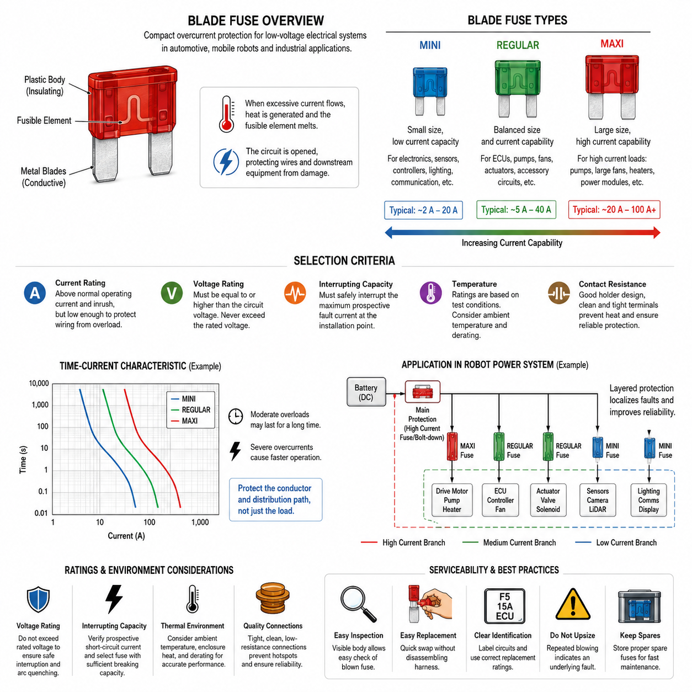
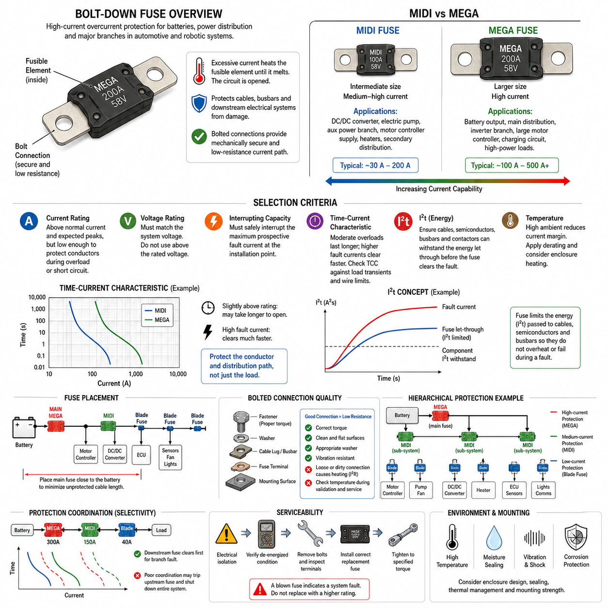
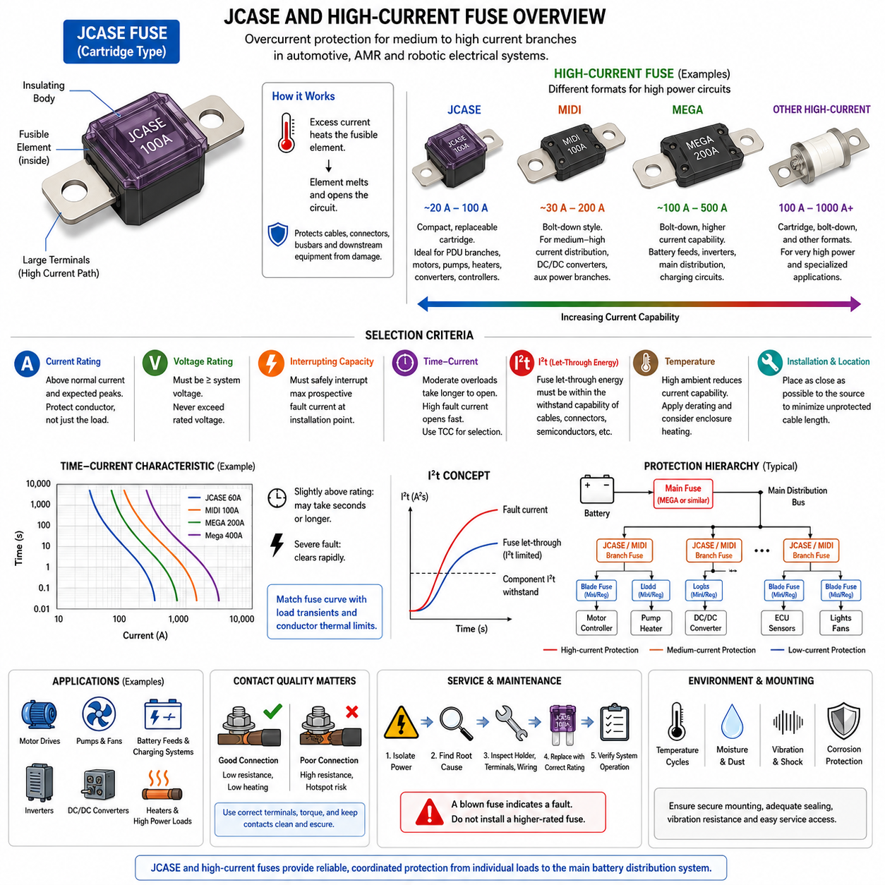
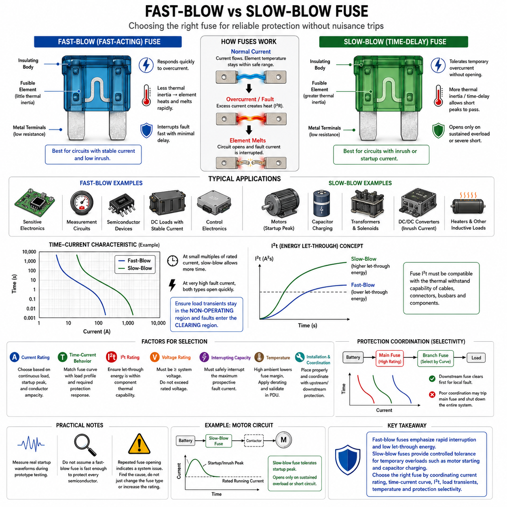
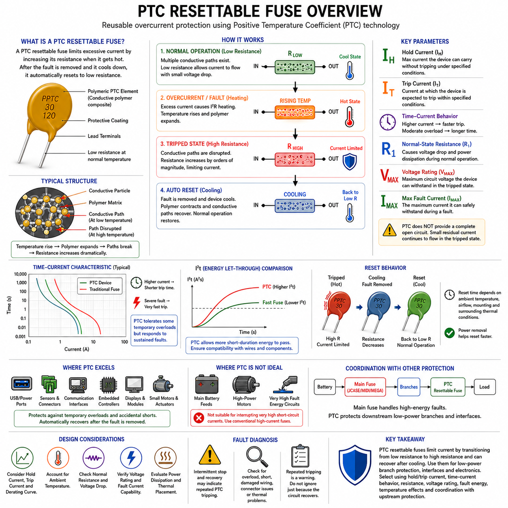

**Volume 04. Fuse, Relay, and Power Distribution Unit**

# Chapter 02. Fuse Types and Selection

## 02.01. Blade Fuse (Mini, Regular, Maxi)

{width="7.268055555555556in" height="7.268055555555556in"}

블레이드 퓨즈(Blade Fuse)는 자동차(Automotive), 이동 로봇(Mobile Robot), 자율이동로봇(AMR), 저전압 전기 시스템(Low-Voltage Electrical System)에서 널리 사용되는 소형 과전류 보호 장치(Overcurrent Protection Device)이다. 절연 플라스틱 몸체 내부에 정밀하게 설계된 가용체(Fusible Element)가 있으며, 외부로 두 개의 금속 블레이드(Metal Blade)가 노출된다. 과도한 전류로 충분한 열에너지가 발생하면 가용체가 용융되어 회로를 차단하고 배선과 하위 전기 장치를 과열 및 손상으로부터 보호한다.

블레이드 형식(Blade Format)은 분산형 전기 아키텍처(Distributed Electrical Architecture)에서 여러 실용적인 장점을 제공한다. 퓨즈(Fuse)를 나사 체결 없이 표준화된 퓨즈 홀더(Fuse Holder) 또는 전력분배장치(Power Distribution Unit, PDU)에 직접 삽입할 수 있어 조립과 교체가 비교적 간단하다. 플라스틱 몸체를 통해 유지보수 과정에서 빠르게 식별할 수도 있다. 그러나 물리적 호환성만으로 전기적 적합성이 보장되지는 않으며, 전압 정격(Voltage Rating), 전류 정격(Current Rating), 차단 용량(Interrupting Capability), 시간-전류 특성(Time-Current Characteristic)을 모두 회로에 맞게 선정해야 한다.

미니 블레이드 퓨즈(Mini Blade Fuse)는 제한된 패키징 공간(Packaging Space)에서 중소 전류 용량이 필요한 회로에 적합하다. 작은 몸체를 사용하기 때문에 소형 퓨즈 박스(Fuse Box) 또는 전력분배장치(PDU)에 많은 보호 분기 회로(Protected Branch Circuit)를 집적할 수 있다. 로봇에서는 보조 전자장치(Auxiliary Electronics), 제어기(Controller), 센서(Sensor), 조명(Lighting), 통신 장치(Communication Device) 및 비교적 낮은 전류를 사용하는 부하에 적합하다. 특히 인클로저(Enclosure) 공간과 와이어 하니스(Wire Harness) 패키징이 제한되는 시스템에서 유리하다.

레귤러 블레이드 퓨즈(Regular Blade Fuse)는 흔히 표준 블레이드 퓨즈(Standard Blade Fuse)라고도 하며, 물리적 크기, 전류 용량(Current Capability), 열적 성능(Thermal Performance), 정비성(Serviceability) 사이에서 균형 잡힌 특성을 제공한다. 전자제어장치(ECU), 펌프(Pump), 팬(Fan), 액추에이터(Actuator), 보조 회로(Accessory Circuit)와 같은 중간 전류 부하에 널리 적용된다. 사용 범위가 넓기 때문에 교체 부품을 쉽게 확보해야 하고 현장 유지보수가 중요한 전기 시스템 설계에도 유리하다.

맥시 블레이드 퓨즈(Maxi Blade Fuse)는 블레이드 퓨즈 개념을 상대적으로 높은 전류 회로까지 확장한 형태이다. 더 큰 전도성 블레이드(Conductive Blade)와 가용 구조(Fusible Structure)를 사용하여 미니(Mini) 또는 레귤러(Regular) 형식보다 높은 전류 전달 능력을 제공한다. 따라서 주요 전력 분배 지점(Main Distribution Point), 전동 펌프(Electric Pump), 대형 팬(Large Fan), 히터(Heater), 보조 전력 모듈(Auxiliary Power Module), 일부 모터 회로(Motor Circuit)에 사용할 수 있다. 다만 매우 높은 배터리 또는 구동 전류에는 볼트 체결형 퓨즈(Bolt-Down Fuse)나 특수 고전류 퓨즈(High-Current Fuse)가 더 적합할 수 있다.

미니(Mini), 레귤러(Regular), 맥시(Maxi)의 선택은 단순한 패키징 결정이 아니라 전류 계층(Current Hierarchy)의 관점에서 이루어져야 한다. 일반적으로 미니 퓨즈(Mini Fuse)는 작은 분기 부하를 담당하고, 레귤러 퓨즈(Regular Fuse)는 다양한 중간 전류 회로를 담당하며, 맥시 퓨즈(Maxi Fuse)는 더 큰 분기 회로를 보호한다. 정확한 사용 가능 범위는 개별 퓨즈 제품군(Fuse Family)과 제조업체(Manufacturer)에 따라 달라지므로, 퓨즈 몸체 크기만으로 허용 전류를 판단하지 말고 데이터시트(Datasheet)를 확인해야 한다.

전류 정격(Current Rating)은 퓨즈의 공칭 전류 분류(Nominal Current Classification)를 나타내지만, 해당 전류에 도달하는 즉시 퓨즈가 정확하게 차단된다는 의미는 아니다. 블레이드 퓨즈는 시간-전류 특성(Time-Current Characteristic)을 갖는 열적 보호 장치(Thermal Protection Device)이다. 중간 정도의 과부하는 일정 시간 지속될 수 있지만 심각한 과전류에서는 훨씬 빠르게 동작한다. 따라서 퓨즈를 선정할 때 정상상태 부하 전류(Steady-State Load Current)뿐만 아니라 모터 기동(Motor Starting), 커패시터 충전(Capacitor Charging), 액추에이터 가속(Actuator Acceleration)과 같은 돌입전류(Inrush Current)도 고려해야 한다.

퓨즈는 단순히 연결된 장치의 공칭 소비전류에 맞추는 것이 아니라 기본적으로 도체(Conductor)와 전력 분배 경로(Electrical Distribution Path)를 보호해야 한다. 선정된 퓨즈 정격은 허용 가능한 일시적 피크 전류를 포함한 정상 운전 전류보다 충분히 높아야 하지만, 과부하 또는 단락(Short Circuit)이 발생했을 때 보호 대상 전선이 위험한 열적 상태에 도달하기 전에 차단할 수 있을 만큼 낮아야 한다. 따라서 블레이드 퓨즈 선정은 전선 굵기(Wire Gauge), 디레이팅(Derating), 주변 온도(Ambient Temperature), 하니스 설계(Harness Design)와 직접 연결된다.

전압 정격(Voltage Rating)도 매우 중요하다. 가용체가 용융되었다고 해서 항상 회로가 안전하게 차단되는 것은 아니기 때문이다. 가용체가 끊어진 후 퓨즈는 형성된 간극(Gap)에 걸리는 전기적 스트레스(Electrical Stress)를 견디면서 지속적인 전도나 아크(Arc)를 억제해야 한다. 따라서 퓨즈는 규정된 전압 정격을 초과하여 사용해서는 안 된다. 이러한 요구사항은 로봇 플랫폼이 기존의 저전압 보조 네트워크에서 48 V 및 그 이상의 직류 전력 아키텍처(DC Power Architecture)로 발전하면서 더욱 중요해진다.

차단 용량(Interrupting Capacity) 또는 정격 차단 용량(Breaking Capacity)은 지정된 조건에서 퓨즈가 안전하게 차단할 수 있는 최대 예상 고장 전류(Prospective Fault Current)를 의미한다. 특히 배터리(Battery)는 정상 부하 전류보다 훨씬 큰 고장 전류를 공급할 수 있으며, 배터리와 고장 지점 사이의 배선 저항이 작을수록 단락 전류는 더욱 커질 수 있다. 따라서 엔지니어는 퓨즈 설치 위치에서 발생 가능한 단락 전류(Short-Circuit Current)를 평가하고 선택한 블레이드 퓨즈가 파괴적으로 손상되지 않으면서 이를 안전하게 차단할 수 있는지 확인해야 한다.

접촉 저항(Contact Resistance) 역시 블레이드 퓨즈 적용에서 중요한 요소이다. 전류는 퓨즈 블레이드(Fuse Blade), 홀더 단자(Holder Terminal), 크림프(Crimp), 버스바(Busbar), 관련 도체를 통과하며 각 접속부는 저항과 발열에 영향을 준다. 느슨하거나 오염되거나 산화된 단자 또는 접촉 압력(Contact Pressure)이 부족한 단자는 퓨즈 자체의 정격이 올바르더라도 국부적인 열적 핫스폿(Thermal Hotspot)을 발생시킬 수 있다. 따라서 신뢰성 있는 퓨즈 보호를 위해서는 퓨즈뿐만 아니라 홀더의 기계적·전기적 품질도 중요하다.

열적 환경(Thermal Environment)은 블레이드 퓨즈의 동작에 큰 영향을 준다. 퓨즈 정격과 시간-전류 곡선(Time-Current Curve)은 규정된 시험 조건에서 결정되지만 실제 시스템에서는 퓨즈가 릴레이(Relay), MOSFET 스위치(MOSFET Switch), DC/DC 컨버터(DC/DC Converter), 배터리 또는 기타 발열 부품 주변의 밀폐된 전력분배장치(PDU)에 설치될 수 있다. 고전류 퓨즈가 조밀하게 배치되면 상호 발열도 발생할 수 있으므로, 까다로운 로봇 전력 시스템에서는 공칭 전류 계산과 함께 주변 온도 보정(Ambient-Temperature Correction) 및 인클로저 수준 열해석(Enclosure-Level Thermal Analysis)을 수행해야 한다.

자율이동로봇(AMR) 또는 이동 로봇(Mobile Robot)에서는 블레이드 퓨즈를 계층적 보호 구조(Layered Protection Structure)로 구성할 수 있다. 상위의 고전류 보호 장치가 주요 저전압 전력 분배 분기(Main Low-Voltage Distribution Branch)를 보호하고, 하위의 레귤러 및 미니 블레이드 퓨즈가 점차 작은 부하를 개별적으로 보호하도록 구성할 수 있다. 이러한 구조는 고장을 국부화(Fault Localization)하고 센서, 제어기, 팬 또는 보조 액추에이터 하나의 고장이 전체 로봇 플랫폼을 정지시키는 가능성을 줄인다. 보호 협조(Protection Coordination)를 통해 고장 지점에 가장 가까운 퓨즈가 상위 보호 장치보다 먼저 동작하도록 설계하는 것이 중요하다.

정비성(Serviceability)은 블레이드 퓨즈의 가장 큰 장점 중 하나이다. 정비 작업자는 일반적으로 주변 하니스(Harness)를 분해하지 않고도 고장 난 퓨즈를 점검하고 제거하여 교체할 수 있다. 그러나 효과적인 진단을 위해서는 명확한 회로 식별(Circuit Identification), 접근 가능한 퓨즈 위치, 올바른 예비 퓨즈 정격, 부적절한 퓨즈가 장착되지 않도록 하는 관리가 필요하다. 퓨즈가 반복적으로 단선되는 경우 더 높은 정격의 퓨즈로 교체해서는 안 되며, 이를 근본적인 전기적 고장(Electrical Fault)이 존재한다는 증거로 판단해야 한다.

미니(Mini), 레귤러(Regular), 맥시(Maxi) 블레이드 퓨즈는 동일한 기본 보호 원리(Fundamental Protection Concept)를 서로 다른 물리적·전기적 규모로 구현한 장치이다. 올바른 선정에는 정상 전류(Normal Current), 과도 전류(Transient Current), 전선 허용전류(Wire Ampacity), 전압(Voltage), 고장전류 차단 능력(Fault-Current Interrupting Capability), 열적 환경, 패키징, 홀더 성능(Holder Performance), 유지보수 요구사항을 종합적으로 평가해야 한다. 전체 퓨즈 아키텍처(Fuse Architecture)에서 블레이드 퓨즈는 접근성이 중요한 저전압 분기 보호(Low-Voltage Branch Protection)에 특히 효과적이며, 더 높은 전류와 특수한 보호 요구사항에는 다른 형태의 퓨즈 기술이 사용된다.

## 02.02. Bolt-Down Fuse (MIDI, MEGA)

{width="7.268055555555556in" height="7.268055555555556in"}

볼트 체결형 퓨즈(Bolt-Down Fuse)는 기존의 플러그인 블레이드 퓨즈(Plug-In Blade Fuse)로는 충분한 보호가 어려운 고전류 회로(High-Current Circuit)를 위해 설계된 과전류 보호 장치(Overcurrent Protection Device)이다. 스프링 접촉 단자(Spring-Contact Terminal)에 의존하는 대신 볼트 체결 방식으로 퓨즈를 버스바(Busbar), 케이블 러그(Cable Lug), 전력 분배 단자(Power Distribution Terminal) 사이에 직접 고정한다. 이러한 구조는 배터리, 고출력 부하, 주요 전력 분배 분기에 적합한 기계적으로 견고하고 접촉 저항이 낮은 전류 경로를 제공한다.

저전압 자동차 및 로봇 전력 시스템에서 대표적으로 사용되는 볼트 체결형 퓨즈 계열에는 미디 퓨즈(MIDI Fuse)와 메가 퓨즈(MEGA Fuse)가 있다. 두 종류 모두 양쪽 끝에 장착 홀(Mounting Hole) 또는 단자부가 있는 소형 몸체 내부에 가용체(Fusible Element)가 통합되어 있다. 기본 동작 원리는 열적 방식으로 동일하며, 과도한 전류가 정밀하게 설계된 가용체를 가열하여 용융시키고 회로를 개방함으로써 보호 대상 도체와 하위 전력 분배 네트워크가 손상될 정도의 열적 스트레스(Thermal Stress)를 받지 않도록 한다.

미디 퓨즈(MIDI Fuse)는 소형 블레이드 퓨즈와 대형 고전류 보호 장치 사이의 중간 보호 영역을 제공한다. 비교적 작은 구조로 상당한 전류를 보호하면서도 전력분배장치(PDU)의 공간을 과도하게 차지하지 않는다는 장점이 있다. 대표적인 적용 대상으로는 중·고전류 DC/DC 컨버터(DC/DC Converter) 전원, 전동 펌프(Electric Pump), 보조 전력 분기(Auxiliary Power Branch), 모터 제어기(Motor Controller) 전원, 히터(Heater), 이동 로봇과 자동차 전기 아키텍처의 2차 전력 분배 회로가 있다.

메가 퓨즈(MEGA Fuse)는 더 높은 전류가 흐르는 전력 경로를 위해 설계되며 미디 퓨즈보다 물리적으로 크다. 견고한 단자와 더 큰 가용 구조(Fusible Structure)를 통해 배터리 출력, 고전류 전력 분배, 인버터 분기(Inverter Branch), 주요 모터 제어기 전원, 충전 회로(Charging Circuit) 및 기타 대전력 부하에 적용할 수 있다. 자율이동로봇(AMR)에서는 배터리 또는 메인 전력분배장치(Main PDU) 가까이에 배치하여 전력이 여러 하위 분기로 나뉘기 전에 1차 보호(Primary Protection)를 제공할 수 있다.

미디(MIDI)와 메가(MEGA)의 차이는 단순히 물리적 크기의 차이로만 판단해서는 안 된다. 퓨즈 선정에는 요구되는 전류 범위(Current Range), 사용 가능한 고장 전류(Fault Current), 전압, 열적 환경(Thermal Environment), 장착 구조(Mounting Arrangement), 하위 보호 장치와의 보호 협조(Protection Coordination)를 함께 고려해야 한다. 미디 퓨즈는 비교적 큰 보조 전력 분기에 적합할 수 있으며, 메가 퓨즈는 주요 전력 분배 경로를 보호할 수 있다. 정확한 전기적 정격은 반드시 해당 제조업체의 데이터시트(Datasheet)를 통해 확인해야 한다.

볼트 체결형 퓨즈는 연결된 장비의 공칭 정격만을 기준으로 선정하는 것이 아니라 기본적으로 케이블(Cable), 버스바(Busbar), 전력 분배 경로(Distribution Path)를 보호하도록 선정해야 한다. 정상 연속 전류(Continuous Current), 예상 과부하, 모터 가속, 컨버터 기동, 커패시터 충전(Capacitor Charging), 회생 상태(Regenerative Condition) 및 기타 과도 전류(Transient Current)를 평가해야 한다. 퓨즈는 정상적인 운전 피크를 견디면서 지속적인 과부하 또는 단락 시 도체가 과도하게 가열되기 전에 충분히 빠르게 차단되어야 한다.

따라서 시간-전류 특성(Time-Current Behavior)은 미디 및 메가 퓨즈 설계에서 핵심적인 요소이다. 공칭 정격을 약간 초과하는 전류가 흐른다고 해서 퓨즈가 즉시 차단되는 것은 아니며, 가용체가 용융되기 위해서는 충분한 열에너지(Thermal Energy)가 축적되어야 한다. 고장 전류가 증가할수록 일반적으로 차단 시간(Clearing Time)은 크게 감소한다. 따라서 보호 장치를 선정할 때 하나의 공칭 전류값만을 사용하는 것이 아니라 퓨즈의 시간-전류 곡선(Time-Current Curve)을 부하 과도 특성과 도체의 열적 한계와 비교해야 한다.

I²t 특성(I²t Characteristic)은 고전류 볼트 체결형 퓨즈를 평가할 때 특히 중요하다. 이는 퓨즈가 동작하는 동안 전류 흐름과 관련된 열에너지를 나타내며, 케이블, 반도체 전력 소자(Semiconductor Power Device), 버스바, 접촉기(Contactor) 또는 기타 하위 구성품이 퓨즈가 회로를 차단하기 전까지 통과하는 에너지를 견딜 수 있는지 판단하는 데 도움을 준다. 따라서 보호 설계에서는 퓨즈의 차단 특성과 보호 대상 전기 부품의 단시간 열적 내량(Short-Duration Thermal Capability)을 서로 협조시켜야 한다.

전압 정격(Voltage Rating) 역시 전기 아키텍처와 일치해야 한다. 가용체가 용융되면 퓨즈는 전류를 차단하고 개방된 가용체 양단에 발생하는 전압을 파괴적인 아크(Arc)를 지속시키지 않으면서 견뎌야 한다. 특정 직류 전압에 대해 정격이 규정된 퓨즈는 전류 정격이 충분하다는 이유만으로 더 높은 전압의 네트워크에 사용할 수 있다고 가정해서는 안 된다. 이러한 문제는 48 V 로봇 아키텍처와 같이 직류 버스 전압(DC Bus Voltage)이 높아지는 배터리 시스템에서 특히 중요하다.

차단 용량(Interrupting Capacity)은 배터리가 매우 높은 단락 전류(Short-Circuit Current)를 공급할 수 있기 때문에 매우 중요하다. 배터리 내부 저항(Battery Internal Resistance), 케이블 저항, 접속 저항이 매우 낮을 수 있으므로 배터리 근처에서 발생하는 예상 고장 전류(Prospective Fault Current)는 정상 운전 전류보다 훨씬 클 수 있다. 따라서 선정된 미디 또는 메가 퓨즈는 설치 위치에서 발생 가능한 최대 고장 전류를 비제어 파열(Uncontrolled Rupture)이나 지속적인 아크 없이 안전하게 차단할 수 있는 충분한 차단 능력(Breaking Capability)을 가져야 한다.

퓨즈의 설치 위치(Fuse Location)는 실제로 보호되는 배선의 범위에 큰 영향을 미친다. 메인 배터리 퓨즈(Main Battery Fuse)는 일반적으로 배터리 전원에 전기적으로 가까운 위치에 배치하여 보호되지 않는 도체의 길이를 최소화해야 한다. 퓨즈가 하위 위치에 멀리 설치되면 배터리와 퓨즈 사이의 케이블은 단락 위험에 그대로 노출된다. 따라서 기계적 패키징(Mechanical Packaging), 정비 접근성(Service Access), 환경 밀폐(Environmental Sealing), 충돌 또는 충격 조건을 전기적 보호 요구사항과 함께 고려해야 한다.

볼트 체결부(Bolted Joint)는 미디 및 메가 퓨즈에서 중요한 설계 요소이다. 퓨즈 단자(Fuse Terminal), 버스바 또는 케이블 러그, 와셔(Washer) 구성, 체결 부품(Fastener), 장착면(Mounting Surface)은 모두 전류 경로의 일부를 구성한다. 체결력이 부족하면 접촉 저항이 증가하여 국부적인 발열이 발생할 수 있으며, 지나치게 강하게 체결하면 단자나 퓨즈 몸체가 손상될 수 있다. 따라서 규정된 체결 토크(Tightening Torque)와 조립 절차는 단순한 기계적 지침이 아니라 전기적 신뢰성(Electrical Reliability)을 위한 필수 요구사항으로 취급해야 한다.

전류가 증가할수록 접촉 저항(Contact Resistance)의 중요성도 커지는데, 접속부의 발열은 I²R에 비례하기 때문이다. 느슨하거나 오염된 볼트 접속부에서 아주 작은 추가 저항만 발생해도 고전류 조건에서는 상당한 열이 발생할 수 있다. 따라서 접촉면 상태(Surface Condition), 단자 평탄도(Terminal Flatness), 재료 호환성(Material Compatibility), 체결 유지력(Fastener Retention), 진동 저항(Vibration Resistance), 부식 방지(Corrosion Protection)를 함께 고려해야 한다. 시제품 검증 및 현장 유지보수에서는 열적 검사(Thermal Inspection)를 통해 비정상적인 접속부 발열을 확인할 수도 있다.

주변 온도(Ambient Temperature)와 인클로저 발열(Enclosure Heating)은 볼트 체결형 퓨즈의 동작 여유도에 영향을 준다. 소형 전력분배장치(PDU) 내부에 설치된 퓨즈는 접촉기, 릴레이(Relay), MOSFET, DC/DC 컨버터, 버스바 또는 인접한 퓨즈에서 발생하는 열에 노출될 수 있다. 높은 주변 온도는 사용 가능한 전류 여유를 감소시키며, 밀집된 도체는 국부 온도를 더욱 높일 수 있다. 따라서 신뢰성 있는 연속 운전을 위해 적절한 온도 디레이팅(Temperature Derating)과 PDU 수준의 열해석(Thermal Analysis)이 필요하다.

미디 및 메가 퓨즈는 블레이드 퓨즈(Blade Fuse)와 결합하여 로봇 전력 아키텍처 내부에 계층적 보호 구조(Hierarchical Protection)를 구성할 수 있다. 메가 퓨즈는 메인 배터리 전력 분배 경로를 보호하고, 미디 퓨즈는 주요 서브시스템 분기를 보호하며, 미니(Mini) 또는 레귤러(Regular) 블레이드 퓨즈는 개별 제어기, 센서, 팬 및 보조 장치를 보호하도록 구성할 수 있다. 이러한 계층 구조는 고장을 국부화하고 하나의 국부적인 전기 고장으로 인해 관련 없는 로봇 기능까지 불필요하게 전원이 차단되는 것을 방지하는 데 도움을 준다.

여러 단계의 퓨즈가 직렬로 연결될 경우 보호 협조(Protection Coordination)가 특히 중요하다. 하위 분기에서 고장이 발생하면 이상적으로는 상위 메인 퓨즈보다 고장 위치에 가장 가까운 적절한 퓨즈가 먼저 동작해야 한다. 이를 구현하려면 단순히 상위 퓨즈에 더 큰 전류 정격을 적용하는 것이 아니라 시간-전류 곡선과 에너지 특성(Energy Characteristic)을 비교해야 한다. 보호 협조가 잘못되면 작은 분기 회로의 고장으로 전체 로봇의 전원이 차단되어 시스템 가용성(System Availability)이 저하되고 고장 진단도 복잡해질 수 있다.

정비성(Serviceability)은 플러그인 블레이드 퓨스와 차이가 있다. 미디 및 메가 퓨즈는 교체 시 공구와 관리된 체결 작업이 필요하기 때문이다. 따라서 유지보수 절차에는 전기적 절연(Electrical Isolation), 무전압 상태(De-Energized State) 확인, 단자와 장착면 점검, 올바른 정격의 교체품 설치, 규정된 토크로의 체결 과정이 포함되어야 한다. 퓨즈가 반복적으로 단선되는 경우 이를 시스템 고장으로 조사해야 하며, 재발을 막기 위해 단순히 더 높은 정격의 퓨즈로 교체해서는 안 된다.

미디(MIDI) 및 메가(MEGA) 볼트 체결형 퓨즈는 자동차, 자율이동로봇(AMR), 이동 로봇 및 배터리 기반 전기 시스템의 고전류 계층을 위한 견고한 보호 수단을 제공한다. 미디 퓨즈는 비교적 큰 서브시스템 전력 분기에 적합하며, 메가 퓨즈는 메인 배터리와 주요 전력 분배 경로까지 보호 범위를 확장한다. 성공적인 적용을 위해서는 전류, 전압, I²t, 고장 전류 수준, 도체 허용전류(Conductor Capacity), 열적 환경, 접촉 저항, 기계적 체결, 보호 선택성(Protection Selectivity), 정비 요구사항을 종합적으로 평가해야 한다.

## 02.03. JCASE and High-Current Fuse

{width="7.268055555555556in" height="7.268055555555556in"}

JCASE 퓨즈(JCASE Fuse)는 기존 미니 블레이드 퓨즈(Mini Blade Fuse)나 레귤러 블레이드 퓨즈(Regular Blade Fuse)보다 높은 전류 용량이 필요하면서도 소형 패키징(Compact Packaging)과 편리한 정비성(Serviceability)을 유지해야 하는 회로를 위해 개발된 카트리지형 과전류 보호 장치(Cartridge-Style Overcurrent Protection Device)이다. 자동차와 이동형 전기 시스템에서 모터, 펌프, 히터, 전력 변환기, 제어기 및 저전압 직류 전력 분배 네트워크에 연결되는 비교적 큰 분기 부하를 보호하는 데 널리 사용된다.

JCASE 구조는 절연 몸체(Insulating Body) 내부에 정밀하게 설계된 가용체(Fusible Element)와 비교적 큰 전도성 단자(Conductive Terminal)를 결합한다. 주로 저전류 분기를 위한 소형 블레이드 퓨즈와 달리 더 큰 전류 경로를 사용하기 때문에 보다 높은 전력이 흐르는 회로에서 사용할 수 있다. 특정 제품군에 따라 카트리지(Cartridge), 플러그인(Plug-In) 또는 이와 유사한 장착 방식을 사용하며, 퓨즈 블록(Fuse Block)이나 전력분배장치(PDU) 내부에서 안정적인 전기적 접촉을 제공하도록 설계된다.

기본적인 동작 원리는 전류에 대한 열적 응답(Thermal Response)에 기반한다. 정상 운전 상태에서는 전류가 가용체를 통과하면서 허용 가능한 수준의 온도 상승만 발생한다. 지속적인 과부하 또는 심각한 단락 전류가 발생하면 I²R 발열(I²R Heating)에 의해 가용체의 온도가 상승하고 결국 용융된다. 이 과정에서 형성되는 전기적 분리(Electrical Separation)가 고장 전류를 차단하여 배선, 커넥터, 버스바 및 하위 장비가 과도한 열에너지로 손상되는 것을 방지한다.

JCASE 퓨즈는 기존 블레이드 퓨즈(Blade Fuse)와 대형 볼트 체결형 보호 장치(Bolt-Down Protection Device) 사이에서 중요한 역할을 담당한다. 미니 또는 레귤러 블레이드 형식이 편리하게 처리할 수 있는 범위보다 높은 전류가 필요하지만 미디(MIDI), 메가(MEGA) 또는 더 큰 볼트 체결형 퓨즈가 반드시 필요하지 않은 회로에 실용적인 해결책을 제공한다. 이러한 중간 영역의 특성으로 인해 여러 중·고전류 분기를 독립적으로 보호해야 하는 소형 전력분배장치(PDU)에 JCASE 기술을 효과적으로 적용할 수 있다.

고전류 퓨즈(High-Current Fuse)는 하나의 특정 기계적 형식을 의미하기보다 광범위한 공학적 분류(Engineering Category)를 의미한다. 배터리 전원, 고출력 전력 분배 분기, 모터 드라이브(Motor Drive), 인버터(Inverter), DC/DC 컨버터(DC/DC Converter), 히터, 충전 시스템 및 이와 유사한 부하를 안전하게 보호하기 위한 장치가 여기에 포함된다. 필요한 전류, 전압, 고장 수준, 패키징 및 정비 요구사항에 따라 JCASE, 볼트 체결형 퓨즈, 카트리지 퓨즈 또는 기타 특수 고전류 보호 기술을 선택할 수 있다.

퓨즈 전류 정격(Current Rating)은 부하뿐만 아니라 보호 대상 도체(Protected Conductor)와의 관계를 고려하여 선정해야 한다. 고전류 회로에서는 모터 가속, 액추에이터 기동, 커패시터 충전(Capacitor Charging), 컨버터 전원 투입(Converter Energization) 또는 기타 과도 상태에서 상당한 일시적 피크 전류가 발생할 수 있다. 퓨즈는 이러한 정상적인 운전 조건에서 불필요하게 차단되지 않으면서도 케이블, 버스바, 커넥터 또는 전력 분배 구조가 허용 가능한 열적 한계를 초과하기 전에 비정상 전류를 차단할 수 있어야 한다.

따라서 시간-전류 특성(Time-Current Characteristic)은 JCASE 또는 기타 고전류 퓨즈를 선정할 때 필수적으로 고려해야 한다. 퓨즈의 동작은 하나의 순간적인 전류 임계값만으로 결정되지 않는다. 중간 수준의 과부하 전류에서는 가용체가 용융되기까지 수초 또는 훨씬 긴 시간이 필요할 수 있지만, 심각한 고장 전류에서는 매우 빠른 차단이 이루어질 수 있다. 엔지니어는 제조업체가 제공하는 시간-전류 곡선(Time-Current Curve)을 예상 부하 프로파일(Load Profile), 도체의 열적 능력, 필요한 보호 응답과 비교해야 한다.

I²t는 고전류 보호를 평가하기 위한 또 하나의 중요한 방법이다. 이 파라미터는 퓨즈 동작 과정에서 축적되는 전류 제곱 에너지(Current-Squared Energy)를 나타내며, 회로가 완전히 차단되기 전까지 어느 정도의 고장 에너지가 통과할 수 있는지를 보여준다. 퓨즈의 통과 에너지(Let-Through Energy)는 하위에 위치한 케이블, 커넥터, 반도체 장치(Semiconductor Device), 접촉기(Contactor), 버스바 및 기타 보호 대상 부품의 단시간 내량(Short-Duration Withstand Capability)과 적합해야 한다.

전압 정격(Voltage Rating)은 전류 정격과 독립적으로 고려해야 한다. 가용체가 용융된 후 퓨즈는 아크(Arc)를 소멸시키고 시스템 전압을 견딜 수 있을 만큼 충분한 전기적 분리를 형성해야 한다. 충분한 전류 용량을 가진 장치라도 전압 정격이 회로의 최대 운전 전압보다 낮다면 적합하지 않을 수 있다. 이러한 요구사항은 48 V 로봇 플랫폼과 같이 상대적으로 높은 저전압 직류 아키텍처(Elevated Low-Voltage DC Architecture)에서 더욱 중요해진다.

차단 용량(Interrupting Capacity)은 특히 고전류 배터리 시스템에서 중요하다. 배터리 팩(Battery Pack)은 내부 임피던스와 인접한 케이블 및 버스바의 저항이 매우 낮을 수 있기 때문에 상당히 높은 단락 전류(Short-Circuit Current)를 공급할 수 있다. 퓨즈는 설치 위치에서 예상되는 최대 고장 전류(Maximum Prospective Fault Current)를 안전하게 차단할 수 있어야 한다. 따라서 연속 부하 전류만을 기준으로 퓨즈를 선정하고 사용 가능한 고장 전류를 평가하지 않는 것은 안전하지 않은 보호 설계로 이어질 수 있다.

설치 위치(Installation Position)는 전기 경로 가운데 어느 범위까지 단락 보호가 이루어지는지를 결정한다. 메인 또는 고전류 전원 보호 장치는 일반적으로 배터리나 전원 공급원에 가능한 한 가까운 위치에 설치해야 한다. 이를 통해 퓨즈 상류에 존재하는 보호되지 않는 도체의 길이를 최소화할 수 있다. 전원과 멀리 떨어진 퓨즈 사이에 위치한 케이블 구간은 사실상 보호되지 않으므로 배선 경로, 기계적 보호, 절연 및 퓨즈 위치를 함께 고려해야 한다.

JCASE 퓨즈는 비교적 높은 전류 용량과 교체 가능성(Replaceability)을 동시에 제공하기 때문에 모듈형 전력분배장치(Modular PDU)에 특히 유용하다. 모든 보호 부하에 볼트 체결 연결을 적용하지 않고도 여러 서브시스템 분기를 개별적으로 보호할 수 있다. 예를 들어 자율이동로봇(AMR)에서는 각각의 JCASE 퓨즈를 사용하여 모터 제어 보조장치, 조향 시스템(Steering System), DC/DC 컨버터, 펌프, 팬, 히터 등의 주요 부하를 보호하고, 더 작은 블레이드 퓨즈로 센서와 전자 보조장치를 보호할 수 있다.

퓨즈 자체의 크기가 올바르게 선정되었더라도 접촉 품질(Contact Quality)은 여전히 중요하다. 불량한 단자 접촉부를 통해 높은 전류가 흐르면 상당한 I²R 발열이 발생할 수 있다. 부족한 접촉 압력(Contact Force), 산화(Oxidation), 오염, 단자 변형 또는 진동으로 인한 접촉력 저하는 국부적인 핫스폿(Hotspot)을 형성하여 퓨즈 가용체가 동작하기 전에 퓨즈 홀더나 주변 전력분배장치를 손상시킬 수 있다. 따라서 퓨즈 홀더 역시 요구 전류와 환경 조건에 적합한 정격을 가져야 한다.

열적 환경(Thermal Environment)은 퓨즈의 동작 여유도를 크게 변화시킬 수 있다. 릴레이(Relay), 접촉기, MOSFET 스위치, 컨버터 또는 다른 고전류 퓨즈 근처에 설치된 JCASE나 고전류 퓨즈는 실온보다 상당히 높은 주변 온도에 노출될 수 있다. 인클로저(Enclosure) 내부의 발열과 제한된 공기 흐름은 온도를 더욱 상승시킬 수 있다. 따라서 소형 로봇 전력분배장치에서 연속 전류 능력을 결정할 때는 적절한 온도 디레이팅(Temperature Derating)과 열적 검증(Thermal Validation)이 필요하다.

보호 협조(Protection Coordination)를 적용하면 JCASE 및 고전류 퓨즈를 계층형 전기 보호 아키텍처(Layered Electrical Protection Architecture)의 일부로 구성할 수 있다. 메인 배터리 퓨즈가 전원과 1차 전력 분배 경로를 보호하고, JCASE 또는 유사한 장치가 주요 서브시스템 분기를 보호하며, 더 작은 블레이드 퓨즈가 개별 전자 부하를 보호하도록 구성할 수 있다. 적절한 선택성(Selectivity)을 확보하면 가능한 경우 고장 위치에서 가장 가까운 보호 장치가 먼저 동작하여 영향을 받지 않은 로봇 영역의 전원을 유지할 수 있다.

이러한 계층적 접근 방법(Hierarchical Approach)은 메인 전력 버스(Main Power Bus)의 불필요한 차단이 추진(Propulsion), 인지(Perception), 컴퓨팅(Computing), 통신(Communication), 안전 관련 기능(Safety-Related Function)을 동시에 정지시킬 수 있는 자율 시스템에서 특히 중요하다. 보조 히터나 펌프에서 발생한 고장은 메인 배터리 퓨즈를 차단하기보다 해당 분기에서 격리되는 것이 바람직하다. 따라서 보호 협조를 설계할 때 시간-전류 곡선, I²t 특성, 분기 정격 및 고장 전류 수준을 함께 평가해야 한다.

기계적 패키징(Mechanical Packaging)과 환경 내성(Environmental Resistance) 역시 중요한 고려사항이다. 이동 로봇의 퓨즈 어셈블리(Fuse Assembly)는 진동(Vibration), 충격(Shock), 먼지, 습기, 온도 사이클링(Temperature Cycling), 오염 등에 노출될 수 있다. 퓨즈 몸체, 단자 접속부, 홀더, 인클로저 및 배선 고정부는 이러한 환경에서도 안정적인 전기 접촉을 유지해야 한다. 고전류 퓨즈는 인접한 활선 도체(Energized Conductor)나 민감한 전자장치에 불필요한 위험을 발생시키지 않으면서 점검과 교체가 가능한 위치에 설치하는 것이 바람직하다.

유지보수 과정에서는 차단된 JCASE 또는 고전류 퓨즈를 전기 시스템에 대한 점검이 필요하다는 신호로 판단해야 한다. 정비 작업자는 전원을 격리하고 안전한 무전압 상태(De-Energized Condition)를 확인한 후 고장의 원인을 파악하고 퓨즈 홀더와 단자를 점검해야 한다. 이후 규정된 전류 정격, 전압 정격 및 차단 정격을 가진 퓨즈로 교체해야 한다. 반복적인 차단을 방지하기 위해 더 큰 정격의 퓨즈를 설치하면 본래의 보호 여유가 사라지고 배선이 위험한 과열 상태에 노출될 수 있다.

JCASE 및 기타 고전류 퓨즈(High-Current Fuse)는 일반적인 분기 회로 보호를 자동차, 자율이동로봇(AMR) 및 로봇 전기 아키텍처의 더 높은 전력 계층까지 확장한다. 올바른 적용을 위해서는 연속 전류와 과도 전류, 시간-전류 응답, I²t, 전압 정격, 차단 용량, 도체 능력(Conductor Capability), 열적 환경, 접촉 품질, 설치 위치 및 보호 선택성을 종합적으로 고려해야 한다. 블레이드 퓨즈 및 볼트 체결형 퓨즈와 함께 사용하면 개별 부하부터 메인 배터리 전력 분배 시스템까지 체계적인 계층형 보호 구조를 구성할 수 있다.

## 02.04. Fast-Blow vs. Slow-Blow

{width="7.268055555555556in" height="7.268055555555556in"}

고속 동작 퓨즈(Fast-Blow Fuse)와 지연 동작 퓨즈(Slow-Blow Fuse)는 주로 가용체(Fusible Element)가 과전류(Overcurrent)에 얼마나 빠르게 반응하는지에 따라 구분된다. 두 장치 모두 과도한 전류를 열로 변환하여 가용체를 용융시키고 회로를 개방함으로써 도체와 전기 장비를 보호한다. 차이는 의도적으로 설계된 열적 응답(Thermal Response)에 있으며, 고속 동작 퓨즈는 과도한 전류에 빠르게 반응하는 반면 지연 동작 퓨즈는 회로를 차단하기 전에 일시적인 과부하를 일정 시간 허용한다.

고속 동작 퓨즈(Fast-Blow Fuse)는 고속 퓨즈(Fast-Acting Fuse)라고도 하며, 비정상 전류를 비교적 작은 의도적 지연만으로 차단하도록 설계된다. 일반적으로 가용체의 열적 관성(Thermal Inertia)이 작기 때문에 전류가 의도된 운전 범위를 초과하면 온도가 빠르게 상승한다. 이러한 특성은 하위 구성품이 과전류 에너지(Overcurrent Energy)를 견디는 능력이 제한되어 있어 고장으로부터 신속하게 격리해야 하는 회로에 유용하다.

고속 동작 보호(Fast-Blow Protection)는 정상 운전 전류가 비교적 안정적이고 큰 기동 전류(Startup Current)나 돌입전류(Inrush Current)가 발생하지 않는 회로에 특히 적합하다. 민감한 전자 모듈(Electronic Module), 계측 회로(Measurement Circuit), 제어 전자장치(Control Electronics), 반도체 기반 부하(Semiconductor-Based Load) 및 일부 저관성 전기 장치는 빠른 보호의 이점을 얻을 수 있다. 이러한 회로에서는 불필요한 차단 지연으로 인해 퓨즈가 완전히 차단되기 전에 손상을 일으킬 수 있는 에너지가 구성품에 전달될 수 있다.

고속 동작 퓨즈의 주요 한계는 보호 대상 부하에서 자연스럽게 단시간 전류 피크(Short-Duration Current Peak)가 발생할 때 나타난다. 모터(Motor), 솔레노이드(Solenoid), 변압기(Transformer), 용량성 입력(Capacitive Input), 히터(Heater), 전력 변환기(Power Converter)는 기동 또는 스위칭 과정에서 정상상태 전류보다 상당히 높은 전류를 일시적으로 소비할 수 있다. 정상 운전 전류에 지나치게 근접하게 선정된 고속 퓨즈는 이러한 정상 과도 현상을 고장으로 판단하여 불필요하게 차단되는 오동작(Nuisance Operation)을 일으킬 수 있다.

지연 동작 퓨즈(Slow-Blow Fuse)는 일반적으로 시간 지연 퓨즈(Time-Delay Fuse)라고도 하며, 일시적인 과전류가 발생해도 즉시 차단되지 않도록 의도적으로 설계된다. 가용체 구조는 더 큰 열적 관성 또는 제어된 시간 지연 특성(Time-Delay Characteristic)을 제공한다. 따라서 단시간의 전류 피크는 가용체를 용융시키지 않고 통과할 수 있지만, 지속적인 과부하와 심각한 단락(Short Circuit)은 충분한 열에너지를 발생시켜 퓨즈를 동작시키고 보호 대상 회로를 차단한다.

지연 동작 특성(Slow-Blow Behavior)은 예측 가능한 기동 또는 돌입 특성을 갖는 부하에서 유용하다. 전기 모터(Electric Motor)는 가속 중 정상 운전 전류의 수배에 이르는 전류를 소비할 수 있으며, DC/DC 컨버터(DC/DC Converter)와 전자식 전원장치(Electronic Power Supply)는 입력 커패시터가 충전될 때 높은 충전 전류를 발생시킬 수 있다. 솔레노이드와 기타 유도성 액추에이터(Inductive Actuator)에서도 일시적인 전류 피크가 발생할 수 있다. 시간 지연 보호는 이러한 정상적인 현상을 허용하면서 지속적인 비정상 전류에 대한 보호를 유지한다.

고속 동작(Fast-Blow)과 지연 동작(Slow-Blow)이라는 용어를 두 가지의 정확하고 보편적인 동작 속도로 해석해서는 안 된다. 퓨즈의 실제 동작 특성은 제조업체가 제공하는 시간-전류 특성(Time-Current Characteristic)을 통해 보다 정확하게 정의된다. 동일한 공칭 전류 정격(Nominal Current Rating)을 가진 두 퓨즈라도 동일한 과부하 전류에서 차단 시간이 크게 다를 수 있다. 따라서 특정 회로의 보호 장치를 선정할 때 설명적인 명칭에만 의존하지 말고 공개된 시간-전류 곡선(Time-Current Curve)을 사용해야 한다.

시간-전류 곡선(Time-Current Curve)은 고장 전류의 크기와 퓨즈 동작 시간 사이의 관계를 나타낸다. 정격 전류보다 비교적 조금 높은 전류 영역에서는 일반적으로 지연 동작 퓨즈가 동급의 고속 동작 퓨즈보다 더 오랫동안 회로를 유지한다. 고장 전류가 매우 커지면 두 종류 모두 빠르게 동작할 수 있다. 설계의 목적은 정상적인 부하 과도 현상이 퓨즈의 비동작 영역(Non-Operating Region)에 머물고, 손상을 발생시키는 고장은 요구되는 차단 영역(Clearing Region)에 진입하도록 하는 것이다.

I²t 특성(I²t Characteristic)은 퓨즈 동작 과정과 관련된 전류 제곱 에너지(Current-Squared Energy)를 나타내기 때문에 퓨즈의 응답 특성을 비교하는 추가적인 방법을 제공한다. 고속 동작 퓨즈는 일반적으로 취약한 회로로 전달되는 에너지를 제한하는 것을 중시하는 반면, 지연 동작 퓨즈는 정상적인 과도 부하를 수용하기 위해 더 많은 단시간 에너지를 의도적으로 허용한다. 따라서 허용 가능한 퓨즈 I²t는 보호 대상 도체와 구성품의 열적 내량(Thermal Withstand Capability)과 적합해야 한다.

퓨즈의 동작 속도(Fuse Speed)는 전류 정격(Current Rating)과 독립적으로 선정할 수 없다. 기동 전류를 견디기 위해 단순히 고속 동작 퓨즈의 전류 정격을 높이면 도체에 대한 과부하 보호 능력이 약화될 수 있다. 반대로 적절한 특성을 가진 지연 동작 퓨즈를 선정하면 더 낮은 연속 전류 정격을 유지하면서 필요한 기동 펄스(Startup Pulse)를 허용할 수 있다. 따라서 전류 정격, 시간-전류 특성, 과도 전류 지속시간(Transient Duration), 도체의 열적 한계를 함께 협조시켜야 한다.

모터 회로(Motor Circuit)에서는 이러한 차이가 특히 중요하다. 구동 모터(Traction Motor), 조향 액추에이터(Steering Actuator), 냉각 팬(Cooling Fan), 펌프(Pump), 매니퓰레이터 액추에이터(Manipulator Actuator)는 가속이나 기계적 부하가 증가할 때 높은 전류를 요구할 수 있다. 보호 장치가 지나치게 빠르게 반응하면 정상 운전 중에도 퓨즈가 반복적으로 차단될 수 있다. 반대로 너무 느리게 동작하거나 과도하게 높은 전류 용량을 가지면 모터 구속(Stalled Motor)이나 실제 단락 상황에서 배선과 모터 제어 장비에 손상을 일으킬 수 있는 에너지가 전달될 수 있다.

전력 전자 회로(Power Electronic Circuit)에서도 유사한 고려가 필요하다. DC/DC 컨버터, 인버터(Inverter), 모터 드라이브(Motor Drive), 컴퓨팅 전원장치(Computing Power Supply)는 상당한 입력 커패시턴스(Input Capacitance)를 포함할 수 있다. 전원을 투입하면 정상상태 전류는 훨씬 낮더라도 커패시터 충전에 의해 짧지만 높은 돌입전류 펄스가 발생할 수 있다. 따라서 정상적인 전원 투입과 지속적인 고장을 구분하기 위해 이 펄스의 크기와 지속시간을 퓨즈의 시간-전류 및 I²t 특성과 비교해야 한다.

반도체 보호(Semiconductor Protection)가 주요 설계 요구사항인 경우 고속 동작 장치가 유리할 수 있다. MOSFET, 다이오드(Diode), 제어 전자장치 및 기타 전자 부품은 단락 에너지(Short-Circuit Energy)를 견디는 능력이 제한될 수 있다. 그러나 일반적인 퓨즈가 모든 반도체 접합부(Semiconductor Junction)를 보호할 만큼 충분히 빠르다고 자동적으로 가정해서는 안 된다. 퓨즈의 차단 특성을 구성품의 허용 한계와 비교해야 하며, 전자식 전류 제한(Electronic Current Limiting) 또는 전용 반도체 보호(Dedicated Semiconductor Protection)가 추가로 필요할 수 있다.

주변 온도(Ambient Temperature)는 퓨즈의 동작이 열 축적(Thermal Accumulation)에 의존하기 때문에 고속 및 지연 동작 퓨즈 모두에 영향을 준다. 따뜻한 전력분배장치(PDU) 내부에 위치한 퓨즈는 낮은 온도에서 동작하는 동일한 퓨즈보다 용융 조건에 도달하기 위해 필요한 추가 발열량이 작다. 인접한 릴레이(Relay), 접촉기(Contactor), 컨버터, 버스바(Busbar), 다른 퓨즈도 국부 온도를 높일 수 있으므로 제조업체가 규정한 온도 보정(Temperature Correction)과 실제 열적 검증(Thermal Validation)이 중요하다.

전력 분배 네트워크(Distribution Network)의 서로 다른 계층에서 고속 및 지연 동작 장치를 함께 사용하면 보호 협조(Protection Coordination)는 더욱 복잡해진다. 이상적으로는 분기 퓨즈(Branch Fuse)가 해당 영역의 고장을 격리한 후에야 상위 메인 퓨즈(Main Fuse)가 전체 시스템의 전원을 차단해야 한다. 이러한 선택성(Selectivity)을 확보하려면 예상되는 고장 전류 범위 전체에서 시간-전류 곡선을 비교해야 한다. 공칭 전류 정격만으로는 하위 퓨즈가 항상 먼저 동작한다는 것을 보장할 수 없다.

자율이동로봇(AMR)의 전력 아키텍처에서는 서로 다른 퓨즈 응답 특성이 함께 사용될 수 있다. 과도 전류가 제한적인 민감한 보조 전자장치에는 비교적 빠른 보호를 적용할 수 있으며, 모터, 펌프, 액추에이터 또는 컨버터 분기에는 기동 피크를 허용하기 위한 시간 지연 특성이 필요할 수 있다. 이후 상위 배터리 및 전력분배장치(PDU) 보호 장치를 이러한 분기 장치와 협조시켜 정상적인 과도 운전을 허용하면서도 시스템 수준의 고장 격리(System-Level Fault Isolation)를 유지해야 한다.

고속 동작과 지연 동작 보호 가운데 적절한 방식을 선택하려면 실제 부하 전류 프로파일(Load-Current Profile)을 이해하는 것에서 시작해야 한다. 연속 전류(Continuous Current), 기동 피크(Startup Peak), 피크 지속시간(Peak Duration), 반복 펄스(Repetitive Pulse), 구속 부하 전류(Stalled-Load Current), 단락 전류, 도체 허용전류(Conductor Ampacity), 하위 구성품의 내량을 모두 고려해야 한다. 시제품 시험(Prototype Testing)에서 실제 기동 전류 파형을 측정하는 것은 공칭 부하 전류만으로 전기적 스트레스를 추정하는 것보다 신뢰성이 높은 경우가 많다.

퓨즈가 반복적으로 차단된다고 해서 고속 동작 퓨즈를 지연 동작 퓨즈로 자동 변경해서는 안 된다. 이러한 현상은 과도한 부하 전류, 비정상적인 기계적 저항(Mechanical Resistance), 손상된 배선, 고장 중인 모터, 잘못된 퓨즈 선정, 예상하지 못한 돌입전류 또는 다른 시스템 문제를 나타낼 수 있다. 원인을 확인하지 않고 퓨즈 특성만 변경하면 고장을 숨기고 전력 분배 시스템의 다른 부분에서 열적 위험(Thermal Risk)을 증가시킬 수 있다.

고속 동작 퓨즈(Fast-Blow Fuse)와 지연 동작 퓨즈(Slow-Blow Fuse)는 고장 보호(Fault Protection)와 정상적인 과도 전류 사이의 관계를 관리하는 서로 다른 전략을 나타낸다. 고속 동작 장치는 빠른 차단과 낮은 통과 에너지(Let-Through Energy)를 중시하는 반면, 지연 동작 장치는 모터 기동과 커패시터 충전과 같은 일시적인 과부하를 제어된 방식으로 허용한다. 올바른 선정에는 전류 정격, 시간-전류 곡선, I²t, 부하 과도 특성, 도체 한계, 온도 및 보호 선택성을 종합적으로 평가해야 한다.

## 02.05. PTC Resettable Fuse

{width="7.268055555555556in" height="7.268055555555556in"}

PTC 리셋터블 퓨즈(PTC Resettable Fuse)는 과도한 전류로 인한 자기 발열(Self-Heating)이 발생할 때 전기 저항이 급격하게 증가하는 양의 온도 계수 재료(Positive Temperature Coefficient Material)를 기반으로 하는 재사용 가능한 과전류 보호 장치(Overcurrent Protection Device)이다. 기존 퓨즈가 가용체(Fusible Element)를 영구적으로 용융시키는 것과 달리, PTC 장치는 고저항 상태(High-Resistance State)로 전환되어 전류를 제한한다. 고장이 제거되고 장치가 냉각되면 저항이 감소하여 일반적으로 정상적인 회로 동작을 다시 수행할 수 있다.

가장 일반적인 리셋터블 보호 장치(Resettable Protection Device)는 고분자 양의 온도 계수 장치(Polymeric Positive Temperature Coefficient Device)이며, 흔히 PPTC 또는 리셋터블 퓨즈(Resettable Fuse)라고 한다. 일반적으로 전도성 입자(Conductive Particle)가 정상 온도에서 다수의 전기적 경로를 형성하는 전도성 고분자 복합재(Conductive Polymer Composite)로 구성된다. 이 상태에서는 저항이 비교적 낮아 정상 부하 전류가 제한적인 전압 강하와 자기 발열만 발생시키면서 통과할 수 있다.

전류가 일정 시간 동안 적정 수준을 초과하면 I²R 발열(I²R Heating)에 의해 PTC 재료의 온도가 상승한다. 고분자 구조(Polymer Structure)의 열팽창(Thermal Expansion)은 많은 전도 경로를 붕괴시키고 저항을 수 자릿수 이상 급격하게 증가시킨다. 이러한 급격한 저항 전이(Resistance Transition)는 회로 전류를 크게 감소시킨다. 따라서 PTC 장치는 용융된 퓨즈처럼 회로를 완전히 개방하지 않고, 고장이 발생한 분기를 강하게 전류 제한된 상태(Current-Limited State)로 유지한다.

중요한 두 가지 파라미터는 유지 전류(Hold Current)와 트립 전류(Trip Current)이다. 유지 전류는 규정된 조건에서 장치가 고저항 상태로 전환되지 않고 연속적으로 전달할 수 있는 최대 지정 전류를 의미한다. 트립 전류는 규정된 조건에서 장치가 고저항 상태로 전환될 것으로 예상되는 더 높은 전류 수준을 의미한다. 이러한 값은 주변 온도(Ambient Temperature)에 크게 의존하므로 제조업체가 제공하는 열적 사양(Thermal Specification)과 분리하여 해석해서는 안 된다.

PTC 리셋터블 퓨즈는 이상적인 순간 트립 임계값(Instantaneous Trip Threshold)이 아니라 시간-전류 응답(Time-Current Response)을 갖는다. 심각한 과전류에서는 열이 빠르게 발생하여 비교적 신속하게 고저항 상태로 전환되지만, 중간 수준의 과부하에서는 훨씬 더 긴 시간이 필요할 수 있다. 이러한 열적 특성을 통해 일정 수준의 일시적인 전류 변동은 허용하면서 지속적인 비정상 상태에는 반응할 수 있다. 따라서 선정 과정에서는 공칭 부하 전류뿐만 아니라 전류의 크기와 지속시간을 함께 고려해야 한다.

트립(Trip) 이후에도 PTC 장치는 전기적으로 연결된 상태를 유지하며 소량의 잔류 전류(Residual Current)를 계속 통과시킨다. 이 전류는 고장이 지속되는 동안 장치가 고저항 상태를 유지하는 데 필요한 열을 발생시킨다. 따라서 트립된 PTC 하위 회로를 자동적으로 완전한 무전압 상태(De-Energized State)라고 판단해서는 안 된다. 이러한 특성은 정상적으로 차단된 후 물리적인 개방 회로(Open Circuit)를 형성하는 기존 퓨즈와 근본적으로 다르다.

리셋(Reset)은 비정상 상태가 제거되고 장치가 충분히 냉각된 이후에 발생한다. 온도가 낮아지면 고분자 구조가 수축하고 전도 경로가 점진적으로 복원되면서 저항이 정상 상태의 값으로 감소한다. 많은 응용 분야에서는 전원을 제거하면 지속적인 전압에 의한 잔류 발열을 줄일 수 있기 때문에 리셋 과정이 촉진된다. 따라서 리셋 시간(Reset Time)은 장치 구조, 주변 온도, 공기 흐름(Airflow), 장착 상태 및 주변의 열적 조건에 따라 달라진다.

리셋터블 보호(Resettable Protection)의 주요 장점 중 하나는 일시적인 고장 이후 유지보수 필요성을 줄일 수 있다는 것이다. 기존 퓨즈는 동작 후 물리적인 교체가 필요하지만 PTC는 부품을 교체하지 않고도 회복될 수 있다. 이러한 특성은 전자 어셈블리(Electronic Assembly), 접근하기 어려운 모듈, 분산형 센서(Distributed Sensor), 통신 인터페이스(Communication Interface), 로봇 보조 회로 및 간헐적으로 복구 가능한 고장이 발생할 수 있으면서 수동 정비를 최소화해야 하는 응용 분야에서 유용하다.

그러나 리셋 가능(Resettable)하다는 것이 무제한 수명이나 매번 트립한 이후 동일한 성능을 의미하는 것은 아니다. 반복적인 열 사이클링(Thermal Cycling)은 특히 심각하거나 장시간 지속되는 고장 조건 이후 장치의 저항과 전기적 특성을 변화시킬 수 있다. 트립 이후의 저항(Post-Trip Resistance)은 일정 시간 동안 초기 저항보다 높은 상태를 유지할 수 있으며 누적 스트레스(Cumulative Stress)도 신뢰성 분석에서 고려해야 한다. 따라서 PTC를 모든 기존 퓨즈 응용 분야에 적용할 수 있는 유지보수가 필요 없는 대체품으로 간주해서는 안 된다.

정상 상태 저항(Normal-State Resistance)은 PTC가 항상 보호 대상 회로와 직렬로 연결되어 있기 때문에 중요한 설계 요소이다. 이 저항은 부하 전류에 따라 전압 강하(Voltage Drop)와 전력 손실(Power Dissipation)을 발생시킨다. 저전압 전자장치에서는 비교적 작은 추가 저항도 전압 마진(Voltage Margin)에 영향을 줄 수 있다. 따라서 설계자는 최악의 정상 운전 조건에서 초기 저항, 최대 저항, 운전 전류, 전압 강하 및 그에 따른 열 손실을 평가해야 한다.

주변 온도(Ambient Temperature)는 PTC의 동작에 특히 큰 영향을 미친다. 높은 온도에서는 전이 영역(Transition Region)에 도달하기 위해 필요한 추가적인 자기 발열이 감소하므로 실질적인 전류 전달 능력(Current-Carrying Capability)이 낮아진다. 반대로 낮은 온도에서는 트립되기 전에 더 많은 전류를 허용할 수 있다. 따라서 프로세서, 컨버터, 모터 드라이버, 배터리 또는 기타 발열 장치 주변에 배치되는 로봇 전자장치용 PTC를 선정할 때는 제조업체의 디레이팅 곡선(Derating Curve)을 반드시 고려해야 한다.

전압 정격(Voltage Rating)은 고장 조건에서 PTC를 사용할 수 있는 최대 회로 전압을 정의한다. 고저항 상태로 전환된 이후에는 잔류 전류가 계속 흐르는 동안 장치 양단에 상당한 전압이 발생할 수 있다. 따라서 선정된 부품은 관련 운전 공차(Operating Tolerance)를 포함한 시스템의 최대 가능 전압에 적합한 정격을 가져야 한다. 전류 전달 능력만으로 특정 회로에서 PTC의 전기적 적합성을 판단할 수는 없다.

최대 고장 전류 능력(Maximum Fault-Current Capability) 역시 준수해야 한다. PTC는 대용량 배터리에서 직접 공급될 수 있는 매우 높은 단락 전류를 자동적으로 안전하게 차단할 수 있는 장치가 아니다. 과도한 고장 전류는 장치가 안전한 전류 제한 상태에 도달하기 전에 열적 또는 기계적으로 손상시킬 수 있다. 따라서 고에너지 배터리 전력 분배에서는 일반적으로 JCASE, 미디(MIDI), 메가(MEGA) 또는 특수 배터리 퓨스(Specialized Battery Fuse)와 같은 기존 고전류 퓨즈가 1차 보호(Primary Protection)에 더 적합하다.

이러한 차이로 인해 PTC 장치는 메인 배터리 보호(Main Battery Protection)보다는 저전력 분기 보호(Lower-Power Branch Protection)에 특히 적합하다. 로봇 전기 아키텍처(Robotic Electrical Architecture)에서는 기존 퓨즈가 메인 전력 분배 경로를 보호하고 리셋터블 장치가 개별 전자 모듈, 센서 전원, 통신 인터페이스, 주변장치 포트(Peripheral Port), 소형 액추에이터 또는 보조 분기를 보호하도록 구성할 수 있다. 서로 다른 보호 기술을 조합하면 각 보호 계층에 고장 에너지 특성에 가장 적합한 동작 원리를 적용할 수 있다.

PTC 장치는 연결 과정에서 일시적인 과부하나 우발적인 단락이 발생할 수 있는 인터페이스 보호에 유용하다. USB 계열 전원 포트(USB-Like Power Port), 센서 커넥터, 통신 주변장치, 임베디드 제어기(Embedded Controller), 디스플레이 모듈(Display Module), 저전력 주변장치 전원 등이 대표적인 예이다. 외부 케이블이나 주변장치에서 과부하가 발생하면 PTC가 전류를 제한하고, 문제가 있는 연결이 제거된 이후 다시 회복할 수 있어 정비를 위한 접근 필요성을 줄일 수 있다.

PTC가 기존 퓨즈의 하위에 설치되는 경우에도 보호 협조(Protection Coordination)를 고려해야 한다. 국부적인 과부하에서는 여러 기능에 전원을 공급하는 상위 퓨즈가 차단되기 전에 PTC가 전류 제한 상태로 전환되는 것이 이상적이다. 그러나 심각한 단락에서는 상위 퓨즈가 더 높은 에너지의 고장 전류를 차단해야 할 수 있다. 따라서 보호 협조에서는 PTC의 트립 특성, 상위 퓨즈 특성, 배선 한계(Wiring Limit), 사용 가능한 고장 전류(Available Fault Current)를 함께 비교해야 한다.

PTC는 온도에 따른 저항 변화를 이용하여 동작하므로 열적 배치(Thermal Placement)가 중요하다. 고온의 컨버터, 전력 저항(Power Resistor), 모터 드라이버 또는 방열판(Heat Sink) 가까이에 장치를 배치하면 조기 트립(Premature Trip)이 발생할 수 있으며, 반대로 강한 냉각은 응답을 지연시킬 수 있다. 인쇄회로기판(PCB)의 구리 면적과 주변 부품도 열전달에 영향을 줄 수 있으므로 실제 인클로저 온도와 공기 흐름 조건에서 부품 선정과 물리적 레이아웃을 함께 검증해야 한다.

고장 진단(Fault Diagnosis)에서는 PTC의 자동 회복 특성을 이해해야 한다. 일시적으로 동작을 멈춘 회로가 이후 다시 정상적으로 동작한다면 PTC가 반복적으로 고저항 상태에 진입했다가 복귀했을 가능성이 있다. 영구 퓨즈가 차단되지 않았다는 이유만으로 이러한 현상을 무시해서는 안 된다. 반복적인 트립은 과도한 부하, 간헐적 단락(Intermittent Short Circuit), 손상된 배선, 커넥터 오염, 열적 문제 또는 잘못된 보호 장치 선정의 징후일 수 있다.

PTC 리셋터블 퓨즈(PTC Resettable Fuse)는 일회용 블레이드(Blade), JCASE, 미디(MIDI), 메가(MEGA) 퓨즈와는 다른 보호 철학(Protection Philosophy)을 제공한다. 저저항 상태(Low-Resistance State)에서 고저항 상태로 전환하여 비정상 전류를 제한하고, 고장과 열적 스트레스가 제거된 후 다시 회복할 수 있다. 효과적인 적용을 위해서는 유지 전류, 트립 전류, 시간-전류 특성, 저항, 전압, 고장 에너지(Fault Energy), 주변 온도, 리셋 특성, 열적 배치 및 상위 보호 장치를 종합적으로 평가해야 한다.
