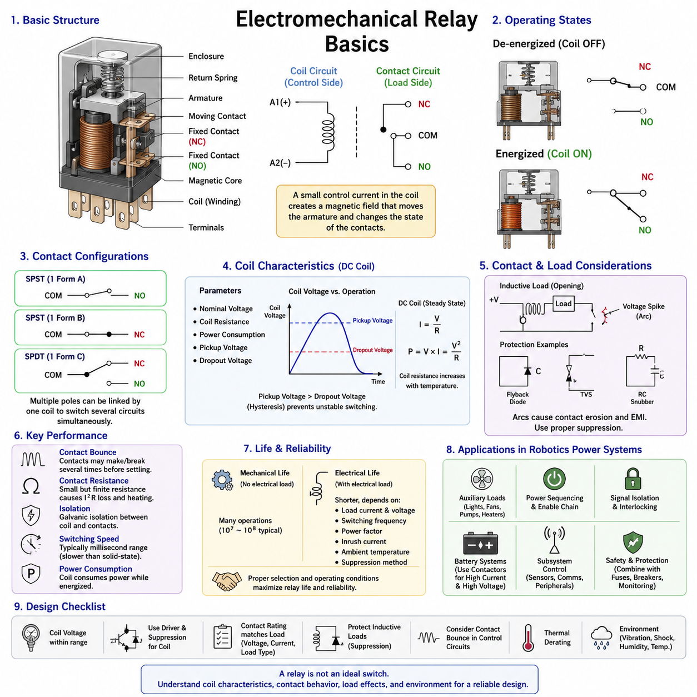
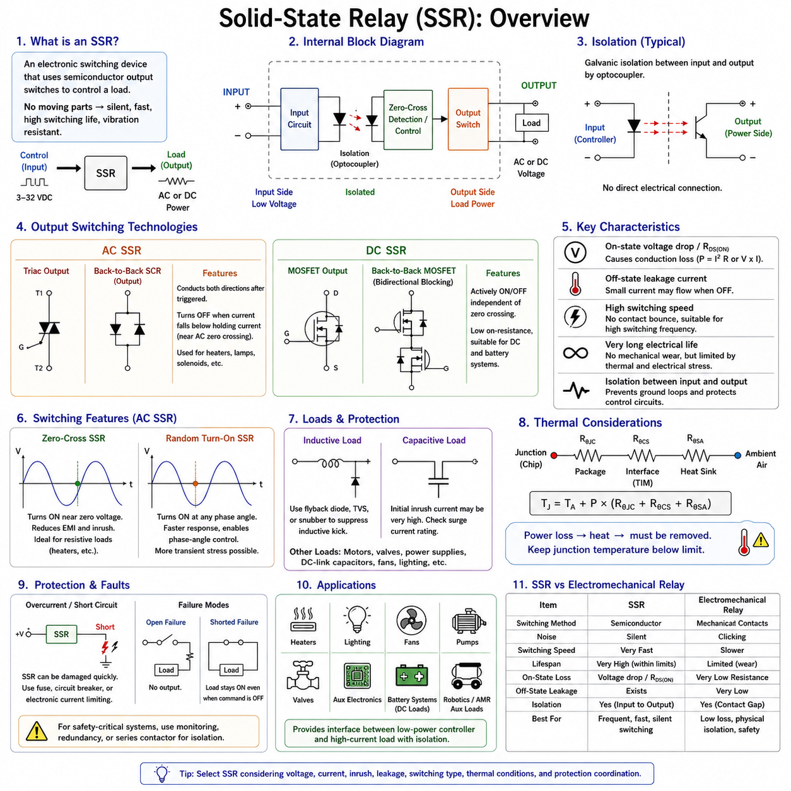
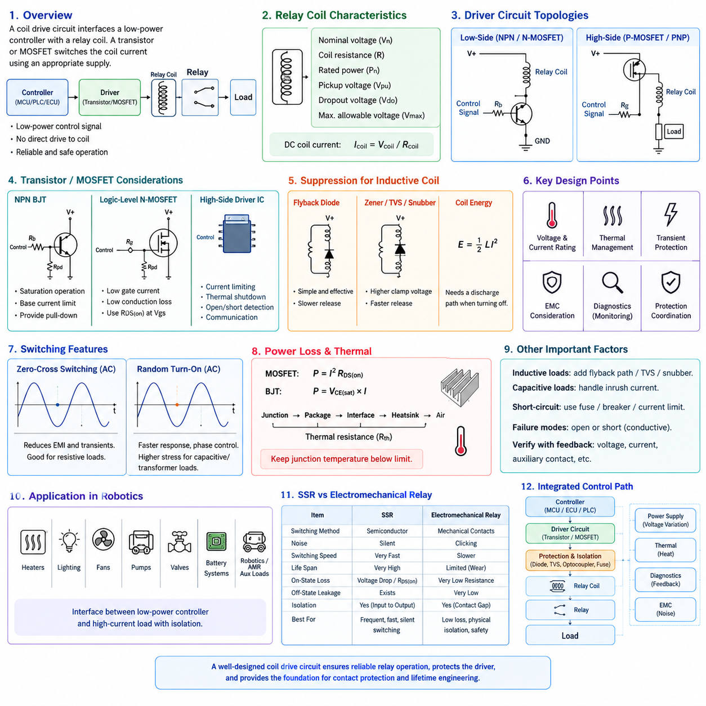
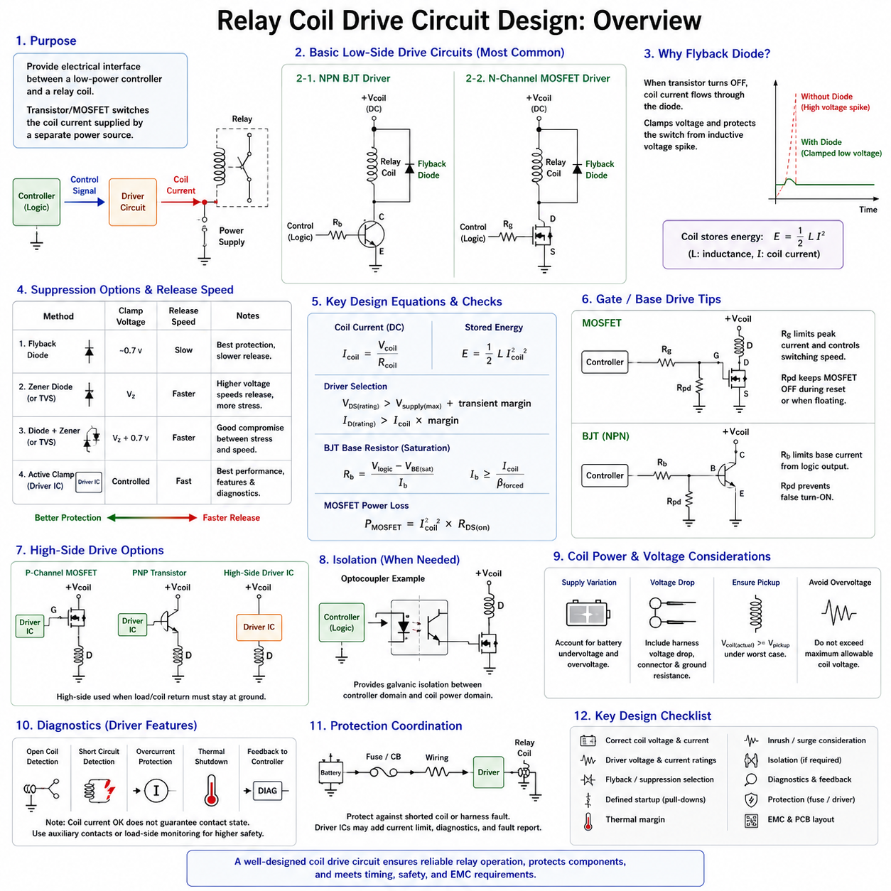
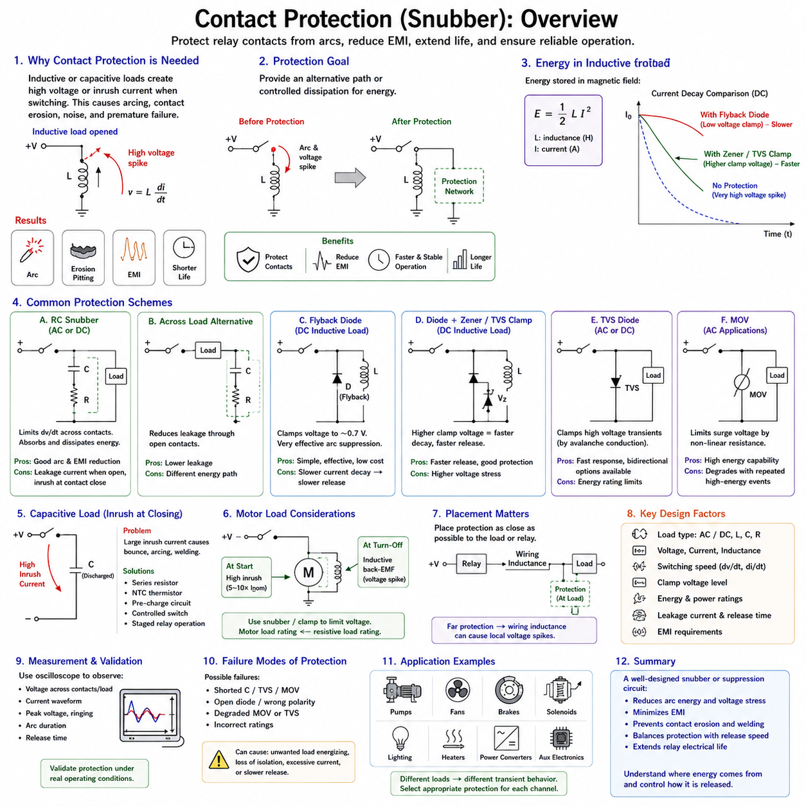
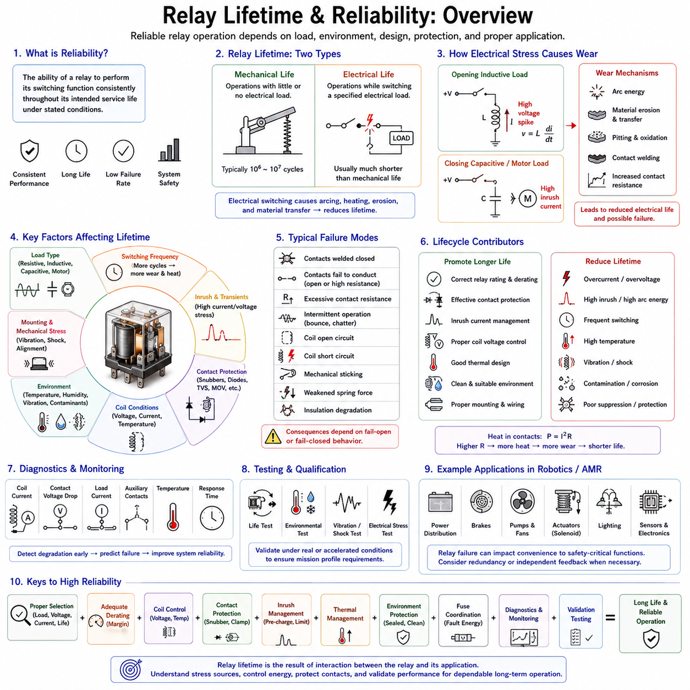

**Volume 04. Fuse, Relay, and Power Distribution Unit**

# Chapter 03. Relay Design

## 03.01. Electromechanical Relay Basics

{width="7.268055555555556in" height="7.268055555555556in"}

An electromechanical relay is an electrically controlled switching device that uses an electromagnetic mechanism to open or close one or more electrical contacts. It allows a relatively low-power control signal to switch a separate load circuit that may operate at a different voltage or current. This separation between the control side and the switched side makes relays useful for power distribution, signal isolation, interlocking, and actuator control in electrical systems.

The basic relay consists of a coil, magnetic core, armature, return spring, stationary contacts, movable contacts, terminals, and an insulating enclosure. When voltage is applied across the coil, current flowing through the winding produces magnetic flux in the core. The resulting electromagnetic force attracts the movable armature toward the core. Mechanical movement of the armature changes the state of the associated contacts and therefore changes the electrical connection of the load circuit.

When the coil is de-energized, the magnetic field collapses and the return spring normally moves the armature back to its rest position. This creates two fundamental operating states: energized and de-energized. The contacts associated with these states are commonly identified as normally open (NO) and normally closed (NC). A normally open contact conducts after relay activation, whereas a normally closed contact conducts while the relay remains inactive and opens when the relay is energized.

Relay contact arrangements are often described using pole and throw terminology. A single-pole single-throw (SPST) relay controls one electrical path, while a single-pole double-throw (SPDT) relay switches one common terminal between two alternative paths. Relays may also contain multiple poles, allowing several circuits to be switched simultaneously by one coil. This mechanical linkage is useful when coordinated switching or electrical interlocking must occur from a single control command.

The coil is characterized by parameters such as nominal voltage, coil resistance, power consumption, pickup voltage, and dropout voltage. Applying the nominal voltage establishes sufficient coil current to produce the magnetic force required for reliable operation. The actual pickup voltage is generally lower than the nominal rating, while the dropout voltage is lower still. This difference introduces hysteresis that helps prevent unstable switching when the control voltage fluctuates near the operating threshold.

For a DC relay coil, steady-state current can be approximated using Ohm\'s law as I = V/R, where V is the applied coil voltage and R is the winding resistance. Coil power can consequently be estimated from P = VI or P = V²/R. Although these relationships are straightforward, coil resistance changes with temperature. Increased winding temperature raises resistance, reduces current, and may reduce available electromagnetic force, making temperature an important consideration in relay drive design.

The contact side of a relay must be selected independently from the coil side. Contact ratings specify the voltage, current, and type of load that can be switched safely. A relay rated for a particular resistive current does not necessarily support the same current for motors, solenoids, transformers, capacitive loads, or other reactive devices. Load characteristics determine switching stress because inductive and capacitive circuits can produce transient currents or voltages substantially greater than their steady-state values.

When relay contacts close, they do not usually establish a perfectly stable connection immediately. Mechanical elasticity causes contact bounce, during which the contacts may repeatedly make and break for a short period before settling. Contact bounce can generate electrical noise, multiple transitions in digital circuits, and localized arcing in power circuits. Its significance depends on the load and application, but it must be considered when relays interface with electronic controllers or sensitive monitoring circuits.

Opening an inductive load presents another important challenge. Current through an inductance cannot change instantaneously, so interruption of the current path can produce a high transient voltage. This voltage may create an arc across separating relay contacts, accelerating contact erosion and generating electromagnetic interference. Protective elements such as flyback diodes, transient voltage suppressors, RC snubbers, or other suppression networks are therefore commonly applied according to the load and required release behavior.

The relay coil itself is also an inductive component. When a DC coil is switched off, stored magnetic energy generates a reverse-voltage transient that can damage the transistor, MOSFET, integrated driver, or controller responsible for energizing the relay. A suppression device is therefore normally placed across or around the coil circuit. A simple flyback diode provides effective protection, although it slows magnetic field decay and may increase the relay\'s mechanical release time.

Electrical isolation is one of the major advantages of electromechanical relays. Because the coil and contacts are coupled magnetically and mechanically rather than through a direct conductive path, the control circuit can remain galvanically separated from the switched circuit. This permits low-voltage electronics to command higher-power loads while reducing direct electrical interaction between domains. The actual isolation capability depends on internal spacing, insulation materials, construction, and applicable voltage ratings.

Contact resistance is another key performance parameter. Closed relay contacts exhibit a small but finite resistance determined by contact material, contact force, surface condition, contamination, and aging. At higher current, even a small resistance produces power loss according to P = I²R. Excessive resistance can therefore create localized heating, voltage drop, and progressive contact degradation. Proper relay selection must account for continuous current as well as the transient conditions occurring during switching.

Contact materials are chosen to balance conductivity, resistance to welding, arc erosion, oxidation, and expected switching life. Different applications impose different requirements because a low-level signal contact operates under conditions very different from a motor power contact. Very small currents may not provide enough electrical energy to penetrate contaminated surface films, while high-current loads can cause severe arcing or welding. Contact ratings must therefore be interpreted in relation to the actual load profile.

Relay life is generally separated into mechanical life and electrical life. Mechanical life represents the number of operations achievable without significant electrical loading and is primarily determined by the armature, spring, bearings, and mechanical construction. Electrical life is normally much shorter because switching current causes contact wear. Load current, voltage, switching frequency, power factor, inrush current, ambient temperature, and suppression strategy can all significantly influence practical service life.

Switching speed is limited by electromagnetic and mechanical dynamics. After coil energization, time is required for current to rise, magnetic force to develop, the armature to move, and the contacts to settle. A similar delay occurs during release. Electromechanical relays are consequently much slower than semiconductor switches, but their switching speed is adequate for many power-control functions where operations occur over milliseconds rather than microseconds.

Relays also consume power while their coils remain energized. In battery-powered robots, mobile platforms, and AMRs, continuous coil consumption can become relevant when multiple relays operate for long periods. Designers may use latching relays when maintaining a state without continuous coil power is advantageous. A latching relay retains its commanded mechanical position after the excitation pulse is removed, although its control strategy and failure-state behavior differ from those of conventional monostable relays.

In robotics power architecture, electromechanical relays can provide controlled connection of auxiliary loads, lighting, pumps, fans, heaters, sensors, communication equipment, and other subsystems. They can also participate in enable chains and power sequencing. Higher-current propulsion batteries and high-voltage systems generally require appropriately rated contactors rather than ordinary relays, making relay and contactor selection dependent on voltage, current, fault energy, isolation, and safety requirements.

A relay should not be treated as an ideal binary switch. Its engineering behavior includes coil heating, pickup and dropout thresholds, contact bounce, switching arcs, transient voltages, contact resistance, mechanical delay, and finite operating life. These characteristics interact with wiring, fuses, electronic drivers, loads, and power distribution architecture. Reliable implementation therefore requires coordinated consideration of both the control circuit and the switched power circuit.

For practical design, the relay must be evaluated under normal operation, startup, shutdown, overload, and fault conditions. Coil voltage must remain within the permitted range, contacts must withstand continuous and transient load currents, and suppression circuits must control inductive energy without producing unacceptable release delays. Environmental factors such as vibration, shock, humidity, contamination, and temperature are particularly important in mobile robotic equipment.

Electromechanical relays remain valuable despite the increasing use of solid-state switching because they provide intuitive switching behavior, strong galvanic isolation, low closed-contact voltage drop, and the ability to switch AC or DC circuits with appropriate contact ratings. Their limitations are mechanical wear, acoustic noise, finite switching speed, contact bounce, and sensitivity to repeated high-energy switching. Understanding these fundamentals provides the basis for later study of solid-state relays, coil drive circuits, contact protection, and relay lifetime engineering.

## 03.02. Solid-State Relay (SSR)

{width="7.268055555555556in" height="7.268055555555556in"}

A solid-state relay (SSR) is an electronic switching device that performs a control function similar to an electromechanical relay without using mechanically moving contacts. A low-power input signal controls a semiconductor switching stage that connects or disconnects an electrical load. Because switching is achieved electronically, SSRs provide silent operation, rapid response, high switching-cycle capability, and resistance to mechanical wear.

An SSR is generally divided into an input circuit, an isolation stage, a drive or control circuit, and an output switching stage. The input accepts a control voltage or current from a microcontroller, PLC, ECU, or other control device. The isolation stage transfers the command without establishing a direct conductive connection, while the output semiconductor performs the actual switching of current through the load.

Galvanic isolation between the input and output is commonly achieved using an optocoupler or another isolated signal-transfer mechanism. In an optically isolated SSR, the input signal energizes an internal light-emitting device, and the emitted light activates a photosensitive receiving circuit. This arrangement allows low-voltage control electronics to command a higher-voltage load while limiting direct electrical interaction between the two domains.

The semiconductor used in the output stage depends strongly on whether the SSR is designed for AC or DC operation. AC SSRs commonly use triacs or pairs of silicon-controlled rectifiers (SCRs), while DC SSRs commonly employ MOSFETs or related transistor structures. These devices have different conduction and turn-off characteristics, so an SSR designed for AC switching generally cannot be assumed to operate correctly in a DC application.

A triac-based AC SSR can conduct current in both directions after being triggered, making it suitable for alternating-current loads. The device normally turns off when load current falls below its holding current, which naturally occurs near the AC current zero crossing. This behavior makes triacs practical for heaters, lamps, solenoids, and other AC loads, although inductive loads require additional consideration because voltage and current may not be in phase.

DC SSRs commonly use power MOSFETs because MOSFETs can be actively turned on and off independently of a current zero crossing. For bidirectional blocking in a DC or mixed-polarity circuit, two MOSFETs may be connected in a back-to-back configuration. MOSFET-based SSRs are useful in battery-powered systems, robotics, industrial DC distribution, and electronic load control where mechanical relay contacts would otherwise experience frequent switching wear.

One important SSR characteristic is the voltage drop or on-state resistance of the output semiconductor. Unlike an electromechanical relay contact, which can exhibit very low closed-contact resistance, a semiconductor switch produces conduction loss while carrying current. For a MOSFET output, conduction loss can be approximated by P = I²RDS(on), while other semiconductor structures may be characterized primarily by their on-state voltage drop.

The resulting power loss is converted into heat and must be removed from the SSR. Thermal design therefore becomes a fundamental part of SSR selection, particularly at high continuous load current. Datasheet current ratings may assume specific heat-sink conditions, ambient temperatures, mounting methods, or airflow. An SSR that appears electrically adequate can overheat if thermal resistance between the semiconductor junction and surrounding environment is not properly controlled.

Thermal resistance describes how temperature rises as power flows from the semiconductor junction through the package, interface material, heat sink, and surrounding air. Junction temperature can be estimated by combining power dissipation with the relevant thermal resistance path. Maintaining junction temperature below the manufacturer\'s allowable limit is essential because excessive temperature accelerates semiconductor degradation and can ultimately cause permanent failure.

Another important difference from an electromechanical relay is off-state leakage current. Mechanical contacts provide a physical air gap when open, whereas semiconductor devices normally allow a small current to flow even when commanded off. This leakage may be insignificant for large loads but can cause unexpected behavior in sensitive circuits, LED lamps, high-impedance inputs, diagnostic circuits, or equipment assumed to be completely disconnected.

The output of an SSR must therefore not automatically be considered equivalent to a physical isolation switch. Although the control input and output may provide galvanic isolation, the semiconductor output can still present leakage current, parasitic capacitance, and limited blocking capability. Where maintenance isolation, emergency disconnection, or safety requirements demand a visible or physically separated current path, an electromechanical device or contactor may still be required.

AC SSRs are often available with zero-cross switching. A zero-cross SSR waits until the AC waveform approaches zero voltage before turning on the output. Switching near this point can reduce electromagnetic interference, current transients, and electrical stress for many resistive loads. This technique is particularly useful for repetitive switching of heaters and similar loads where precise switching at an arbitrary phase angle is unnecessary.

Random-turn-on SSRs, sometimes called instantaneous switching SSRs, activate the output without intentionally waiting for a zero crossing. They are useful when switching timing must closely follow the control command or when phase-angle control is required. However, switching at an arbitrary point on an AC waveform can produce greater transient stress, especially with capacitive, transformer, or other loads having substantial inrush characteristics.

SSRs offer much faster switching than conventional electromechanical relays because no armature or contact mechanism must physically move. They also eliminate mechanical contact bounce, allowing clean electronic transitions and high switching frequencies compared with ordinary relays. Nevertheless, practical switching frequency is still limited by semiconductor losses, driver behavior, load characteristics, thermal conditions, and the particular SSR architecture.

The absence of mechanical contacts provides very high switching endurance when the SSR operates within its electrical and thermal limits. There is no contact erosion, mechanical spring fatigue, or repeated contact arcing. This makes SSRs attractive for applications requiring frequent switching. Their lifetime, however, is not unlimited because semiconductor junction temperature, voltage transients, overcurrent events, insulation aging, and repeated thermal cycling can progressively reduce reliability.

Inductive loads remain a significant design consideration. Motors, solenoids, electromagnetic brakes, valves, and relay coils store energy in their magnetic fields. When current is interrupted, this energy can produce a transient voltage capable of exceeding the SSR output rating. Appropriate suppression using flyback paths, transient voltage suppressors, snubbers, or other protective networks may therefore be required according to the type of output device and load.

Capacitive loads can create a different problem because initially discharged capacitance may draw a large charging current when connected. This inrush current can greatly exceed the normal steady-state load current and may overstress the SSR even though its continuous current rating appears sufficient. Power supplies, DC-link capacitors, electronic modules, and input filters must therefore be evaluated using their startup behavior rather than only their nominal operating current.

Short-circuit behavior is especially important because semiconductor switches can be damaged much faster than mechanical relay contacts under severe fault current. An SSR generally cannot be assumed to protect itself against an external short circuit. Properly coordinated fuses, circuit breakers, electronic current limiting, or other protective devices are required so that fault energy remains within the semiconductor\'s allowable electrical and thermal limits.

SSRs can fail in either an open or conductive condition, but a shorted or permanently conducting output is an important failure mode to consider. A control command requesting OFF therefore does not guarantee that the load has actually been disconnected after a device failure. Safety-related systems may require independent monitoring, redundant switching, feedback signals, or a series electromechanical isolation element to achieve the required fault response.

In robotic electrical architectures, SSRs can control heaters, lighting, fans, pumps, valves, auxiliary electronics, and other loads that require frequent or silent switching. DC MOSFET-based switching is particularly relevant to battery-powered robots and AMRs because many auxiliary subsystems operate from DC power rails. The SSR can provide an interface between a low-power controller and a higher-current load while preserving input-to-output isolation where required.

Selecting between an electromechanical relay and an SSR therefore requires system-level evaluation rather than simply comparing current ratings. Electromechanical relays offer low closed-contact resistance, physical contact separation, and relatively low leakage, while SSRs provide silent operation, high switching endurance, fast response, and no contact bounce. SSRs introduce conduction loss, thermal-management requirements, leakage current, and semiconductor-specific fault behavior.

A reliable SSR design must evaluate control-input compatibility, input-output isolation, load voltage, continuous current, inrush or surge current, switching frequency, output-device technology, off-state leakage, conduction loss, ambient temperature, cooling conditions, and transient protection. Protection coordination with fuses or circuit breakers is also essential because the semiconductor output may be damaged before conventional overcurrent protection operates if the devices are not properly coordinated.

Solid-state relays are therefore best understood as semiconductor power-switching assemblies rather than direct electronic replacements for every electromechanical relay. Their advantages become strongest when frequent switching, silent operation, fast response, vibration resistance, or long cycle life is required. Their successful application depends on electrical protection and thermal engineering, providing the foundation for subsequent study of relay coil drive circuits, contact protection, and switching-device reliability.

## 03.03. Coil Drive Circuit Design

{width="7.268055555555556in" height="7.268055555555556in"}

{width="7.268055555555556in" height="7.268055555555556in"}

A relay coil drive circuit provides the electrical interface between a low-power control device and the electromagnetic coil of a relay. Microcontrollers, ECUs, PLC outputs, and logic circuits usually cannot supply the current required by a relay coil directly. A transistor or MOSFET is therefore used as an electronic switch, allowing the controller to command the relay while the coil receives power from an appropriate supply.

The first design requirement is to understand the relay coil itself. Important parameters include nominal coil voltage, coil resistance, rated coil power, pickup voltage, dropout voltage, and maximum allowable coil voltage. For a DC coil, the approximate steady-state current can be calculated from Icoil = Vcoil/Rcoil. This current establishes the minimum current-handling requirement for the switching device and associated wiring.

A common low-side drive circuit places the relay coil between the positive supply and the switching transistor. The transistor is connected between the coil and ground, so activating the transistor completes the current path. Low-side switching is widely used because an N-channel MOSFET or NPN bipolar junction transistor can be controlled conveniently by ground-referenced logic from a microcontroller or other electronic controller.

An NPN bipolar junction transistor can provide a simple and inexpensive relay driver. The transistor is normally operated in saturation so that its collector-to-emitter voltage remains low while the relay is energized. A base resistor limits current from the controller output and must provide sufficient base drive for reliable saturation. The controller pin current capability, transistor gain assumptions, coil current, and worst-case operating conditions must all be considered.

MOSFETs are increasingly preferred for DC relay drive circuits because they require very little steady-state gate current and can provide low conduction loss. A logic-level N-channel MOSFET can often be driven directly from a 3.3 V or 5 V logic signal if its specified gate characteristics are suitable. Selection should be based on guaranteed RDS(on) at the actual gate voltage rather than only the MOSFET threshold voltage.

The MOSFET voltage rating must provide sufficient margin above the relay supply and expected transient conditions. Its current rating must also exceed the coil current with appropriate thermal and reliability margin. Although relay coils normally require modest current, automotive and robotic electrical environments can contain significant supply disturbances. Voltage rating, avalanche capability, temperature, package dissipation, and transient protection should therefore be evaluated together.

The relay coil behaves as an inductive load because energy is stored in its magnetic field while current flows. The stored energy can be approximated as E = 1/2 LI², where L is coil inductance and I is coil current. When the switching transistor suddenly turns off, the coil attempts to maintain current. Without a controlled discharge path, this behavior produces a high voltage across the switching device and can cause electrical overstress.

A flyback diode is the simplest suppression method for a DC relay coil. It is connected across the coil with reverse polarity during normal energized operation. When the transistor turns off, coil current is redirected through the diode, allowing stored magnetic energy to decay safely. The diode clamps the switching voltage to a low level and provides excellent protection for the transistor against the inductive turn-off transient.

The main disadvantage of a simple flyback diode is slower relay release. Because the diode clamps the coil voltage to a relatively low value, current decays gradually and the magnetic field persists longer. The armature therefore takes additional time to return to its de-energized position. In applications where rapid contact opening is important, this delayed release may affect control timing, fault isolation, or contact arcing behavior.

A higher-voltage suppression method can accelerate coil current decay. A Zener diode, transient voltage suppressor, diode-plus-Zener network, or suitable active clamp permits the coil voltage to rise above the supply during turn-off while limiting it to a safe level. The greater reverse voltage causes magnetic energy to dissipate more rapidly, producing faster relay release than a conventional flyback diode.

Suppression selection is therefore a compromise between semiconductor protection and relay release performance. A low clamp voltage minimizes stress on the driver but extends release time, while a higher clamp voltage shortens release time but increases voltage stress. The chosen clamp level must remain safely below the switching device rating while satisfying relay timing, electromagnetic compatibility, and system safety requirements.

A gate resistor is often included between a controller and MOSFET gate. Although the MOSFET requires almost no DC gate current, its gate capacitance draws transient current during switching. The resistor limits peak gate current, controls switching speed, and can reduce ringing or electromagnetic emissions. A gate-to-source pull-down resistor is also commonly added to keep the MOSFET reliably OFF while the controller output is floating during startup or reset.

For an NPN transistor driver, the equivalent design elements are a base resistor and, where necessary, a base-emitter pull-down resistor. The base resistor prevents excessive current from the logic output, while the pull-down helps prevent unintended transistor activation when the controller pin is undefined. These apparently small components are important because uncontrolled relay activation during processor startup can create undesirable or unsafe system behavior.

High-side relay driving may be required when the system architecture expects the load or coil return to remain permanently connected to ground. High-side switching can use a P-channel MOSFET, PNP transistor, or dedicated high-side driver integrated circuit. Modern protected high-side drivers may additionally provide current limiting, thermal shutdown, open-load detection, short-circuit diagnostics, and communication with the controlling ECU.

Electrical isolation can be introduced when the controller domain must remain galvanically separated from the relay power domain. An optocoupler, digital isolator, or isolated driver can transfer the control command across the isolation boundary. Isolation may be useful where ground potential differences, noise, safety requirements, or separate power domains exist, although the relay contacts themselves already isolate the coil circuit from the switched load circuit.

Supply-voltage variation must be considered because relay pickup depends on actual coil voltage. Battery-powered robots and vehicles may experience undervoltage during startup or heavy loads and elevated voltage during charging. The driver must ensure sufficient voltage for reliable pickup without exposing the coil to excessive voltage. Harness voltage drop, connector resistance, transistor voltage drop, and ground-path resistance should be included in worst-case analysis.

Continuous coil energization produces both coil heating and driver losses. For a MOSFET, conduction loss can be approximated as P = I²RDS(on), while a bipolar transistor dissipates approximately VCE(sat) × I. These losses are often small compared with the coil power but can become relevant in compact electronic modules containing many relay channels. Ambient temperature and enclosure thermal conditions must therefore be included in the design.

Pulse-width modulation can sometimes reduce relay holding power after initial pickup. The coil is first driven strongly to move the armature, after which the average current is reduced while remaining above the holding requirement. This technique can reduce coil temperature and system power consumption, but PWM frequency, current ripple, acoustic behavior, electromagnetic emissions, and guaranteed holding force must be validated for the specific relay.

Diagnostic capability is valuable in advanced relay drive circuits. Monitoring coil current or driver voltage can help identify open coils, disconnected wiring, short circuits, driver faults, or unexpected electrical conditions. Intelligent low-side and high-side driver ICs often integrate such diagnostics. However, electrical confirmation that coil current exists does not necessarily prove that the relay contacts have physically changed to the commanded state.

Safety-related designs must distinguish between commanding the relay and confirming the resulting power state. A welded contact, mechanically stuck armature, broken linkage, or degraded contact may prevent the expected switching action even when the coil driver operates correctly. Systems requiring higher diagnostic coverage may therefore monitor switched-side voltage, auxiliary contacts, load current, or other independent feedback in addition to the coil drive signal.

Protection coordination should include the relay driver, coil supply wiring, connector, fuse, and upstream power distribution system. A shorted coil or harness fault can draw current far above normal coil current, so the branch circuit should be protected appropriately. The semiconductor driver may also require local protection because its damage threshold can be much faster than the operating time of an upstream fuse under certain fault conditions.

Electromagnetic compatibility is another important design consideration. Relay coil switching produces rapid changes in current and voltage, while contact switching can introduce additional disturbances into the electrical system. Suppression components should be located with short current paths, grounding should be carefully controlled, and sensitive logic traces should be separated from noisy switching paths. PCB layout can therefore be as important as component selection.

In robotics and AMR electrical architectures, relay drivers commonly interface MCU or edge-control electronics with power-distribution relays controlling auxiliary subsystems, sensors, pumps, fans, lighting, brakes, and enable circuits. Reliable operation requires the logic domain, driver stage, coil supply, protection network, relay, and feedback mechanism to be treated as one coordinated control path rather than as independent components.

A robust coil drive circuit ultimately combines correct transistor selection, sufficient current capability, transient suppression, defined startup behavior, thermal margin, fault protection, and appropriate diagnostics. The design must guarantee relay pickup under minimum supply conditions and protect the switching electronics during release and abnormal events. These principles provide the electrical foundation for reliable relay control and for subsequent contact-protection and lifetime engineering.

## 03.04. Contact Protection and Snubber

{width="7.268055555555556in" height="7.268055555555556in"}

Contact protection is a fundamental part of relay design because electrical contacts experience severe stress whenever current is interrupted or established. The stress is particularly significant with inductive and capacitive loads, where stored energy or inrush current can produce conditions far beyond steady-state operation. Protection circuits reduce arcing, contact erosion, electromagnetic interference, and premature relay failure.

When relay contacts open an inductive circuit, the current cannot decrease instantaneously because energy is stored in the magnetic field of the load. The inductance attempts to maintain current according to v = L(di/dt), producing a potentially large voltage across the separating contacts. If this voltage exceeds the dielectric strength of the widening contact gap, an electrical arc forms and continues carrying current through ionized gas.

Contact arcing creates extremely high localized temperatures that can melt, vaporize, or transfer small amounts of contact material during every switching operation. Repeated arcing progressively changes the contact surface, increasing roughness and contact resistance. Severe events can cause material transfer, pitting, oxidation, or contact welding. These mechanisms explain why the electrical life of a relay is usually much shorter than its mechanical life.

Contact protection therefore aims to provide an alternative path or controlled dissipation mechanism for energy that would otherwise appear across the opening contacts. Common techniques include RC snubbers, flyback diodes, transient voltage suppressors, Zener clamps, metal-oxide varistors, and combinations of these devices. The correct technique depends on whether the circuit is AC or DC and on the load voltage, current, inductance, switching speed, and required release behavior.

An RC snubber consists of a resistor and capacitor connected in series and placed across the relay contacts or, in some applications, across the switched load. When the contacts begin to open, the capacitor temporarily accepts current that would otherwise charge the contact gap rapidly. This limits the rate of voltage rise across the contacts, while the resistor controls capacitor charging and discharging current and dissipates part of the stored energy.

The capacitor value strongly influences the effectiveness of an RC snubber. A larger capacitance can absorb more transient energy and reduce the rate of voltage rise more effectively, but it also allows greater transient current when the contacts close. Excessive capacitance can therefore create additional contact stress rather than eliminating it. The capacitor must also have an appropriate voltage rating and construction for repetitive pulse operation.

The resistor in the snubber limits peak current and damps oscillation between circuit inductance and capacitance. If resistance is too small, capacitor discharge during contact closure can produce a high current pulse through the contacts. If resistance is too large, the snubber may not sufficiently control the transient voltage. RC values are therefore selected as an electrical compromise and should ideally be validated using measurements under representative load conditions.

Placing an RC snubber directly across the contacts protects the contact gap by limiting the voltage developed as the contacts separate. However, this arrangement creates a small current path around the open contacts through the series RC network. In some circuits this leakage path may influence high-impedance loads or sensitive electronics. Placement across the load can reduce some of these effects but changes how transient energy circulates through the system.

For DC inductive loads, a flyback diode connected directly across the load is one of the most effective suppression methods. During normal operation the diode is reverse biased and does not conduct. When the relay opens, the inductive current commutates into the diode and circulates through the load until its stored magnetic energy decays. The resulting contact voltage is greatly reduced, substantially suppressing arcing and electrical noise.

The low clamp voltage of a flyback diode also causes the inductive current to decay slowly. For solenoids, electromagnetic brakes, valves, and other actuators, this can delay mechanical release. A brake intended to engage immediately after power removal, for example, may respond too slowly with simple diode suppression. Contact protection must therefore be evaluated together with the dynamic behavior of the controlled actuator.

A diode combined with a Zener diode or transient voltage suppressor permits a higher controlled voltage during current decay. The higher clamp voltage increases di/dt and removes magnetic energy more rapidly, improving actuator or relay release time while still limiting the maximum voltage. This method provides a useful compromise between aggressive contact protection and fast load de-energization in DC systems.

A transient voltage suppressor (TVS) can clamp short-duration voltage spikes by entering controlled avalanche conduction above a specified voltage. TVS devices are available in unidirectional and bidirectional configurations and can be applied to DC or appropriate AC transient suppression. Selection requires consideration of standoff voltage, breakdown voltage, clamp voltage, pulse energy, repetitive operation, and the voltage withstand capability of surrounding components.

Metal-oxide varistors (MOVs) are also widely used for transient suppression, particularly in AC circuits. Their resistance decreases sharply when the applied voltage exceeds a characteristic level, allowing transient current to flow and limiting the peak voltage. MOVs can absorb substantial surge energy, but repeated high-energy events gradually degrade their characteristics. Their lifetime and failure behavior must therefore be considered in repetitive relay switching applications.

AC inductive loads require different treatment from simple DC loads because current reverses direction every half cycle. A single flyback diode cannot normally be placed across an AC load because it would conduct during one polarity of the supply waveform. RC snubbers, bidirectional TVS devices, MOVs, or appropriately designed suppression networks are therefore commonly used to limit switching transients in AC relay applications.

Capacitive loads create their greatest contact stress during closing rather than opening. An initially discharged capacitor can behave almost like a short circuit, producing a large inrush current limited mainly by source impedance, wiring resistance, and equivalent series resistance. Repeated high-current closure can cause contact bounce arcing, surface damage, and welding. Contact protection for capacitive loads therefore often requires management of inrush current.

Inrush limiting can be achieved using series resistance, negative-temperature-coefficient thermistors, pre-charge circuits, controlled semiconductor switches, or staged relay operation. Large DC-link capacitors are commonly charged through a pre-charge resistance before the main relay or contactor closes. Once capacitor voltage approaches the supply voltage, the main contacts can close with much lower current stress, greatly reducing the risk of welding and extending contact life.

Motor loads combine several difficult switching characteristics. At startup, a stationary motor can draw several times its normal operating current because back electromotive force has not yet developed. During interruption, winding inductance can generate a substantial voltage transient. A relay switching a motor must therefore withstand both closing inrush and opening inductive energy, and its motor-load rating may be much lower than its resistive-load rating.

Snubber design must also consider electromagnetic compatibility. Contact arcing produces broadband electromagnetic noise that can couple into nearby sensor, communication, and controller circuits through conducted and radiated paths. Limiting voltage rise and arc duration reduces this disturbance at its source. Short suppression-current loops, appropriate grounding, careful harness routing, and physical separation from sensitive signal circuits further improve EMC performance.

The location of the suppression device is important because wiring inductance exists between the relay and the load. A suppression component located far from the energy source may not adequately clamp local voltage because the connecting harness itself stores magnetic energy. For inductive loads, protection is generally most effective when placed close to the load or the switching element according to the intended energy circulation path and system architecture.

Component ratings must include sufficient margin for repetitive operation rather than only a single transient event. Snubber capacitors experience repeated charge and discharge pulses, resistors dissipate pulse energy, and TVS or MOV devices absorb transient energy during switching. Ambient temperature, switching frequency, component tolerances, load variation, and abnormal conditions can significantly change accumulated thermal and electrical stress.

Protection components can themselves introduce failure modes. A shorted suppression capacitor, failed TVS, degraded MOV, or incorrectly selected diode can affect load operation or create excessive current. Safety-related designs should therefore consider whether a protection-device failure can energize a load unexpectedly, defeat isolation, overload wiring, or prevent required actuator release. Appropriate fuse coordination and diagnostic coverage may be necessary.

Oscilloscope measurement is particularly valuable when validating contact protection. Voltage should be observed across the contacts or load during representative opening and closing events while monitoring relevant current behavior. Peak voltage, ringing, arc duration, current decay, release timing, and repetitive heating can then be compared before and after suppression. Measurement provides stronger design confidence than relying solely on nominal component calculations.

In robotics and AMR power systems, relay contacts may switch pumps, fans, brakes, solenoids, lighting, heaters, power converters, and auxiliary electronic modules. Each load presents a different transient signature, so one universal snubber design should not be assumed to protect every channel. Load classification and measured switching behavior should guide the selection of suppression and inrush-management methods for each power-distribution branch.

Reliable contact protection ultimately requires understanding where electrical energy is stored, how that energy moves when contacts change state, and how the protection network controls its release. A properly designed snubber or suppression circuit reduces arc energy, voltage stress, EMI, contact erosion, and welding risk without creating unacceptable leakage or release delay. These principles directly support improved relay lifetime and reliability in the next stage of relay design.

## 03.05. Relay Lifetime and Reliability

{width="7.268055555555556in" height="7.268055555555556in"}

Relay lifetime and reliability describe how consistently a relay performs its required switching function throughout its intended service period. Reliability depends not only on the relay\'s nominal current and voltage ratings but also on load type, switching frequency, environmental conditions, coil excitation, contact protection, and fault exposure. A relay that is correctly rated under steady-state conditions may still fail prematurely if transient stresses are ignored.

Relay lifetime is commonly divided into mechanical life and electrical life. Mechanical life represents the number of switching operations that the mechanism can perform with little or no electrical load applied to the contacts. Electrical life represents the number of operations achievable while switching a specified electrical load. Because electrical switching introduces arcing, heating, erosion, and material transfer, electrical life is usually considerably shorter than mechanical life.

Mechanical wear occurs in components such as the armature, return spring, pivots, bearings, contact supports, and other moving structures. Repeated operation can cause fatigue, dimensional change, friction increase, or loss of spring force. Although mechanical endurance may reach a very large number of cycles, vibration, shock, contamination, excessive coil voltage, and unfavorable mounting conditions can accelerate degradation beyond that expected from cycle count alone.

Electrical contact wear is strongly influenced by the energy present during contact opening and closing. When an inductive load is interrupted, stored magnetic energy can generate a high voltage and sustain an arc across the separating contacts. During closing, capacitive loads and motors can produce large inrush currents. These transient events can impose substantially greater stress than the nominal steady-state current indicated by the load specification.

Contact arcing progressively removes or redistributes contact material. Small amounts of metal may melt, vaporize, oxidize, or transfer from one contact surface to another during each switching event. Over many cycles, the surfaces can develop pits, protrusions, increased roughness, or altered geometry. These changes influence contact resistance and local current density, creating conditions that can accelerate further degradation and reduce electrical life.

Contact welding is one of the most serious relay failure mechanisms. If closing current or arc energy becomes sufficiently high, the contact surfaces can locally melt and fuse together. The relay may then remain electrically closed even after the coil is de-energized. Motor startup current, capacitor inrush, short circuits, contact bounce, and insufficient relay rating can all increase welding risk, making transient current analysis essential.

Contact resistance provides an important indicator of contact condition. A healthy closed contact normally has low resistance, but contamination, oxidation, reduced contact force, erosion, or surface damage can increase it over time. Because power dissipation follows P = I²R, increasing resistance generates additional heat at higher currents. This heating can further damage the contact interface and create a positive feedback mechanism that accelerates aging.

The type of load has a major influence on expected relay life. A resistive load generally produces relatively predictable switching stress, whereas motors, solenoids, transformers, lamps, capacitors, and electronic power supplies can produce substantial transient behavior. Consequently, a relay capable of switching a given resistive current may require significant derating when applied to an inductive, motor, lamp, or capacitive load.

Switching frequency affects both mechanical wear and thermal conditions. A relay operating only a few times per day experiences very different aging from one switching several times per minute. Frequent operation increases accumulated arc events and may prevent the coil, contacts, or surrounding structure from returning to thermal equilibrium. Electrical-life calculations should therefore consider expected operations per hour, daily duty cycle, and total mission duration.

Coil conditions also influence long-term reliability. Continuous overvoltage increases coil current and temperature, accelerating insulation aging and potentially affecting surrounding mechanical components. Undervoltage can be equally problematic because insufficient magnetic force may cause incomplete pickup, chatter, or reduced contact pressure. Stable coil excitation within the specified operating range is therefore important for both switching performance and relay lifetime.

Coil temperature depends on electrical power dissipation and the surrounding thermal environment. As copper winding temperature rises, resistance increases, modifying coil current and electromagnetic force. High ambient temperature reduces the available thermal margin and may also accelerate degradation of insulation, plastics, adhesives, and spring materials. Relay selection should therefore use the manufacturer\'s temperature-dependent limits rather than assuming room-temperature ratings apply universally.

Contact bounce contributes to electrical aging because each brief separation and reconnection can create additional arcs during a single commanded switching event. The effect becomes particularly severe when high inrush current is present at closure. Mechanical design determines much of the bounce behavior, but external circuit conditions determine its electrical severity. Proper load selection and inrush limitation can therefore substantially improve practical contact life.

Contact protection directly influences relay reliability. Flyback diodes, TVS clamps, Zener networks, RC snubbers, MOVs, and other suppression devices reduce the electrical energy imposed on contacts when reactive loads are switched. Effective suppression can greatly reduce arcing and electromagnetic interference. However, protection must be selected carefully because excessive suppression can slow current decay and delay the release of solenoids, brakes, or other electromagnetic actuators.

Environmental contamination can significantly alter contact behavior. Dust, moisture, corrosive gases, oils, and chemical vapors may degrade exposed surfaces or enter inadequately sealed relay structures. Low-current signal contacts are especially sensitive because the available electrical energy may be insufficient to break through oxide or contamination films. Sealed, flux-resistant, or environmentally protected relays may therefore be necessary depending on installation conditions.

Vibration and mechanical shock are particularly important in vehicles, robots, AMRs, industrial machines, and mobile equipment. External acceleration can disturb the armature or contact system, temporarily change contact force, or cause unintended opening and closing. Repeated vibration may also fatigue terminals, solder joints, mounting structures, and internal mechanical elements. Relay qualification should therefore reflect the actual mechanical environment of the product.

Thermal cycling introduces another reliability mechanism. Repeated heating and cooling causes materials with different coefficients of thermal expansion to expand and contract by different amounts. Over long periods, this can stress solder joints, terminals, coil connections, plastic structures, and internal interfaces. Systems with frequent power cycling or large ambient temperature variation should therefore consider thermal cycling in addition to maximum operating temperature.

Relay derating is an effective method for improving reliability margin. Instead of operating contacts continuously at their absolute or nominal rating, designers select a relay with additional voltage, current, thermal, and transient capability. The required margin depends on load characteristics and operating environment rather than on one universal percentage. Inrush current, inductive energy, ambient temperature, switching frequency, and expected service life should guide the derating decision.

Reliability evaluation should distinguish normal operating stress from abnormal and fault conditions. Normal switching may remain well within the relay rating, while a stalled motor, shorted load, failed power converter, or wiring fault can expose the contacts to much greater current. Upstream fuses or circuit breakers must therefore be coordinated so that fault energy does not exceed the relay\'s withstand capability before protection clears the circuit.

Failure modes can include contacts welded closed, contacts unable to conduct, excessive contact resistance, intermittent switching, coil open circuit, coil short circuit, mechanical sticking, weakened spring force, and insulation degradation. These failures do not all produce the same system consequence. Reliability engineering must therefore consider both the probability of each failure mechanism and the effect that the resulting relay state has on the overall system.

A particularly important distinction exists between fail-open and fail-closed behavior. Some relay failures prevent current from reaching the load, while welded contacts can leave the load permanently energized. In safety-related circuits, the latter condition may be especially hazardous. Designers should not assume that removing coil power guarantees load isolation, and independent feedback or redundant disconnection may be required when the consequence of unintended energization is severe.

Diagnostic monitoring can improve system-level reliability by detecting degradation before complete failure. Coil current, contact-side voltage, load current, auxiliary contacts, temperature, and switching response time can provide useful information. Increasing voltage drop across closed contacts, for example, may indicate rising contact resistance. Diagnostic thresholds must nevertheless account for normal variation in supply voltage, load current, temperature, and component tolerance.

Preventive maintenance may be based on operating cycles, elapsed service time, measured degradation, or a combination of these factors. In high-cycle applications, counting relay operations provides a practical indicator of accumulated usage. More advanced systems can combine cycle count with switched current, load category, temperature, and fault history to estimate effective contact stress rather than treating every switching event as equally damaging.

Reliability testing should reproduce representative operating conditions rather than relying only on datasheet life values. Tests may include repeated switching at realistic load current, inrush conditions, inductive energy, supply voltage, temperature, vibration, and switching frequency. Contact resistance, release time, pickup behavior, temperature rise, and failure occurrence can then be monitored to determine whether the relay satisfies the intended mission profile.

Accelerated life testing can expose relays to increased switching frequency, temperature, electrical stress, or environmental severity to reveal dominant failure mechanisms within a practical test duration. Acceleration must be applied carefully because excessive stress can create failure mechanisms that would not occur during normal service. The objective is to accelerate relevant aging processes while preserving meaningful correspondence with the actual application.

In robotics and AMR systems, relay reliability directly affects power distribution, braking, auxiliary actuators, pumps, fans, lighting, sensors, and subsystem enable functions. A relay failure can therefore range from a minor loss of convenience to loss of mobility or a safety-related condition. Relay lifetime should be treated as part of the system mission profile together with duty cycle, environmental exposure, maintenance strategy, and fault response.

A reliable relay design combines appropriate contact rating, coil excitation, load-specific derating, transient suppression, inrush management, thermal control, environmental protection, fuse coordination, diagnostics, and validation testing. Lifetime is not a fixed number inherent to the relay alone but the result of interaction between the device and its application. Understanding these interactions enables relay systems to achieve predictable electrical life and dependable long-term operation.
