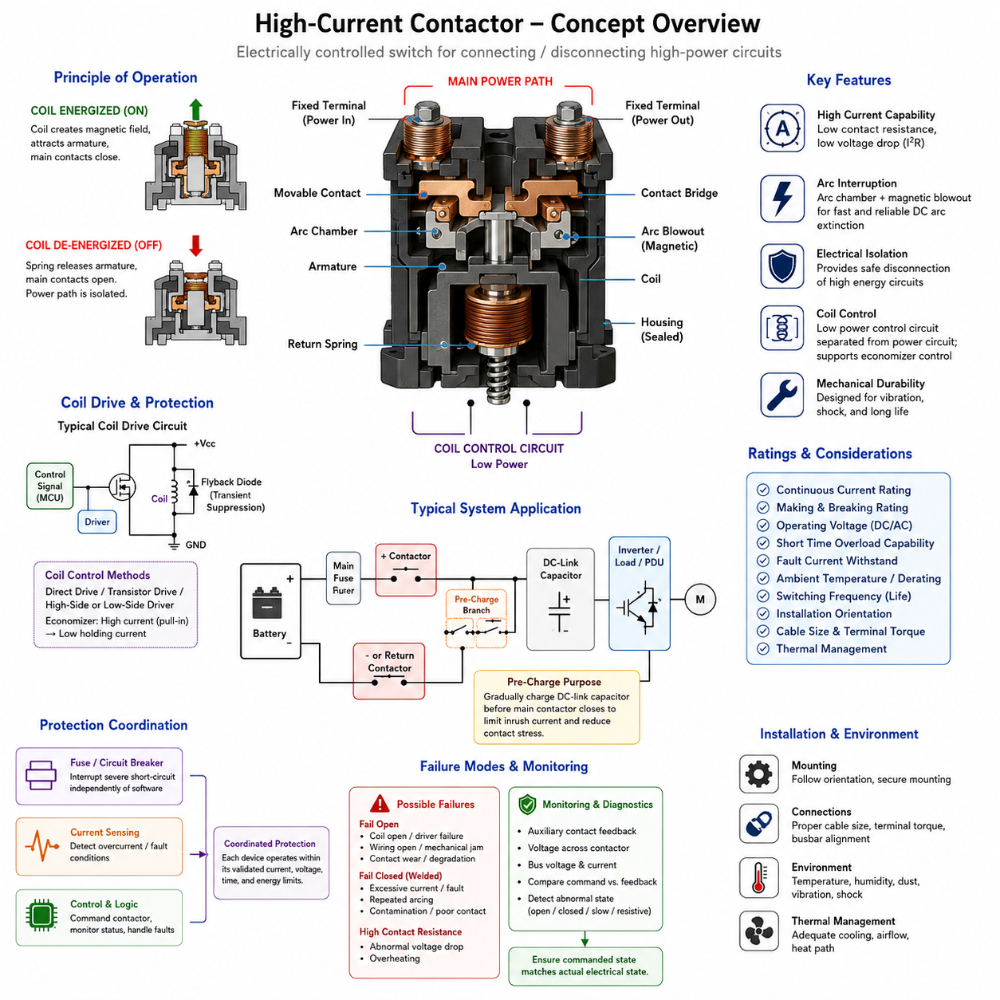
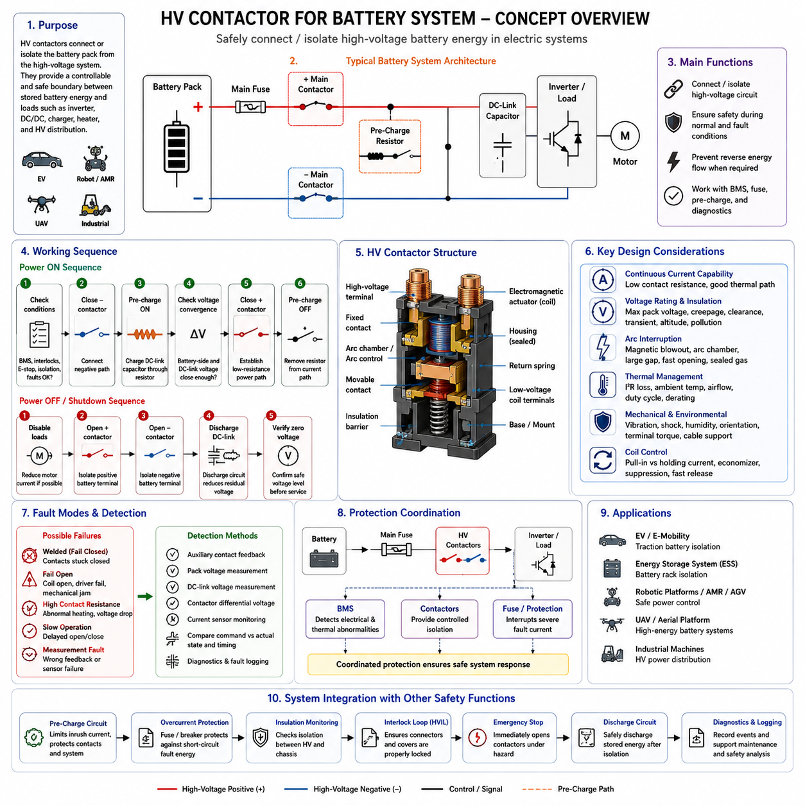
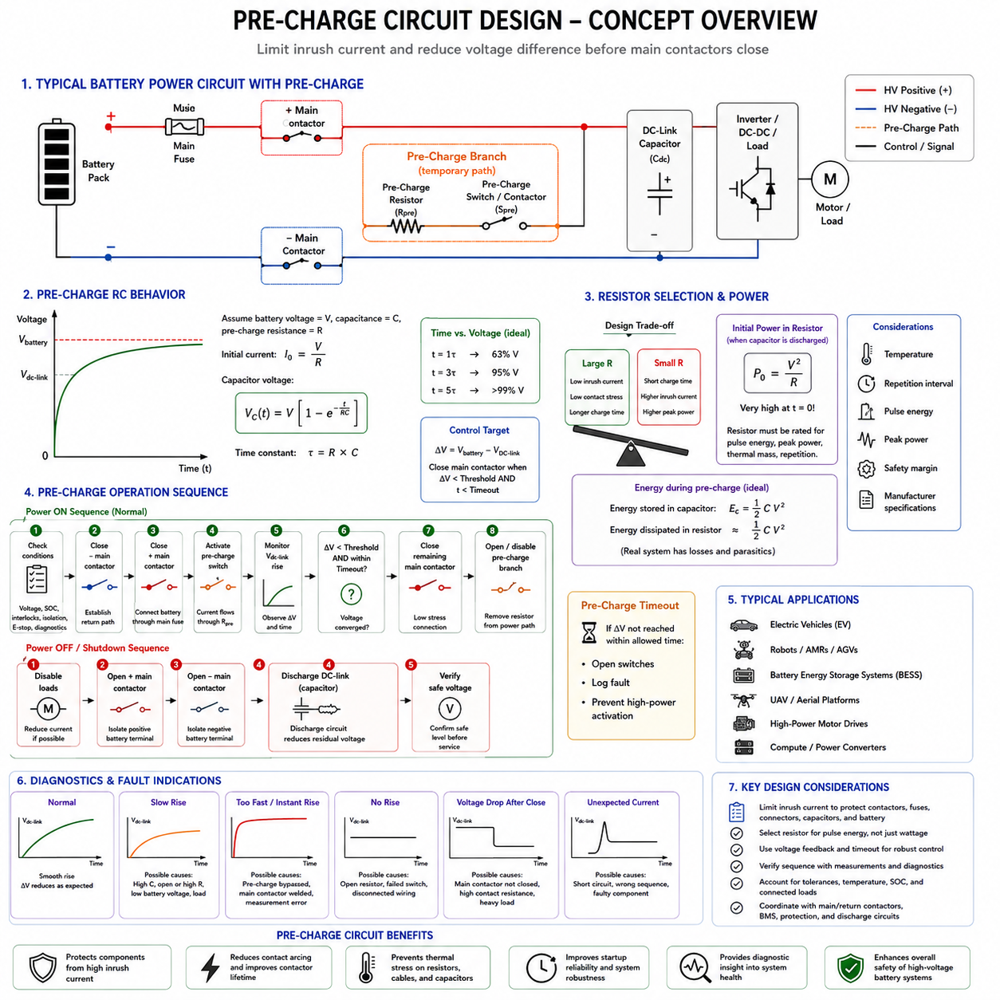
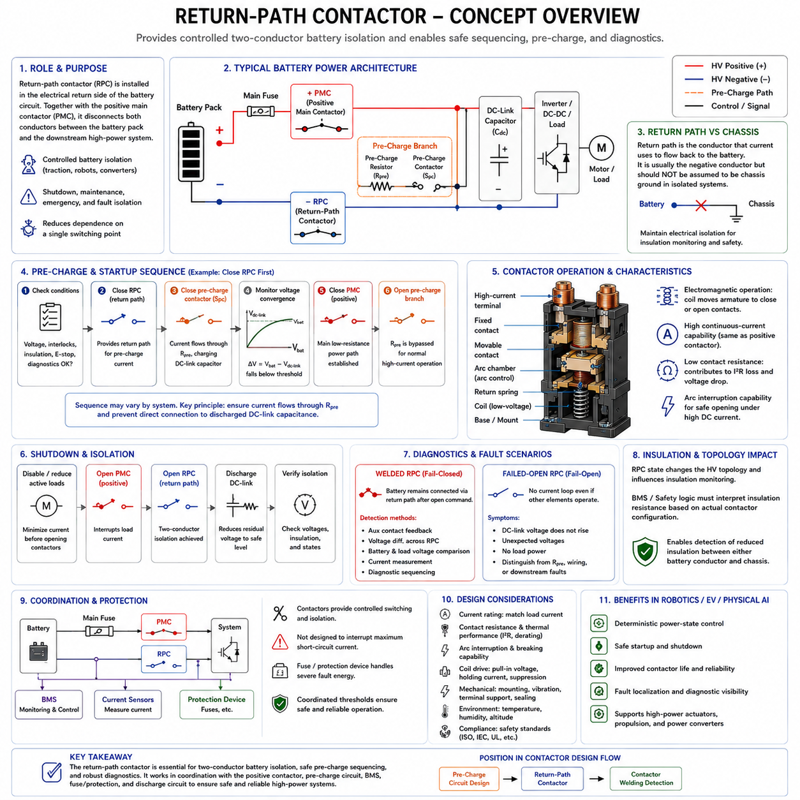
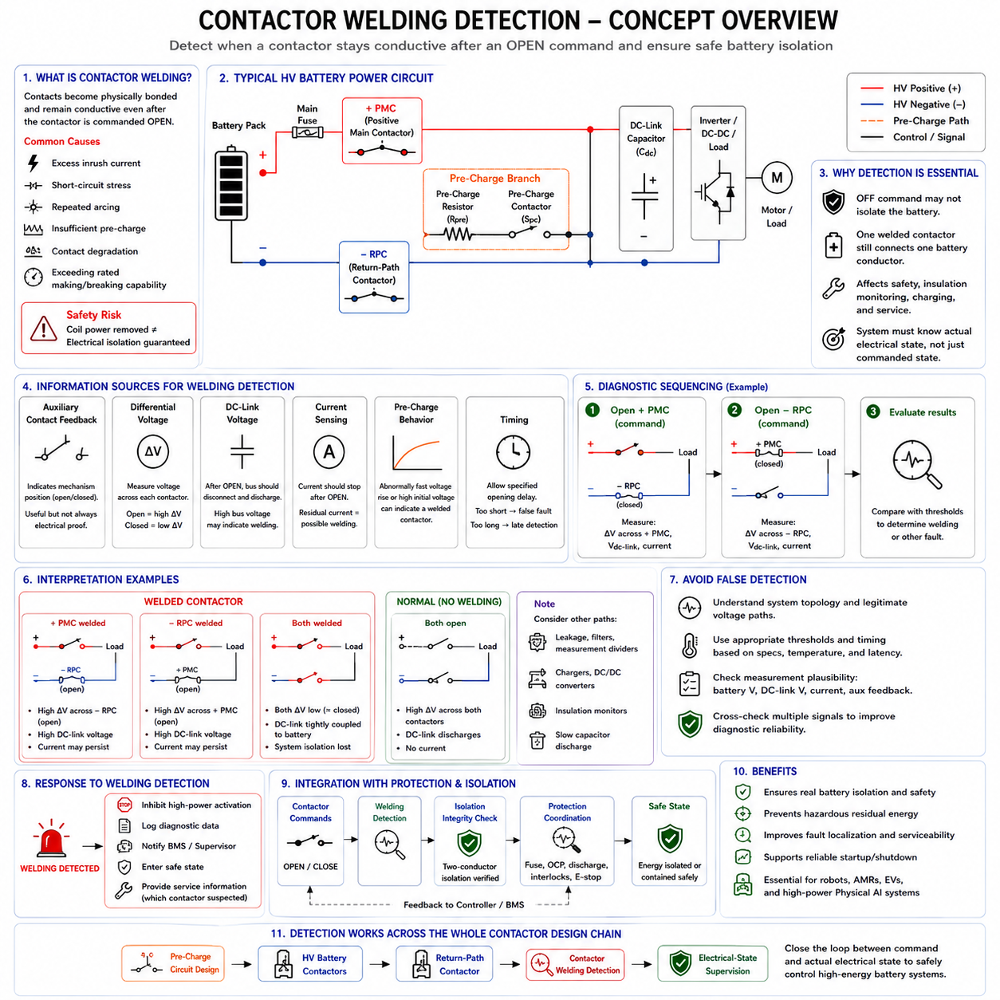

**Volume 04. Fuse, Relay, and Power Distribution Unit**

# Chapter 04. Contactor Design

## 04.01. High-Current Contactor Basics

{width="7.268055555555556in" height="7.268055555555556in"}

고전류 접촉기(High-Current Contactor)는 일반적인 신호 릴레이(Signal Relay)가 실용적으로 처리하기 어려운 수준의 큰 전류를 전달하는 전력 회로(Power Circuit)를 연결하거나 차단하도록 설계된 전기 제어식 스위칭 장치(Electrically Controlled Switching Device)이다. 로봇 전기 아키텍처(Robotics Electrical Architecture)에서는 배터리(Battery)와 견인 인버터(Traction Inverter), 모터 드라이브(Motor Drive), DC/DC 컨버터(DC/DC Converter), 충전 회로(Charging Circuit), 고전력 전력분배장치(Power Distribution Unit, PDU) 등의 주요 부하 사이에 배치된다.

접촉기(Contactor)는 일반적인 전기기계식 릴레이(Electromechanical Relay)와 동일한 전자기 원리(Electromagnetic Principle)로 작동하지만, 훨씬 큰 전류와 고장 에너지(Fault Energy), 스위칭 스트레스(Switching Stress)를 견딜 수 있도록 기계적·전기적 구조가 최적화되어 있다. 코일(Coil)에 전류가 공급되면 자기력이 발생하여 전기자(Armature)를 움직이고 주 접점(Main Contact)을 닫는다. 코일 전원이 제거되면 일반적으로 스프링(Spring)이 접점을 무여자 상태(De-energized State)로 복귀시킨다.

주 전류 경로(Main Current Path)는 일반적으로 대형 고정 단자(Fixed Terminal), 가동 접점(Movable Contact), 도전성 브리지(Conductive Bridge), 저저항 내부 연결부(Low-Resistance Internal Connection)로 구성된다. 수백 암페어(Ampere)의 전류가 흐를 수 있기 때문에 매우 작은 접촉 저항(Contact Resistance)도 P = I²R 관계에 따라 상당한 열을 발생시킬 수 있다. 따라서 접점 재료(Contact Material), 접촉 압력(Contact Pressure), 단자 형상(Terminal Geometry), 도체 단면적(Conductor Cross-Section), 열전달 경로(Thermal Path)를 함께 설계해야 한다.

접촉기는 일반적으로 고전류 전력 회로(High-Current Power Circuit)와 저전력 코일 제어 회로(Low-Power Coil Control Circuit)라는 두 개의 전기적으로 분리된 회로를 가진다. 이러한 분리를 통해 배터리 관리 시스템(Battery Management System, BMS), 차량 제어 장치(Vehicle Control Unit, VCU), 안전 제어기(Safety Controller), 전력 분배 제어기(Power Distribution Controller)가 비교적 작은 제어 전력으로 대형 전기 부하를 제어할 수 있다. 코일은 시스템 아키텍처에 따라 직접 또는 트랜지스터 구동단(Transistor Driver Stage)을 통해 제어될 수 있다.

접촉기의 정격(Rating)은 단순히 장치에 표시된 최대 전류만으로 해석해서는 안 된다. 연속 전류 정격(Continuous Current Rating)은 지정된 열적 조건에서 지속적으로 전달할 수 있는 전류를 의미하며, 투입 및 차단 정격(Making and Breaking Rating)은 안전하게 스위칭할 수 있는 전류를 나타낸다. 단시간 과부하 능력(Short-Duration Overload Capability), 고장 전류 내량(Fault-Current Withstand), 동작 전압(Operating Voltage), 스위칭 횟수, 주변 온도(Ambient Temperature), 설치 방향, 도체 크기와 냉각 조건도 실제 성능에 영향을 준다.

전류가 흐르는 접촉기를 개방하는 것은 단순히 두 도체를 분리하는 것보다 어렵다. 접점이 떨어지는 과정에서 증가하는 접점 간극(Contact Gap)을 가로질러 전기 아크(Electrical Arc)가 형성되면서 전류가 계속 흐를 수 있다. 아크는 강한 국부 발열(Local Heating)을 발생시키고 접점 표면을 침식시키며 정상적인 전류 차단을 방해할 수도 있다. 특히 직류(DC) 시스템에서는 교류(AC)와 달리 전류가 주기적으로 자연 영점(Current Zero)을 통과하지 않으므로 이러한 문제가 더욱 중요하다.

따라서 고전류 직류 접촉기(High-Current DC Contactor)는 아크를 신속하게 소호(Arc Extinction)하기 위한 다양한 구조를 사용한다. 접점 분리 거리(Contact Separation)를 증가시키거나 자기 블로아웃(Magnetic Blowout), 아크 챔버(Arc Chamber), 특수 형상의 접점, 제어된 개방 속도(Opening Speed), 밀폐형 내부 환경(Sealed Internal Environment) 등을 적용할 수 있다. 일부 접촉기는 영구자석(Permanent Magnet)을 이용하여 아크를 주 접점 영역에서 밀어내며, 밀폐형 구조에서는 산화를 줄이고 차단 성능을 향상시키기 위한 제어된 가스 환경을 사용할 수 있다.

직류 접촉기에 자기식 아크 억제(Magnetic Arc Suppression)가 적용되는 경우 극성(Polarity)이 중요할 수 있다. 따라서 양극과 음극 전력 단자가 명확하게 지정된 장치를 자동으로 양방향(Bidirectional) 장치라고 판단해서는 안 된다. 전류 방향이 반대로 바뀌면 자기장이 아크를 이동시키는 방향도 달라져 차단 능력이 감소할 수 있다. 회생 제동(Regenerative Braking)이나 제어 감속 과정에서 에너지 흐름이 역전될 수 있는 로봇 파워트레인(Robotic Powertrain)에서는 특히 주의해야 한다.

접촉기 코일 역시 제어 전자회로(Control Electronics)의 관점에서는 유도성 부하(Inductive Load)이다. 코일 전류를 차단하면 붕괴하는 자기장(Collapsing Magnetic Field)에 의해 전압 과도현상(Voltage Transient)이 발생하므로 적절한 억제 방법이 필요하다. 다이오드(Diode), TVS 소자(TVS Device), 제너 회로(Zener Arrangement) 또는 기타 클램프 네트워크(Clamp Network)를 사용할 수 있다. 지나치게 강한 억제는 접점 개방을 느리게 할 수 있으며, 억제가 부족하면 스위칭 전자회로에 과도한 전기적 스트레스를 줄 수 있다.

많은 현대식 접촉기에는 정상상태 코일 전력을 줄이기 위한 이코노마이저 제어(Economizer Control)가 적용된다. 초기에는 빠른 흡입(Pull-In)에 필요한 충분한 자기력을 만들기 위해 비교적 높은 전류를 공급하고, 이후에는 코일 전류를 더 낮은 유지 전류(Holding Current)로 감소시킨다. 이를 통해 지속적인 전력 소비와 코일 발열을 줄일 수 있다. 이러한 방식은 기생 전력 소비(Parasitic Power Consumption)와 인클로저 온도(Enclosure Temperature)가 중요한 배터리 기반 로봇, 자율이동로봇(Autonomous Mobile Robot, AMR), 전기차(Electric Vehicle), 무인항공기(Unmanned Aerial Vehicle, UAV)에서 특히 유용하다.

접점 바운스(Contact Bounce)는 기계식 접점이 최초 충돌 후 짧은 시간 동안 반복적으로 분리되고 다시 연결되는 현상이다. 고전류 회로에서는 이러한 바운스가 반복적인 아크, 국부 발열, 전자기 간섭(Electromagnetic Interference, EMI), 접점 표면 손상을 발생시킬 수 있다. 따라서 접점 형상, 스프링 힘(Spring Force), 전기자 동역학(Armature Dynamics), 감쇠(Damping), 재료 선정(Material Selection)을 통해 불안정한 전환을 최소화해야 한다. 여러 접촉기의 동작 순서나 프리차지(Pre-Charge)를 제어할 때도 실제 스위칭 동작 특성을 고려해야 한다.

접촉기를 발생 가능한 모든 단락(Short Circuit)을 차단하는 주 보호장치(Primary Protection Device)로 간주해서는 안 된다. 퓨즈(Fuse), 회로 차단기(Circuit Breaker), 전류 센싱(Current Sensing), 배터리 보호 전자장치(Battery Protection Electronics), 접촉기는 일반적으로 상호 보완적인 기능을 수행한다. 퓨즈는 소프트웨어와 관계없이 심각한 고장 에너지를 차단할 수 있으며, 접촉기는 명령에 따른 연결과 절연(Isolation)을 제공한다. 적절한 보호 협조(Protection Coordination)를 통해 각 구성요소가 검증된 전류, 전압, 시간 및 에너지 한계 내에서 동작하도록 해야 한다.

배터리 기반 시스템(Battery-Powered System)의 일반적인 전력 경로에는 배터리, 메인 퓨즈(Main Fuse), 양극 접촉기(Positive Contactor), 음극 또는 리턴 경로 접촉기(Negative or Return-Path Contactor), 프리차지 분기(Pre-Charge Branch), DC 링크 커패시터(DC-Link Capacitor), 인버터(Inverter) 또는 전력분배장치(PDU)가 포함될 수 있다. 방전된 DC 링크 커패시터에 메인 접촉기를 직접 연결하면 매우 큰 돌입 전류(Inrush Current)가 발생할 수 있으므로, 일반적으로 프리차지 회로를 사용하여 주 전류 경로를 완성하기 전에 하류 전압을 점진적으로 상승시킨다.

접점 용착(Contact Welding)은 고전류 스위칭에서 가장 중요한 고장 모드(Failure Mode) 중 하나이다. 과도한 투입 전류(Making Current), 단락 전류, 반복적인 아크, 불충분한 접촉 압력, 오염 또는 정격 범위를 벗어난 동작은 접점 표면을 국부적으로 용융시켜 서로 붙게 만들 수 있다. 접촉기가 용착되면 코일 전원이 제거된 후에도 전기적으로 닫힌 상태를 유지할 수 있으므로, 단순한 OFF 명령만으로 실제 전력 절연이 이루어졌다고 보장할 수 없다.

이러한 이유로 안전 중심 시스템(Safety-Oriented System)은 명령에 따라 전기적 상태가 변화했다고 가정하지 않고 실제 접촉기 상태를 감시하는 경우가 많다. 보조 접점(Auxiliary Contact)은 기계적 위치 정보를 제공할 수 있으며, 접촉기 양단 또는 하류 버스(Downstream Bus)의 전압 측정을 통해 성공적인 개방과 폐쇄 여부를 전기적으로 확인할 수 있다. 더욱 발전된 진단 로직(Diagnostic Logic)은 코일 명령, 보조 접점 피드백, 배터리 전압, DC 링크 전압, 전류 흐름 및 동작 시간을 비교하여 비정상 상태를 검출한다.

고장 거동(Failure Behavior)은 시스템 수준(System Level)에서 고려해야 한다. 접촉기는 코일 손상, 드라이버 고장(Driver Failure), 배선 단선, 기계적 장애 또는 접점 열화로 인해 개방 상태로 고장(Fail Open)날 수 있다. 반대로 용착이나 기계적 고착(Mechanical Sticking)으로 폐쇄 상태 고장(Fail Closed)이 발생할 수도 있다. 완전히 고장 나지 않더라도 접촉 저항이 증가하여 비정상적인 전압 강하(Voltage Drop)와 발열이 발생할 수 있으므로 진단 전략은 구동 상실, 잘못된 상태, 느린 동작 및 점진적인 전기적 열화를 구분할 수 있어야 한다.

접촉기의 실제 성능은 설치 환경의 영향을 크게 받으므로 열 설계(Thermal Design)가 특히 중요하다. 높은 주변 온도, 밀폐된 전력분배장치, 인접한 전력 전자장치(Power Electronics), 작은 규격의 케이블, 불량한 단자 접속, 반복적인 고전류 동작은 내부 온도를 크게 상승시킬 수 있다. 따라서 엔지니어는 명목 전류만을 기준으로 선정하지 않고 정상상태 전류, 듀티 사이클(Duty Cycle), 단자 온도, 케이블 발열, 인클로저 공기 흐름 및 제조사의 디레이팅(Derating) 정보를 함께 평가해야 한다.

기계적 통합(Mechanical Integration) 역시 신뢰성(Reliability)에 영향을 준다. 이동 로봇(Mobile Robot)의 전기 부품은 진동, 충격, 먼지, 습기, 반복적인 가속 및 자세 변화에 노출된다. 접촉기는 지정된 설치 방향과 기계적 한계에 따라 장착해야 하며, 전력 케이블의 질량과 진동이 단자에 과도한 하중을 전달하지 않도록 케이블을 지지해야 한다. 설치 과정에서는 단자 체결 토크(Terminal Torque), 버스바 정렬(Busbar Alignment), 절연 거리(Insulation Clearance), 환경 밀폐(Environmental Sealing), 정비 접근성(Service Accessibility)을 관리해야 한다.

따라서 릴레이(Relay)와 접촉기(Contactor)의 차이는 완전히 다른 작동 원리에 있다기보다 적용되는 전력 규모와 스위칭 엔지니어링(Switching Engineering)에 있다. 릴레이는 일반적으로 비교적 중간 수준의 전기 부하에 사용되는 반면, 접촉기는 고전류 전력 스위칭, 아크 차단, 열 관리, 고장 에너지 노출 및 장기적인 기계적 내구성(Mechanical Endurance)을 중심으로 설계된다. 이러한 특성으로 인해 접촉기는 고에너지 로봇 시스템(High-Energy Robotic System)의 제어 가능한 전력 분배에서 핵심적인 구성요소가 된다.

자율이동로봇(AMR) 및 기타 피지컬 AI(Physical AI) 플랫폼에서 접촉기의 동작은 소프트웨어로 제어되는 지능과 실제 전기 에너지 사이의 중요한 경계를 형성한다. 상위 제어기(Supervisory Controller)가 전력 활성화를 요청할 수 있지만, 안전한 전원 인가(Energization)는 적절한 배터리 상태, 치명적 고장의 부재, 정상적인 프리차지 동작, 유효한 절연 상태 및 확인된 접촉기 피드백과 같은 전기적 선행조건에 의존한다. 따라서 전력 상태 전환(Power-State Transition)은 단순한 디지털 명령이 아니라 제어된 시퀀스(Controlled Sequence)로 처리해야 한다.

견고한 접촉기 설계(Robust Contactor Design)는 궁극적으로 전기적 정격, 아크 거동, 열 성능, 코일 구동 특성, 기계적 내구성, 진단, 보호 협조 및 시스템 수준의 고장 처리를 통합한다. 올바른 접촉기를 선정하려면 단순히 장치가 얼마나 큰 전류를 지속적으로 전달할 수 있는지만 보는 것이 아니라, 어느 정도의 전류를 투입하고 차단해야 하는지, 어떠한 전압 및 고장 조건에서 동작하는지, 얼마나 자주 스위칭하는지, 그리고 접촉기가 명령대로 동작하지 않을 경우 전체 로봇 시스템이 어떻게 대응해야 하는지를 함께 고려해야 한다.

## 04.02. HV Contactor for Battery System

{width="7.268055555555556in" height="7.268055555555556in"}

고전압 접촉기(HV Contactor)는 배터리 팩(Battery Pack)을 하위 전기 시스템(Downstream Electrical System)에 연결하거나 전기적으로 절리(Isolation)하기 위해 사용되는 고전압 전기기계식 스위칭 장치(High-Voltage Electromechanical Switching Device)이다. 배터리 기반 로봇(Battery-Powered Robot), 전기자동차(Electric Vehicle), 산업용 이동 플랫폼(Industrial Mobile Platform) 및 기타 고에너지 시스템(High-Energy System)에서 저장된 배터리 에너지와 견인 인버터(Traction Inverter), DC/DC 컨버터(DC/DC Converter), 충전기(Charger), 히터(Heater), 고전압 전력분배장치(High-Voltage Power Distribution Unit) 등의 부하 사이에 제어 가능한 경계를 형성한다.

일반적인 저전압 릴레이(Low-Voltage Relay)와 달리 고전압 접촉기(HV Contactor)는 높은 직류 전압(DC Voltage)에서 충분한 절연 성능(Insulation Performance)과 차단 능력(Interruption Capability)을 유지하면서 상당한 크기의 연속 전류(Continuous Current)를 안전하게 전달해야 한다. 따라서 대형 도전성 단자(Conductive Terminal), 저저항 주 접점(Low-Resistance Main Contact), 전자기 액추에이터(Electromagnetic Actuator), 절연 장벽(Insulation Barrier), 아크 제어 구조(Arc-Control Structure), 그리고 일반적으로 밀폐형 하우징(Sealed Housing)이 결합된 구조로 설계된다. 이러한 요소들은 정상 스위칭, 과부하, 진동, 열 사이클링(Thermal Cycling), 비정상적인 전기 조건에서도 함께 안정적으로 동작해야 한다.

일반적인 배터리 시스템(Battery System)은 최소한 양극 메인 접촉기(Positive Main Contactor)와 음극 메인 접촉기(Negative Main Contactor)를 포함하여 고전압 배터리 연결부의 양쪽을 모두 절리할 수 있도록 구성한다. 시스템 아키텍처에 따라 충전 경로(Charging Path), 보조 고전압 부하(Auxiliary High-Voltage Load), 이중화 절리 기능(Redundant Isolation Function)을 제어하기 위한 추가 접촉기를 사용할 수도 있다. 이러한 구성을 통해 배터리 관리 시스템(Battery Management System, BMS)과 상위 제어기(Supervisory Controller)는 운전 상태와 검출된 고장에 따라 고전압 연결을 설정하거나 해제할 수 있다.

접촉기 코일(Contactor Coil)은 주 접점(Main Contact)이 고전압 전력 영역(High-Voltage Power Domain)을 스위칭하더라도 저전압 제어 영역(Low-Voltage Control Domain)에 속한다. 배터리 관리 시스템(BMS), 차량 제어 장치(Vehicle Control Unit), 안전 제어기(Safety Controller) 또는 전용 접촉기 드라이버(Dedicated Contactor Driver)가 적절한 드라이버 전자회로(Driver Electronics)를 통해 코일을 제어한다. 고전압 고장이 저전압 전자장치나 통신 네트워크로 전파되지 않도록 제어 회로와 고전압 도체(HV Conductor) 사이의 갈바닉 절리(Galvanic Isolation)와 물리적 분리(Physical Separation)가 중요하다.

메인 접촉기(Main Contactor)를 닫는 과정은 단순히 코일에 전원을 공급하는 것 이상을 요구한다. 하위 장비에는 일반적으로 대용량 DC 링크 커패시터(DC-Link Capacitor)가 포함되어 있으며, 방전된 상태에서는 초기 순간에 매우 낮은 임피던스(Impedance)처럼 동작한다. 배터리를 이러한 커패시터에 직접 연결하면 심각한 돌입 전류(Inrush Current)가 발생하여 접점 아크(Contact Arcing), 전자기적 교란(Electromagnetic Disturbance), 커넥터 스트레스(Connector Stress), 퓨즈 부하(Fuse Loading), 접점 용착(Contact Welding)을 유발할 수 있다. 따라서 배터리 시스템은 일반적으로 메인 접촉기와 프리차지 회로(Pre-Charge Circuit)를 연계하여 제어한다.

프리차지(Pre-Charge) 과정에서는 저항(Resistor)을 이용하여 전류를 제한하면서 하위 DC 링크 커패시터를 배터리 전압에 가까운 수준까지 점진적으로 충전한다. 제어기는 배터리 측 전압(Battery-Side Voltage)과 부하 측 전압(Load-Side Voltage)을 감시하고 두 전압의 차이가 충분히 감소했는지 판단한다. 허용 가능한 프리차지 조건이 확인된 이후에만 메인 접촉기를 닫아 저저항 전력 경로(Low-Resistance Power Path)를 형성한다. 이후 프리차지 분기(Pre-Charge Branch)는 연속적인 전류 전달 경로에서 제거될 수 있다.

종료 시퀀스(Shutdown Sequence) 역시 중요하다. 정상 운전이 종료되거나 안전 고장(Safety Fault)이 발생하면 시스템은 적절한 접촉기에 개방 명령을 내리고 고전압 에너지가 실제로 차단되었는지를 확인한다. 배터리가 절리된 이후에도 DC 링크 커패시터에는 저장 에너지(Stored Energy)가 남아 있을 수 있으므로 잔류 전압(Residual Voltage)을 정의된 안전 수준까지 감소시키기 위한 방전 회로(Discharge Circuit)가 필요할 수 있다. 따라서 접촉기 개방과 하위 회로의 방전은 서로 별개의 기능이지만 상호 연계하여 제어해야 한다.

고전압 직류 전류(High-Voltage DC Current)를 차단하면 접점이 분리되는 동안 아크(Arc)가 계속 유지될 수 있기 때문에 심각한 전기적 스트레스(Electrical Stress)가 발생한다. 교류 전류(AC Current)와 달리 직류 전류는 주기적으로 영점(Zero Crossing)을 통과하지 않으므로 접촉기 자체에서 능동적으로 아크 소호(Arc Extinction)를 촉진해야 한다. 고전압 접촉기에는 지속적인 도전성 플라즈마 경로(Conductive Plasma Path)의 형성을 방지하기 위해 자기 블로아웃 메커니즘(Magnetic Blowout Mechanism), 아크 챔버(Arc Chamber), 확대된 접점 간극(Contact Gap), 고속 개방 메커니즘(High-Speed Opening Mechanism), 특수 접점 재료(Specialized Contact Material), 밀폐 가스 환경(Sealed Gas Environment) 등이 적용될 수 있다.

자기식 아크 제어 구조(Magnetic Arc-Control Structure)가 적용된 경우 접촉기의 극성(Polarity)이 중요할 수 있다. 제조사가 배터리 측 단자(Battery-Side Terminal)와 부하 측 단자(Load-Side Terminal)의 극성을 지정한 경우, 양방향 차단 능력(Bidirectional Interruption Capability)이 명시적으로 제공되지 않는 한 해당 요구사항에 따라 설치해야 한다. 이는 회생 제동(Regenerative Braking), 양방향 충전(Bidirectional Charging), 에너지 회수(Energy Recovery)가 적용된 시스템에서 특히 중요하다. 이러한 운전 모드에서는 배터리 전압의 극성이 변하지 않더라도 전류 방향(Current Direction)이 달라질 수 있기 때문이다.

연속 전류 성능(Continuous-Current Capability)은 주로 접촉 저항(Contact Resistance)과 열 성능(Thermal Performance)에 의해 결정된다. 도통 손실(Conduction Loss)은 I²R에 비례하기 때문에 수백 암페어의 전류가 접촉기를 통과하면 밀리옴(Milliohm) 수준의 저항도 중요해진다. 단자 접속부(Terminal Interface), 케이블 또는 버스바 크기, 접촉 압력(Contact Pressure), 주변 온도(Ambient Temperature), 인클로저 공기 흐름(Enclosure Airflow), 듀티 사이클(Duty Cycle), 인접 열원(Heat Source)이 동작 온도에 영향을 준다. 따라서 명목 전류 정격(Nominal Current Rating)은 제조사가 규정한 열적 조건 및 디레이팅 조건(Derating Condition)과 함께 평가해야 한다.

전압 정격(Voltage Rating) 역시 단순한 배터리 공칭 전압(Nominal Battery Voltage)보다 복잡하게 평가해야 한다. 배터리 팩은 완전 충전 상태에서 최대 전압(Maximum Voltage)에 도달하며, 스위칭 과도현상(Switching Transient)에 의해 일시적으로 추가적인 전기적 스트레스가 발생할 수 있다. 접촉기는 전체 시스템 동작 범위에서 충분한 절연 성능, 연면거리(Creepage Distance), 공간거리(Clearance Distance), 차단 성능을 유지해야 한다. 따라서 접촉기 선정 시 최대 팩 전압(Maximum Pack Voltage), 예상 과도전압, 고도 영향(Altitude Effect), 오염, 환경 조건 및 관련 절연 요구사항을 함께 고려해야 한다.

가장 중요한 고장 모드(Failure Mode) 중 하나는 접점 용착(Contact Welding)이다. 과도한 돌입 전류, 단락 전류(Short-Circuit Current), 반복적인 고에너지 스위칭(High-Energy Switching), 불충분한 프리차지 또는 규정된 투입 능력(Making Capability)을 초과한 동작은 접점 표면을 국부적으로 용융시킬 수 있다. 용착된 접촉기는 코일의 전원이 차단된 이후에도 전기적으로 닫힌 상태를 유지한다. 따라서 접촉기 제어 명령을 제거했다는 사실만으로 고전압 배터리가 실제로 절리되었다고 판단해서는 안 된다.

따라서 배터리 시스템에서는 피드백(Feedback)과 전기적 측정(Electrical Measurement)을 이용하여 실제 접촉기 상태를 판단한다. 보조 접점(Auxiliary Contact)은 기계적 위치를 나타낼 수 있으며, 팩 전압(Pack Voltage), DC 링크 전압(DC-Link Voltage), 접촉기 양단 차동 전압(Contactor Differential Voltage), 전류 센서(Current Sensor)는 전기적 상태에 대한 근거를 제공한다. 진단 소프트웨어(Diagnostic Software)는 명령 상태와 실제 관측된 동작 및 타이밍을 비교한다. 예를 들어 개방 명령 이후에도 예상하지 못한 전압이 존재한다면 용착, 누설(Leakage), 대체 전류 경로(Alternate Current Path) 또는 측정 시스템 고장(Measurement-System Fault)을 의심할 수 있다.

반대 방향의 고장도 발생할 수 있다. 손상된 코일, 단선된 하니스(Open Harness), 드라이버 고장, 부족한 코일 전압, 기계적 장애 또는 열화된 접점 메커니즘으로 인해 접촉기가 닫히지 않을 수 있다. 과도한 접촉 저항은 접촉기가 기계적으로 정상 동작하더라도 비정상적인 발열과 전압 강하(Voltage Drop)를 발생시키는 또 다른 고장 모드가 된다. 따라서 견고한 진단 시스템은 개방 고장(Fail-Open), 폐쇄 고장(Fail-Closed), 느린 상태 전환(Slow Transition), 비정상 피드백(Implausible Feedback), 점진적인 저항 열화(Progressive Resistance Degradation)를 검출할 수 있어야 한다.

접촉기는 배터리 보호(Battery Protection)를 구성하는 여러 요소 중 하나일 뿐이다. 접촉기가 최대 예상 단락 전류(Prospective Short-Circuit Current)를 반드시 안전하게 차단할 수 있는 것은 아니므로 일반적으로 메인 퓨즈(Main Fuse) 또는 다른 과전류 보호장치(Overcurrent Protection Device)가 필요하다. 배터리 관리 시스템(BMS)은 비정상적인 전기적·열적 조건을 검출하고, 접촉기는 명령에 따른 절리를 수행하며, 퓨즈는 심각한 고장 에너지에 대해 독립적인 보호를 제공한다. 효과적인 보호는 하나의 부품에 의존하는 것이 아니라 이러한 장치 사이의 보호 협조(Protection Coordination)에 의해 달성된다.

비상 종료 로직(Emergency Shutdown Logic)은 접촉기의 물리적인 스위칭 한계(Physical Switching Limitation)를 고려해야 한다. 정상적인 저전류 조건에서 접촉기를 개방하는 것과 큰 모터 전류(Motor Current) 또는 단락 전류를 차단하는 것은 매우 다른 조건이다. 가능한 경우 시스템은 고전압 경로를 개방하기 전에 능동 부하(Active Load)를 감소시키거나 비활성화해야 하지만, 실제 위험 고장(Hazardous Fault)이 발생하면 즉각적인 절리가 필요할 수 있다. 따라서 제어 전략(Control Strategy)은 신속한 위험 제거와 접촉기의 전기적 차단 능력 및 예상 수명(Expected Lifetime) 사이의 균형을 고려해야 한다.

고전압 접촉기는 이동 플랫폼(Mobile Platform)에서 가혹한 기계적·환경적 조건에 노출된다. 진동, 충격, 습도, 먼지, 온도 사이클링, 케이블 하중(Cable Force), 설치 방향이 전기적·기계적 신뢰성에 영향을 줄 수 있다. 무거운 고전압 케이블(HV Cable)과 버스바(Busbar)는 그 하중이 접촉기 단자로 직접 전달되지 않도록 기계적으로 지지해야 한다. 올바른 단자 체결 토크(Terminal Torque)와 저저항 접속부(Low-Resistance Interface)는 불량한 접속부가 심각한 국부 열원(Local Heat Source)이 될 수 있기 때문에 특히 중요하다.

배터리 시스템 설계에서는 저전압 코일(Low-Voltage Coil)의 동작 특성도 고려해야 한다. 초기 흡입(Pull-In)에는 닫힌 상태를 유지하는 것보다 더 큰 전자기력이 일반적으로 필요하므로 일부 접촉기 또는 드라이버에서는 높은 초기 코일 전류를 공급한 후 더 낮은 유지 전류(Holding Current)로 전환하는 이코노마이저 제어(Economizer Control)를 사용한다. 또한 코일 억제 회로(Coil Suppression)는 드라이버가 차단될 때 발생하는 유도성 전압(Inductive Voltage)을 제어하면서 요구되는 안전 응답에 충분한 접점 해제 속도(Contact Release Speed)를 유지해야 한다.

따라서 일반적인 고전압 배터리 활성화 시퀀스(HV Battery Activation Sequence)는 단순한 ON 명령이 아니라 제어된 상태 머신(Controlled State Machine)으로 동작한다. 제어기는 접촉기 동작을 시작하기 전에 배터리 상태, 절연 상태(Isolation Status), 비상정지 상태(Emergency-Stop State), 인터록(Interlock), 관련 진단 조건을 확인한다. 이후 정의된 음극 또는 양극 접촉기 시퀀싱(Contactor Sequencing)을 수행하고 프리차지를 실행하며, 전압 수렴(Voltage Convergence)을 평가하고, 나머지 메인 경로를 닫은 후 최종 전기적 상태가 명령된 상태와 일치하는지 검증한다.

따라서 고전압 접촉기(HV Contactor)는 전력 부품(Power Component)이면서 동시에 중요한 안전 액추에이터(Safety Actuator)로 기능한다. 접촉기의 동작은 배터리 관리(Battery Management), 프리차지, 과전류 보호(Overcurrent Protection), 절연 감시(Insulation Monitoring), 비상 종료(Emergency Shutdown), 진단(Diagnostics), 고전압 전력 분배(High-Voltage Distribution)를 하나의 조정된 아키텍처(Coordinated Architecture)로 연결한다. 이러한 역할 때문에 고전압 접촉기 엔지니어링은 프리차지 회로, 리턴 경로 접촉기(Return-Path Contactor), 접촉기 용착 검출(Contactor Welding Detection)과 함께 전체 접촉기 설계(Contactor Design)의 핵심 영역을 구성한다.

로보틱스(Robotics)와 피지컬 AI(Physical AI) 플랫폼에서 신뢰성 있는 고전압 접촉기 제어(HV Contactor Control)는 계산 시스템의 명령이 궁극적으로 예측 가능한 물리적 에너지 상태(Physical Energy State)로 이어지도록 보장한다. 소프트웨어는 추진 또는 액추에이터 전원(Actuator Power)을 요청할 수 있지만, 실제 전원 인가(Energization)는 필요한 전기적 선행조건(Electrical Prerequisite)이 검증된 이후에만 이루어져야 한다. 따라서 안전한 설계에서는 고전압 활성화, 정상 운전, 고장 절리(Fault Isolation), 종료 과정을 감시되는 전기적 상태 전환(Monitored Electrical State Transition)으로 취급하며, 그 성공 여부를 단순히 가정하지 않고 실제로 검증해야 한다.

## 04.03. Pre-Charge Circuit Design

{width="7.268055555555556in" height="7.268055555555556in"}

프리차지 회로(Pre-Charge Circuit)는 배터리(Battery)를 대용량 DC 링크 커패시터(DC-Link Capacitor)를 포함하는 전력 전자 부하(Power Electronic Load)에 연결할 때 발생하는 초기 돌입 전류(Inrush Current)를 제한하기 위해 사용된다. 로봇 플랫폼(Robotic Platform), 전기자동차(Electric Vehicle), 배터리 에너지 시스템(Battery Energy System), 고출력 모터 드라이브(High-Power Motor Drive)에서 이러한 커패시터는 초기 순간에 거의 단락 회로(Short Circuit)처럼 동작할 수 있다. 제어된 충전이 없으면 발생하는 전류가 접촉기, 퓨즈, 커넥터, 버스바, 커패시터 및 배터리 자체에 스트레스를 줄 수 있다.

프리차지(Pre-Charge)의 기본적인 목적은 메인 접촉기(Main Contactor)의 접점이 닫히기 전에 접촉기 양단의 전압 차이(Voltage Difference)를 감소시키는 것이다. 배터리를 방전된 DC 링크 커패시터에 직접 연결하는 대신, 시스템은 먼저 프리차지 저항(Pre-Charge Resistor)을 통해 전류를 흐르게 한다. 저항이 전류를 제한하는 동안 커패시터 전압은 점진적으로 배터리 전압에 가까워진다. 허용 가능한 전압 관계가 형성되면 훨씬 낮은 전기적 스트레스(Electrical Stress) 상태에서 메인 접촉기를 닫을 수 있다.

일반적인 배터리 전력 경로(Battery Power Path)는 메인 퓨즈(Main Fuse), 양극 및 음극 또는 리턴 경로 접촉기(Positive and Negative or Return-Path Contactor), 프리차지 저항, 프리차지 스위칭 장치(Pre-Charge Switching Device), 하위 DC 링크 커패시턴스(Downstream DC-Link Capacitance)를 포함한다. 프리차지 분기(Pre-Charge Branch)는 일반적으로 메인 접촉기 중 하나와 병렬로 연결된다. 정상적인 고전류 운전에서는 프리차지 저항이 일시적인 충전 용도로만 설계되어 견인 또는 액추에이터의 연속 전류를 정상적으로 전달할 수 없기 때문에 이 분기는 우회(Bypass)된다.

충전 동작은 저항-커패시터 회로(Resistor-Capacitor Circuit), 즉 RC 회로(RC Circuit)로 근사할 수 있다. 배터리 전압을 V, 하위 커패시턴스를 C로 나타내면 초기 전류는 대략 I₀ = V/R이며, 여기서 R은 전체 프리차지 저항이다. 이상적인 회로에서 커패시터 전압은 Vc(t) = V[1 − exp(−t/RC)]에 따라 지수적으로 증가한다. 따라서 RC의 곱은 기본적인 충전 시정수(Time Constant)를 결정한다.

하나의 시정수가 지나면 커패시터 전압은 인가 전압의 약 63%에 도달하고, 세 개의 시정수 이후에는 약 95%, 다섯 개의 시정수 이후에는 이상적인 모델에서 99% 이상에 도달한다. 실제 시스템이 반드시 다섯 개의 시정수까지 기다리는 것은 아니다. 대신 제어기는 일반적으로 하위 전압이 팩 전압(Pack Voltage)의 정의된 비율에 도달했는지 또는 메인 접촉기 양단의 차동 전압(Differential Voltage)이 허용 가능한 임계값(Threshold) 이하로 감소했는지를 판단한다.

저항 선정(Resistor Selection)에서는 전류 제한(Current Limitation)과 충전 시간(Charging Time) 사이의 절충이 필요하다. 더 큰 저항값은 초기 전류와 접점 스트레스를 감소시키지만 DC 링크 커패시터를 충전하는 데 필요한 시간을 증가시킨다. 반대로 작은 저항값은 프리차지 시간을 단축하지만 더 큰 전류와 높은 순간 전력(Instantaneous Power)을 발생시킨다. 따라서 선택된 저항값은 시스템 시동 시간 요구사항을 만족하면서 배터리, 스위칭 장치, 퓨즈, 배선, 커패시터 및 하위 전자장치의 허용 돌입 전류를 만족해야 한다.

프리차지 저항은 일반적으로 짧은 시간 동안만 동작하지만 상당한 과도 전력(Transient Power)을 받는다. 프리차지가 시작되는 순간 방전된 커패시터를 가정한 단순화된 조건에서 저항의 전력은 P₀ = V²/R에 가까워질 수 있다. 이러한 초기값은 저항의 연속 전력 정격(Continuous Power Rating)보다 훨씬 클 수 있다. 따라서 저항을 선정할 때 연속 와트 정격만이 아니라 펄스 에너지(Pulse Energy), 피크 전력(Peak Power), 열용량(Thermal Mass), 허용 표면 온도, 반복 주기(Repetition Interval), 제조사가 정의한 과부하 특성(Overload Characteristic)을 고려해야 한다.

이상적인 커패시터를 일정한 전압원(Constant-Voltage Source)으로부터 저항을 통해 충전하면 최종적으로 커패시터에 저장되는 에너지는 ½CV²이며, 충전 과정에서 대략 동일한 양의 에너지가 저항에서 소모된다. 이 관계는 필요한 펄스 에너지 허용 능력(Pulse-Energy Capability)을 추정하는 유용한 첫 번째 기준이 된다. 실제 시스템에는 케이블 저항, 커패시터 등가 직렬 저항(Equivalent Series Resistance, ESR), 반도체 손실, 보조 부하(Auxiliary Load), 누설 경로(Leakage Path), 배터리 임피던스가 추가되어 실제 전류 및 에너지 분포가 달라진다.

프리차지 분기의 스위칭 소자(Switching Element)는 전압, 전류, 시스템 아키텍처 및 안전 요구사항에 따라 전용 접촉기(Dedicated Contactor), 릴레이(Relay) 또는 적합한 반도체 소자(Semiconductor Device)를 사용할 수 있다. 이 소자는 비활성 상태에서 필요한 절리(Isolation)를 제공하면서 초기 충전 전류와 시스템 전압을 견뎌야 한다. 프리차지 저항이 전류의 크기를 제한하더라도 방전된 DC 링크 네트워크로 전류를 최초 투입하므로 스위칭 소자의 투입 능력(Making Capability)이 중요하다.

일반적인 활성화 시퀀스(Activation Sequence)는 배터리 전압, 인터록(Interlock), 절연 상태(Isolation Status), 비상정지 조건(Emergency-Stop Condition), 관련 진단 상태(Diagnostic State)를 확인하는 것으로 시작한다. 이후 하나의 메인 접촉기를 닫고 프리차지 분기를 활성화한다. 제어기는 상승하는 하위 DC 링크 전압을 관찰한다. 허용된 시간 내에 요구되는 전압 수렴(Voltage Convergence)이 달성되면 나머지 메인 접촉기를 닫고, 이후 프리차지 분기를 개방하거나 비활성화한다.

전압 수렴을 확인하는 방식은 고정 타이머(Fixed Timer)에만 의존하는 것보다 더 유용하다. 타이머 방식은 커패시턴스, 저항, 배터리 전압, 온도 및 연결된 부하가 예측 가능한 상태로 유지된다고 가정한다. 배터리 측 전압과 DC 링크 전압을 모두 측정하면 제어기는 충전이 실제로 정상적으로 진행되는지를 판단할 수 있다. 유용한 제어 변수(Control Quantity)는 ΔV = Vbattery − VDC-link로 표현되는 전압 차이이며, 이 값은 메인 접촉기가 닫힐 때 존재하는 전기적 스트레스와 직접적인 관련이 있다.

DC 링크 전압이 너무 느리게 상승한다면 과도한 커패시턴스, 의도하지 않은 부하, 손상된 저항, 과도한 저항값, 낮은 배터리 전압 또는 기타 비정상적인 전류 경로가 존재할 수 있다. 반대로 상당한 커패시턴스가 존재해야 하는 시스템에서 전압이 거의 즉시 상승한다면 프리차지 접촉기가 우회되어 있거나 메인 접촉기가 이미 용착(Welded)되었거나 전압 센싱(Voltage Sensing)이 잘못되었을 가능성이 있다. 따라서 프리차지 동작은 단순한 돌입 전류 제한 이상의 중요한 진단 정보를 제공할 수 있다.

예상한 전압에 도달하지 못하는 상태에서 저항이 무기한 통전되지 않도록 일반적으로 프리차지 타임아웃(Pre-Charge Timeout)이 필요하다. 짧은 펄스 동작을 위해 설계된 저항에 전류가 지속적으로 흐르면 온도가 급격하게 상승하여 손상될 수 있다. 타임아웃이 발생하면 제어기는 프리차지 시퀀스를 종료하고 관련 스위칭 장치를 개방하며 적절한 고장 정보를 기록하고, 비정상 상태가 평가될 때까지 정상적인 고출력 활성화(High-Power Activation)를 방지해야 한다.

메인 접촉기는 차동 전압이 충분히 감소한 이후에만 닫혀야 한다. 너무 일찍 닫으면 남아 있는 전압 차이에 의해 여전히 큰 전류 스텝(Current Step)과 접점 아크(Contact Arc)가 발생하여 프리차지의 목적을 상실할 수 있다. 반대로 프리차지 시간이 지나치게 길면 시스템 시동이 불필요하게 지연되고 저항 발열이 증가한다. 따라서 임계값과 타이밍 요구사항은 접촉기 성능, 커패시턴스, 허용 전류, 배터리 전압 및 시스템 안전 목표(System Safety Objective)를 기반으로 결정해야 한다.

메인 접촉기가 닫힌 이후에는 일반적으로 프리차지 스위치(Pre-Charge Switch)를 개방하여 저항을 활성 전력 경로(Active Power Path)에서 제거한다. 제어기는 프리차지 분기가 비활성화된 이후에도 DC 링크 전압이 배터리 전압에 가까운 수준으로 유지되는지 확인할 수 있다. 전압이 크게 떨어지면 메인 접촉기가 정상적으로 닫히지 않았거나 접촉 저항이 지나치게 높거나 예상하지 못한 하위 부하가 존재할 수 있다. 따라서 시퀀스 검증(Sequence Verification)은 메인 접촉기가 닫히는 순간 이후에도 계속된다.

프리차지는 기본적으로 전원 인가(Energization)를 위한 기능이므로 종료 과정(Shutdown)은 별도로 고려해야 한다. 배터리가 분리되더라도 메인 접촉기가 열린 이후 DC 링크 커패시터에 위험한 에너지가 남아 있을 수 있다. 따라서 지정된 시간 내에 잔류 전압을 감소시키기 위한 방전 회로(Discharge Circuit)를 사용할 수 있다. 프리차지 저항과 방전 저항(Discharge Resistor)은 개념적으로 유사해 보일 수 있지만 전기적 기능, 스위칭 시퀀스, 에너지 요구사항 및 안전 목적이 서로 다르므로 자동적으로 동일한 기능으로 취급해서는 안 된다.

프리차지 설계에서는 반복적인 시동 시도(Repeated Startup Attempt)도 고려해야 한다. 시스템이 OFF와 ON 상태를 반복하면 저항이 각 펄스 사이에서 충분히 냉각될 시간이 없을 수 있다. 한 번의 프리차지 이벤트를 안전하게 처리하는 부품이라도 빠른 재시도(Rapid Retry)가 반복되면 과열될 수 있다. 따라서 제어 소프트웨어(Control Software)는 재시도 횟수 제한(Retry Limit)이나 냉각 지연(Cooling Delay)을 적용할 수 있으며, 하드웨어 선정 시에도 단일 정상 시동뿐 아니라 현실적으로 발생 가능한 최악의 프리차지 반복 시퀀스를 평가해야 한다.

부품 공차(Component Tolerance)와 환경 조건(Environmental Condition)은 실제 RC 응답에 영향을 준다. 저항값은 공차와 온도에 따라 변하고, 커패시턴스 역시 제조 공차와 동작 조건에 따라 달라질 수 있으며, 배터리 전압은 충전 상태(State of Charge, SOC)에 따라 변화한다. 또한 하위 장치가 프리차지가 완료되기 전에 전류를 소비하기 시작할 수도 있다. 따라서 설계 검증(Design Verification)에서는 공칭 계산에만 의존하지 않고 예상되는 전기적·환경적 동작 범위 전체에서 최소 및 최대 충전 시간을 평가해야 한다.

고장 분석(Fault Analysis)에는 프리차지 저항의 단선(Open Pre-Charge Resistor), 저항 단락(Shorted Resistor), 프리차지 접촉기 용착(Welded Pre-Charge Contactor), 스위치 개방 고장(Failed-Open Switch), 메인 접촉기 용착(Welded Main Contactor), 잘못된 전압 측정, 배선 고장(Wiring Fault), 예상하지 못한 하위 부하를 포함해야 한다. 각 조건은 시동 과정에서 서로 다른 전압-시간 특성(Voltage-Time Signature)을 나타낼 수 있다. 명령된 스위칭 상태를 측정된 배터리 전압, DC 링크 전압, 전류 및 보조 접점 피드백(Auxiliary Contact Feedback)과 비교하면 전체 배터리 전력이 인가되기 전에 이러한 고장의 상당 부분을 식별할 수 있다.

이동 로봇(Mobile Robot)과 피지컬 AI(Physical AI) 시스템에서 프리차지는 고출력 모터 드라이브, 컴퓨팅 전원 컨버터(Compute Power Converter), 액추에이터 전자장치(Actuator Electronics), 보조 전원 모듈(Auxiliary Power Module)이 상당한 전체 입력 커패시턴스(Aggregate Input Capacitance)를 형성할 수 있기 때문에 특히 중요하다. 제어된 프리차지 시퀀스는 이러한 전자장치가 제어되지 않은 전원 인가에 노출되는 것을 방지하는 동시에 반복적인 돌입 전류 스트레스로부터 배터리 스위칭 아키텍처를 보호한다. 이를 통해 접촉기 수명, 시동 신뢰성(Startup Reliability), 전체 전력 시스템의 견고성(Power-System Robustness)을 향상시킬 수 있다.

따라서 프리차지는 독립적인 저항 계산(Isolated Resistor Calculation)이 아니라 배터리 전력 상태 머신(Battery Power-State Machine)의 일부로 다루어야 한다. 프리차지 동작은 메인 접촉기 및 리턴 경로 접촉기(Return-Path Contactor), 배터리 관리 시스템(BMS), 퓨즈 보호(Fuse Protection), 전압 센싱, 인터록, 진단 및 종료 전략(Shutdown Strategy)과 연계되어야 한다. 접촉기 설계(Contactor Design) 구조에서 프리차지는 고전압 배터리 접촉기(HV Battery Contactor)의 동작과 이후의 리턴 경로 제어(Return-Path Control) 및 접촉기 용착 검출(Contactor Welding Detection)을 연결하는 기능적 가교 역할을 한다.

## 04.04. Return Path Contactor

{width="7.268055555555556in" height="7.268055555555556in"}

리턴 경로 접촉기(Return-Path Contactor)는 배터리 전력 회로(Battery Power Circuit)의 전기적 리턴 측(Return Side)에 설치되는 고전류 스위칭 장치(High-Current Switching Device)이다. 플로팅 또는 절연형 직류 아키텍처(Floating or Isolated DC Architecture)에서는 일반적으로 양극 메인 접촉기(Positive Main Contactor)와 함께 사용되어 배터리 팩과 하위 고전력 시스템 사이의 두 도체를 모두 차단할 수 있도록 한다. 이러한 이중 접촉기(Dual-Contactor) 구성은 견인 시스템, 로봇 액추에이터, 전력 변환기 및 기타 고에너지 부하에 대해 제어된 배터리 절리(Battery Isolation)를 제공한다.

리턴 경로(Return Path)라는 용어는 부하에서 배터리 방향으로 전류가 되돌아가는 도체를 의미한다. 많은 배터리 시스템에서는 이것이 음극 도체(Negative Conductor)에 해당하지만, 이 개념을 섀시 접지(Chassis Ground)와 자동적으로 동일하게 간주해서는 안 된다. 고전압 및 안전 중심 직류 시스템에서는 배터리 도체와 섀시 사이의 전기적 절연(Electrical Isolation)을 유지하는 경우가 많으며, 이를 통해 절연 감시(Insulation Monitoring)가 가능하고 정상 운전 전류가 기계 구조물을 통해 의도적으로 흐르는 것을 방지한다.

양극 및 리턴 경로 접촉기가 모두 개방되면 배터리는 전력 인터페이스(Power Interface)의 양쪽에서 하위 시스템과 분리된다. 이러한 아키텍처는 하나의 스위칭 지점(Switching Point)에 대한 의존성을 줄이고 종료, 정비, 비상 상황 및 검출된 전기적 고장 시 제어된 절리를 지원한다. 그러나 실제 절리 수준은 보조 회로(Auxiliary Circuit), 충전 경로(Charging Path), 필터(Filter), 측정 네트워크(Measurement Network) 및 시스템 경계를 가로지르는 기타 가능한 연결 경로에 따라 달라질 수 있다.

리턴 경로 접촉기는 일반적으로 양극 접촉기와 동일한 기본 전자기 동작 원리(Electromagnetic Operating Principle)를 사용한다. 저전압 코일(Low-Voltage Coil)이 자기력을 발생시켜 전기자(Armature)를 움직이고 큰 직류 전류를 전달할 수 있는 대형 도전성 접점(Conductive Contact)을 닫는다. 코일 여자(Coil Excitation)가 제거되면 스프링 메커니즘(Spring Mechanism)이 접점을 개방한다. 리턴 도체에는 양극 도체와 본질적으로 동일한 부하 전류가 흐르므로 연속 전류 용량(Continuous-Current Capability) 역시 이에 맞게 선정해야 한다.

두 개의 메인 접촉기는 모두 배터리 전력 경로에 직렬 저항(Series Resistance)을 추가하므로 접촉 저항(Contact Resistance)이 특히 중요하다. 각 접촉기의 저항을 R이라고 하면 각각의 장치에서 I²R에 따른 도통 손실(Conduction Loss)이 발생하며, 두 접촉기의 전체 전압 강하(Voltage Drop)는 부하에 전달되는 전압에 영향을 준다. 따라서 전체 전력 경로 손실과 열 성능(Thermal Performance)을 평가할 때 단자 저항, 케이블 접속부, 버스바(Busbar), 접촉 압력(Contact Pressure), 온도 및 노화(Aging)를 함께 고려해야 한다.

리턴 경로 접촉기는 개방 및 폐쇄 과정에서도 전기적 스트레스(Electrical Stress)를 받는다. 큰 직류 전류가 흐르는 상태에서 접점이 분리되면 아크(Arc)가 발생할 수 있으므로 충분한 차단 능력(Breaking Capability)과 아크 제어 설계(Arc-Control Design)가 필요하다. 접촉기에 자기식 아크 블로아웃(Magnetic Arc Blowout)이 적용되어 있다면 설치 극성(Installation Polarity)과 허용 전류 방향(Permitted Current Direction)을 사양에서 확인해야 한다. 이러한 사항은 회생 부하(Regenerative Load)에 의해 배터리 전력 경로의 전류 방향이 역전될 수 있는 경우 특히 중요하다.

리턴 경로 제어(Return-Path Control)는 프리차지 시퀀스(Pre-Charge Sequence)와 밀접한 관계가 있다. 일반적인 전략에서는 먼저 하나의 메인 접촉기를 닫으며, 흔히 리턴 경로 접촉기를 먼저 닫은 다음 반대편에서 프리차지 분기(Pre-Charge Branch)를 활성화한다. 전류는 프리차지 저항(Pre-Charge Resistor)을 통과하면서 하위 DC 링크 커패시터(DC-Link Capacitor)를 점진적으로 충전한다. 전압 차이가 규정된 임계값(Threshold) 이하로 감소하면 나머지 메인 접촉기를 닫아 정상적인 저저항 전력 경로(Low-Resistance Power Path)를 형성한다.

그러나 이러한 시퀀스가 모든 시스템에 공통적으로 적용되는 것은 아니다. 일부 시스템은 양극 측 접촉기를 먼저 닫고 리턴 측을 통해 프리차지를 수행하며, 다른 시스템에서는 패키징(Packaging), 진단(Diagnostics), 충전 토폴로지(Charging Topology), 안전 요구사항에 따라 다른 스위칭 구성을 사용할 수 있다. 중요한 설계 원칙은 프리차지 저항을 통과하는 알려진 전류 경로(Known Current Path)를 형성하고 배터리와 방전된 DC 링크 커패시턴스 사이의 제어되지 않은 직접 연결을 방지하는 것이다.

따라서 시동 과정에서 제어기는 개별 접촉기 명령만을 평가해서는 안 된다. 배터리 전압, 하위 버스 전압(Downstream Bus Voltage), 보조 접점 피드백(Auxiliary Contact Feedback), 프리차지 상태, 인터록 상태(Interlock Status), 절연 상태 및 전류 측정값을 조합하여 예상한 전기적 토폴로지(Electrical Topology)가 실제로 형성되었는지 판단할 수 있다. 유효한 명령 시퀀스가 실행되었더라도 이에 대응하는 전기적 동작이 나타나지 않는다면 정상적인 전원 인가로 가정하지 않고 진단 조건(Diagnostic Condition)으로 처리해야 한다.

리턴 경로 접촉기는 종료 과정(Shutdown)에서 특히 중요하다. 두 메인 도체를 모두 개방하면 명확하게 정의된 배터리 절리 전략(Battery Isolation Strategy)을 구현할 수 있기 때문이다. 정상 종료에서는 먼저 능동 부하(Active Load)를 비활성화하거나 감소시키고, 이후 지정된 순서에 따라 메인 접촉기를 개방할 수 있다. 절리 이후에도 하위 DC 링크 커패시터가 충전된 상태로 남을 수 있으므로 별도의 방전 회로(Discharge Circuit)를 이용하여 요구되는 시간 내에 잔류 전압(Residual Voltage)을 안전 수준까지 낮출 수 있다.

접촉기의 개방 순서(Opening Order)는 진단 능력과 전기적 스트레스에 영향을 줄 수 있다. 하나의 접촉기를 개방하고 다른 접촉기를 일시적으로 닫힌 상태로 유지하면 전압 측정을 통해 개방된 접촉기의 상태를 평가하거나 예상하지 못한 도전 경로(Conductive Path)가 존재하는지 판단할 수 있다. 그러나 시퀀싱 전략(Sequencing Strategy)은 위험한 중간 상태(Hazardous Intermediate State)가 발생하지 않도록 설계해야 한다. 타이밍 요구사항은 접촉기 개방 지연(Opening Delay), 바운스(Bounce), 부하 전류, 아크 차단 및 전압 측정 응답을 고려해야 한다.

용착된 리턴 경로 접촉기(Welded Return-Path Contactor)는 개방 명령 이후에도 하나의 도체를 통해 배터리가 하위 시스템에 계속 연결되어 있기 때문에 중요한 고장 상태를 의미한다. 양극 접촉기를 개방하면 정상적인 부하 전류를 차단할 수 있지만 시스템은 의도된 2극 절리(Two-Pole Isolation) 상태를 더 이상 확보하지 못한다. 시스템 아키텍처에 따라 이러한 상태는 정비 안전성, 절연 진단, 고장 대응, 충전 동작 및 이후의 전원 인가 시퀀스에 영향을 줄 수 있다.

따라서 용착 검출(Welding Detection)은 양극 접촉기에만 제한해서는 안 된다. 보조 접점 피드백은 기계적 상태를 나타낼 수 있으며, 전기적 측정을 통해 리턴 경로가 계속 도통 상태인지 판단할 수 있다. 제어기는 스위칭 명령 전후의 배터리 전압, 부하 측 전압, 접촉기 차동 전압(Contactor Differential Voltage), 전류를 비교할 수 있다. 진단 시퀀스(Diagnostic Sequence)는 의도적으로 알려진 전기적 상태를 생성하여 다른 조건에서는 모호할 수 있는 접점 용착 상태를 보다 쉽게 식별하도록 설계할 수도 있다.

리턴 경로 접촉기의 개방 고장(Fail-Open)은 다른 형태의 동작을 발생시킨다. 양극 접촉기와 프리차지 구성요소가 정상적으로 동작하더라도 리턴 경로가 계속 개방되어 있다면 완전한 전류 루프(Current Loop)를 형성할 수 없다. DC 링크 전압이 예상대로 상승하지 않을 수 있으며, 누설 경로와 측정 회로에 따라 비정상적인 전압이 관측될 수도 있다. 전기적 측정값과 보조 접점 피드백을 결합하면 접촉기 고장을 저항 고장, 배선 고장(Wiring Fault), 하위 시스템 문제와 구분하는 데 도움이 된다.

리턴 경로와 섀시(Chassis)의 관계는 전기 아키텍처 수준에서 명확하게 정의해야 한다. 절연형 배터리 시스템(Isolated Battery System)에서는 음극 배터리 도체를 단순히 리턴 경로라고 부른다는 이유만으로 섀시에 연결해서는 안 된다. 의도적이거나 우발적인 연결은 절연 감시 동작을 변경하고 예상하지 못한 전류 경로를 형성할 수 있다. 따라서 접지(Grounding), 본딩(Bonding), 차폐(Shielding), 보호 접지(Protective Earth), 신호 기준(Signal Reference), 고전력 배터리 리턴(High-Power Battery Return)은 서로 구별되는 전기적 기능으로 다루어야 한다.

절연 감시(Insulation Monitoring)는 고전압 버스(HV Bus)의 플로팅 특성(Floating Characteristic)을 이용하여 배터리의 어느 한 도체와 섀시 사이의 절연 저항이 감소하는 것을 검출할 수 있다. 리턴 경로 접촉기의 상태는 배터리 네트워크의 토폴로지를 변화시키므로 개방 또는 폐쇄 상태에 따라 절연 측정 결과를 해석하는 방식이 달라질 수 있다. 따라서 배터리 관리 및 안전 로직은 절연 저항을 스위칭 상태와 독립적인 값으로 취급하지 않고 실제 접촉기 구성을 고려하여 절연 고장(Isolation Fault)을 평가해야 한다.

리턴 경로 접촉기는 메인 퓨즈(Main Fuse) 및 기타 보호장치(Protection Device)와도 협조되어야 한다. 접촉기는 명령에 따른 스위칭과 절리를 제공하지만 배터리에서 발생 가능한 최대 단락 전류(Maximum Battery Short-Circuit Current)를 반드시 안전하게 차단할 수 있는 것은 아니다. 심각한 고장 에너지는 퓨즈 또는 전용 보호장치를 필요로 할 수 있다. 따라서 접촉기, 전류 센싱(Current Sensing), 배터리 관리 시스템(BMS), 과전류 보호(Overcurrent Protection)는 서로 다른 동작 임계값과 응답 메커니즘을 갖는 협조 보호 아키텍처(Coordinated Protection Architecture)를 구성한다.

코일 구동 설계(Coil-Drive Design)는 다른 전자기 접촉기와 동일하게 리턴 경로 접촉기의 성능에 영향을 준다. 저전압 전원 변동(Low-Voltage Supply Variation)이 존재하는 상황에서도 충분한 흡입 전압(Pull-In Voltage)을 확보해야 하며, 장시간 동작 중에는 유지 전류(Holding Current)와 코일 온도가 허용 한계 내에 있어야 한다. 이코노마이저 제어(Economizer Control)를 사용하면 유지 전력을 줄일 수 있으며, 적절한 과도전압 억제(Transient Suppression)를 통해 코일이 비여자될 때 드라이버를 보호하면서 안전 종료 시 접점 해제(Contact Release)가 지나치게 지연되지 않도록 해야 한다.

기계적 및 열적 통합(Mechanical and Thermal Integration) 역시 중요하다. 리턴 경로 접촉기에 연결된 고전류 케이블이나 버스바는 진동과 케이블 질량이 접촉기 단자에 과도한 기계적 힘을 전달하지 않도록 지지해야 한다. 올바른 설치 방향(Mounting Orientation), 단자 체결 토크(Terminal Torque), 절연 간격(Insulation Spacing), 환경 밀폐(Environmental Sealing), 주변 온도 디레이팅(Ambient-Temperature Derating), 방열(Heat Dissipation)을 고려해야 한다. 두 메인 접촉기 중 어느 하나라도 열화되면 전체 배터리 전력 경로의 성능이 저하될 수 있기 때문이다.

이동 로봇(Mobile Robot), 자율이동로봇(Autonomous Mobile Robot, AMR), 전기자동차(Electric Vehicle) 및 기타 피지컬 AI(Physical AI) 플랫폼에서 리턴 경로 접촉기는 결정론적 전력 상태 아키텍처(Deterministic Power-State Architecture)를 구성하는 중요한 요소이다. 상위 제어기(Supervisory Controller)는 단순히 배터리 ON 또는 OFF만 요청하는 것이 아니라 두 개의 메인 스위칭 경로, 프리차지, 전압 센싱, 인터록, 보호 및 진단 피드백을 연계하여 제어한다. 이를 통해 고출력 액추에이터나 추진 시스템을 활성화하기 전에 소프트웨어 명령과 실제 전기적 상태가 일치하는지 검증할 수 있다.

따라서 리턴 경로 접촉기 설계(Return-Path Contactor Design)는 양극 접촉기를 단순히 하나 더 설치하는 개념이 아니라 완전한 배터리 절리 및 시퀀싱 전략(Battery Isolation and Sequencing Strategy)의 일부로 다루어야 한다. 리턴 경로 접촉기의 가치는 두 도체에 대한 제어된 절리, 연계된 프리차지 동작, 고장 위치 식별(Fault Localization), 진단 관측성(Diagnostic Observability)에 있다. 접촉기 설계(Contactor Design)의 전체 구조에서는 이러한 기능이 앞서 다룬 프리차지 회로 설계(Pre-Charge Circuit Design)를 다음 단계인 접촉기 용착 검출(Contactor Welding Detection)과 직접 연결한다.

## 04.05. Contactor Welding Detection

{width="7.268055555555556in" height="7.268055555555556in"}

접촉기 용착(Contactor Welding)은 주 전기 접점(Main Electrical Contact)이 물리적으로 서로 붙어 접촉기에 개방 명령이 내려진 이후에도 도통 상태(Conductive State)를 유지하는 고장 상태(Failure Condition)이다. 고전류 배터리 시스템(High-Current Battery System)에서는 과도한 돌입 전류(Inrush Current), 단락 스트레스(Short-Circuit Stress), 반복적인 아크(Arcing), 불충분한 프리차지(Pre-Charge), 접점 열화(Contact Degradation), 규정된 투입 및 차단 능력(Making and Breaking Capability)을 초과한 동작으로 인해 이러한 현상이 발생할 수 있다. 접촉기가 용착되면 코일 명령(Coil Command)과 실제 전력 상태(Actual Power State) 사이의 정상적인 관계가 성립하지 않는다.

기본적인 안전 문제는 코일 전원을 제거하는 것만으로 전기적 절리(Electrical Isolation)를 보장할 수 없다는 점이다. 제어기(Controller)가 배터리 시스템에 OFF 명령을 내리더라도 용착된 양극 접촉기(Positive Contactor) 또는 리턴 경로 접촉기(Return-Path Contactor)가 하나의 배터리 도체를 하위 고전압 버스(Downstream High-Voltage Bus)에 계속 연결할 수 있다. 따라서 시스템은 명령 상태에만 의존하지 않고 실제 전기적 상태를 판단해야 하며, 이 때문에 용착 검출(Welding Detection)은 고에너지 배터리 아키텍처(High-Energy Battery Architecture)의 필수적인 진단 기능(Diagnostic Function)이 된다.

접촉기 용착은 일반적으로 접점이 닫히는 순간 매우 큰 전류가 흐를 때 발생할 수 있다. 방전된 DC 링크 커패시터(DC-Link Capacitor)가 배터리에 직접 연결되면 발생하는 돌입 전류가 강한 아크와 접점 인터페이스(Contact Interface)의 국부 발열(Local Heating)을 유발할 수 있다. 접점 표면이 부분적으로 용융된 후 접촉 압력(Contact Pressure)이 가해진 상태에서 다시 응고되면서 서로 붙을 수 있다. 적절한 프리차지 설계(Pre-Charge Design)는 메인 접촉기가 닫히기 전에 전압 차이를 최소화하여 이러한 위험을 크게 감소시킨다.

용착은 접촉기가 개방되는 과정에서도 발생할 수 있다. 접촉기가 큰 직류 전류(DC Current)를 차단하면 분리되는 접점 사이에 아크가 형성되고 극심한 국부 온도(Local Temperature)가 발생할 수 있다. 장치의 정격 부근 또는 정격을 초과하는 전류를 반복적으로 차단하면 접점 표면이 점진적으로 침식되고 손상된다. 결국 재료 이동(Material Transfer), 표면 거칠기(Roughness), 오염(Contamination), 국부 용융(Local Melting)으로 인해 이후의 스위칭 과정에서 접점이 고착되거나 용착될 가능성이 증가할 수 있다.

배터리 시스템은 일반적으로 최소한 양극 메인 접촉기(Positive Main Contactor)와 음극 또는 리턴 경로 접촉기(Negative or Return-Path Contactor)를 포함한다. 어느 한 접촉기라도 개방 명령 이후 도통 상태를 유지할 수 있으므로 용착 검출은 두 장치를 모두 대상으로 해야 한다. 하나의 접촉기만 용착된 경우 다른 접촉기를 개방하여 정상 부하 전류를 차단할 수 있지만, 의도한 2도체 절리(Two-Conductor Isolation)는 상실된다. 이러한 상태는 정비 안전, 절연 감시(Insulation Monitoring), 충전 동작 및 이후의 시동 시퀀스에도 영향을 줄 수 있다.

가장 단순한 진단 개념은 명령된 접촉기 상태(Commanded Contactor State)를 보조 접점(Auxiliary Contact)의 피드백과 비교하는 것이다. 보조 접점은 메인 스위칭 메커니즘(Main Switching Mechanism)과 기계적으로 연결되어 접촉기가 개방 또는 폐쇄된 것으로 보이는지를 나타낸다. 제어기가 OFF를 명령했음에도 허용된 해제 시간(Release Time)을 초과하여 보조 접점 피드백이 폐쇄 상태를 유지한다면 접촉기 용착 또는 기계적 고착(Mechanical Sticking)을 의심할 수 있다. 이 방식은 유용한 기계적 상태 정보를 제공하지만 항상 완전한 전기적 증거로 간주해서는 안 된다.

보조 접점은 고전류 접점 인터페이스의 실제 도통 상태를 직접 측정하는 것이 아니라 전기자 위치(Armature Position)를 나타낼 수 있다. 따라서 기계적 링크 고장(Mechanical Linkage Fault), 보조 접점 고장, 배선 문제 또는 비정상적인 접점 손상으로 인해 모호한 정보가 발생할 수 있다. 안전 중심 진단(Safety-Oriented Diagnosis)에서는 보조 접점 피드백을 배터리 전압(Battery Voltage), DC 링크 전압(DC-Link Voltage), 각 접촉기의 차동 전압(Differential Voltage), 전류 센싱(Current Sensing)과 같은 전기적 측정값과 함께 사용할 때 더욱 강력한 진단이 가능하다.

차동 전압 측정(Differential-Voltage Measurement)은 접촉기의 실제 전기적 상태에 대한 직접적인 정보를 제공한다. 접촉기가 닫혀 정상적으로 전류를 전달할 때 양단 전압은 매우 작아야 하며 대략 전류와 접촉 저항(Contact Resistance)의 곱에 해당한다. 반대로 접촉기가 개방되어 두 개의 활성 전압 노드(Energized Node)를 분리하고 있다면 접촉기 양단에 상당한 전압이 나타날 수 있다. 따라서 측정된 차동 전압과 명령된 스위칭 상태를 비교하면 접촉기가 예상한 전기적 동작을 수행하는지 판단할 수 있다.

차동 전압의 해석은 주변 회로 토폴로지(Circuit Topology)에 따라 달라진다. 다른 도전 경로(Conductive Path), 누설(Leakage), 프리차지 구성요소, 방전된 커패시터 등으로 인해 접촉기 양쪽의 전위가 우연히 비슷하다면 개방된 접촉기에서도 큰 전압 차이가 나타나지 않을 수 있다. 따라서 용착 검출은 모든 운전 조건에서 하나의 전압 임계값만 독립적으로 적용하는 방식이 아니라 전체 스위칭 구성(Switching Configuration)을 함께 평가해야 한다.

유용한 진단 전략(Diagnostic Strategy)은 시동 또는 종료 과정에서 의도적으로 알려진 접촉기 상태(Known Contactor State)를 생성하는 것이다. 예를 들어 하나의 메인 접촉기를 닫힌 상태로 유지하면서 다른 접촉기에 개방 명령을 내리고, 전압 측정을 통해 개방되어야 하는 장치가 여전히 도전 경로를 제공하는지 판단할 수 있다. 이후 시퀀스를 변경하여 두 번째 접촉기를 평가할 수 있다. 이러한 진단 시퀀싱(Diagnostic Sequencing)은 각 스위칭 상태에서 예상되는 전압 관계를 실제 측정값과 비교할 수 있으므로 진단 관측성(Diagnostic Observability)을 향상시킨다.

DC 링크 전압은 종료 과정의 진단에서 특히 유용하다. 배터리 접촉기에 개방 명령을 내린 이후 하위 버스(Downstream Bus)는 배터리로부터 전기적으로 분리되어야 하며 이후 제어된 방전 회로(Controlled Discharge Circuit)를 통해 방전될 수 있다. 절리되어야 하는 상황에서도 DC 링크 전압이 배터리 전압과 강하게 연동된 상태로 유지된다면 용착된 접촉기 또는 다른 의도하지 않은 도전 경로가 존재할 수 있다. 진단 시스템은 이러한 현상을 느린 커패시터 방전(Slow Capacitor Discharge)이나 측정 오류와 구분해야 한다.

전류 센싱은 또 다른 진단 정보를 제공한다. 해당 접촉기에 개방 명령을 내린 이후에도 측정 가능한 전류가 계속 흐른다면 실제 전기적 상태가 명령과 일치하지 않는 것이다. 그러나 전류가 0이라는 사실만으로 정상적인 개방을 증명할 수는 없다. 접촉기가 용착되어 닫힌 상태를 유지하더라도 연결된 부하가 전류를 소비하지 않을 수 있기 때문이다. 따라서 전류 측정은 독립적인 완전한 용착 검출 방법이 아니라 전압 및 위치 피드백을 보완하는 수단으로 사용해야 한다.

전기기계식 접촉기(Electromechanical Contactor)는 순간적으로 상태가 변화하지 않으므로 타이밍(Timing)이 중요하다. 코일 비여자(Coil De-Energization), 자기력 해제(Magnetic Release), 전기자 이동, 접점 분리, 바운스(Bounce), 아크 소호(Arc Extinction)에는 일정한 시간이 필요하다. 진단 로직은 용착 고장을 선언하기 전에 규정된 개방 지연(Opening Delay)을 허용해야 한다. 반대로 진단 지연이 지나치게 길면 위험 상태의 인지가 늦어질 수 있으므로 임계값은 접촉기 사양, 온도 영향, 전원 조건 및 측정 지연(Measurement Latency)을 고려해야 한다.

프리차지 회로(Pre-Charge Circuit) 역시 용착 진단에 중요한 정보를 제공한다. 시동 전에 예상보다 높은 DC 링크 전압이 측정된다면 개방되어 있어야 하는 메인 접촉기가 이미 도통 상태일 가능성이 있다. 프리차지 과정에서 상당한 커패시턴스가 존재함에도 전압이 예상보다 훨씬 빠르게 상승한다면 용착된 메인 접촉기에 의해 프리차지 저항이 우회(Bypass)되었을 수 있다. 따라서 원래 돌입 전류 제어를 위해 사용하던 전압-시간 동작(Voltage-Time Behavior)을 동시에 진단 특성(Diagnostic Signature)으로 활용할 수 있다.

용착된 양극 접촉기와 용착된 리턴 경로 접촉기는 시스템 토폴로지에 따라 서로 다른 전압 패턴(Voltage Pattern)을 나타낼 수 있다. 따라서 진단 소프트웨어(Diagnostic Software)는 단순히 일반적인 고전압 고장(Generic High-Voltage Fault)을 보고하는 데 그치지 않고 어느 스위칭 장치가 예상 상태와 일치하지 않는지를 식별해야 한다. 고장 위치 식별(Fault Localization)은 시동을 금지해야 하는지, 정비 과정에서 특별한 주의가 필요한지, 어떤 하드웨어를 점검하거나 교체해야 하는지를 결정하는 데 도움이 된다.

시스템은 잘못된 용착 진단(False Welding Diagnosis)도 방지해야 한다. 커패시터 충전, 누설 저항(Leakage Resistance), 전자기 간섭 필터(EMI Filter), 측정 분압 네트워크(Measurement-Divider Network), 절연 감시 장치(Insulation-Monitoring Device), 충전기, DC/DC 컨버터, 보조 고전압 부하는 접촉기가 개방된 이후에도 예상하지 못한 전압을 유지할 수 있다. 따라서 진단 임계값과 타이밍은 이러한 정상적인 전기 경로를 고려해야 하며, 잔류 전압만으로는 그 크기와 변화 특성이 알려진 회로 모델과 일치하지 않는 경우가 아니라면 접촉기 용착을 확정할 수 없다.

따라서 측정 타당성 검증(Measurement Plausibility)은 용착 검출의 일부가 된다. 배터리 전압, DC 링크 전압, 전류 센서 및 보조 접점이 서로 일치하지 않는 정보를 제공한다면 제어기는 접촉기 고장뿐 아니라 센서 또는 배선 고장도 함께 고려해야 한다. 여러 측정값을 상호 검증(Cross-Checking)하면 하나의 센서 고장으로 인해 고전압 스위칭 상태에 대한 잘못된 판단이 발생하는 것을 방지하고 더욱 견고한 고장 분류(Fault Classification)를 지원할 수 있다.

접촉기 용착이 검출되거나 강하게 의심되는 경우 일반적으로 정상적인 고출력 활성화(High-Power Activation)를 금지해야 한다. 손상된 접촉기에 반복적으로 명령을 내리면 고장이 악화되거나 예측하기 어려운 전기적 상태가 발생할 수 있다. 시스템은 정의된 안전 대응(Safe Response) 상태로 전환하고 진단 정보를 기록하며 상위 제어기(Supervisory Controller) 또는 배터리 관리 시스템(BMS)에 고장을 전달하고, 정비 분석과 고장난 스위칭 소자의 식별에 필요한 충분한 상태 정보를 보존해야 한다.

용착 검출은 절연 감시 및 비상 종료 로직(Emergency Shutdown Logic)과도 연계되어야 한다. 하나의 접촉기가 용착된 시스템에서도 나머지 정상 접촉기를 이용하여 부하 전류를 차단할 수 있지만 배터리 절리 토폴로지(Isolation Topology)는 이미 저하된 상태이다. 안전 로직(Safety Logic)은 이러한 전류 차단(Current Interruption)과 완전한 배터리 절리(Complete Battery Isolation)의 차이를 인식해야 한다. 적절한 대응 방식은 전기 아키텍처, 고장 격리 전략(Fault Containment Strategy), 로봇 또는 차량에 요구되는 안전 상태(Safe State)에 따라 결정된다.

위험한 운전 이벤트가 발생할 때까지 기다리지 않고 제어된 전력 상태 전환(Controlled Power-State Transition) 과정에서 접촉기의 동작을 검사하면 진단 범위(Diagnostic Coverage)를 향상시킬 수 있다. 시동과 종료 과정은 명령, 보조 접점 피드백, 버스 전압, 전류 및 타이밍을 비교할 수 있는 자연스러운 기회를 제공한다. 반복적인 관측을 통해 완전한 용착이 발생하기 전에 접촉 저항 증가(Increasing Contact Resistance), 느려지는 기계적 동작, 비정상적인 프리차지 동작과 같은 점진적인 변화도 식별할 수 있다.

이동 로봇(Mobile Robot), 자율이동로봇(Autonomous Mobile Robot, AMR), 전기자동차(Electric Vehicle), 피지컬 AI(Physical AI) 플랫폼에서 접촉기 용착 검출은 소프트웨어 명령과 실제 물리적 에너지 제어(Physical Energy Control) 사이의 폐루프(Closed Loop)를 완성한다. 제어기는 어떤 상태를 요청했는지만 아는 것이 아니라 배터리 전력 네트워크(Battery Power Network)가 실제로 해당 상태에 도달했는지를 확인해야 한다. 이러한 원칙은 추진 시스템, 매니퓰레이터(Manipulator), 고출력 컴퓨팅 시스템(High-Power Compute System), 기타 액추에이터가 고에너지 배터리 버스에 의존하는 경우 특히 중요하다.

따라서 접촉기 용착 검출(Contactor Welding Detection)은 메인 접촉기와 리턴 경로 접촉기, 프리차지 동작, 전압 센싱, 전류 센싱, 보조 접점 피드백, 타이밍 및 보호 로직(Protection Logic)을 통합하는 협조 진단 기능(Coordinated Diagnostic Function)으로 구현해야 한다. 전체 접촉기 설계(Contactor Design) 구조에서 용착 검출은 기본적인 고전류 스위칭(High-Current Switching)에서 시작하여 고전압 배터리 접촉기(HV Battery Contactor), 프리차지 제어(Pre-Charge Control), 리턴 경로 절리(Return-Path Isolation)를 거쳐 실제 전기 상태가 검증되는 전기적 상태 감시(Electrical-State Supervision)까지의 흐름을 완성한다.
