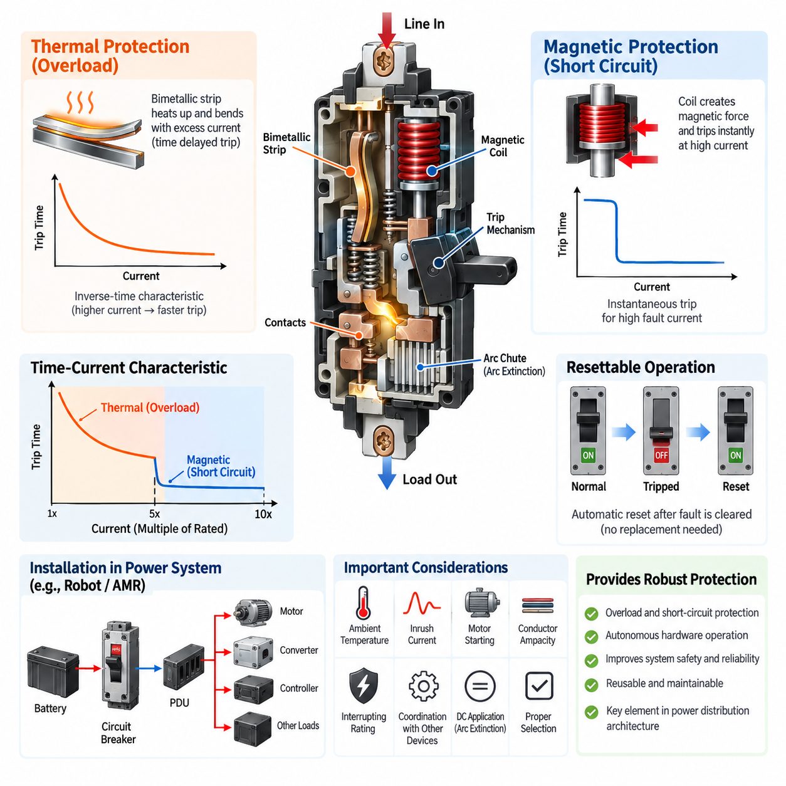
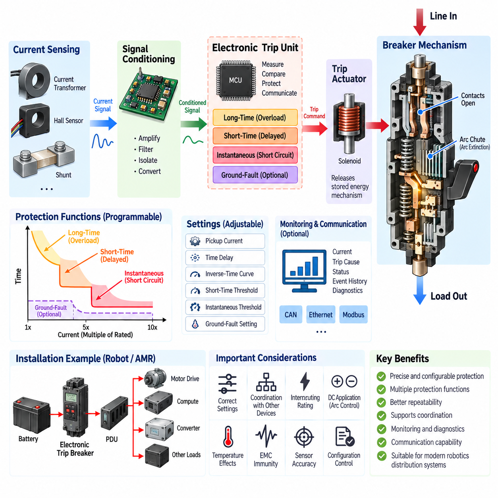
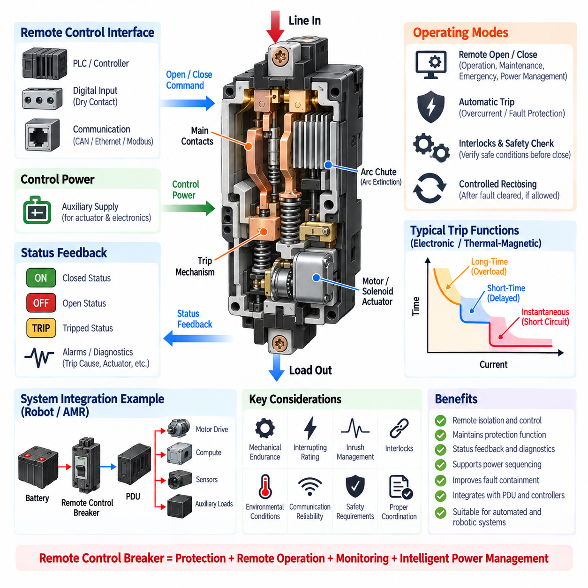
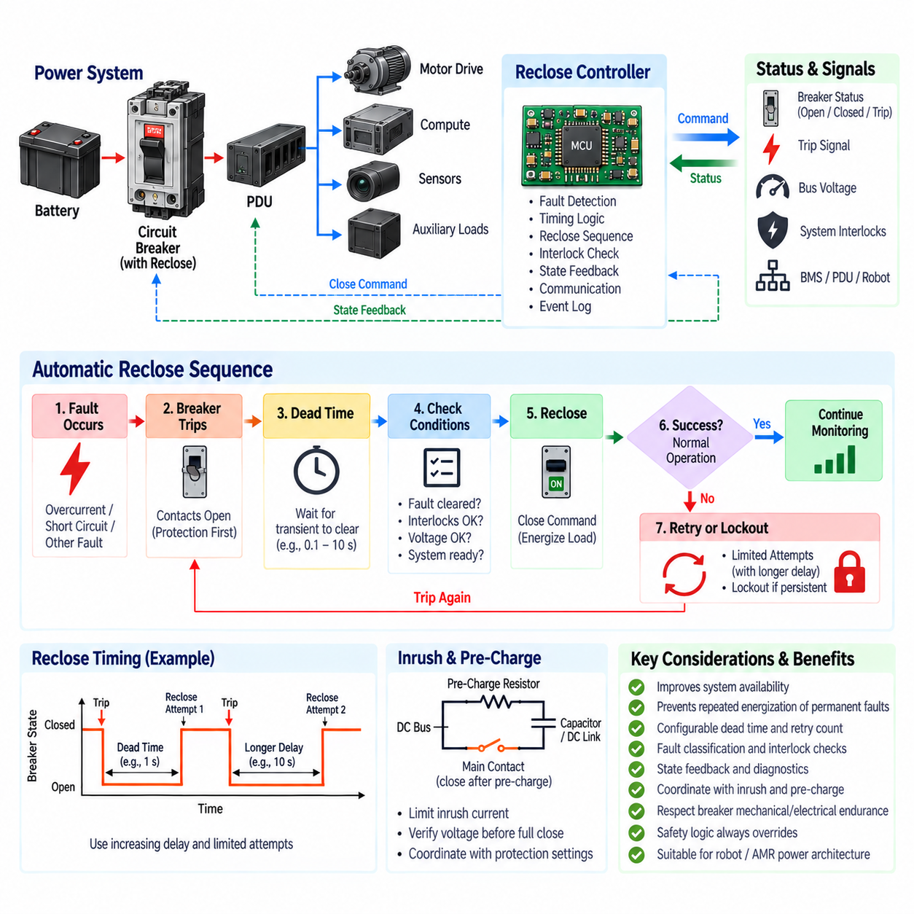
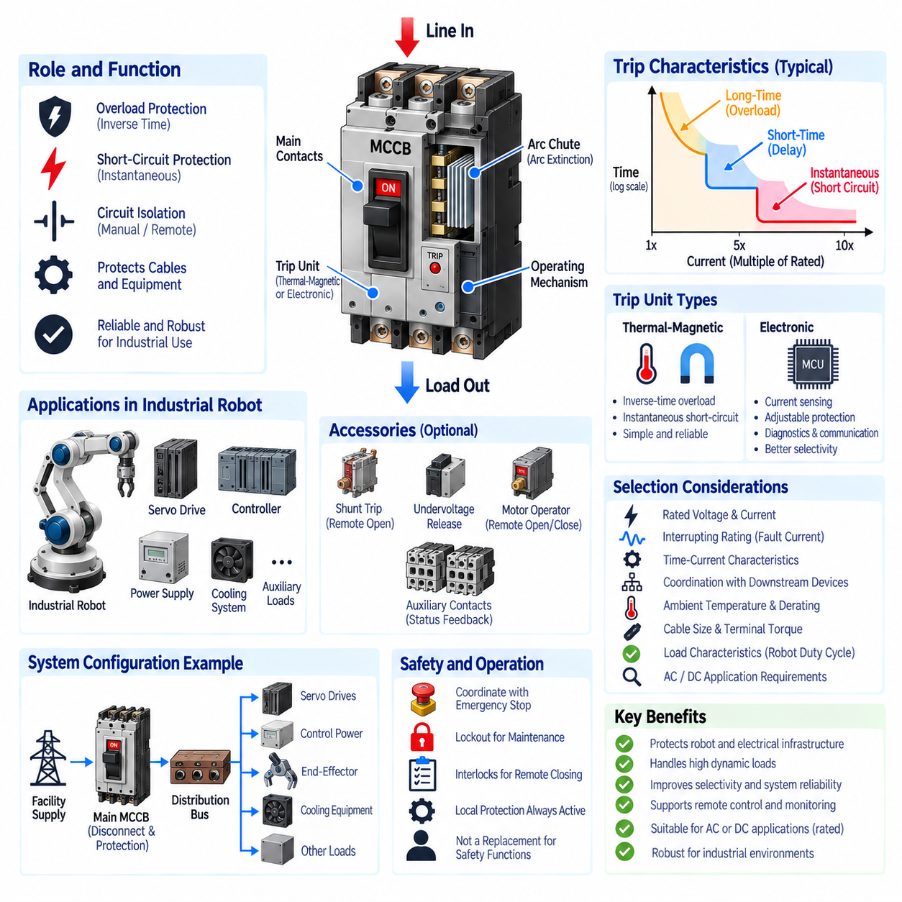

**Volume 04. Fuse, Relay, and Power Distribution Unit**

# Chapter 05. Circuit Breaker

## 05.01. Thermal-Magnetic Breaker

{width="7.268055555555556in" height="7.268055555555556in"}

A thermal-magnetic circuit breaker combines two independent overcurrent protection mechanisms in one electromechanical device. The thermal element responds primarily to sustained overloads, while the magnetic element responds almost instantaneously to severe overcurrent or short-circuit conditions. This dual behavior allows one breaker to protect wiring, distribution conductors, motors, power converters, and other electrical loads across very different fault time scales.

The thermal protection mechanism normally uses a bimetallic strip carrying or sensing the load current. Because conductor heating approximately follows the square of current, excessive current gradually raises the temperature of the strip. The two bonded metals have different coefficients of thermal expansion, causing the strip to bend as temperature increases. When sufficient deflection occurs, it releases the breaker mechanism and opens the electrical contacts.

Thermal tripping is intentionally time dependent rather than instantaneous. A moderate overload may therefore be tolerated for seconds or minutes, while a larger overload produces much faster operation. This inverse relationship between current magnitude and trip time is important for systems containing motors, transformers, DC/DC converters, capacitive loads, or other equipment that can temporarily draw current above the normal operating level without representing an actual fault.

The magnetic trip mechanism provides the high-speed portion of the protection characteristic. Load current passes through, or is magnetically coupled to, a coil that produces a magnetic field proportional to current. Under normal conditions and ordinary overloads, the magnetic force remains below the mechanical trip threshold. When a sufficiently large fault current occurs, the magnetic force rapidly moves an armature or plunger and releases the breaker mechanism.

Magnetic tripping typically occurs much faster than thermal tripping because it does not depend on progressive heating of the protection element. This makes it suitable for clearing short circuits and other high-current faults before excessive thermal or mechanical damage develops in cables, connectors, busbars, power semiconductor stages, or downstream equipment. The magnetic pickup threshold must nevertheless remain above legitimate transient currents to prevent nuisance operation.

The resulting breaker characteristic can be understood as two connected operating regions. At lower multiples of rated current, the thermal mechanism establishes an inverse-time response in which increasing current progressively reduces the allowable operating duration. At sufficiently high multiples of rated current, the magnetic mechanism dominates and creates an approximately instantaneous trip region. The transition between these regions is a fundamental consideration when interpreting the breaker\'s time-current curve.

Breaker current rating alone is therefore insufficient for device selection. Engineers must evaluate continuous load current, expected overload magnitude and duration, starting or inrush current, prospective short-circuit current, conductor ampacity, ambient temperature, installation method, and the characteristics of downstream equipment. The selected breaker must tolerate legitimate operating transients while disconnecting abnormal currents early enough to protect the electrical distribution system.

Ambient temperature has particular importance because the thermal mechanism fundamentally depends on heat. A breaker calibrated under specified reference conditions may trip earlier in a hot enclosure and later under colder conditions. Closely packed breakers, nearby power electronics, restricted airflow, and internally generated heat can further alter the effective thermal environment. Manufacturer temperature-correction and derating information should therefore be considered during practical system integration.

The magnetic element is less directly dependent on ambient temperature, but its pickup setting introduces another important coordination parameter. If the instantaneous threshold is too low, motor starting current or converter inrush may cause unwanted trips. If it is too high, severe faults may persist longer than desired before another protection mechanism operates. Selection consequently requires comparison of the load transient envelope with both thermal and magnetic portions of the breaker characteristic.

When the breaker trips, stored mechanical energy rapidly separates the contacts. Opening a significant current produces an electrical arc between the separating surfaces, so interruption capability depends on more than the sensing mechanism. Contact geometry, opening speed, arc runners, arc chutes, insulation structure, and internal clearances are engineered to extinguish the arc safely. The breaker must therefore have an interrupting rating suitable for the maximum prospective fault current at its installation point.

DC applications require particular attention because current does not naturally cross zero every half cycle as it does in AC systems. Consequently, an arc established during contact separation can be more difficult to extinguish. A breaker suitable for an AC voltage cannot automatically be assumed suitable for an equivalent DC voltage. Robotics and battery-powered equipment should use breakers explicitly rated for the required DC voltage, current, polarity conditions, and fault interruption capability.

Reset capability distinguishes circuit breakers from conventional one-time fuses. After a fault is cleared and the mechanism is reset, a breaker can normally be returned to service without replacing the protective component. This can improve maintainability in robots, AMRs, industrial machines, test equipment, and field-serviceable platforms. However, repeated interruption of severe faults can degrade contacts and internal mechanisms, so reset capability should never be interpreted as unlimited fault-cycle endurance.

Protection coordination becomes especially important when thermal-magnetic breakers are installed together with fuses, contactors, motor drives, battery protection devices, or additional upstream breakers. Their time-current characteristics should be compared so that the protective device nearest the fault operates first whenever practical. Proper selectivity prevents a local branch fault from unnecessarily disconnecting the entire robot or power distribution system and improves fault containment and system availability.

In an AMR or mobile robot, a thermal-magnetic breaker can serve as a branch or main distribution protection device between the battery system and major electrical loads. The thermal element protects against persistent overload conditions caused by wiring problems, overloaded actuators, or abnormal subsystem consumption, while the magnetic element provides rapid response to major short circuits. This function belongs naturally within the broader robot power-distribution and protection architecture identified in the electrical engineering structure.

For motor circuits, coordination must account for acceleration current, stall behavior, motor-driver current limiting, cable capability, and breaker response. A breaker should not trip during a valid acceleration event simply because current temporarily exceeds the continuous rating. Conversely, prolonged overload or stalled operation must not be allowed to overheat conductors or connectors. The complete protection design therefore depends on the combined behavior of the breaker, motor controller, wiring, and software protection functions.

Thermal-magnetic breakers are fundamentally hardware protection devices and can operate without software, communication networks, or electronic control logic. This independence is valuable because protection remains available even when an ECU, edge computer, communication bus, or application software fails. In more advanced power architectures, breaker status or auxiliary contacts may still be monitored electronically, allowing diagnostics to distinguish a protection trip from commanded shutdown or loss of downstream power.

A robust design treats the thermal-magnetic breaker as one coordinated layer rather than as the complete protection solution. Battery systems may additionally require fuses, contactors, BMS-controlled protection, insulation monitoring, pre-charge circuits, and semiconductor-level current limiting. The breaker contributes reusable overload and short-circuit protection, while the surrounding architecture handles faults requiring faster response, remote isolation, diagnostic intelligence, or high-voltage safety functions.

Engineering validation should confirm behavior under nominal current, maximum continuous load, startup and inrush events, controlled overloads, short-circuit conditions, elevated and reduced temperatures, repeated switching, vibration, and representative installation conditions. Particular attention should be given to terminal temperature rise and connection resistance because poor joints can generate localized heating that is not accurately represented by load current alone and may alter long-term reliability.

Ultimately, thermal-magnetic breaker design is an exercise in matching electrical fault physics to two complementary response mechanisms. Thermal action provides delayed protection against energy accumulation during sustained overload, whereas magnetic action provides rapid interruption of high-current faults. Correctly selected and coordinated, the device provides simple, autonomous, resettable protection and forms an important bridge between basic circuit protection and higher-level power distribution architecture.

## 05.02. Electronic Trip Breaker

{width="7.268055555555556in" height="7.268055555555556in"}

An electronic trip breaker uses electronic sensing, signal processing, and programmable trip logic to detect abnormal current conditions and command a mechanical interruption mechanism. Unlike a thermal-magnetic breaker, whose trip behavior is determined primarily by bimetallic and electromagnetic elements, an electronic trip breaker measures electrical current and evaluates it against defined protection thresholds. This architecture enables more precise and configurable protection characteristics.

Current measurement is commonly performed using current transformers, Hall-effect sensors, shunts, or other isolated sensing technologies depending on voltage level, current range, and breaker architecture. The measured current is converted into an electrical signal that represents the actual load condition. Signal-conditioning circuits then scale, filter, and prepare this information for the electronic trip unit, allowing the protection algorithm to continuously evaluate the electrical state of the protected circuit.

The electronic trip unit acts as the decision-making element of the breaker. It processes measured current values and compares them with configured pickup levels and time-delay parameters. When the measured condition satisfies the programmed trip criteria, the unit energizes a trip actuator, such as a solenoid or flux-shunt mechanism. The actuator releases the stored-energy mechanism, rapidly separating the main contacts and interrupting current through the protected circuit.

One major advantage of electronic protection is the ability to implement multiple protection regions through programmable logic. A typical breaker can provide long-time, short-time, instantaneous, and sometimes ground-fault protection. These functions correspond to different fault magnitudes and durations, allowing the same breaker to distinguish sustained overloads, temporary high-current events, severe short circuits, and specific leakage or ground-fault conditions when suitable sensing is available.

Long-time protection performs a function similar to the thermal portion of a thermal-magnetic breaker, but the response is calculated electronically rather than produced directly by bimetal heating. The trip unit monitors current relative to a configured long-time pickup threshold and determines how long the overload may persist. Electronic implementation can reproduce inverse-time behavior while providing greater repeatability and adjustment flexibility than a purely thermal mechanism.

Short-time protection introduces an adjustable region between ordinary overload protection and instantaneous short-circuit protection. It intentionally allows a high current to remain for a limited period before tripping. This delay can be extremely valuable for protection coordination because a downstream protective device may be given sufficient time to clear a local fault before an upstream breaker disconnects a larger portion of the electrical distribution system.

Instantaneous protection responds to very high fault currents without an intentional time delay. Once current exceeds the configured instantaneous pickup threshold, the trip unit commands the breaker to open as rapidly as the sensing, processing, actuator, and mechanical contact system permit. This function is intended to limit the duration of severe short-circuit current and reduce thermal stress, conductor damage, contact damage, and mechanical forces within the power distribution network.

Electronic trip characteristics are commonly represented using a time-current curve, but programmable parameters allow the curve to be shaped for a particular application. Pickup current, delay time, inverse-time response, short-time threshold, and instantaneous threshold may be adjustable depending on the breaker model. This flexibility allows engineers to coordinate protection around actual cable capability, load behavior, motor starting current, converter inrush, and upstream or downstream protective devices.

Greater adjustability also introduces greater engineering responsibility. Incorrect protection settings can compromise either availability or safety. Settings that are too sensitive may produce nuisance trips during normal startup or transient loading, while settings that are too permissive can expose cables and equipment to excessive fault energy. Protection parameters should therefore be established from system-level electrical analysis rather than simply retaining arbitrary default settings.

Electronic sensing can provide better repeatability because protection decisions are less dependent on the physical temperature history of a bimetallic element. Nevertheless, electronic trip breakers remain subject to operating-temperature limits, sensor accuracy, component tolerances, electromagnetic interference, auxiliary power conditions, and internal thermal constraints. The complete breaker must therefore be evaluated under the environmental and electrical conditions expected in the actual installation.

The mechanical interruption section remains essential even though fault detection is electronic. After a trip command is generated, the breaker must physically separate contacts and extinguish the resulting electrical arc. Contact opening speed, stored mechanical energy, arc chutes, insulation distances, and interruption structures therefore remain fundamental design elements. Electronic intelligence improves fault detection and trip control but does not eliminate the physical requirements associated with interrupting high current.

Interrupting rating must be distinguished from the electronic pickup setting. A programmable trip unit may detect a short circuit at a selected threshold, but the breaker itself must still safely interrupt the prospective fault current available from the power source. Battery systems and high-power DC buses can produce extremely large short-circuit currents because of their low source impedance, making interruption capability a critical selection parameter for robotics and mobile power systems.

DC electronic trip breakers require particular consideration because interruption of direct current is more difficult than interruption of alternating current. The absence of natural periodic current zero crossings can sustain an arc after the contacts begin separating. A breaker used on a battery-powered robot must therefore have an appropriate DC voltage rating, current rating, interruption capability, and internal arc-control design rather than relying only on its programmable electronic protection functions.

Electronic trip technology is particularly useful for protection coordination. Long-time and short-time settings can be arranged so that downstream branch protection operates before an upstream main breaker whenever the fault is confined to one branch. Selective coordination improves system availability because a failure in one actuator, converter, controller, or auxiliary circuit does not necessarily remove power from every subsystem connected to the common power distribution unit.

In an industrial robot or AMR, an electronic trip breaker can protect a main battery output, high-current distribution branch, charging interface, auxiliary power bus, or large actuator supply. Adjustable protection makes it possible to accommodate loads having different transient characteristics. Motor drives may require temporary high current during acceleration, while computing and converter systems may exhibit capacitor-charging inrush. Protection settings can be coordinated with these legitimate operating behaviors.

Advanced electronic trip units can also support monitoring and diagnostic functions beyond basic overcurrent interruption. Depending on the device architecture, measured current, load level, trip cause, warning state, event history, or breaker status may be available to a supervisory controller. Such information can help distinguish overload, short-circuit, and operational shutdown events and can contribute to predictive maintenance, power-management diagnostics, and fault localization within complex robotic electrical systems.

Communication capability can further integrate the breaker with a smart power distribution architecture. When supported by the selected device, protection information may be transferred to a power distribution unit, industrial controller, robot controller, or supervisory system. Communication should remain secondary to the fundamental protection function: a critical overcurrent fault must still be handled locally and deterministically rather than depending on a network message or high-level software decision.

Electronic trip breakers should therefore be considered part of a layered protection architecture. Fuses may provide very fast backup protection, contactors may provide commanded isolation, a BMS may supervise battery conditions, motor drives may implement semiconductor-level current limiting, and the electronic breaker may provide configurable branch or main overcurrent protection. Effective system design coordinates these devices rather than expecting one component to handle every possible electrical fault.

Validation should examine sensor accuracy, pickup thresholds, trip delays, instantaneous response, repeatability, startup and inrush immunity, environmental temperature, electromagnetic compatibility, interruption capability, and behavior under representative fault conditions. Programmable settings should also be configuration-controlled so that production units and serviced systems retain the approved protection parameters. Uncontrolled setting changes can silently alter the protection coordination originally established during system design.

An electronic trip breaker ultimately separates the functions of fault measurement, protection decision, and power interruption more clearly than a conventional thermal-magnetic device. Electronic sensing and configurable logic provide accurate and adaptable protection, while the mechanical breaker mechanism performs physical isolation and arc interruption. When correctly selected, configured, validated, and coordinated, this architecture provides a powerful foundation for intelligent protection in industrial robots, AMRs, battery systems, and advanced power distribution units.

## 05.03. Remote-Control Breaker

{width="7.268055555555556in" height="7.268055555555556in"}{width="7.268055555555556in" height="7.268055555555556in"}

A remote control breaker combines conventional circuit interruption with an electrically operated mechanism that allows the breaker to be opened, closed, or otherwise controlled without direct manual operation. In addition to protecting the electrical circuit, it introduces a controllable switching interface between the power source and the load. This capability is particularly useful in automated machines, distributed power systems, industrial robots, AMRs, and remotely operated equipment.

The fundamental power path remains similar to that of a conventional circuit breaker. Main contacts carry current during normal operation and separate when electrical isolation is required. An internal trip mechanism releases the contacts when an overcurrent or other protected fault occurs. Remote-control hardware adds an actuator capable of operating the breaker mechanism through an electrical command while preserving the fundamental protective and interrupting functions of the breaker.

Remote actuation can be implemented using a motor operator, solenoid, electromagnetic mechanism, stored-energy actuator, or other electromechanical arrangement. The exact mechanism depends on breaker size, required operating speed, voltage level, duty cycle, and application. A control signal energizes the actuator, which transfers mechanical force to the breaker mechanism and changes the contact state without requiring an operator to physically manipulate the breaker handle.

Remote opening and protective tripping must be conceptually distinguished. A remote-open command intentionally disconnects the circuit as part of system operation, maintenance, emergency control, or power management. A protection trip occurs because the breaker has detected an abnormal electrical condition. Although both actions ultimately open the main contacts, maintaining this distinction is important for diagnostics because their causes and required recovery procedures are different.

Remote closing requires greater control discipline than remote opening because closing energizes downstream equipment. Before issuing a close command, the control architecture should verify that relevant interlocks, fault conditions, operating permissions, and system states allow safe energization. If the original fault remains present, uncontrolled reclosing can repeatedly apply fault energy to damaged wiring or equipment and may create additional electrical and mechanical stress.

The remote control interface may use discrete digital inputs, relay contacts, dedicated control wiring, or an intelligent communication interface depending on the breaker design. In more advanced systems, a controller may exchange commands and status information with the breaker through an industrial or embedded communication network. Regardless of interface technology, critical protection should remain locally executable so that network latency or communication failure does not prevent essential fault interruption.

Status feedback is an important part of remote breaker architecture because a command does not guarantee that the expected mechanical state has actually been achieved. Auxiliary contacts or internal position sensing can indicate whether the breaker is open, closed, or tripped. More advanced devices may additionally report protection alarms, trip causes, actuator conditions, or diagnostic information, allowing the supervisory controller to compare the commanded state with the actual breaker state.

This distinction enables useful diagnostic logic. For example, a controller may command the breaker closed but observe that the closed-state feedback is absent. Such a condition can indicate a persistent trip condition, actuator failure, mechanical problem, missing control power, or another interlock preventing operation. Similarly, unexpected opening without a corresponding remote command can be classified as a possible protective trip and investigated before power restoration is attempted.

Remote breakers can support power sequencing in systems containing multiple electrical domains. A controller can energize auxiliary electronics first, verify their health, and then connect higher-power loads such as motor drives or actuators. During shutdown, the sequence can be reversed so that high-power loads are removed before sensitive control electronics. Controlled sequencing can reduce inrush current, simplify fault isolation, and improve management of limited battery or converter capacity.

In battery-powered robotics, remote breaker control can become part of the relationship between the battery, power distribution unit, motor drives, computing system, sensors, and auxiliary loads. Different branches can be disconnected according to operating mode or fault state. A robot may therefore isolate a failed noncritical subsystem while retaining power for computing, communications, braking, localization, or other functions required to reach a controlled safe condition.

A remote control breaker should not automatically be treated as a replacement for a contactor. Contactors are typically optimized for frequent commanded switching, whereas circuit breakers are fundamentally protection and interruption devices whose allowable switching duty depends on their design. Some remote-operated breakers support substantial operating cycles, but engineers must verify mechanical endurance, electrical endurance, switching category, load type, and manufacturer-specified operating limitations.

The distinction becomes particularly important for motors, capacitive loads, converters, and other circuits that can generate large transient currents. Closing a breaker into a discharged DC-link capacitor, for example, may produce substantial inrush current. Remote operation therefore needs to be coordinated with pre-charge circuits, motor-drive enable logic, soft-start functions, or other inrush-management methods rather than assuming that the breaker alone can repeatedly switch severe transient loads.

Remote control power must also be considered separately from the protected power path. Depending on the design, the actuator and control electronics may require an auxiliary supply. Engineers should define behavior when this control supply disappears. The desired fail-state may be application dependent: some systems require the breaker to remain mechanically latched in its previous state, while others use dedicated mechanisms to achieve a defined opening behavior under particular safety conditions.

Manual operation and serviceability remain important even when remote control is available. Maintenance personnel may require a local handle, mechanical indication, lockout capability, or other means of establishing and verifying isolation. Remote commands must not defeat maintenance procedures. In industrial equipment, the electrical design should clearly separate remote operational control from formal energy-isolation procedures used to protect personnel during service or repair.

For mobile robots and AMRs, communication loss introduces another design consideration. A breaker should not depend on continuous communication merely to maintain basic electrical protection. Local overcurrent protection must continue to operate independently of the robot computer or network. The supervisory system can use communication for commands, status collection, diagnostics, and coordinated power management while the breaker retains autonomous capability to interrupt electrical faults.

Remote breakers can also support recovery after selected non-destructive faults, but reset and reclose logic must be carefully controlled. The system should determine whether the fault has cleared and whether automatic restoration is permitted before re-energizing the circuit. Persistent short circuits, insulation failures, repeated overcurrent events, or uncertain fault states should normally inhibit repeated closing attempts and generate a diagnostic condition requiring higher-level intervention.

Integration with a smart power distribution unit can provide centralized control over several protected branches. The PDU controller may monitor breaker states, current measurements, subsystem health, and operating modes, then issue controlled open or close commands according to predefined logic. This architecture can improve fault containment because individual branches can be isolated without necessarily disconnecting the entire battery or main electrical bus.

Safety-related applications require careful separation between operational convenience and safety integrity. A remotely commanded breaker may participate in shutdown architecture, but its suitability for a safety function depends on the breaker mechanism, control architecture, diagnostic coverage, failure modes, and applicable system requirements. A standard remote-control feature alone should not be assumed to provide a certified emergency-stop or safety-isolation function.

Protection coordination remains necessary because remote operation does not change the fundamental requirement for selective fault clearing. Breaker trip characteristics must still be coordinated with upstream fuses, battery protection, downstream branch devices, motor-drive protection, conductor ampacity, and prospective fault current. Remote control adds operational flexibility to this protection structure but should not compromise the electrical coordination established for abnormal conditions.

Validation should include protective tripping, commanded opening and closing, state feedback, loss of control power, communication interruption, actuator malfunction, mechanical endurance, electrical switching endurance, inrush conditions, environmental temperature, vibration, and representative fault scenarios. Testing should also verify that contradictory commands, repeated commands, or software faults cannot produce uncontrolled switching behavior or bypass required interlocks.

A remote control breaker ultimately extends the circuit breaker from a passive protective component into a controllable element of the power distribution architecture. Its value comes from combining local fault interruption with remote isolation, status feedback, sequencing, diagnostics, and system-level power management. When correctly coordinated with contactors, fuses, BMS functions, PDUs, controllers, and safety mechanisms, it provides a practical foundation for intelligent and serviceable power control in modern robotic systems.

## 05.04. Reclose Design

{width="7.268055555555556in" height="7.268055555555556in"}

Automatic reclose design restores electrical power after a circuit breaker has opened because of a fault, but only after the system determines that re-energization is permitted. The concept is based on the fact that some electrical disturbances are temporary rather than permanent. Reclosing can therefore improve system availability by restoring service automatically, while controlled logic prevents repeated energization of persistent or dangerous faults.

A reclose system normally combines a protective breaker, electrically operated closing mechanism, fault detection, state feedback, timing logic, and supervisory control. When protection detects an abnormal condition, the breaker opens and interrupts current independently of the reclose function. Only after interruption has been confirmed does the reclose controller evaluate whether another closing attempt should be initiated. Protection therefore has priority over restoration.

The operating sequence begins with fault detection and breaker tripping. After the main contacts open, the system enters a waiting interval commonly called dead time. During this period, the protected circuit remains de-energized so that transient conditions can disappear and stored electrical energy can decay. When the dead time expires, the controller verifies required conditions and commands the breaker to close if automatic reclose remains authorized.

Dead time is a fundamental design parameter because immediate reclosing may reconnect power before the original disturbance has disappeared. The required interval depends on the electrical system, load characteristics, discharge behavior, protection architecture, and expected fault mechanisms. Excessively short dead time can increase electrical stress, whereas unnecessarily long dead time reduces availability and delays recovery from faults that were actually temporary.

The controller must distinguish between faults that permit automatic recovery and faults that require lockout. A short transient disturbance or temporary overload may be considered recoverable under defined conditions. Persistent short circuits, insulation faults, severe overcurrent events, repeated trips, emergency-stop conditions, or uncertain system states should generally inhibit automatic restoration. Reclose permission must therefore be based on explicit fault classification rather than elapsed time alone.

Before closing, permissive logic should verify the electrical and operational state of the system. Typical conditions include breaker-open confirmation, absence of an active trip signal, acceptable bus voltage, valid control power, healthy protection electronics, and required system interlocks. In robotic systems, additional conditions may include motor-drive readiness, battery status, emergency-stop state, PDU status, and permission from the supervisory controller.

Breaker state feedback is essential because commanded state and actual mechanical state are not necessarily identical. Auxiliary contacts or position sensors can confirm open, closed, and sometimes tripped conditions. A reclose command should not be generated merely because software previously issued an open command. The controller should verify that the breaker physically reached the required open state and that the operating mechanism is ready for another closing cycle.

A basic reclose strategy may permit one automatic attempt before entering lockout if the circuit trips again. More sophisticated systems can permit several attempts with different waiting intervals. The number of attempts should remain deliberately limited because repeated closing into a permanent fault can repeatedly inject high fault energy into conductors, connectors, contacts, batteries, converters, and other equipment while accelerating damage to the breaker itself.

Repeated reclose attempts are often separated by increasing delays. The first attempt may occur after a relatively short dead time when a transient fault is considered likely, while subsequent attempts can use longer intervals. This approach provides additional recovery time without allowing uncontrolled rapid cycling. The appropriate timing sequence must be derived from the application rather than copied directly from utility power-system practices into robotic or battery-powered equipment.

Lockout is the final state when automatic recovery is no longer considered acceptable. The breaker remains open and further automatic closing commands are inhibited until a defined reset condition is satisfied. Reset may require operator acknowledgement, maintenance action, diagnostic clearance, a power cycle, or authorization from a supervisory controller. Lockout prevents the control system from indefinitely attempting to energize a circuit containing a persistent fault.

Reclose design must also consider inrush current. Even when the original fault has disappeared, closing the breaker can energize discharged capacitors, DC-link circuits, motor drives, converters, and other loads that produce substantial transient current. If the protection system interprets this legitimate inrush as another fault, the breaker may immediately trip again. Reclose logic must therefore be coordinated with protection thresholds and inrush-management mechanisms.

Pre-charge circuits are particularly important when reconnecting large capacitive loads. Instead of directly applying the battery or DC-bus voltage to a discharged capacitor bank, a pre-charge path limits initial current and raises the downstream voltage gradually. The main power path is closed only after an acceptable voltage relationship is established. Reclose sequencing may therefore require pre-charge verification before the breaker, contactor, or associated power switching element is fully closed.

Battery-powered systems require careful fault-energy consideration because batteries can supply very high short-circuit current. Automatically reclosing into a permanent DC fault can expose the system to another severe interruption event. The reclose controller should consequently use information from the breaker, BMS, PDU, insulation monitoring, current sensing, and other available diagnostics before authorizing restoration of a high-current battery branch.

In an AMR or industrial robot, reclose logic can be applied selectively rather than globally. A temporary fault in an auxiliary sensor or computing branch may permit controlled recovery, whereas a propulsion power fault, battery short circuit, emergency-stop event, or safety-related isolation condition may require immediate lockout. Different electrical domains should therefore have reclose policies appropriate to their fault consequences and operational criticality.

The distinction between automatic reclose and automatic reset is also important. Resetting a trip mechanism prepares a protective device for further operation, while reclosing actually reconnects electrical power to the downstream circuit. Some devices combine these operations mechanically, whereas others require separate commands or mechanisms. System logic should represent the actual device behavior rather than treating reset and close as equivalent software states.

Reclose control should remain subordinate to local protection. A networked controller, robot computer, or PDU may decide when restoration is allowed, but an overcurrent protection function must still be capable of opening the circuit without depending on communication. If another fault occurs immediately after reclose, the breaker must trip again regardless of the supervisory controller state. This separation preserves deterministic fault interruption.

Communication can nevertheless provide valuable context for intelligent recovery. A supervisory controller may receive trip cause, current history, breaker position, battery condition, load status, and diagnostic information before deciding whether another attempt is appropriate. The controller can also record the number and timing of reclose events, allowing repeated intermittent faults to be identified even when individual attempts temporarily restore normal operation.

Reclose counters and event histories are valuable diagnostic tools because intermittent electrical faults may disappear before maintenance personnel inspect the system. Recording trip cause, current magnitude, timestamps, attempted recovery, and final state can reveal degrading connectors, damaged harnesses, unstable converters, overloaded actuators, or environmental problems. Reclose design can therefore contribute not only to availability but also to predictive maintenance and fault localization.

The mechanical and electrical endurance of the breaker must be included in the design because every reclose cycle produces contact operation and potentially another fault interruption. A breaker capable of remote operation is not necessarily intended for frequent automatic cycling. Manufacturer limits for operating cycles, fault interruption endurance, closing duty, actuator duty cycle, and permissible switching frequency must be respected when defining the reclose strategy.

Safety logic must always override availability objectives. Emergency-stop activation, maintenance isolation, personnel-access conditions, detected insulation failures, or other safety states may explicitly prohibit automatic re-energization. A system should never reclose merely because a timer has expired when a higher-priority safety condition remains active. Reclose authorization should therefore be implemented as a controlled permission derived from multiple independent system conditions.

Validation should reproduce both temporary and permanent faults and verify trip, dead time, permissive checks, closing, repeated-trip detection, attempt counting, and lockout behavior. Tests should also cover communication loss, missing position feedback, control-power interruption, stuck actuators, inrush current, pre-charge failure, BMS inhibition, emergency-stop activation, and software restart to ensure that no abnormal sequence produces unintended energization.

A robust reclose architecture can be summarized as trip, isolate, wait, diagnose, verify, re-energize, and monitor. If the recovered circuit remains healthy, normal operation can continue. If the fault reappears, the system returns to the protection state and either performs another explicitly permitted attempt or enters lockout. This state-oriented approach makes recovery behavior deterministic, diagnosable, and easier to validate.

Reclose design ultimately represents a balance between availability and fault containment. Automatic restoration can reduce unnecessary downtime caused by temporary disturbances, but every closing action intentionally reapplies electrical energy to a previously faulted circuit. Effective design therefore combines limited retry counts, controlled dead time, fault classification, interlocks, state feedback, pre-charge coordination, diagnostics, and lockout to achieve safe recovery in modern robot and AMR power architectures.

## 05.05. MCCB for Industrial Robot

{width="7.268055555555556in" height="7.268055555555556in"}

A molded case circuit breaker, or MCCB, is a protective switching device designed to interrupt overload and short-circuit currents while carrying substantially higher current than many miniature circuit breakers. Its molded insulating enclosure contains the current path, contacts, trip mechanism, arc-control components, and operating mechanism. In industrial robots, an MCCB commonly protects the main incoming supply or major power-distribution branches feeding drives, controllers, and auxiliary equipment.

The fundamental role of an MCCB is to protect conductors and electrical equipment against excessive current while providing a practical means of circuit isolation. During normal operation, the main contacts remain closed and carry load current with low resistance. When the trip system detects an unacceptable overload or short circuit, the operating mechanism rapidly separates the contacts. The resulting arc is controlled and extinguished inside the breaker before current interruption is completed.

Industrial robots create demanding protection conditions because their electrical loads are highly dynamic. Servo drives can produce significant current during acceleration and deceleration, while transformers, power supplies, DC-link capacitors, cooling systems, and auxiliary equipment introduce different transient characteristics. An MCCB must tolerate legitimate operating peaks without nuisance tripping while still protecting the feeder and distribution system against sustained overloads and severe faults.

MCCBs may use thermal-magnetic or electronic trip units. Thermal-magnetic designs provide inverse-time overload protection through a thermal element and rapid short-circuit protection through a magnetic mechanism. Electronic trip units measure current using sensors and apply configurable protection logic. For larger or more sophisticated industrial robots, electronic trip units can provide improved adjustment, repeatability, coordination, diagnostics, and protection flexibility.

Breaker selection begins with system voltage, continuous current, number of poles, and expected load characteristics. The rated current should support the actual operating demand while remaining coordinated with conductor ampacity and downstream equipment. Engineers must consider robot duty cycle rather than only nominal power because simultaneous joint acceleration, payload handling, auxiliary equipment, and process tools can temporarily increase the current drawn by the complete robotic system.

The prospective short-circuit current at the installation point is equally important. An MCCB must have an interrupting rating sufficient to safely clear the maximum fault current that the upstream electrical source can deliver. Transformer impedance, cable impedance, distribution architecture, and source capacity influence this value. Selecting a breaker with an appropriate current rating but inadequate interruption capability can create a serious failure condition during a high-energy short circuit.

Time-current characteristics determine how the MCCB responds across different fault magnitudes. Moderate overloads are normally permitted for a limited duration, while larger currents produce progressively faster trips. Severe short circuits require rapid interruption. The selected characteristic must accommodate robot startup and dynamic load behavior while remaining below the thermal withstand limits of cables, terminals, busbars, connectors, and other protected components.

Protection coordination becomes critical when an industrial robot contains multiple protective levels. A facility feeder may supply a main robot MCCB, which then feeds servo drives, control power supplies, end-effectors, cooling equipment, and auxiliary branches protected by additional breakers or fuses. Ideally, a fault in one downstream branch should operate the nearest protective device rather than disconnecting the complete robot cell or upstream production line.

Electronic MCCBs can improve selectivity by providing adjustable long-time, short-time, and instantaneous protection regions. A downstream device can be configured to clear a local fault first, while the upstream MCCB allows a controlled delay where appropriate. Such coordination must be based on actual time-current curves and fault-current calculations. Excessive delay must not expose conductors or equipment to fault energy beyond their allowable withstand capability.

Servo systems require particular attention because motor drives can draw high transient current during acceleration and may return regenerative energy during deceleration. The MCCB protects the feeder and distribution circuit rather than replacing the internal semiconductor protection of the servo drive. Fast electronic current limiting, overtemperature protection, DC-bus monitoring, and motor protection remain functions of the drive, while the MCCB provides upstream circuit-level protection and isolation.

Inrush current is another major design consideration. When robot power is applied, transformer magnetizing current and charging of large DC-link capacitors can briefly produce currents several times greater than steady-state demand. If the MCCB instantaneous threshold is incompatible with this transient, nuisance trips can occur during normal startup. Breaker characteristics should therefore be coordinated with manufacturer-specified inrush behavior, pre-charge circuits, and sequential power-up strategies.

An industrial robot frequently contains a main disconnecting function near the electrical cabinet entrance. Depending on applicable equipment architecture and regulations, an MCCB may contribute both overcurrent protection and an accessible means of electrical isolation. However, ordinary breaker operation should not automatically be interpreted as equivalent to every required safety-isolation function. Lockout, disconnecting means, emergency-stop architecture, and maintenance procedures must be considered separately.

Remote accessories can extend the MCCB beyond purely manual operation. Shunt-trip coils can open the breaker following an external command, undervoltage releases can force defined behavior when control voltage disappears, and motor operators can permit remote opening or closing. Auxiliary contacts can report open, closed, or tripped states to the robot controller, PLC, or supervisory system, supporting diagnostics and coordinated power-management functions.

Remote functionality should remain subordinate to local protection. A robot controller may request breaker opening for maintenance, abnormal operation, or controlled shutdown, but a severe electrical fault must be interrupted without depending on PLC software or network communication. Similarly, remote closing should require suitable interlocks so that power cannot be restored while maintenance isolation, emergency conditions, persistent faults, or other prohibited states remain active.

The MCCB must also be coordinated with the robot emergency-stop system. An emergency stop is a functional safety action intended to bring hazardous motion or processes to an appropriate safe condition, whereas an MCCB primarily provides electrical overcurrent protection and isolation. Immediate removal of all electrical power is not always the correct emergency response because controlled stopping, braking, or safety-rated drive functions may require temporary power availability.

Environmental conditions inside the robot control cabinet influence breaker performance and lifetime. Ambient temperature, enclosure ventilation, neighboring heat-producing drives, installation orientation, altitude, contamination, and conductor termination can affect thermal behavior. A breaker selected solely from its nameplate current may therefore be inadequate in a densely populated cabinet. Manufacturer derating and installation requirements should be incorporated into the electrical design.

Terminal engineering deserves particular attention at high current. Incorrect conductor size, inadequate tightening torque, poor crimping, surface contamination, or repeated thermal cycling can increase connection resistance. Localized heating may then occur even when total current remains within the nominal breaker rating. Proper cable preparation, specified torque, thermal inspection, and maintenance practices help prevent terminal degradation from becoming a secondary source of electrical failure.

MCCB integration should be considered together with the industrial robot\'s complete power architecture. A typical path may include the facility supply, main disconnect or MCCB, distribution bus, branch protection, servo drives, control power supplies, and auxiliary loads. Each protective layer has a defined responsibility. The MCCB establishes a major protection boundary, while downstream devices provide more localized protection for individual circuits and equipment.

For mobile industrial platforms or large battery-powered robots, MCCB principles can also be applied to DC distribution when the selected device is explicitly rated for the required DC conditions. DC interruption is more demanding because natural current zero crossings are absent. Pole configuration, voltage rating, polarity requirements, arc extinction, fault-current capability, and battery short-circuit energy must therefore be verified rather than inferred from an AC rating.

Monitoring capability is increasingly useful in modern robotic production systems. Electronic MCCBs may provide current measurements, load utilization, alarms, trip causes, event history, or communication interfaces depending on the selected product. This information can support maintenance planning and fault localization. A production system can distinguish a genuine overcurrent trip from a commanded shutdown and identify recurring overload trends before they develop into repeated production interruptions.

Validation should reproduce representative operating and fault conditions rather than checking only basic breaker operation. Tests should include normal production cycles, simultaneous axis acceleration, startup inrush, maximum payload operation, auxiliary loads, controlled overloads, downstream faults, short circuits where safely testable, remote-trip functions, status feedback, environmental temperature, and recovery behavior following a trip.

Maintenance must consider both the breaker and its surrounding connections. Periodic inspection can identify discoloration, overheating, loose terminals, mechanical damage, contamination, or abnormal operating history. Breakers that have interrupted severe fault currents may require inspection or replacement according to manufacturer guidance. Reset capability does not imply that the device retains unlimited interruption performance after repeated high-energy fault events.

A properly engineered MCCB therefore forms a major protective boundary within an industrial robot electrical system. It combines overload and short-circuit protection, high-current interruption, isolation, coordination, and optional remote or diagnostic functions. When selected using load analysis, fault-current calculation, time-current coordination, environmental derating, and system-level validation, the MCCB helps protect both the robot and the surrounding electrical infrastructure while supporting reliable production operation.
