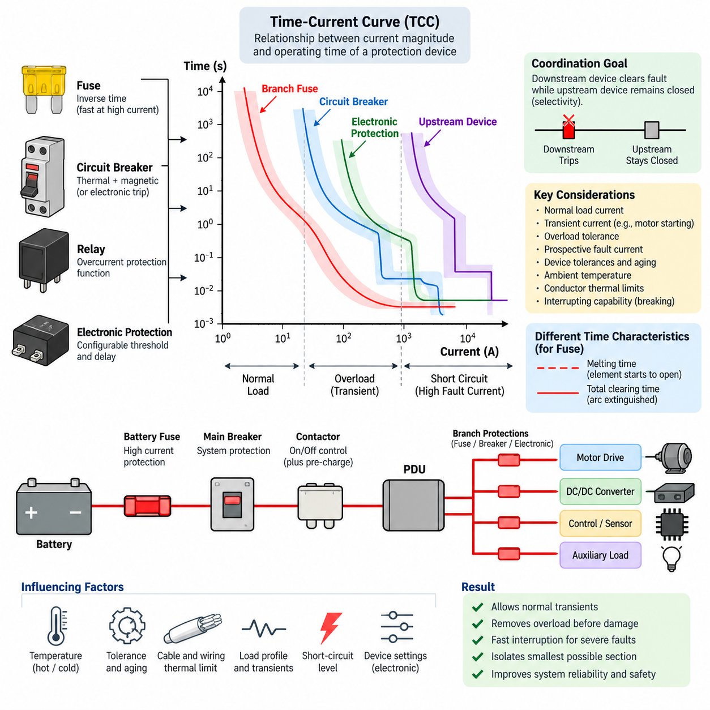
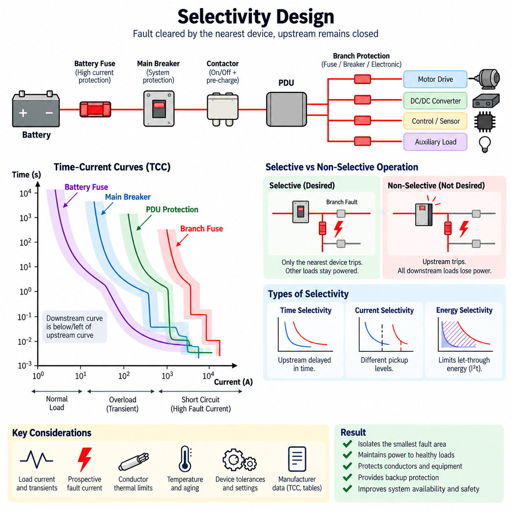
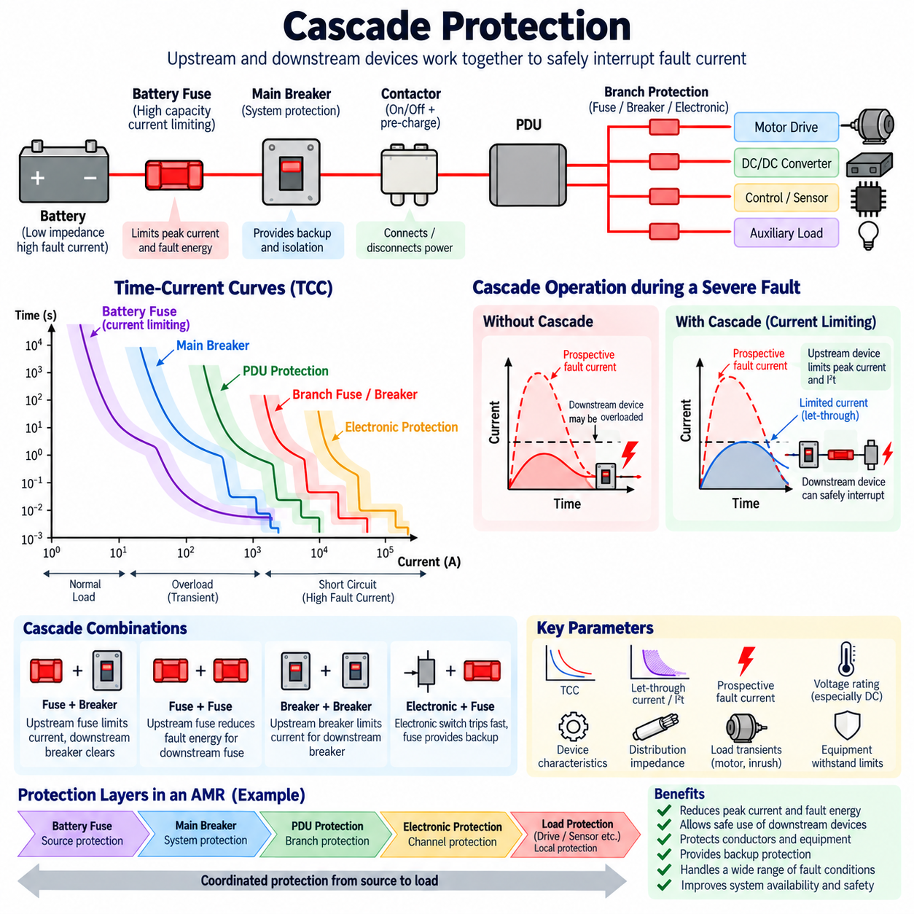
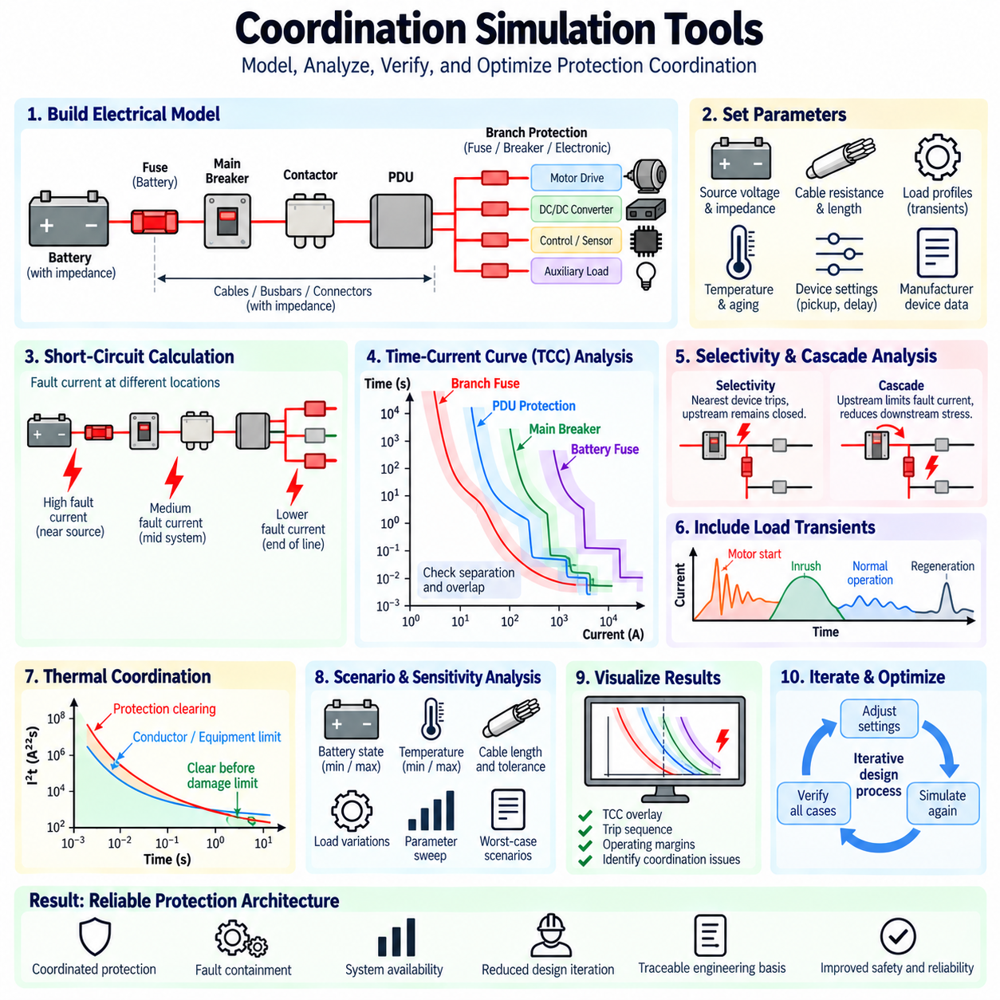
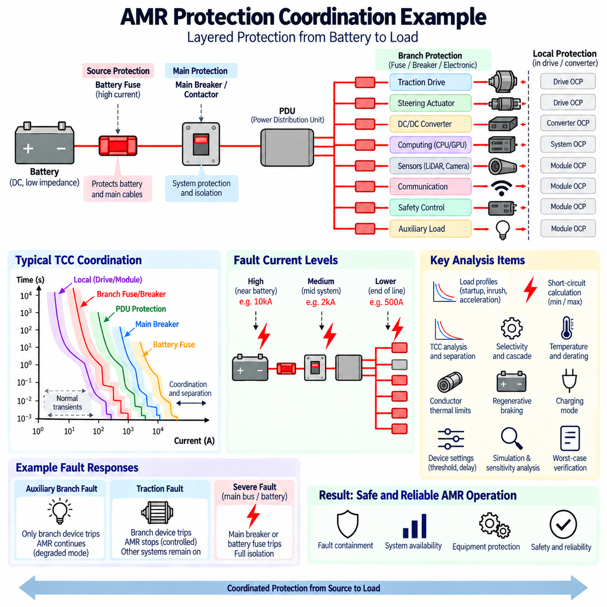

**Volume 04. Fuse, Relay, and Power Distribution Unit**


# Chapter 06. Protection Coordination

##  

## 06.01. Time-Current Curve (TCC)

{width="7.268055555555556in" height="7.268055555555556in"}

A Time-Current Curve (TCC) describes the operating relationship between the magnitude of current flowing through an overcurrent protection device and the time required for that device to interrupt the circuit. It is a fundamental engineering representation used when coordinating fuses, circuit breakers, relays, and electronic protection devices. The curve allows designers to evaluate whether abnormal current will be tolerated temporarily or cleared before conductors and equipment reach damaging thermal or electrical limits.

The horizontal axis of a TCC normally represents current, while the vertical axis represents operating or clearing time. Both axes are commonly plotted on logarithmic scales because protection systems must cover extremely wide ranges of current and time. Current may range from normal load levels to many times rated current, while operating time can extend from milliseconds during severe short circuits to seconds or minutes during moderate overload conditions.

A protection device does not generally operate at one exact current and one exact time. Instead, its behavior is represented by a curve or band defining the expected operating region. Manufacturing tolerances, ambient temperature, initial thermal state, device construction, and current waveform can influence actual clearing time. Consequently, TCC analysis should treat the published characteristic as an operating envelope rather than assuming that every device will trip at a single deterministic point.

The shape of a TCC reflects the physical operating principle of the protection device. A fuse responds primarily to heating produced by current and therefore exhibits an inverse time characteristic: relatively small overloads require longer melting times, whereas large fault currents cause rapid operation. Thermal circuit breakers behave similarly in their overload region, while magnetic or electronic trip mechanisms can provide much faster operation when current exceeds a defined threshold.

An inverse-time characteristic is particularly useful because electrical conductors, terminals, windings, and semiconductor components also accumulate thermal stress over time. Moderate overload current can often be tolerated briefly without damage, whereas sustained overload must eventually be disconnected. At much higher fault current, the available thermal margin becomes extremely small. The TCC therefore provides a convenient way to compare protection-device response against the thermal withstand characteristics of protected equipment.

For fuses, several time characteristics may appear in the manufacturer\'s TCC information. The melting characteristic indicates the time required for the fuse element to begin opening, while the total clearing characteristic includes the additional time needed to extinguish the arc and fully interrupt current. Protection coordination normally requires careful attention to which characteristic is being compared, especially at high prospective fault currents where the difference between melting and total clearing can become significant.

Circuit-breaker TCCs may contain several distinct operating regions. The thermal region covers sustained overload conditions and normally shows an inverse relationship between current and trip time. A magnetic instantaneous region responds to severe overcurrent with little intentional delay. Electronic-trip breakers may provide additional long-time, short-time, instantaneous, and sometimes ground-fault functions whose thresholds and delays can be adjusted to obtain the required coordination behavior.

The most important application of TCC analysis is protection coordination between upstream and downstream devices. When a fault occurs in a branch circuit, the protection device closest to the fault should normally interrupt the current while upstream devices remain closed. On a TCC plot, this objective is examined by comparing the operating bands of successive devices and verifying sufficient separation throughout the relevant current range. This concept forms the basis for subsequent selectivity and cascade protection design.

For example, a branch fuse protecting a motor controller should generally clear a branch short circuit before the main distribution breaker operates. However, the branch fuse must also tolerate legitimate transient currents such as motor starting current or capacitor charging current. The engineer therefore evaluates normal load current, expected transient envelopes, overload conditions, and prospective short-circuit current together rather than selecting protection solely from the continuous current rating.

Motor loads illustrate why time is as important as current. A traction motor, pump, fan, or robotic actuator may temporarily draw several times its normal operating current during acceleration or sudden mechanical loading. If the protection curve intersects the expected transient-current envelope, nuisance interruption can occur. Conversely, selecting an excessively slow protective device merely to avoid nuisance trips can expose cables, connectors, motor drivers, or windings to unacceptable fault energy.

Cable and wire protection can also be evaluated using TCC relationships. The protective device should interrupt abnormal current before conductor temperature exceeds allowable insulation or material limits. This requires coordination between the device characteristic and the conductor\'s short-time thermal withstand capability. Wire gauge, conductor material, insulation temperature rating, harness bundling, ambient temperature, installation method, and connection resistance can all influence the practical protection margin.

Short-circuit analysis defines another important boundary of the TCC study. The prospective fault current depends on source voltage, battery or supply impedance, cable resistance, connection impedance, and fault location. A fault near a low-impedance battery can produce extremely high current, while a distant fault through long wiring may produce substantially less current. Both conditions must be considered because the same protection device can operate in completely different regions of its TCC.

The TCC must therefore be interpreted together with interrupting capability. Fast operation alone does not prove that a protective device can safely clear a fault. The device must also possess an interrupting rating appropriate for the maximum prospective fault current at its installation point. This distinction becomes especially important in battery systems, industrial DC distribution, high-power robots, and other low-impedance power architectures where short-circuit current can become very large.

TCC coordination becomes more complex when several protection technologies are connected in series. A battery fuse, main circuit breaker, PDU branch protection device, electronic motor-driver protection, and internal semiconductor current limiting may all respond to the same abnormal event. Their thresholds, delays, thermal memories, and interruption mechanisms must be considered as one coordinated protection chain rather than as independent components selected only according to their individual current ratings.

Electronic protection introduces additional flexibility because current thresholds and timing functions can be implemented in software or dedicated trip electronics. A smart PDU may detect overload current, apply a configurable delay, disconnect a channel through a semiconductor switch, and report the event through a communication network. Nevertheless, its electronic trip characteristic should still be evaluated against conventional fuse and breaker curves whenever multiple protection layers share the same current path.

Temperature is another important consideration because many protection devices depend on thermal mechanisms. Elevated ambient temperature can reduce the current required to operate a thermal breaker or fuse, while low temperature can increase operating time. Components installed inside enclosed PDUs, battery compartments, or densely packaged robot electronics may therefore behave differently from laboratory conditions. Manufacturer correction factors and worst-case thermal conditions should be incorporated into coordination studies.

Tolerance and aging should also be included in engineering margins. Contact resistance can increase over service life, fuse characteristics can vary within specified manufacturing limits, and thermal conditions can change as ventilation becomes restricted or equipment is modified. Reliable coordination should therefore avoid designs in which two protective characteristics barely avoid intersection under nominal assumptions. Adequate separation provides robustness against realistic variations across production and operating conditions.

In an AMR or mobile robot, TCC analysis can be applied hierarchically from the battery toward individual loads. A high-current battery fuse provides protection against catastrophic distribution faults, a main breaker or contactor protection stage protects the principal power path, and branch devices protect traction drives, steering actuators, computing equipment, sensors, auxiliary converters, and charging circuits. Each level should isolate faults without unnecessarily removing power from unaffected subsystems.

Regenerative and bidirectional power systems require additional attention because current may flow differently during propulsion, braking, charging, and fault conditions. Protection coordination must account for the maximum current magnitude and duration associated with each operating mode. DC systems also present interruption challenges because current does not naturally pass through zero as AC current does, making the device\'s DC voltage rating, arc-extinguishing capability, polarity restrictions, and interrupting rating essential parts of TCC-based selection.

A complete TCC study therefore combines load profiles, transient-current envelopes, device operating bands, conductor withstand limits, equipment damage curves, and minimum and maximum prospective fault currents on a common engineering basis. The objective is not simply to make every protection device operate quickly. It is to establish controlled timing so that normal transients pass safely, overloads are removed before thermal damage occurs, severe faults are interrupted rapidly, and the smallest practical portion of the electrical system is disconnected.

When correctly applied, the Time-Current Curve becomes more than a component-selection graph. It provides a system-level language for reasoning about fault energy, interruption timing, protection hierarchy, and service continuity. In robotics power architectures containing batteries, PDUs, motor drives, DC/DC converters, computing systems, and safety circuits, TCC analysis provides the foundation from which selectivity, cascade protection, simulation-based coordination, and complete AMR protection strategies can subsequently be developed.

시간-전류 곡선(Time-Current Curve, TCC)은 과전류 보호 장치(Overcurrent Protection Device)를 통과하는 전류의 크기와 해당 장치가 회로를 차단하는 데 필요한 시간 사이의 동작 관계를 나타낸다. 이는 퓨즈(Fuse), 회로 차단기(Circuit Breaker), 릴레이(Relay), 전자식 보호 장치(Electronic Protection Device)를 서로 협조시키기 위한 기본적인 공학적 표현이다. 이 곡선을 이용하면 비정상 전류를 일정 시간 허용할 것인지, 또는 배선과 장비가 열적·전기적 손상 한계에 도달하기 전에 차단할 것인지를 평가할 수 있다.

시간-전류 곡선(TCC)의 수평축은 일반적으로 전류(Current)를 나타내고, 수직축은 동작 시간(Operating Time) 또는 차단 시간(Clearing Time)을 나타낸다. 보호 시스템은 매우 넓은 범위의 전류와 시간을 다루기 때문에 두 축 모두 일반적으로 로그 스케일(Logarithmic Scale)로 표현된다. 전류는 정상 부하 수준에서 정격 전류의 수배 또는 수십 배까지 증가할 수 있으며, 동작 시간은 심각한 단락 시 수 밀리초에서 중간 수준의 과부하 시 수초 또는 수분까지 확장될 수 있다.

보호 장치는 일반적으로 하나의 정확한 전류와 하나의 정확한 시간에서만 동작하지 않는다. 대신 예상되는 동작 영역을 정의하는 곡선(Curve) 또는 밴드(Band) 형태로 특성이 표현된다. 제조 공차(Manufacturing Tolerance), 주변 온도(Ambient Temperature), 초기 열 상태(Initial Thermal State), 장치 구조, 전류 파형(Current Waveform) 등이 실제 차단 시간에 영향을 줄 수 있다. 따라서 시간-전류 곡선(TCC)은 모든 장치가 하나의 결정된 지점에서 트립한다고 가정하기보다 동작 범위(Operating Envelope)로 해석해야 한다.

시간-전류 곡선(TCC)의 형태는 보호 장치의 물리적인 동작 원리를 반영한다. 퓨즈(Fuse)는 주로 전류에 의해 발생하는 발열에 반응하므로 역한시 특성(Inverse Time Characteristic)을 나타낸다. 비교적 작은 과부하에서는 용단 시간이 길어지지만 큰 고장 전류에서는 매우 빠르게 동작한다. 열동식 회로 차단기(Thermal Circuit Breaker)도 과부하 영역에서 유사하게 동작하며, 자기식(Magnetic) 또는 전자식 트립 메커니즘(Electronic Trip Mechanism)은 전류가 설정된 임계값을 초과할 경우 훨씬 빠른 차단을 제공할 수 있다.

역한시 특성(Inverse-Time Characteristic)은 전기 배선, 단자(Terminal), 권선(Winding), 반도체 부품(Semiconductor Component) 역시 시간에 따라 열적 스트레스(Thermal Stress)를 축적하기 때문에 특히 유용하다. 중간 수준의 과부하 전류는 손상 없이 짧은 시간 동안 허용될 수 있지만 지속적인 과부하는 결국 차단되어야 한다. 매우 높은 고장 전류에서는 허용 가능한 열적 여유가 극히 작아진다. 따라서 시간-전류 곡선(TCC)을 이용하면 보호 장치의 응답 특성과 보호 대상 장비의 열적 내량(Thermal Withstand Capability)을 비교할 수 있다.

퓨즈(Fuse)의 경우 제조사가 제공하는 시간-전류 곡선(TCC)에 여러 시간 특성이 표시될 수 있다. 용단 특성(Melting Characteristic)은 퓨즈 엘리먼트(Fuse Element)가 녹아서 회로가 개방되기 시작할 때까지의 시간을 나타내며, 전체 차단 특성(Total Clearing Characteristic)은 아크(Arc)를 소호하고 전류를 완전히 차단하는 데 필요한 추가 시간까지 포함한다. 특히 예상 고장 전류(Prospective Fault Current)가 높아 용단 시간과 전체 차단 시간의 차이가 중요해지는 경우 보호 협조(Protection Coordination)에서는 어떤 특성을 비교하는지 명확하게 구분해야 한다.

회로 차단기(Circuit Breaker)의 시간-전류 곡선(TCC)은 여러 개의 서로 다른 동작 영역으로 구성될 수 있다. 열동 영역(Thermal Region)은 지속적인 과부하 조건을 담당하며 일반적으로 전류와 트립 시간 사이에 역비례 관계를 나타낸다. 자기식 순시 영역(Magnetic Instantaneous Region)은 심각한 과전류에 의도적인 시간 지연 없이 빠르게 반응한다. 전자식 트립 차단기(Electronic-Trip Breaker)는 장시간(Long-Time), 단시간(Short-Time), 순시(Instantaneous), 경우에 따라 지락(Ground-Fault) 기능까지 제공하며, 필요한 보호 협조 특성을 얻기 위해 임계값과 지연 시간을 조정할 수 있다.

시간-전류 곡선(TCC) 분석의 가장 중요한 적용 분야는 상위 및 하위 보호 장치 사이의 보호 협조(Protection Coordination)이다. 분기 회로(Branch Circuit)에서 고장이 발생하면 일반적으로 고장 지점에 가장 가까운 보호 장치가 먼저 전류를 차단하고 상위 보호 장치는 폐로 상태를 유지해야 한다. 시간-전류 곡선(TCC)에서는 연속된 보호 장치의 동작 밴드를 비교하고 관련 전류 범위 전체에서 충분한 시간적 분리(Time Separation)가 확보되는지를 검토한다. 이러한 개념은 이후 선택 보호(Selectivity)와 캐스케이드 보호(Cascade Protection) 설계의 기초가 된다.

예를 들어 모터 컨트롤러(Motor Controller)를 보호하는 분기 퓨즈(Branch Fuse)는 일반적으로 분기 회로 단락이 발생했을 때 주 배전 차단기(Main Distribution Breaker)보다 먼저 차단되어야 한다. 그러나 분기 퓨즈는 모터 기동 전류(Motor Starting Current)나 커패시터 충전 전류(Capacitor Charging Current)와 같은 정상적인 과도 전류(Transient Current)를 견뎌야 한다. 따라서 엔지니어는 연속 전류 정격만으로 보호 장치를 선정하지 않고 정상 부하 전류, 예상 과도 전류 범위, 과부하 조건, 예상 단락 전류를 함께 평가해야 한다.

모터 부하(Motor Load)는 전류뿐만 아니라 시간이 중요한 이유를 잘 보여준다. 구동 모터(Traction Motor), 펌프(Pump), 팬(Fan), 로봇 액추에이터(Robotic Actuator)는 가속이나 갑작스러운 기계적 부하 증가 과정에서 일시적으로 정상 동작 전류의 수배에 해당하는 전류를 소비할 수 있다. 보호 곡선이 예상 과도 전류 범위와 교차하면 불필요한 차단(Nuisance Trip)이 발생할 수 있다. 반대로 이를 방지하기 위해 지나치게 느린 보호 장치를 선택하면 케이블, 커넥터, 모터 드라이버 또는 권선이 과도한 고장 에너지(Fault Energy)에 노출될 수 있다.

케이블 및 배선 보호 역시 시간-전류 곡선(TCC)의 관계를 이용하여 평가할 수 있다. 보호 장치는 도체 온도가 절연재 또는 재료의 허용 한계를 초과하기 전에 비정상 전류를 차단해야 한다. 이를 위해 보호 장치 특성과 도체의 단시간 열적 내량(Short-Time Thermal Withstand Capability)을 서로 협조시켜야 한다. 배선 굵기(Wire Gauge), 도체 재료(Conductor Material), 절연재 온도 정격(Insulation Temperature Rating), 하네스 번들링(Harness Bundling), 주변 온도, 설치 방식, 접속 저항(Connection Resistance) 등이 실제 보호 여유에 영향을 줄 수 있다.

단락 회로 분석(Short-Circuit Analysis)은 시간-전류 곡선(TCC) 검토에서 또 다른 중요한 경계를 정의한다. 예상 고장 전류(Prospective Fault Current)는 전원 전압, 배터리 또는 전원 공급 장치의 임피던스, 케이블 저항, 접속 임피던스(Connection Impedance), 고장 위치에 따라 달라진다. 저임피던스 배터리 가까이에서 발생한 고장은 매우 높은 전류를 발생시킬 수 있지만, 긴 배선을 거쳐 멀리 떨어진 위치에서 발생한 고장은 상당히 낮은 전류를 발생시킬 수 있다. 동일한 보호 장치라도 두 조건에서 시간-전류 곡선(TCC)의 서로 다른 영역에서 동작할 수 있으므로 모두 검토해야 한다.

따라서 시간-전류 곡선(TCC)은 차단 용량(Interrupting Capability)과 함께 해석해야 한다. 빠른 동작만으로 보호 장치가 고장을 안전하게 차단할 수 있다는 것이 보장되지는 않는다. 보호 장치는 설치 지점에서 발생 가능한 최대 예상 고장 전류에 적합한 차단 정격(Interrupting Rating)을 가져야 한다. 이러한 구분은 배터리 시스템(Battery System), 산업용 직류 배전(Industrial DC Distribution), 고출력 로봇(High-Power Robot)과 같이 단락 전류가 매우 커질 수 있는 저임피던스 전력 아키텍처(Low-Impedance Power Architecture)에서 특히 중요하다.

여러 보호 기술이 직렬로 연결되면 시간-전류 곡선(TCC) 협조는 더욱 복잡해진다. 배터리 퓨즈(Battery Fuse), 주 회로 차단기(Main Circuit Breaker), 전력 분배 장치(Power Distribution Unit, PDU)의 분기 보호 장치, 전자식 모터 드라이버 보호(Electronic Motor-Driver Protection), 내부 반도체 전류 제한(Current Limiting)이 동일한 비정상 상황에 모두 반응할 수 있다. 따라서 각각의 전류 정격만을 기준으로 독립적으로 선정하지 않고 임계값, 지연 시간, 열 기억 특성(Thermal Memory), 차단 메커니즘을 하나의 통합된 보호 체인(Protection Chain)으로 고려해야 한다.

전자식 보호(Electronic Protection)는 전류 임계값과 시간 기능을 소프트웨어 또는 전용 트립 전자회로(Dedicated Trip Electronics)로 구현할 수 있기 때문에 추가적인 유연성을 제공한다. 스마트 전력 분배 장치(Smart PDU)는 과부하 전류를 감지하고 설정 가능한 지연 시간을 적용한 후 반도체 스위치(Semiconductor Switch)를 이용하여 해당 채널을 차단하고 통신 네트워크를 통해 고장 이벤트를 보고할 수 있다. 그러나 여러 보호 계층이 동일한 전류 경로를 공유한다면 전자식 트립 특성도 기존 퓨즈 및 회로 차단기의 시간-전류 곡선과 함께 평가해야 한다.

많은 보호 장치가 열적 메커니즘(Thermal Mechanism)에 의존하기 때문에 온도 역시 중요한 고려 요소이다. 높은 주변 온도에서는 열동식 회로 차단기나 퓨즈가 동작하는 데 필요한 전류가 감소할 수 있으며, 낮은 온도에서는 동작 시간이 증가할 수 있다. 따라서 밀폐된 전력 분배 장치(PDU), 배터리 구획(Battery Compartment), 고밀도 로봇 전장 시스템 내부에 설치된 부품은 실험실 조건과 다르게 동작할 수 있다. 제조사의 온도 보정 계수(Temperature Correction Factor)와 최악 조건의 열 환경을 보호 협조 분석에 반영해야 한다.

공차(Tolerance)와 노화(Aging) 역시 공학적 마진(Engineering Margin)에 포함해야 한다. 접촉 저항(Contact Resistance)은 사용 기간에 따라 증가할 수 있고, 퓨즈 특성은 규정된 제조 공차 범위에서 달라질 수 있으며, 환기 상태가 악화되거나 장비가 변경되면 열 환경도 변할 수 있다. 따라서 신뢰성 높은 보호 협조 설계에서는 명목 조건에서 두 보호 특성이 간신히 교차하지 않는 수준의 설계를 피해야 한다. 충분한 분리 여유(Separation Margin)를 확보하면 생산 및 실제 운용 조건에서 발생하는 변동에 대한 강건성(Robustness)을 확보할 수 있다.

자율 이동 로봇(Autonomous Mobile Robot, AMR)에서는 배터리에서 개별 부하에 이르기까지 계층적으로 시간-전류 곡선(TCC) 분석을 적용할 수 있다. 대전류 배터리 퓨즈(High-Current Battery Fuse)는 치명적인 배전 계통 고장을 보호하고, 주 차단기 또는 컨택터 보호 단계(Main Breaker or Contactor Protection Stage)는 주요 전력 경로를 보호한다. 이후 분기 보호 장치는 구동 드라이브, 조향 액추에이터, 컴퓨팅 장치, 센서, 보조 컨버터, 충전 회로 등을 개별적으로 보호한다. 각 보호 계층은 정상적인 다른 하위 시스템의 전원을 불필요하게 제거하지 않으면서 고장 영역만 격리할 수 있어야 한다.

회생 제동(Regenerative Braking) 및 양방향 전력 시스템(Bidirectional Power System)은 추진, 제동, 충전, 고장 조건에서 전류의 방향과 크기가 달라질 수 있으므로 추가적인 주의가 필요하다. 보호 협조는 각각의 동작 모드에서 발생할 수 있는 최대 전류 크기와 지속 시간을 고려해야 한다. 또한 직류 시스템(DC System)은 교류 전류처럼 자연적인 전류 영점(Current Zero)이 존재하지 않으므로 장치의 직류 전압 정격(DC Voltage Rating), 아크 소호 능력(Arc-Extinguishing Capability), 극성 제한(Polarity Restriction), 차단 정격을 시간-전류 곡선 기반 선정 과정에서 함께 검토해야 한다.

완전한 시간-전류 곡선(TCC) 분석에서는 부하 프로파일(Load Profile), 과도 전류 범위(Transient-Current Envelope), 보호 장치 동작 밴드(Device Operating Band), 도체 내량(Conductor Withstand Limit), 장비 손상 곡선(Equipment Damage Curve), 최소 및 최대 예상 고장 전류를 공통된 공학적 기준 위에서 함께 비교한다. 목적은 모든 보호 장치를 단순히 최대한 빠르게 동작시키는 것이 아니다. 정상적인 과도 상태는 안전하게 통과시키고, 과부하는 열 손상이 발생하기 전에 제거하며, 심각한 고장은 신속하게 차단하고, 전기 시스템에서 가능한 최소 영역만 분리되도록 제어된 보호 타이밍을 확립하는 것이 핵심이다.

시간-전류 곡선(Time-Current Curve, TCC)을 올바르게 적용하면 단순한 부품 선정 그래프 이상의 역할을 수행한다. 이는 고장 에너지(Fault Energy), 차단 타이밍(Interruption Timing), 보호 계층 구조(Protection Hierarchy), 서비스 연속성(Service Continuity)을 시스템 수준에서 분석하기 위한 공통 언어를 제공한다. 배터리, 전력 분배 장치(PDU), 모터 드라이브, 직류-직류 컨버터(DC/DC Converter), 컴퓨팅 시스템, 안전 회로를 포함하는 로봇 전력 아키텍처에서 시간-전류 곡선 분석은 이후 선택 보호(Selectivity), 캐스케이드 보호(Cascade Protection), 시뮬레이션 기반 보호 협조(Simulation-Based Coordination), 그리고 완전한 자율 이동 로봇 보호 전략(AMR Protection Strategy)을 개발하기 위한 기반이 된다.

##  

## 06.02. Selectivity Design

{width="7.268055555555556in" height="7.268055555555556in"}

Selectivity design is the engineering process of arranging multiple overcurrent protection devices so that a fault is interrupted by the protective device closest to the fault while upstream devices remain energized. In a coordinated electrical distribution system, this behavior limits the affected area, maintains power to healthy loads, and prevents a localized electrical failure from unnecessarily shutting down the complete machine or robot.

Selectivity is closely related to protection coordination but emphasizes the sequence in which protective devices operate. A distribution architecture may contain a battery fuse, main circuit breaker, PDU protection, branch fuses, electronic switches, and motor-drive protection. When an abnormal condition occurs, these devices may all detect the same current. Selective design ensures that their operating thresholds and times establish a predictable protection hierarchy.

The simplest example is a main protective device supplying several independently protected branches. If a short circuit occurs in one branch, its branch protection should clear the fault before the main device operates. The remaining branches can therefore continue operating. If the main device trips first, every downstream load loses power even though most circuits are healthy, demonstrating poor selectivity and unnecessarily reducing system availability.

Selectivity can be evaluated using Time-Current Curves (TCCs), which compare current magnitude with protection operating time. The downstream device characteristic should generally lie below or to the left of the upstream characteristic throughout the fault-current range requiring coordination. Sufficient separation between the curves is necessary because manufacturing tolerances, temperature, aging, initial thermal conditions, and measurement uncertainty can shift actual operating behavior.

Time selectivity is achieved by intentionally delaying the upstream protective device relative to the downstream device. A downstream breaker may operate immediately for a branch fault while the upstream breaker waits for a defined interval before opening. If the downstream device successfully clears the fault, the upstream device remains closed. This method provides clear coordination but increases the duration of fault current experienced by upstream conductors and equipment.

Current selectivity uses different pickup thresholds rather than primarily relying on time delays. The downstream device is configured to respond at a lower current level, while the upstream device requires a larger current before entering its rapid trip region. This approach can provide fast fault clearing without long intentional delays, although selectivity may disappear when fault current becomes sufficiently high to activate the instantaneous functions of both devices.

Energy selectivity considers the amount of fault energy passed through protective devices during interruption. Current-limiting fuses and fast circuit breakers can significantly restrict peak current and let-through energy before an upstream device reaches its operating condition. The I²t characteristic is therefore important when coordinating fuses or other current-limiting devices, particularly where fault duration is extremely short and conventional time separation alone does not fully describe device interaction.

Complete selectivity means that the downstream device operates first throughout the entire expected fault-current range up to the maximum prospective short-circuit current. Partial selectivity exists when coordination is guaranteed only below a specified current value. Partial selectivity can still be acceptable when the calculated maximum fault current at the downstream installation point remains below the manufacturer-defined or analytically verified selectivity limit.

Prospective fault current must therefore be calculated at relevant locations in the distribution system. A fault near a battery or low-impedance DC bus may produce much greater current than a fault at the end of a long cable. Cable resistance, connector resistance, battery internal resistance, converter impedance, contactor resistance, and distribution topology influence the available fault current and determine which regions of the protective-device characteristics must be coordinated.

Protection settings cannot be selected solely from fault current. Normal operating behavior must also remain outside the trip region. Motors can generate starting and acceleration currents, DC/DC converters can exhibit input inrush, capacitive loads can create short charging pulses, and robotic actuators can experience temporary current peaks during dynamic motion. Selective protection must distinguish these legitimate transients from sustained overloads and actual short circuits.

The conductor and equipment damage limits provide another boundary for selectivity design. Delaying an upstream breaker may improve coordination, but the additional delay cannot allow cables, connectors, busbars, semiconductor switches, motor windings, or battery components to exceed their thermal withstand capability. Selectivity is therefore constrained by equipment protection: maintaining service continuity must never take priority over preventing unsafe thermal or electrical damage.

Fuse-to-fuse coordination often depends on the relationship between the ratings and I²t characteristics of the downstream and upstream fuses. The downstream fuse should melt and clear the fault without delivering sufficient energy to cause the upstream fuse to operate. Simple current-rating ratios may provide preliminary guidance, but final coordination should use manufacturer data because fuse construction, speed class, temperature behavior, and current-limiting performance differ between product families.

Breaker-to-breaker coordination requires consideration of thermal, short-time, magnetic, and instantaneous trip regions. Adjustable electronic-trip breakers offer greater flexibility because pickup current and delay can be configured independently. However, overlapping instantaneous regions can eliminate selectivity during severe faults. Manufacturer selectivity tables, tested device combinations, and TCC analysis are therefore important when determining whether coordination remains valid at high short-circuit currents.

Fuse-to-breaker coordination combines devices with different operating mechanisms and must be analyzed carefully. A downstream fuse may clear severe faults extremely quickly while an upstream breaker provides slower overload and backup protection. Conversely, a downstream breaker may protect a serviceable branch while an upstream fuse protects the main power path. Their curves, total clearing times, current-limiting behavior, and maximum fault levels must be evaluated together.

Electronic protection in a smart PDU introduces programmable selectivity. Each output channel can have an individual continuous-current limit, overload threshold, short-circuit threshold, and trip delay. Software can distinguish short transient peaks from persistent faults and disconnect only the affected channel. Nevertheless, electronic protection must still coordinate with upstream physical fuses or breakers because semiconductor failure or loss of control electronics can require independent backup interruption.

Selectivity must also account for backup protection. The downstream device is expected to clear a local fault first, but the upstream device must operate if the downstream device fails to interrupt it. Consequently, the coordination interval cannot be unlimited. The upstream protection should remain slow enough to permit normal downstream clearing while still operating within a safe time if the primary protection mechanism fails or the fault persists.

DC power systems require special attention because interruption behavior differs from AC systems. Batteries can supply high short-circuit current with limited source impedance, and DC arcs do not benefit from periodic natural current zero crossings. Protective devices must therefore have appropriate DC voltage and interrupting ratings in addition to suitable selectivity characteristics. A device coordinated correctly by timing can still be unsafe if it cannot physically interrupt the available DC fault current.

In an AMR electrical architecture, selectivity can be implemented as a hierarchy beginning with battery protection and progressing toward individual loads. A battery fuse protects against catastrophic high-current faults, a main breaker protects the principal distribution path, and PDU branch devices protect traction drives, steering systems, computing equipment, sensors, communication modules, and auxiliary loads. Local electronic protection may provide an additional layer inside individual subsystems.

This hierarchy is particularly valuable for robotic systems because different loads have different operational importance. A fault in an auxiliary lighting circuit should not normally remove propulsion, computing, localization, or safety power. Similarly, a failed sensor branch should preferably be isolated without collapsing the entire DC bus. Selectivity therefore contributes not only to electrical protection but also to fault containment, graceful degradation, serviceability, and overall system availability.

Safety-related circuits require additional engineering judgment. Selectivity should not preserve power merely for availability when system safety requires coordinated shutdown. Emergency-stop circuits, safety controllers, brake systems, contactors, and battery isolation functions may intentionally disconnect larger portions of the system after particular faults. Electrical selectivity must therefore be integrated with the machine-level safety architecture rather than treated as an independent optimization objective.

A practical selectivity study begins by establishing the power-distribution topology, load currents, transient profiles, conductor ratings, and prospective fault currents at major nodes. Protection characteristics are then compared across successive hierarchy levels. TCC separation, I²t behavior, interrupting capability, thermal limits, environmental derating, and manufacturer coordination data are evaluated together to determine whether each fault is cleared by the intended device.

The final design should be verified under minimum and maximum operating conditions because protection behavior can change with battery state, supply impedance, temperature, cable length, and component tolerance. A low fault current must still be large enough to trigger protection within a safe period, while the highest prospective fault current must remain within interrupting ratings and the verified selective range. Both boundaries are necessary for a robust protection architecture.

Effective selectivity design therefore balances four objectives: rapid fault interruption, protection of conductors and equipment, isolation of the smallest practical fault region, and continuity of unaffected electrical functions. When these objectives are coordinated across fuses, breakers, electronic protection, PDUs, and subsystem-level devices, the resulting architecture can tolerate localized failures without converting them into system-wide power losses.

For robots, AMRs, battery systems, and industrial automation equipment, selectivity ultimately transforms individual protection components into a coordinated protection system. Time-current behavior defines when each device should respond, fault-current analysis determines the conditions it must handle, and the protection hierarchy determines which device should act first. This coordinated foundation enables the subsequent development of cascade protection, simulation-based coordination, and complete robot power-protection architectures.

선택 보호 설계(Selectivity Design)는 여러 과전류 보호 장치(Overcurrent Protection Device)를 구성하여 고장이 발생했을 때 고장 지점에 가장 가까운 보호 장치가 먼저 회로를 차단하고 상위 보호 장치는 계속 통전 상태를 유지하도록 하는 공학적 설계 과정이다. 적절하게 보호 협조된 전기 배전 시스템에서는 이러한 동작을 통해 고장의 영향을 받는 영역을 제한하고 정상 부하의 전원을 유지하며, 국부적인 전기 고장이 전체 기계나 로봇의 불필요한 정지로 확대되는 것을 방지할 수 있다.

선택 보호(Selectivity)는 보호 협조(Protection Coordination)와 밀접하게 관련되어 있지만, 특히 보호 장치들이 동작하는 순서에 중점을 둔다. 하나의 배전 아키텍처(Distribution Architecture)에는 배터리 퓨즈(Battery Fuse), 주 회로 차단기(Main Circuit Breaker), 전력 분배 장치 보호(PDU Protection), 분기 퓨즈(Branch Fuse), 전자식 스위치(Electronic Switch), 모터 드라이브 보호(Motor-Drive Protection) 등이 포함될 수 있다. 비정상 상태가 발생하면 이들 장치가 동일한 전류를 동시에 감지할 수 있으며, 선택 보호 설계는 동작 임계값과 시간을 조정하여 예측 가능한 보호 계층 구조(Protection Hierarchy)를 형성한다.

가장 단순한 예는 하나의 주 보호 장치(Main Protective Device)가 독립적으로 보호되는 여러 분기 회로(Branch Circuit)에 전력을 공급하는 구조이다. 하나의 분기 회로에서 단락(Short Circuit)이 발생하면 해당 분기의 보호 장치가 주 보호 장치보다 먼저 고장을 차단해야 한다. 그러면 나머지 분기 회로는 계속 동작할 수 있다. 반대로 주 보호 장치가 먼저 트립하면 대부분의 회로가 정상임에도 모든 하위 부하의 전원이 차단되며, 이는 선택 보호가 불충분하고 시스템 가용성(System Availability)을 불필요하게 감소시키는 설계이다.

선택 보호(Selectivity)는 전류 크기와 보호 장치의 동작 시간을 비교하는 시간-전류 곡선(Time-Current Curve, TCC)을 이용하여 평가할 수 있다. 하위 보호 장치의 특성은 일반적으로 보호 협조가 필요한 전체 고장 전류 범위에서 상위 보호 장치 특성보다 아래쪽 또는 왼쪽에 위치해야 한다. 제조 공차(Manufacturing Tolerance), 온도, 노화(Aging), 초기 열 상태(Initial Thermal Condition), 측정 불확도(Measurement Uncertainty) 등에 따라 실제 동작 특성이 달라질 수 있으므로 곡선 사이에 충분한 분리 여유(Separation Margin)를 확보해야 한다.

시간 선택 보호(Time Selectivity)는 하위 보호 장치보다 상위 보호 장치의 동작을 의도적으로 지연시키는 방식으로 구현된다. 하위 회로 차단기(Downstream Breaker)는 분기 고장에 즉시 동작할 수 있지만, 상위 회로 차단기(Upstream Breaker)는 회로를 개방하기 전에 설정된 시간 동안 대기한다. 하위 장치가 정상적으로 고장을 제거하면 상위 장치는 폐로 상태를 유지한다. 이 방식은 명확한 보호 협조를 제공하지만 상위 배선과 장비가 고장 전류에 노출되는 시간을 증가시킨다.

전류 선택 보호(Current Selectivity)는 주로 시간 지연에 의존하기보다 서로 다른 픽업 임계값(Pickup Threshold)을 사용한다. 하위 장치는 낮은 전류 수준에서 동작하도록 설정하고 상위 장치는 더 높은 전류에 도달해야 빠른 트립 영역에 진입하도록 구성한다. 이러한 방식은 긴 의도적 지연 없이 빠르게 고장을 차단할 수 있지만, 고장 전류가 충분히 커져 두 장치의 순시 기능(Instantaneous Function)이 동시에 활성화되면 선택 보호가 유지되지 않을 수 있다.

에너지 선택 보호(Energy Selectivity)는 보호 장치가 고장을 차단하는 동안 통과시키는 고장 에너지(Fault Energy)의 양을 고려한다. 전류 제한 퓨즈(Current-Limiting Fuse)와 고속 회로 차단기(Fast Circuit Breaker)는 상위 보호 장치가 동작 조건에 도달하기 전에 피크 전류(Peak Current)와 통과 에너지(Let-Through Energy)를 크게 제한할 수 있다. 따라서 퓨즈 또는 기타 전류 제한 장치를 협조시킬 때는 I²t 특성(I²t Characteristic)이 중요하며, 특히 고장 지속 시간이 매우 짧아 단순한 시간 차이만으로 장치 간 상호작용을 충분히 설명할 수 없는 경우 더욱 중요하다.

완전 선택 보호(Complete Selectivity)는 예상되는 전체 고장 전류 범위에서 최대 예상 단락 전류(Maximum Prospective Short-Circuit Current)에 이르기까지 항상 하위 보호 장치가 먼저 동작하는 것을 의미한다. 부분 선택 보호(Partial Selectivity)는 특정 전류값 이하에서만 보호 협조가 보장되는 경우를 의미한다. 하위 장치 설치 지점에서 계산된 최대 고장 전류가 제조사가 정의하거나 분석적으로 검증한 선택 보호 한계(Selectivity Limit)보다 낮다면 부분 선택 보호 역시 충분히 허용될 수 있다.

따라서 배전 시스템의 주요 위치에서 예상 고장 전류(Prospective Fault Current)를 계산해야 한다. 배터리 또는 저임피던스 직류 버스(Low-Impedance DC Bus) 가까이에서 발생한 고장은 긴 케이블 끝에서 발생한 고장보다 훨씬 큰 전류를 생성할 수 있다. 케이블 저항, 커넥터 저항, 배터리 내부 저항(Battery Internal Resistance), 컨버터 임피던스(Converter Impedance), 컨택터 저항(Contactor Resistance), 배전 토폴로지(Distribution Topology)는 모두 발생 가능한 고장 전류에 영향을 주며, 어떤 보호 장치 특성 영역을 서로 협조해야 하는지를 결정한다.

보호 설정(Protection Setting)은 고장 전류만을 기준으로 선정할 수 없다. 정상적인 시스템 동작은 반드시 트립 영역(Trip Region) 밖에 위치해야 한다. 모터는 기동 및 가속 전류를 발생시킬 수 있고, 직류-직류 컨버터(DC/DC Converter)는 입력 돌입 전류(Input Inrush Current)를 나타낼 수 있으며, 용량성 부하(Capacitive Load)는 짧은 충전 전류 펄스를 발생시킬 수 있다. 또한 로봇 액추에이터(Robotic Actuator)는 동적인 움직임 과정에서 일시적인 전류 피크를 경험할 수 있다. 선택 보호는 이러한 정상적인 과도 상태와 지속적인 과부하 및 실제 단락을 구별할 수 있어야 한다.

도체 및 장비의 손상 한계(Damage Limit)는 선택 보호 설계의 또 다른 경계를 제공한다. 상위 회로 차단기의 동작을 지연시키면 보호 협조를 개선할 수 있지만, 추가된 지연 시간으로 인해 케이블, 커넥터, 버스바(Busbar), 반도체 스위치(Semiconductor Switch), 모터 권선(Motor Winding), 배터리 부품 등이 열적 내량(Thermal Withstand Capability)을 초과해서는 안 된다. 따라서 선택 보호는 장비 보호라는 제약 조건 안에서 이루어져야 하며, 서비스 연속성(Service Continuity)을 유지하는 것이 안전하지 않은 열적 또는 전기적 손상을 방지하는 것보다 우선되어서는 안 된다.

퓨즈 간 보호 협조(Fuse-to-Fuse Coordination)는 일반적으로 하위 및 상위 퓨즈의 정격과 I²t 특성 사이의 관계에 영향을 받는다. 하위 퓨즈는 상위 퓨즈가 동작할 정도의 에너지가 전달되기 전에 먼저 용단되고 고장을 완전히 차단해야 한다. 단순한 전류 정격 비율(Current-Rating Ratio)은 초기 설계 지침으로 활용할 수 있지만 퓨즈 구조, 동작 속도 등급(Speed Class), 온도 특성, 전류 제한 성능(Current-Limiting Performance)이 제품군마다 다르므로 최종 보호 협조는 제조사 데이터를 이용하여 검증해야 한다.

회로 차단기 간 보호 협조(Breaker-to-Breaker Coordination)에서는 열동(Thermal), 단시간(Short-Time), 자기식(Magnetic), 순시 트립 영역(Instantaneous Trip Region)을 함께 고려해야 한다. 조정 가능한 전자식 트립 차단기(Adjustable Electronic-Trip Breaker)는 픽업 전류와 지연 시간을 독립적으로 설정할 수 있으므로 높은 설계 유연성을 제공한다. 그러나 순시 영역이 서로 겹치면 심각한 고장에서 선택 보호가 사라질 수 있다. 따라서 높은 단락 전류에서도 보호 협조가 유지되는지를 판단하려면 제조사의 선택 보호 표(Selectivity Table), 시험된 장치 조합, 시간-전류 곡선(TCC) 분석이 중요하다.

퓨즈-회로 차단기 보호 협조(Fuse-to-Breaker Coordination)는 서로 다른 동작 메커니즘을 가진 장치를 결합하기 때문에 주의 깊게 분석해야 한다. 하위 퓨즈는 심각한 고장을 매우 빠르게 차단하고 상위 회로 차단기는 상대적으로 느린 과부하 및 백업 보호(Backup Protection)를 제공할 수 있다. 반대로 하위 회로 차단기가 유지보수 가능한 분기 회로를 보호하고 상위 퓨즈가 주 전력 경로를 보호할 수도 있다. 이 경우 각 장치의 곡선, 전체 차단 시간(Total Clearing Time), 전류 제한 특성, 최대 고장 전류를 함께 평가해야 한다.

스마트 전력 분배 장치(Smart PDU)의 전자식 보호(Electronic Protection)는 프로그래밍 가능한 선택 보호(Programmable Selectivity)를 가능하게 한다. 각 출력 채널에 개별적인 연속 전류 제한(Continuous-Current Limit), 과부하 임계값(Overload Threshold), 단락 임계값(Short-Circuit Threshold), 트립 지연(Trip Delay)을 설정할 수 있다. 소프트웨어는 짧은 과도 전류 피크와 지속적인 고장을 구분하고 고장이 발생한 채널만 차단할 수 있다. 그러나 반도체 고장이나 제어 전자장치 상실 시 독립적인 백업 차단이 필요하므로 전자식 보호 역시 상위 물리적 퓨즈 또는 회로 차단기와 협조되어야 한다.

선택 보호(Selectivity)는 백업 보호(Backup Protection) 역시 고려해야 한다. 하위 장치가 국부적인 고장을 먼저 제거하는 것이 정상적인 동작이지만, 하위 장치가 고장을 차단하지 못하면 상위 장치가 반드시 동작해야 한다. 따라서 보호 협조 시간 간격(Coordination Interval)을 무제한으로 증가시킬 수 없다. 상위 보호 장치는 정상적인 하위 장치의 고장 차단을 허용할 만큼 충분히 느려야 하지만, 1차 보호 메커니즘이 실패하거나 고장이 지속될 경우 안전한 시간 내에 동작해야 한다.

직류 전력 시스템(DC Power System)은 차단 동작이 교류 시스템과 다르기 때문에 특별한 주의가 필요하다. 배터리는 낮은 전원 임피던스로 인해 높은 단락 전류를 공급할 수 있으며, 직류 아크(DC Arc)는 교류와 같은 주기적인 자연 전류 영점(Natural Current Zero Crossing)을 이용할 수 없다. 따라서 보호 장치는 적절한 선택 보호 특성뿐만 아니라 적합한 직류 전압 정격(DC Voltage Rating)과 차단 정격(Interrupting Rating)을 가져야 한다. 시간적으로 올바르게 보호 협조된 장치라도 실제 발생 가능한 직류 고장 전류를 물리적으로 차단할 수 없다면 안전하지 않다.

자율 이동 로봇(Autonomous Mobile Robot, AMR)의 전기 아키텍처에서는 배터리 보호에서 개별 부하까지 이어지는 계층 구조로 선택 보호를 구현할 수 있다. 배터리 퓨즈(Battery Fuse)는 치명적인 대전류 고장을 보호하고, 주 회로 차단기(Main Breaker)는 주요 배전 경로를 보호하며, 전력 분배 장치(PDU)의 분기 보호 장치는 구동 드라이브(Traction Drive), 조향 시스템(Steering System), 컴퓨팅 장치, 센서, 통신 모듈, 보조 부하 등을 보호한다. 개별 하위 시스템 내부에는 추가적인 국부 전자식 보호(Local Electronic Protection)를 적용할 수 있다.

이러한 계층 구조는 서로 다른 부하가 서로 다른 운용 중요도(Operational Importance)를 갖는 로봇 시스템에서 특히 중요하다. 보조 조명 회로(Auxiliary Lighting Circuit)의 고장이 일반적으로 추진 시스템, 컴퓨팅 시스템, 위치 추정(Localization), 안전 전원의 차단으로 이어져서는 안 된다. 마찬가지로 센서 분기 회로의 고장은 전체 직류 버스(DC Bus)를 정지시키지 않고 해당 영역만 격리하는 것이 바람직하다. 따라서 선택 보호는 전기적 보호뿐만 아니라 고장 격리(Fault Containment), 점진적 성능 저하(Graceful Degradation), 정비성(Serviceability), 전체 시스템 가용성 향상에도 기여한다.

안전 관련 회로(Safety-Related Circuit)에는 추가적인 공학적 판단이 필요하다. 시스템 안전을 위해 협조된 전체 정지가 필요한 상황에서는 단순히 가용성을 유지하기 위해 선택 보호를 적용해서는 안 된다. 비상 정지 회로(Emergency-Stop Circuit), 안전 제어기(Safety Controller), 브레이크 시스템(Brake System), 컨택터(Contactor), 배터리 절연 기능(Battery Isolation Function)은 특정 고장이 발생하면 의도적으로 시스템의 더 넓은 영역을 차단할 수 있다. 따라서 전기적 선택 보호는 독립적인 최적화 목표로 취급하지 않고 기계 수준 안전 아키텍처(Machine-Level Safety Architecture)와 통합해야 한다.

실제 선택 보호 검토(Selectivity Study)는 전력 배전 토폴로지(Power-Distribution Topology), 부하 전류, 과도 전류 프로파일(Transient Profile), 도체 정격, 주요 노드에서의 예상 고장 전류를 정의하는 것에서 시작한다. 이후 연속된 보호 계층 사이에서 보호 장치 특성을 비교한다. 시간-전류 곡선(TCC)의 분리, I²t 특성, 차단 능력(Interrupting Capability), 열적 한계(Thermal Limit), 환경적 디레이팅(Environmental Derating), 제조사의 보호 협조 데이터를 함께 평가하여 각 고장이 의도한 보호 장치에 의해 차단되는지를 확인한다.

최종 설계는 배터리 상태, 전원 임피던스, 온도, 케이블 길이, 부품 공차에 따라 보호 동작이 달라질 수 있으므로 최소 및 최대 운전 조건(Minimum and Maximum Operating Condition)에서 검증해야 한다. 낮은 고장 전류에서도 보호 장치가 안전한 시간 내에 동작할 수 있을 만큼 충분한 전류가 발생해야 하며, 최대 예상 고장 전류는 보호 장치의 차단 정격과 검증된 선택 보호 범위 안에 있어야 한다. 강건한 보호 아키텍처(Robust Protection Architecture)를 위해서는 두 경계 조건을 모두 만족해야 한다.

효과적인 선택 보호 설계(Selectivity Design)는 신속한 고장 차단(Rapid Fault Interruption), 도체 및 장비 보호, 가능한 최소 고장 영역의 격리, 정상적인 전기 기능의 연속성이라는 네 가지 목표 사이의 균형을 형성한다. 이러한 목표를 퓨즈, 회로 차단기, 전자식 보호, 전력 분배 장치(PDU), 하위 시스템 수준의 보호 장치 전체에서 체계적으로 협조하면 국부적인 고장을 시스템 전체의 전원 상실로 확대하지 않고 견딜 수 있는 전력 아키텍처를 구축할 수 있다.

로봇(Robot), 자율 이동 로봇(AMR), 배터리 시스템(Battery System), 산업 자동화 장비(Industrial Automation Equipment)에서 선택 보호(Selectivity)는 궁극적으로 개별 보호 부품들을 하나의 협조된 보호 시스템(Coordinated Protection System)으로 변환한다. 시간-전류 특성(Time-Current Behavior)은 각 장치가 언제 반응해야 하는지를 정의하고, 고장 전류 분석(Fault-Current Analysis)은 장치가 처리해야 할 조건을 결정하며, 보호 계층 구조(Protection Hierarchy)는 어떤 장치가 먼저 동작해야 하는지를 결정한다. 이러한 보호 협조 기반은 이후 캐스케이드 보호(Cascade Protection), 시뮬레이션 기반 보호 협조(Simulation-Based Coordination), 완전한 로봇 전력 보호 아키텍처(Robot Power-Protection Architecture)를 개발하기 위한 기반이 된다.

##  

## 06.03. Cascade Protection

{width="7.268055555555556in" height="7.268055555555556in"}

Cascade protection is a coordinated protection strategy in which upstream and downstream protective devices operate as a system to safely interrupt fault current. The upstream device can limit or interrupt fault energy in a manner that reduces the electrical stress imposed on downstream equipment. This approach is especially useful in multi-level power distribution architectures containing main protection, PDU protection, branch protection, and local electronic protection.

Unlike selectivity, whose primary objective is to ensure that the protective device nearest the fault operates while upstream devices remain closed, cascade protection focuses on the combined protective performance of devices connected in series. The upstream device may actively contribute to fault interruption. Therefore, cascade protection and selectivity are related concepts but do not represent the same design objective within protection coordination.

A typical cascade begins with a high-capacity protective device installed near the power source. Downstream devices protect progressively smaller distribution branches and individual loads. During a severe short circuit, the upstream device may limit the peak current and let-through energy before downstream equipment experiences the full prospective fault current. The resulting protection performance depends on the interaction between both devices rather than on either device considered independently.

The principle becomes important when the prospective short-circuit current at a distribution point exceeds the standalone interrupting capability of a downstream protective device. Under specifically verified combinations, an upstream current-limiting device can reduce the fault stress sufficiently for the downstream device to participate safely in interruption. Such an arrangement must be based on validated device combinations and must never be assumed merely because two protection devices are connected in series.

Current limiting is one of the fundamental mechanisms behind effective cascade protection. A current-limiting fuse or breaker can begin interrupting a severe fault before the prospective current reaches its unrestricted peak value. By restricting the actual peak current, the device reduces electrodynamic forces on conductors, busbars, terminals, and contacts while also reducing the thermal energy transferred into downstream components during the fault.

The I²t characteristic provides an important measure of this thermal stress. Because heating effects are strongly related to the square of current integrated over time, a rapid reduction in fault current can significantly decrease the energy passing through the circuit. Cascade analysis therefore considers not only the RMS or prospective fault current but also peak current, pre-arcing or melting energy, total clearing energy, and the withstand capability of downstream devices.

Time-Current Curves remain useful for understanding cascade behavior, particularly in the overload and moderate fault-current regions. The curves show when upstream and downstream devices begin operating and whether their characteristics overlap. However, very high current-limiting fault conditions may occur so rapidly that conventional TCC comparison alone is insufficient. Manufacturer let-through curves, I²t data, peak-current limitation data, and tested coordination tables may also be required.

Cascade protection can involve several combinations of protective technologies. A high-current battery fuse may operate with a downstream circuit breaker, a main molded-case circuit breaker may support smaller branch breakers, or a physical fuse may provide backup protection for semiconductor-based PDU channels. Each combination has different dynamic behavior, and the engineering analysis must reflect the actual operating principles and interruption capabilities of the selected devices.

Fuse-based cascading can provide very rapid limitation of severe fault currents. When a high-performance upstream fuse enters its current-limiting region, it can restrict both the magnitude and duration of current delivered downstream. A downstream fuse or breaker may consequently experience much less fault energy than the prospective system fault level would suggest. The exact coordination nevertheless depends on fuse class, rating, voltage, I²t characteristics, and manufacturer-validated combinations.

Breaker-based cascade protection can use the current-limiting characteristics of an upstream breaker to reduce stress on downstream breakers. This arrangement can be attractive in industrial distribution systems containing multiple protection levels. However, the combined short-circuit rating cannot be inferred from the individual breaker ratings. The manufacturer must establish whether the particular upstream and downstream combination has been tested or otherwise approved for the required fault level.

Electronic protection introduces another cascade layer in modern robotic systems. A smart PDU may detect excessive branch current and rapidly turn off a semiconductor switch before a physical fuse operates. If the semiconductor cannot interrupt the fault because of device failure, excessive short-circuit current, or loss of control, a branch fuse or upstream breaker provides secondary protection. A higher-level battery fuse then protects against faults that exceed the capability of lower protection layers.

This layered arrangement illustrates an important distinction between normal protection and backup protection. The fastest local device should normally handle faults within its designed operating range. The next protection layer responds when the local mechanism cannot clear the event, and higher layers address increasingly severe or persistent faults. Cascade design therefore establishes overlapping protection capability without requiring every device to perform the same protection function.

The interrupting rating of each device remains a critical requirement. Cascade protection must not be interpreted as permission to install arbitrarily underrated downstream devices. Any enhanced or conditional short-circuit capability must be supported by applicable manufacturer data, tested series combinations, and relevant equipment requirements. Without such evidence, each device should be treated according to its independently specified interrupting capability.

Voltage rating is equally important, especially in DC systems. A device capable of interrupting a given AC fault current may not provide equivalent performance on a DC bus because DC arcs do not naturally pass through periodic current zero crossings. Battery-powered robots and AMRs therefore require protective devices with suitable DC voltage ratings, polarity characteristics where applicable, arc-extinguishing capability, and verified interruption performance.

The physical distribution impedance influences cascade behavior throughout the system. Battery internal resistance, cable length, conductor cross-section, busbar resistance, connector interfaces, contactors, and DC/DC converters can change the prospective fault current available at each node. Consequently, a fault near the battery may activate strong current-limiting behavior, while a distant branch fault may produce lower current and remain in a slower overload or short-time protection region.

Cascade protection must also remain compatible with normal transient operation. Motor acceleration, regenerative braking, capacitor charging, DC/DC converter startup, and actuator peak loads can generate substantial temporary currents. Protection thresholds and delays must allow these legitimate events without nuisance interruption while still providing sufficiently rapid response to persistent overloads and short circuits. Load profiles therefore form an essential input to cascade design.

Thermal coordination with conductors and equipment provides another design constraint. Even when protective devices can successfully interrupt a fault, the let-through energy must remain below the withstand capability of cables, connectors, PCB traces, busbars, motor windings, semiconductor switches, and other components in the fault path. The protection chain is only effective when the weakest protected component remains within its allowable thermal and electrodynamic limits.

Cascade protection and selectivity may sometimes create competing requirements. Selectivity attempts to keep upstream devices closed during downstream faults, whereas cascading may intentionally rely on upstream current limitation or operation to support downstream interruption. The designer must therefore determine whether service continuity or enhanced short-circuit protection is the dominant requirement for each fault region and verify the resulting device interaction accordingly.

In an AMR, a practical cascade may begin with a battery fuse capable of interrupting the maximum battery short-circuit current. A main breaker or contactor protection stage forms the next level, followed by PDU branch fuses or electronic protection. Motor drives, computing systems, sensors, communication modules, and auxiliary equipment can then contain additional local protection. Each successive layer addresses a more localized portion of the electrical architecture.

For traction branches, cascade protection is particularly important because motor drives can draw high normal peak currents while also being connected to a low-impedance battery source. Semiconductor protection may react first to moderate overcurrent, a branch fuse may clear severe drive or cable faults, and the battery fuse provides final protection against catastrophic high-energy faults. Correct coordination prevents a single protection mechanism from carrying responsibility for every possible fault condition.

A practical cascade study begins by calculating minimum and maximum prospective fault currents at important distribution nodes. Engineers then identify the operating region of each protection layer and compare TCC characteristics, I²t limits, peak-current limitation, interrupting ratings, conductor withstand limits, and manufacturer coordination data. Faults should be evaluated at multiple locations because protection behavior changes significantly with distribution impedance and fault position.

Verification should include tolerance, temperature, aging, battery state, cable configuration, and worst-case source impedance. The minimum fault current must still cause a protective response within an acceptable time, while the maximum fault current must remain within the verified capability of the complete protection chain. Particular attention is required when a design depends on current limitation from one device to protect another device with lower standalone capability.

Effective cascade protection therefore creates a layered defense against electrical faults. Local devices handle routine overloads and branch faults, intermediate devices provide additional interruption and backup capability, and source-level protection addresses the highest-energy events. When these layers are coordinated with TCC behavior, I²t characteristics, fault-current calculations, and equipment withstand limits, the distribution architecture can manage a much wider range of abnormal conditions.

For robots, AMRs, battery systems, and industrial equipment, cascade protection transforms multiple independent protective components into a structured fault-energy management system. Combined with Time-Current Curve analysis and selectivity design, it establishes when protection should operate, which layer should respond, and how fault energy should be constrained. This provides the foundation for coordination simulation and complete robot power-protection design.

캐스케이드 보호(Cascade Protection)는 상위 및 하위 보호 장치가 하나의 시스템으로 협조하여 고장 전류(Fault Current)를 안전하게 차단하도록 구성하는 보호 협조 전략(Coordinated Protection Strategy)이다. 상위 보호 장치는 고장 에너지(Fault Energy)를 제한하거나 차단하여 하위 장비에 가해지는 전기적 스트레스(Electrical Stress)를 감소시킬 수 있다. 이러한 방식은 주 보호(Main Protection), 전력 분배 장치 보호(PDU Protection), 분기 보호(Branch Protection), 국부 전자식 보호(Local Electronic Protection) 등 여러 단계로 구성된 전력 배전 아키텍처에서 특히 유용하다.

선택 보호(Selectivity)의 주요 목적이 고장 지점에 가장 가까운 보호 장치가 동작하고 상위 보호 장치는 폐로 상태를 유지하도록 하는 것이라면, 캐스케이드 보호(Cascade Protection)는 직렬로 연결된 여러 장치의 결합된 보호 성능(Combined Protective Performance)에 중점을 둔다. 이 과정에서 상위 보호 장치가 고장 차단에 능동적으로 기여할 수 있다. 따라서 캐스케이드 보호와 선택 보호는 서로 관련된 개념이지만 보호 협조(Protection Coordination)에서 동일한 설계 목적을 의미하지는 않는다.

일반적인 캐스케이드 보호(Cascade Protection)는 전원에 가까운 위치에 설치된 높은 차단 용량의 보호 장치(High-Capacity Protective Device)에서 시작한다. 하위 보호 장치는 점차 더 작은 배전 분기와 개별 부하를 보호한다. 심각한 단락(Short Circuit)이 발생하면 상위 보호 장치는 하위 장비가 전체 예상 고장 전류(Prospective Fault Current)에 노출되기 전에 피크 전류(Peak Current)와 통과 에너지(Let-Through Energy)를 제한할 수 있다. 따라서 최종 보호 성능은 개별 장치가 아니라 두 장치 사이의 상호작용에 의해 결정된다.

이러한 원리는 배전 지점의 예상 단락 전류(Prospective Short-Circuit Current)가 하위 보호 장치 자체의 독립적인 차단 능력(Standalone Interrupting Capability)을 초과할 때 중요해진다. 특별히 검증된 장치 조합에서는 상위 전류 제한 장치(Current-Limiting Device)가 고장 스트레스를 충분히 감소시켜 하위 장치가 안전하게 차단 과정에 참여하도록 할 수 있다. 그러나 이러한 구성은 반드시 검증된 장치 조합을 기반으로 해야 하며, 단순히 두 보호 장치가 직렬로 연결되어 있다는 이유만으로 성립한다고 가정해서는 안 된다.

전류 제한(Current Limiting)은 효과적인 캐스케이드 보호를 가능하게 하는 핵심 메커니즘 중 하나이다. 전류 제한 퓨즈(Current-Limiting Fuse) 또는 회로 차단기(Current-Limiting Breaker)는 예상 고장 전류가 제한되지 않은 최대 피크값에 도달하기 전에 심각한 고장의 차단을 시작할 수 있다. 실제 피크 전류를 제한함으로써 도체, 버스바(Busbar), 단자(Terminal), 접점(Contact)에 작용하는 전자기력(Electrodynamic Force)을 감소시키는 동시에 고장 과정에서 하위 부품으로 전달되는 열에너지(Thermal Energy)도 감소시킨다.

I²t 특성(I²t Characteristic)은 이러한 열적 스트레스(Thermal Stress)를 평가하는 중요한 척도를 제공한다. 발열 효과는 전류의 제곱을 시간에 대해 적분한 값과 밀접하게 관련되므로 고장 전류를 빠르게 감소시키면 회로를 통과하는 에너지를 크게 줄일 수 있다. 따라서 캐스케이드 분석(Cascade Analysis)에서는 실효값 전류(RMS Current)나 예상 고장 전류뿐만 아니라 피크 전류, 프리 아크 또는 용단 에너지(Pre-Arcing or Melting Energy), 전체 차단 에너지(Total Clearing Energy), 하위 장치의 내량(Withstand Capability)을 함께 고려한다.

시간-전류 곡선(Time-Current Curve, TCC)은 특히 과부하와 중간 수준의 고장 전류 영역에서 캐스케이드 동작을 이해하는 데 유용하다. 이 곡선을 통해 상위 및 하위 장치가 언제 동작하기 시작하는지와 각 특성이 서로 중첩되는지를 확인할 수 있다. 그러나 매우 높은 전류 제한 고장은 극히 짧은 시간에 발생할 수 있으므로 기존 시간-전류 곡선 비교만으로는 충분하지 않을 수 있다. 따라서 제조사의 통과 전류 곡선(Let-Through Curve), I²t 데이터, 피크 전류 제한 데이터(Peak-Current Limitation Data), 시험된 보호 협조 표(Tested Coordination Table) 등이 추가로 필요할 수 있다.

캐스케이드 보호(Cascade Protection)는 여러 종류의 보호 기술을 조합하여 구성할 수 있다. 고전류 배터리 퓨즈(High-Current Battery Fuse)는 하위 회로 차단기와 함께 동작할 수 있고, 주 배선용 차단기(Main Molded-Case Circuit Breaker)는 소형 분기 차단기의 보호를 지원할 수 있으며, 물리적 퓨즈(Physical Fuse)는 반도체 기반 전력 분배 장치 채널(Semiconductor-Based PDU Channel)의 백업 보호(Backup Protection)를 제공할 수 있다. 각 조합은 서로 다른 동적 특성을 가지므로 실제 선정된 장치의 동작 원리와 차단 능력을 기준으로 분석해야 한다.

퓨즈 기반 캐스케이드 보호(Fuse-Based Cascading)는 심각한 고장 전류를 매우 빠르게 제한할 수 있다. 고성능 상위 퓨즈가 전류 제한 영역(Current-Limiting Region)에 진입하면 하위 회로로 전달되는 전류의 크기와 지속 시간을 모두 제한할 수 있다. 그 결과 하위 퓨즈나 회로 차단기는 시스템의 예상 고장 수준에서 예상되는 것보다 훨씬 적은 고장 에너지에 노출될 수 있다. 그러나 정확한 보호 협조는 퓨즈 등급(Fuse Class), 정격, 전압, I²t 특성, 제조사가 검증한 장치 조합에 따라 결정된다.

회로 차단기 기반 캐스케이드 보호(Breaker-Based Cascade Protection)는 상위 회로 차단기의 전류 제한 특성을 이용하여 하위 회로 차단기에 가해지는 스트레스를 감소시킬 수 있다. 이러한 구성은 여러 보호 계층을 포함하는 산업용 배전 시스템(Industrial Distribution System)에서 유용할 수 있다. 그러나 결합된 단락 정격(Combined Short-Circuit Rating)은 각 회로 차단기의 개별 정격만으로 추정해서는 안 된다. 제조사가 해당 상위 및 하위 장치의 조합이 요구되는 고장 수준에 대해 시험되었거나 승인되었는지를 명확하게 제시해야 한다.

전자식 보호(Electronic Protection)는 현대 로봇 시스템에서 또 하나의 캐스케이드 계층을 제공한다. 스마트 전력 분배 장치(Smart PDU)는 과도한 분기 전류를 감지하고 물리적 퓨즈가 동작하기 전에 반도체 스위치(Semiconductor Switch)를 신속하게 차단할 수 있다. 반도체 소자 고장, 과도한 단락 전류 또는 제어 기능 상실로 인해 반도체가 고장을 차단하지 못하면 분기 퓨즈나 상위 회로 차단기가 2차 보호(Secondary Protection)를 제공한다. 이후 더 높은 계층의 배터리 퓨즈가 하위 보호 계층의 능력을 초과하는 고장을 보호한다.

이러한 계층 구조는 정상 보호(Normal Protection)와 백업 보호(Backup Protection)의 중요한 차이를 보여준다. 가장 빠른 국부 보호 장치(Local Protective Device)는 일반적으로 자신에게 설계된 동작 범위 내의 고장을 처리해야 한다. 국부 보호 메커니즘이 고장을 제거하지 못하면 다음 보호 계층이 동작하며, 더 높은 보호 계층은 점차 더 심각하거나 지속적인 고장을 처리한다. 따라서 캐스케이드 설계는 모든 보호 장치에 동일한 기능을 요구하는 대신 서로 중첩되는 보호 능력(Overlapping Protection Capability)을 구성한다.

각 장치의 차단 정격(Interrupting Rating)은 여전히 핵심적인 요구사항이다. 캐스케이드 보호를 정격이 임의로 부족한 하위 장치를 설치할 수 있다는 의미로 해석해서는 안 된다. 향상되거나 조건부로 적용되는 단락 차단 능력은 제조사의 관련 데이터, 시험된 직렬 장치 조합(Tested Series Combination), 적용되는 장비 요구사항에 의해 뒷받침되어야 한다. 이러한 근거가 없다면 각 장치는 독립적으로 규정된 차단 능력을 기준으로 평가해야 한다.

전압 정격(Voltage Rating) 역시 특히 직류 시스템(DC System)에서 중요하다. 특정 교류 고장 전류를 차단할 수 있는 장치라고 하더라도 직류 버스(DC Bus)에서는 동일한 성능을 제공하지 못할 수 있다. 직류 아크(DC Arc)는 주기적인 자연 전류 영점(Natural Current Zero Crossing)을 통과하지 않기 때문이다. 따라서 배터리 기반 로봇과 자율 이동 로봇(AMR)은 적절한 직류 전압 정격, 필요한 경우 극성 특성(Polarity Characteristic), 아크 소호 능력(Arc-Extinguishing Capability), 검증된 차단 성능을 갖춘 보호 장치를 사용해야 한다.

물리적인 배전 임피던스(Distribution Impedance)는 시스템 전체의 캐스케이드 동작에 영향을 미친다. 배터리 내부 저항(Battery Internal Resistance), 케이블 길이, 도체 단면적(Conductor Cross-Section), 버스바 저항, 커넥터 인터페이스(Connector Interface), 컨택터(Contactor), 직류-직류 컨버터(DC/DC Converter)는 각 노드에서 발생 가능한 예상 고장 전류를 변화시킬 수 있다. 따라서 배터리 가까이에서 발생한 고장은 강한 전류 제한 동작을 활성화할 수 있지만, 먼 분기 회로의 고장은 더 낮은 전류를 발생시켜 느린 과부하 또는 단시간 보호 영역에서 처리될 수 있다.

캐스케이드 보호(Cascade Protection)는 정상적인 과도 동작(Transient Operation)과도 호환되어야 한다. 모터 가속, 회생 제동(Regenerative Braking), 커패시터 충전(Capacitor Charging), 직류-직류 컨버터 기동, 액추에이터 피크 부하(Actuator Peak Load)는 상당한 크기의 일시적 전류를 발생시킬 수 있다. 보호 임계값과 지연 시간은 이러한 정상적인 현상을 불필요하게 차단하지 않으면서 지속적인 과부하와 단락에는 충분히 빠르게 대응하도록 설정해야 한다. 따라서 부하 프로파일(Load Profile)은 캐스케이드 설계의 필수 입력 조건이다.

도체 및 장비와의 열적 보호 협조(Thermal Coordination)는 또 다른 설계 제약 조건이다. 보호 장치가 고장을 성공적으로 차단하더라도 통과 에너지(Let-Through Energy)는 케이블, 커넥터, 인쇄회로기판 패턴(PCB Trace), 버스바, 모터 권선, 반도체 스위치 및 고장 경로에 포함된 다른 부품의 내량보다 낮아야 한다. 가장 취약한 보호 대상 부품이 허용 가능한 열적 및 전자기적 한계(Thermal and Electrodynamic Limit)를 유지할 때에만 전체 보호 체인이 효과적이라고 할 수 있다.

캐스케이드 보호(Cascade Protection)와 선택 보호(Selectivity)는 경우에 따라 서로 상충하는 요구사항을 만들 수 있다. 선택 보호는 하위 회로에서 고장이 발생했을 때 상위 보호 장치를 폐로 상태로 유지하려는 반면, 캐스케이드 보호는 하위 장치의 고장 차단을 지원하기 위해 상위 장치의 전류 제한 또는 실제 동작을 의도적으로 이용할 수 있다. 따라서 설계자는 각각의 고장 영역에서 서비스 연속성(Service Continuity)과 향상된 단락 보호(Enhanced Short-Circuit Protection) 중 어느 것이 우선되는지를 결정하고 그에 따른 장치 간 상호작용을 검증해야 한다.

자율 이동 로봇(AMR)의 실제 캐스케이드 구조는 최대 배터리 단락 전류를 차단할 수 있는 배터리 퓨즈(Battery Fuse)에서 시작할 수 있다. 다음 단계에는 주 회로 차단기(Main Breaker) 또는 컨택터 보호 단계(Contactor Protection Stage)가 위치하고, 이후 전력 분배 장치(PDU)의 분기 퓨즈나 전자식 보호가 구성된다. 모터 드라이브, 컴퓨팅 시스템, 센서, 통신 모듈, 보조 장비에는 추가적인 국부 보호(Local Protection)를 구성할 수 있다. 각각의 연속된 계층은 전기 아키텍처에서 점차 더 국부적인 영역을 보호한다.

구동 분기 회로(Traction Branch)에서는 모터 드라이브가 정상 상태에서도 높은 피크 전류를 소비하면서 동시에 저임피던스 배터리 전원에 연결되므로 캐스케이드 보호가 특히 중요하다. 반도체 보호(Semiconductor Protection)는 중간 수준의 과전류에 가장 먼저 반응할 수 있고, 분기 퓨즈는 심각한 드라이브 또는 케이블 고장을 차단하며, 배터리 퓨즈는 치명적인 고에너지 고장에 대한 최종 보호를 제공한다. 올바른 보호 협조는 하나의 보호 메커니즘이 모든 가능한 고장 조건을 담당하는 것을 방지한다.

실제 캐스케이드 검토(Cascade Study)는 주요 배전 노드에서 최소 및 최대 예상 고장 전류를 계산하는 것으로 시작한다. 이후 각 보호 계층의 동작 영역을 확인하고 시간-전류 곡선(TCC), I²t 한계, 피크 전류 제한(Peak-Current Limitation), 차단 정격, 도체 내량, 제조사의 보호 협조 데이터를 비교한다. 배전 임피던스와 고장 위치에 따라 보호 동작이 크게 달라지므로 여러 위치에서 발생하는 고장을 각각 평가해야 한다.

검증 과정에서는 공차(Tolerance), 온도, 노화(Aging), 배터리 상태(Battery State), 케이블 구성, 최악 조건의 전원 임피던스(Worst-Case Source Impedance)를 포함해야 한다. 최소 고장 전류에서도 허용 가능한 시간 내에 보호 장치가 동작해야 하며, 최대 고장 전류에서는 전체 보호 체인이 검증된 능력 범위 내에서 동작해야 한다. 특히 하나의 보호 장치가 제공하는 전류 제한 효과를 이용하여 독립적인 차단 능력이 낮은 다른 장치를 보호하는 설계에서는 더욱 주의 깊은 검증이 필요하다.

효과적인 캐스케이드 보호(Cascade Protection)는 전기적 고장에 대한 계층형 방어(Layered Defense)를 구성한다. 국부 보호 장치는 일반적인 과부하와 분기 고장을 처리하고, 중간 보호 장치는 추가적인 차단 및 백업 능력을 제공하며, 전원 측 보호(Source-Level Protection)는 가장 높은 에너지를 갖는 고장을 처리한다. 이러한 계층을 시간-전류 곡선(TCC), I²t 특성, 고장 전류 계산(Fault-Current Calculation), 장비 내량(Equipment Withstand Limit)과 협조하면 배전 아키텍처가 훨씬 넓은 범위의 비정상 상태를 안전하게 처리할 수 있다.

로봇(Robot), 자율 이동 로봇(AMR), 배터리 시스템(Battery System), 산업 장비(Industrial Equipment)에서 캐스케이드 보호(Cascade Protection)는 여러 독립적인 보호 부품을 구조화된 고장 에너지 관리 시스템(Fault-Energy Management System)으로 변환한다. 시간-전류 곡선 분석(Time-Current Curve Analysis) 및 선택 보호 설계(Selectivity Design)와 결합하면 보호 장치가 언제 동작해야 하는지, 어떤 보호 계층이 대응해야 하는지, 고장 에너지를 어떻게 제한해야 하는지를 체계적으로 정의할 수 있다. 이는 이후 보호 협조 시뮬레이션(Coordination Simulation)과 완전한 로봇 전력 보호 설계(Robot Power-Protection Design)를 수행하기 위한 기반을 제공한다.

##  

## 06.04. Coordination Simulation Tools

{width="7.268055555555556in" height="7.268055555555556in"}

Protection coordination simulation tools provide an engineering environment for analyzing how fuses, circuit breakers, electronic protection devices, relays, and other protective elements interact during overload and short-circuit conditions. Instead of evaluating each device independently, simulation allows the complete protection hierarchy to be studied from the power source through distribution nodes to individual loads, supporting systematic verification of coordinated operation.

The foundation of a coordination study is an accurate electrical network model. The engineer represents batteries or power supplies, cables, busbars, connectors, contactors, PDUs, converters, motors, and protection devices together with their relevant electrical parameters. Source impedance and distribution resistance are especially important because they determine the prospective fault current available at different locations and therefore influence which protection characteristic becomes active.

Short-circuit calculation is one of the primary functions of coordination software. The simulation estimates minimum and maximum fault currents at selected nodes by considering source voltage, internal source impedance, conductor impedance, connection resistance, and network topology. Fault location must be varied because a short circuit close to a battery may produce extremely high current, while the same fault at the end of a long cable may generate substantially lower current.

Time-Current Curve analysis is another central capability. Protection-device characteristics can be placed on common logarithmic current-versus-time axes so that engineers can compare their operating regions directly. A branch fuse, PDU protection device, main breaker, and battery fuse can therefore be evaluated as one coordinated chain. Curve overlap, insufficient separation, or unexpected upstream operation can be identified before hardware testing.

Modern coordination tools commonly use manufacturer device libraries containing published protection characteristics. These libraries may include fuse melting and total-clearing curves, breaker thermal and magnetic trip characteristics, electronic-trip settings, interrupting ratings, and current-limiting information. Using actual device data reduces the uncertainty associated with simplified generic curves, although the engineer must still verify that the selected model corresponds to the exact device and operating conditions.

Selectivity analysis evaluates whether the protection device nearest a fault operates before upstream devices. Simulation can place faults at multiple branches and determine the expected sequence of protective actions. Complete selectivity may be demonstrated across the entire expected fault-current range, while partial selectivity may be identified when coordination is maintained only below a particular current. This information supports fault containment and service continuity decisions.

Cascade protection analysis requires additional information beyond basic TCC comparison. When an upstream current-limiting device reduces the stress applied to downstream protection, the simulation may need peak-current limitation, let-through energy, and I²t characteristics. Manufacturer-tested cascade or series combinations remain particularly important because high-current interruption involves dynamic device interactions that cannot always be predicted accurately from independent TCC curves alone.

Load behavior must be included so that normal operating transients are not incorrectly interpreted as faults. Motor starting, acceleration, regenerative braking, capacitor charging, converter startup, and actuator peak torque can generate temporary currents substantially above continuous operating levels. By overlaying these load-current envelopes with protection characteristics, engineers can identify settings that avoid nuisance trips while retaining adequate overload and short-circuit protection.

Thermal withstand characteristics can also be compared with protection operation. Cable and conductor limits, busbar capability, connector heating, motor winding limits, and semiconductor protection boundaries may be represented as damage or withstand curves. The protection device should clear abnormal current before the protected component crosses its allowable thermal boundary. This approach connects protection coordination directly with wire sizing, derating, and equipment thermal design.

Scenario analysis is particularly valuable because a protection architecture must operate correctly under more than one nominal condition. Simulation cases can represent different battery states, source voltages, ambient temperatures, cable lengths, load combinations, and fault locations. Minimum fault-current scenarios verify that protection still operates rapidly enough, while maximum fault-current scenarios confirm interrupting capability and fault-energy containment under the most severe conditions.

Sensitivity analysis extends this process by varying uncertain parameters within realistic limits. Battery internal resistance may change with state of charge, temperature, aging, and cell chemistry, while cable and connector resistance can vary with temperature and manufacturing tolerance. Protective devices also contain operating tolerances. Exploring these variations helps identify coordination designs that appear acceptable nominally but lose selectivity or thermal margin under worst-case conditions.

Simulation tools are also useful for adjustable electronic protection. An electronic-trip breaker or smart PDU may provide configurable current thresholds, delay times, short-circuit limits, and channel-specific protection parameters. Engineers can modify these settings in the model and immediately examine their influence on TCC separation and fault-clearing sequence. This capability supports systematic calibration instead of relying primarily on trial-and-error hardware adjustment.

For smart robotic power systems, protection behavior may combine physical devices and software-controlled functions. A semiconductor load switch can respond within microseconds or milliseconds, while a branch fuse, main breaker, or battery fuse provides progressively higher-level backup protection. Coordination analysis should therefore represent both electronic and electromechanical layers so that local software-controlled protection does not unintentionally conflict with physical backup devices.

A useful simulation model should distinguish between device trip initiation and complete current interruption. For a fuse, melting time and total clearing time are different quantities. For a breaker, sensing, mechanical opening, and arc interruption introduce additional timing. This distinction becomes increasingly important at high fault currents because the energy delivered during the final interruption interval may determine whether downstream semiconductor devices or conductors survive.

Visualization is one of the major advantages of coordination software. Engineers can inspect TCC overlays, fault-current levels, trip points, operating margins, and protection sequences in a common environment. A graphical representation makes it easier to identify cases in which a downstream curve approaches an upstream curve too closely or a normal transient enters a trip region. Visualization therefore supports both detailed analysis and engineering design reviews.

Commercial power-system analysis platforms often combine protection coordination with short-circuit, load-flow, arc-flash, cable, and equipment studies. In large industrial systems, this integration allows changes in network configuration to propagate through multiple analyses. Robotics applications may use a smaller model, but the underlying engineering principle remains the same: protection settings should be derived from the electrical system rather than selected independently from component datasheets.

General circuit simulation environments can complement dedicated coordination software when detailed transient behavior is important. SPICE-type models can represent battery impedance, capacitors, semiconductor switches, parasitic inductance, contact resistance, and converter input behavior. Such simulations are particularly useful for studying fast current transients and inrush phenomena, although they do not automatically replace manufacturer-certified protection coordination information.

Model accuracy is limited by the quality of input data. A sophisticated simulation cannot compensate for an unrealistic battery short-circuit model, incorrect cable resistance, missing contact impedance, or an inaccurate protection curve. Engineers should therefore establish traceable input parameters from component datasheets, measured values, manufacturer libraries, and validated system models. Assumptions should be explicitly documented when reliable data are unavailable.

Simulation results should not be interpreted as automatic proof of compliance or safety. Protection devices have manufacturing tolerances, environmental dependencies, aging effects, and interruption phenomena that may not be completely represented by analytical models. Manufacturer coordination tables, applicable standards, component qualification data, and physical fault testing remain necessary where required. Simulation is most effective as a design and verification tool within a broader validation process.

An AMR coordination model can begin with the battery and its internal impedance, followed by the battery fuse, main breaker or contactor stage, power cables, PDU, branch protection, and individual loads. Traction drives, steering actuators, computers, sensors, communication equipment, and auxiliary loads can each be represented by appropriate steady-state and transient current profiles. Faults can then be inserted systematically at each distribution level.

For a traction-drive branch, simulation can examine normal acceleration current, temporary overload, motor-controller short circuit, cable short circuit, and semiconductor failure. The model can determine whether local electronic protection reacts first, whether the branch fuse provides appropriate backup, and whether the battery fuse remains coordinated. The resulting sequence can then be compared with conductor thermal limits and the maximum fault energy allowed by the drive electronics.

The engineering workflow is iterative rather than a single calculation. Initial protection ratings and settings are selected, the network is simulated, coordination conflicts are identified, and device ratings or settings are adjusted. The analysis is then repeated across relevant operating and fault scenarios. This cycle continues until normal transients, overload protection, short-circuit interruption, selectivity, cascade behavior, and equipment withstand requirements are simultaneously satisfied.

Simulation models should also be maintained as the electrical architecture evolves. Changing battery capacity, cable gauge, PDU architecture, motor-drive rating, or branch layout can alter fault-current levels and invalidate previously established coordination. Maintaining the coordination model as an engineering artifact allows protection performance to be reassessed systematically whenever the power architecture changes, rather than assuming that previous protection settings remain valid.

Protection coordination simulation therefore connects analytical design with physical implementation. TCC analysis explains when protective devices operate, short-circuit calculations determine the currents they must interrupt, selectivity analysis determines the preferred operating sequence, and cascade analysis evaluates interaction between protection layers. Thermal and transient simulations add the equipment constraints necessary to transform these individual calculations into a complete protection strategy.

For robots, AMRs, battery systems, and industrial automation equipment, coordination simulation tools provide a practical method for developing and validating a layered protection architecture before destructive fault testing. When accurate system models, manufacturer characteristics, worst-case scenarios, and physical verification are combined, simulation can reduce design iteration, expose hidden coordination conflicts, and provide a traceable technical basis for reliable robot power protection.

보호 협조 시뮬레이션 도구(Protection Coordination Simulation Tools)는 과부하(Overload) 및 단락(Short Circuit) 조건에서 퓨즈(Fuse), 회로 차단기(Circuit Breaker), 전자식 보호 장치(Electronic Protection Device), 릴레이(Relay) 및 기타 보호 요소가 어떻게 상호작용하는지를 분석하기 위한 공학적 환경을 제공한다. 각 장치를 독립적으로 평가하는 대신 전원에서 배전 노드를 거쳐 개별 부하까지 이어지는 전체 보호 계층 구조(Protection Hierarchy)를 분석함으로써 협조된 동작을 체계적으로 검증할 수 있다.

보호 협조 검토(Coordination Study)의 기반은 정확한 전기 네트워크 모델(Electrical Network Model)이다. 엔지니어는 배터리 또는 전원 공급 장치, 케이블, 버스바(Busbar), 커넥터, 컨택터(Contactor), 전력 분배 장치(PDU), 컨버터(Converter), 모터, 보호 장치를 관련 전기적 파라미터와 함께 모델링한다. 특히 전원 임피던스(Source Impedance)와 배전 저항(Distribution Resistance)은 위치별 예상 고장 전류(Prospective Fault Current)를 결정하고 어떤 보호 특성이 활성화되는지에 영향을 주므로 중요하다.

단락 계산(Short-Circuit Calculation)은 보호 협조 소프트웨어(Coordination Software)의 주요 기능 중 하나이다. 시뮬레이션은 전원 전압, 내부 전원 임피던스, 도체 임피던스(Conductor Impedance), 접속 저항(Connection Resistance), 네트워크 토폴로지(Network Topology)를 고려하여 선택된 노드의 최소 및 최대 고장 전류를 계산한다. 배터리 가까이에서 발생한 단락은 매우 높은 전류를 생성할 수 있지만 긴 케이블 끝의 동일한 고장은 훨씬 낮은 전류를 발생시킬 수 있으므로 고장 위치를 변화시키면서 분석해야 한다.

시간-전류 곡선 분석(Time-Current Curve Analysis)은 또 다른 핵심 기능이다. 보호 장치 특성을 공통 로그 전류-시간 축(Logarithmic Current-versus-Time Axes)에 표시하면 엔지니어가 각 장치의 동작 영역을 직접 비교할 수 있다. 따라서 분기 퓨즈(Branch Fuse), 전력 분배 장치 보호 장치(PDU Protection Device), 주 회로 차단기(Main Breaker), 배터리 퓨즈(Battery Fuse)를 하나의 협조된 보호 체인(Coordinated Protection Chain)으로 평가할 수 있으며, 곡선 중첩, 불충분한 분리, 예상하지 못한 상위 장치 동작을 하드웨어 시험 전에 확인할 수 있다.

현대적인 보호 협조 도구는 일반적으로 제조사가 공개한 보호 특성을 포함하는 제조사 장치 라이브러리(Manufacturer Device Library)를 사용한다. 여기에는 퓨즈 용단 곡선(Fuse Melting Curve)과 전체 차단 곡선(Total-Clearing Curve), 회로 차단기의 열동 및 자기식 트립 특성(Thermal and Magnetic Trip Characteristic), 전자식 트립 설정(Electronic-Trip Setting), 차단 정격(Interrupting Rating), 전류 제한 정보(Current-Limiting Information) 등이 포함될 수 있다. 실제 장치 데이터를 사용하면 단순화된 일반 곡선의 불확실성을 줄일 수 있지만 선택한 모델이 정확한 장치와 운전 조건에 해당하는지는 엔지니어가 다시 확인해야 한다.

선택 보호 분석(Selectivity Analysis)은 고장 지점에 가장 가까운 보호 장치가 상위 장치보다 먼저 동작하는지를 평가한다. 시뮬레이션에서는 여러 분기 회로에 고장을 배치하여 예상되는 보호 장치의 동작 순서를 결정할 수 있다. 전체 예상 고장 전류 범위에서 완전 선택 보호(Complete Selectivity)가 성립하는지 검증하거나, 특정 전류 이하에서만 보호 협조가 유지되는 부분 선택 보호(Partial Selectivity)를 확인할 수 있다. 이러한 정보는 고장 격리(Fault Containment)와 서비스 연속성(Service Continuity)을 결정하는 데 활용된다.

캐스케이드 보호 분석(Cascade Protection Analysis)에는 기본적인 시간-전류 곡선(TCC) 비교 이상의 추가 정보가 필요하다. 상위 전류 제한 장치(Current-Limiting Device)가 하위 보호 장치에 가해지는 스트레스를 감소시키는 경우 피크 전류 제한(Peak-Current Limitation), 통과 에너지(Let-Through Energy), I²t 특성 등을 시뮬레이션에 포함해야 할 수 있다. 높은 고장 전류의 차단 과정에서는 독립적인 시간-전류 곡선만으로 정확하게 예측하기 어려운 동적 장치 상호작용이 발생하므로 제조사가 시험한 캐스케이드 또는 직렬 조합(Tested Cascade or Series Combination)이 특히 중요하다.

정상 운전 과도 상태(Normal Operating Transient)가 고장으로 잘못 판단되지 않도록 부하 동작(Load Behavior)도 포함해야 한다. 모터 기동, 가속, 회생 제동(Regenerative Braking), 커패시터 충전(Capacitor Charging), 컨버터 기동(Converter Startup), 액추에이터 피크 토크(Actuator Peak Torque)는 연속 운전 수준보다 상당히 높은 일시적 전류를 발생시킬 수 있다. 이러한 부하 전류 범위(Load-Current Envelope)를 보호 특성과 중첩하여 분석하면 불필요한 트립(Nuisance Trip)을 방지하면서 적절한 과부하 및 단락 보호를 유지하는 설정을 찾을 수 있다.

열적 내량 특성(Thermal Withstand Characteristic) 역시 보호 동작과 비교할 수 있다. 케이블 및 도체 한계, 버스바 용량, 커넥터 발열, 모터 권선 한계(Motor Winding Limit), 반도체 보호 경계(Semiconductor Protection Boundary)를 손상 곡선(Damage Curve) 또는 내량 곡선(Withstand Curve)으로 표현할 수 있다. 보호 장치는 보호 대상 부품이 허용 가능한 열적 경계를 초과하기 전에 비정상 전류를 차단해야 한다. 이러한 접근법은 보호 협조를 배선 선정(Wire Sizing), 디레이팅(Derating), 장비 열 설계(Equipment Thermal Design)와 직접 연결한다.

보호 아키텍처는 하나의 명목 조건에서만 올바르게 동작해서는 안 되므로 시나리오 분석(Scenario Analysis)이 특히 중요하다. 시뮬레이션 사례에는 서로 다른 배터리 상태, 전원 전압, 주변 온도, 케이블 길이, 부하 조합, 고장 위치 등을 포함할 수 있다. 최소 고장 전류 시나리오(Minimum Fault-Current Scenario)는 보호 장치가 여전히 충분히 빠르게 동작하는지를 검증하고, 최대 고장 전류 시나리오(Maximum Fault-Current Scenario)는 가장 심각한 조건에서 차단 능력과 고장 에너지 제한을 확인한다.

민감도 분석(Sensitivity Analysis)은 현실적인 범위에서 불확실한 파라미터를 변화시켜 이러한 검증 과정을 확장한다. 배터리 내부 저항(Battery Internal Resistance)은 충전 상태(State of Charge), 온도, 노화(Aging), 셀 화학(Cell Chemistry)에 따라 달라질 수 있으며, 케이블 및 커넥터 저항도 온도와 제조 공차에 따라 변화할 수 있다. 보호 장치 자체에도 동작 공차가 존재한다. 이러한 변화를 분석하면 명목 조건에서는 적절해 보이지만 최악 조건에서 선택 보호나 열적 여유(Thermal Margin)를 상실하는 설계를 발견할 수 있다.

시뮬레이션 도구는 조정 가능한 전자식 보호(Adjustable Electronic Protection)를 분석하는 데에도 유용하다. 전자식 트립 회로 차단기(Electronic-Trip Breaker) 또는 스마트 전력 분배 장치(Smart PDU)는 설정 가능한 전류 임계값(Current Threshold), 지연 시간(Delay Time), 단락 제한(Short-Circuit Limit), 채널별 보호 파라미터(Channel-Specific Protection Parameter)를 제공할 수 있다. 엔지니어는 모델에서 이러한 설정을 변경하고 시간-전류 곡선의 분리와 고장 차단 순서에 미치는 영향을 즉시 확인할 수 있어 시행착오 중심의 하드웨어 조정보다 체계적인 보정(Calibration)이 가능하다.

스마트 로봇 전력 시스템(Smart Robotic Power System)에서는 물리적 장치와 소프트웨어 제어 기능이 결합되어 보호 동작을 수행할 수 있다. 반도체 부하 스위치(Semiconductor Load Switch)는 마이크로초 또는 밀리초 단위로 반응할 수 있으며, 분기 퓨즈, 주 회로 차단기, 배터리 퓨즈는 점차 높은 계층의 백업 보호(Backup Protection)를 제공한다. 따라서 보호 협조 분석에서는 전자식 계층과 전기기계식 계층(Electromechanical Layer)을 모두 모델링하여 국부 소프트웨어 제어 보호가 물리적인 백업 장치와 의도하지 않게 충돌하지 않도록 해야 한다.

유용한 시뮬레이션 모델은 보호 장치의 트립 시작(Trip Initiation)과 완전한 전류 차단(Complete Current Interruption)을 구분해야 한다. 퓨즈의 경우 용단 시간(Melting Time)과 전체 차단 시간(Total Clearing Time)은 서로 다른 값이다. 회로 차단기의 경우 감지(Sensing), 기계적 개방(Mechanical Opening), 아크 차단(Arc Interruption) 과정에서 추가적인 시간이 발생한다. 높은 고장 전류에서는 최종 차단 구간 동안 전달되는 에너지가 하위 반도체 장치 또는 도체의 생존 여부를 결정할 수 있으므로 이러한 구분이 더욱 중요하다.

시각화(Visualization)는 보호 협조 소프트웨어의 주요 장점 중 하나이다. 엔지니어는 시간-전류 곡선 중첩(TCC Overlay), 고장 전류 수준, 트립 지점(Trip Point), 동작 마진(Operating Margin), 보호 순서(Protection Sequence)를 하나의 공통 환경에서 확인할 수 있다. 그래픽 표현을 사용하면 하위 곡선이 상위 곡선에 지나치게 접근하거나 정상적인 과도 전류가 트립 영역에 진입하는 경우를 쉽게 식별할 수 있다. 따라서 시각화는 상세 분석뿐만 아니라 공학 설계 검토(Engineering Design Review)에도 유용하다.

상용 전력 시스템 분석 플랫폼(Commercial Power-System Analysis Platform)은 보호 협조와 함께 단락 분석(Short-Circuit Analysis), 부하 흐름 분석(Load-Flow Analysis), 아크 플래시 분석(Arc-Flash Analysis), 케이블 및 장비 분석을 통합하는 경우가 많다. 대규모 산업 시스템에서는 이러한 통합을 통해 네트워크 구성 변경의 영향을 여러 분석에 반영할 수 있다. 로봇 응용에서는 더 작은 모델을 사용할 수 있지만 기본적인 공학 원리는 동일하며, 보호 설정은 개별 부품 데이터시트에서 독립적으로 선택하기보다 전체 전기 시스템을 기준으로 결정해야 한다.

상세한 과도 동작(Transient Behavior)이 중요한 경우 일반 회로 시뮬레이션 환경(General Circuit Simulation Environment)을 전용 보호 협조 소프트웨어와 함께 사용할 수 있다. SPICE 계열 모델(SPICE-Type Model)은 배터리 임피던스, 커패시터, 반도체 스위치, 기생 인덕턴스(Parasitic Inductance), 접촉 저항(Contact Resistance), 컨버터 입력 특성 등을 표현할 수 있다. 이러한 시뮬레이션은 빠른 전류 과도 현상과 돌입 현상(Inrush Phenomenon)을 분석하는 데 특히 유용하지만 제조사가 인증한 보호 협조 정보를 자동으로 대체하지는 않는다.

모델 정확도(Model Accuracy)는 입력 데이터의 품질에 의해 제한된다. 아무리 정교한 시뮬레이션이라도 비현실적인 배터리 단락 모델, 잘못된 케이블 저항, 누락된 접촉 임피던스(Contact Impedance), 부정확한 보호 곡선을 보완할 수는 없다. 따라서 엔지니어는 부품 데이터시트, 측정값, 제조사 라이브러리, 검증된 시스템 모델을 기반으로 추적 가능한 입력 파라미터(Traceable Input Parameter)를 구성해야 한다. 신뢰할 수 있는 데이터가 없는 경우에는 사용한 가정(Assumption)을 명확하게 문서화해야 한다.

시뮬레이션 결과를 규정 준수(Compliance)나 안전성을 자동으로 증명하는 것으로 해석해서는 안 된다. 보호 장치에는 제조 공차, 환경 의존성(Environmental Dependency), 노화 효과, 분석 모델에 완전히 반영되지 않을 수 있는 차단 현상(Interruption Phenomenon)이 존재한다. 필요한 경우 제조사의 보호 협조 표, 관련 표준(Applicable Standard), 부품 적격성 데이터(Component Qualification Data), 실제 고장 시험(Physical Fault Testing)을 함께 적용해야 한다. 시뮬레이션은 보다 광범위한 검증 절차 안에서 설계 및 검증 도구로 사용할 때 가장 효과적이다.

자율 이동 로봇(AMR)의 보호 협조 모델은 배터리와 배터리 내부 임피던스에서 시작하여 배터리 퓨즈, 주 회로 차단기 또는 컨택터 단계, 전력 케이블, 전력 분배 장치(PDU), 분기 보호 장치, 개별 부하로 구성할 수 있다. 구동 드라이브(Traction Drive), 조향 액추에이터(Steering Actuator), 컴퓨터, 센서, 통신 장비, 보조 부하에는 각각 적절한 정상 상태 및 과도 전류 프로파일(Steady-State and Transient Current Profile)을 적용할 수 있다. 이후 각 배전 계층에 체계적으로 고장을 삽입하여 분석할 수 있다.

구동 드라이브 분기(Traction-Drive Branch)의 경우 시뮬레이션을 통해 정상 가속 전류, 일시적인 과부하, 모터 컨트롤러 단락(Motor-Controller Short Circuit), 케이블 단락, 반도체 고장(Semiconductor Failure)을 분석할 수 있다. 모델은 국부 전자식 보호가 가장 먼저 반응하는지, 분기 퓨즈가 적절한 백업을 제공하는지, 배터리 퓨즈가 보호 협조 상태를 유지하는지를 판단할 수 있다. 이후 그 동작 순서를 도체 열적 한계와 드라이브 전자장치가 허용하는 최대 고장 에너지와 비교할 수 있다.

공학적 작업 흐름(Engineering Workflow)은 한 번의 계산으로 끝나는 것이 아니라 반복적인 과정이다. 초기 보호 정격과 설정을 선정하고 네트워크를 시뮬레이션한 후 보호 협조 충돌(Coordination Conflict)을 확인하여 장치 정격이나 설정을 수정한다. 이후 관련 운전 및 고장 시나리오에 대해 분석을 반복한다. 이러한 과정은 정상 과도 상태, 과부하 보호, 단락 차단, 선택 보호(Selectivity), 캐스케이드 동작(Cascade Behavior), 장비 내량 요구사항이 동시에 만족될 때까지 계속된다.

전기 아키텍처가 발전함에 따라 시뮬레이션 모델 역시 지속적으로 유지 관리해야 한다. 배터리 용량, 케이블 굵기, 전력 분배 장치(PDU) 아키텍처, 모터 드라이브 정격, 분기 회로 구성이 변경되면 고장 전류 수준이 달라지고 기존에 설정된 보호 협조가 더 이상 유효하지 않을 수 있다. 보호 협조 모델을 하나의 공학적 산출물(Engineering Artifact)로 유지하면 이전의 보호 설정이 계속 유효하다고 가정하는 대신 전력 아키텍처가 변경될 때마다 보호 성능을 체계적으로 재평가할 수 있다.

따라서 보호 협조 시뮬레이션(Protection Coordination Simulation)은 해석적 설계(Analytical Design)와 실제 구현(Physical Implementation)을 연결한다. 시간-전류 곡선 분석(TCC Analysis)은 보호 장치가 언제 동작하는지를 설명하고, 단락 계산은 보호 장치가 차단해야 하는 전류를 결정하며, 선택 보호 분석은 바람직한 동작 순서를 결정한다. 캐스케이드 분석은 보호 계층 간 상호작용을 평가하고, 열 및 과도 시뮬레이션(Thermal and Transient Simulation)은 개별 계산을 완전한 보호 전략으로 통합하기 위한 장비 제약 조건을 제공한다.

로봇(Robot), 자율 이동 로봇(AMR), 배터리 시스템(Battery System), 산업 자동화 장비(Industrial Automation Equipment)에서 보호 협조 시뮬레이션 도구는 파괴적인 고장 시험(Destructive Fault Testing)을 수행하기 전에 계층형 보호 아키텍처(Layered Protection Architecture)를 개발하고 검증하기 위한 실용적인 방법을 제공한다. 정확한 시스템 모델, 제조사 보호 특성, 최악 조건 시나리오(Worst-Case Scenario), 물리적 검증(Physical Verification)을 함께 적용하면 설계 반복을 줄이고 숨겨진 보호 협조 충돌을 발견하며 신뢰성 높은 로봇 전력 보호를 위한 추적 가능한 기술적 근거(Traceable Technical Basis)를 확보할 수 있다.

##  

## 06.05. AMR Protection Coordination Example

{width="7.268055555555556in" height="7.268055555555556in"}

An AMR protection coordination example can be developed by treating the robot as a layered DC power distribution system rather than as a collection of independently protected loads. A practical architecture begins at the battery, continues through source-level protection and switching, enters the PDU, and then divides into protected branches supplying traction drives, steering actuators, computers, sensors, communication equipment, converters, and auxiliary loads.

Consider a representative battery-powered AMR in which the battery is connected first to a high-current fuse and then to a main breaker or contactor stage. The main power path feeds a PDU that distributes energy to several branches. Each branch contains a fuse, breaker, or electronic protection channel selected according to its load characteristics. Local protection inside motor drives or converters may provide an additional layer closest to the actual electrical load.

The battery fuse represents the highest-energy protection layer. Its primary responsibility is to protect the battery cables and main distribution path against catastrophic short circuits that could release very large fault energy. Because the battery can behave as a low-impedance source, the fuse must have an appropriate DC voltage rating and interrupting capability for the maximum prospective battery fault current rather than being selected only from the AMR continuous operating current.

The main breaker provides system-level protection and convenient electrical isolation. Its continuous current rating must support simultaneous operation of the required AMR loads, while its thermal and instantaneous characteristics must coordinate with the battery fuse. During ordinary downstream faults, the main breaker should preferably remain closed if branch protection can isolate the affected circuit, but it must still provide backup protection when a branch device cannot clear a persistent fault.

The PDU forms the transition from system-level protection to branch-level protection. Separate outputs may supply the traction system, steering system, DC/DC converters, onboard computing, perception sensors, communication equipment, safety electronics, and auxiliary devices. This architecture allows protection settings to reflect the characteristics and criticality of each load rather than applying one common protection threshold to every electrical subsystem.

The traction branch normally requires special attention because it may carry the largest dynamic current. During acceleration, slope climbing, obstacle negotiation, or rapid speed changes, motor drives can temporarily draw currents substantially higher than their steady-state values. Branch protection must tolerate these legitimate peaks while responding to prolonged overload, motor-controller failure, cable short circuit, or other abnormal conditions before conductors and power electronics are damaged.

A traction-drive protection chain may consist of electronic overcurrent protection inside the drive, followed by a branch fuse or breaker and then the upstream main and battery protection. Moderate overload should normally be handled by the drive electronics. A severe branch short circuit should cause the branch device to operate rapidly, while the battery fuse remains available as the final protection layer for extremely high-energy faults or failure of downstream interruption.

Computing and sensor branches have very different current profiles. An edge computer, GPU module, or DC/DC converter can generate substantial startup inrush because of input capacitance, even though its steady-state current is considerably lower. Cameras, LiDARs, communication modules, and control electronics generally consume smaller currents. Separate branch protection prevents a fault in one low-power subsystem from unnecessarily disabling traction or the entire AMR.

The first coordination check is therefore based on normal and transient load profiles. Continuous current, startup current, acceleration peaks, regenerative events, converter inrush, and temporary actuator overloads are characterized for each branch. These current-versus-time envelopes are compared with the protection characteristics so that normal AMR operation remains outside the trip region while sustained abnormal current enters a region where protection operates predictably.

The second step is to calculate prospective fault current at multiple positions. A short circuit directly after the battery fuse can produce a much higher current than a short circuit near a sensor at the end of a long harness. Battery internal resistance, cable length, conductor cross-section, connector resistance, contactor resistance, and PDU distribution impedance determine the available current. Protection must operate correctly at both the minimum and maximum credible fault levels.

Time-Current Curve analysis can then place the protection layers on a common current-versus-time diagram. Ideally, the local or branch protection characteristic operates first, followed by PDU or main protection and finally the battery fuse as fault severity increases. The curves must also remain clear of legitimate transient-current envelopes. Adequate separation is required because temperature, manufacturing tolerance, aging, and initial thermal conditions can shift actual operating behavior.

For a fault in an auxiliary branch, selectivity requires the auxiliary branch device to disconnect that circuit without removing power from the traction, computing, and safety branches. The robot may report the failure and continue in a degraded operating state when permitted by the system safety concept. This demonstrates why electrical protection coordination contributes directly to fault containment and system availability rather than merely preventing component damage.

A traction fault may require a different response. Because propulsion is functionally important and potentially safety relevant, loss of a traction branch may require the control system to stop the vehicle even when electrical selectivity successfully preserves power to other branches. Computing, communication, safety control, and diagnostic functions can remain energized to perform controlled stopping, record fault information, communicate status, and support recovery.

This distinction illustrates that electrical selectivity and functional system response are not identical. Protection coordination determines which electrical circuit is disconnected, while the safety and control architecture determines what the AMR should do after that event. A selectively isolated branch fault may therefore cause continued operation, reduced capability, controlled stopping, or complete shutdown depending on the function that has been lost.

Cascade protection becomes relevant for severe faults. The battery fuse or another upstream current-limiting device may restrict peak fault current and I²t energy before downstream equipment experiences the unrestricted prospective fault level. This can reduce thermal and electrodynamic stress on cables, PDU conductors, connectors, and branch devices. Any cascade relationship used to justify protection capability must nevertheless be supported by appropriate device data or validated combinations.

Conductor protection must be checked together with device coordination. The clearing characteristic of each branch device should remain below the thermal damage boundary of its cable and connectors. The same principle applies to PDU busbars, PCB conductors, motor windings, and semiconductor switches. A protection sequence is not acceptable merely because the correct fuse trips first if excessive let-through energy can damage another component before interruption is completed.

Temperature introduces an important practical margin in an AMR because electrical components may operate inside compact enclosures close to batteries, motor drives, computers, and converters. Fuse and breaker characteristics can shift with ambient temperature, while cable current capability decreases as thermal conditions become more severe. Protection coordination should therefore be verified at representative minimum and maximum operating temperatures rather than only under room-temperature laboratory conditions.

Regenerative braking must also be considered in traction-system coordination. During deceleration, energy can flow from the motor drive back toward the DC bus or battery, producing current conditions different from propulsion. Protection devices, contactors, busbars, and electronic switches must be suitable for the possible current direction and magnitude. A unidirectional assumption can create unexpected behavior in a power architecture containing regenerative loads.

The charging path introduces another operating condition. When the AMR docks to a charger, the battery, BMS, charging interface, contactors, and protection devices form a different power-flow configuration from normal driving. Charging faults should be isolated without exposing the vehicle harness or battery to excessive energy. Protection settings must therefore consider both autonomous operation and charging when the same electrical distribution components participate in both modes.

A smart PDU can improve coordination by monitoring current individually on each branch. Electronic thresholds and delays can be configured according to load type, allowing a motor branch to tolerate short acceleration peaks while a sensitive electronics branch uses a lower protection threshold. Fault status can also be communicated to the robot controller, enabling diagnostics and controlled recovery while independent fuses or breakers remain available as physical backup protection.

A representative fault study should include branch overload, branch short circuit, main-bus short circuit, failed motor drive, failed converter, and protection-device failure. For each event, the engineer determines the expected current path, first protection device to operate, backup device, maximum clearing time, and equipment exposed to fault energy. This establishes whether the intended protection hierarchy remains valid across realistic failure conditions.

Simulation can then verify the architecture before destructive testing. The AMR electrical network is modeled using battery impedance, cable resistance, PDU distribution paths, protection characteristics, and load profiles. Faults are inserted at selected nodes, and the resulting current levels and trip sequence are compared with TCC curves, I²t limits, conductor withstand capability, and interrupting ratings.

Worst-case analysis should vary battery state, temperature, cable tolerance, source impedance, and load conditions. A fully charged battery at favorable temperature may produce the maximum short-circuit current, while another operating condition may produce a much lower fault current that takes longer to activate protection. Both extremes matter: high current challenges interruption capability, whereas low fault current can challenge the ability to detect and clear the fault quickly enough.

The final AMR protection architecture therefore operates as a coordinated hierarchy from source to load. Battery protection manages catastrophic source-level faults, main protection protects the principal distribution path, PDU devices isolate individual branches, and local electronic protection responds closest to sensitive loads. This layered organization is consistent with the broader AMR electrical architecture in which battery, power distribution, sensing, computing, communication, and safety functions operate as an integrated system.

A successful coordination example is not defined simply by whether every fault eventually opens a fuse or breaker. Normal transients must pass without nuisance trips, localized faults should be isolated where appropriate, conductors and equipment must remain below damage limits, severe faults must receive reliable backup protection, and safety-related responses must remain consistent with vehicle behavior. Protection coordination therefore becomes part of overall AMR fault-management architecture.

When TCC analysis, selectivity, cascade protection, fault-current calculation, thermal limits, simulation, and physical verification are combined, an AMR can achieve both electrical safety and operational resilience. The resulting design confines faults to the smallest appropriate region, preserves healthy electrical functions when possible, provides backup for severe failures, and creates a traceable engineering basis for reliable battery-to-load power protection.

자율 이동 로봇 보호 협조 사례(AMR Protection Coordination Example)는 로봇을 독립적으로 보호되는 여러 부하의 집합이 아니라 계층형 직류 전력 배전 시스템(Layered DC Power Distribution System)으로 간주하여 구성할 수 있다. 실제적인 아키텍처는 배터리에서 시작하여 전원 측 보호(Source-Level Protection)와 스위칭(Switching), 전력 분배 장치(PDU)를 거쳐 구동 드라이브(Traction Drive), 조향 액추에이터(Steering Actuator), 컴퓨터, 센서, 통신 장비, 컨버터(Converter), 보조 부하(Auxiliary Load)를 공급하는 보호 분기 회로로 나뉜다.

대표적인 배터리 기반 자율 이동 로봇(Battery-Powered AMR)에서는 배터리가 먼저 고전류 퓨즈(High-Current Fuse)에 연결되고 이후 주 회로 차단기(Main Breaker) 또는 컨택터 단계(Contactor Stage)에 연결된다고 가정할 수 있다. 주 전력 경로(Main Power Path)는 여러 분기로 전력을 분배하는 전력 분배 장치(PDU)에 연결된다. 각 분기에는 부하 특성에 따라 선정된 퓨즈, 회로 차단기 또는 전자식 보호 채널(Electronic Protection Channel)이 구성된다. 모터 드라이브 또는 컨버터 내부의 국부 보호(Local Protection)는 실제 전기 부하에 가장 가까운 추가 보호 계층을 제공할 수 있다.

배터리 퓨즈(Battery Fuse)는 가장 높은 에너지를 처리하는 보호 계층을 의미한다. 주요 역할은 매우 큰 고장 에너지(Fault Energy)를 방출할 수 있는 치명적인 단락(Catastrophic Short Circuit)으로부터 배터리 케이블과 주 배전 경로를 보호하는 것이다. 배터리는 저임피던스 전원(Low-Impedance Source)으로 동작할 수 있으므로 퓨즈는 자율 이동 로봇의 연속 운전 전류만을 기준으로 선정하는 것이 아니라 최대 예상 배터리 고장 전류(Maximum Prospective Battery Fault Current)에 적합한 직류 전압 정격(DC Voltage Rating)과 차단 능력(Interrupting Capability)을 가져야 한다.

주 회로 차단기(Main Breaker)는 시스템 수준 보호(System-Level Protection)와 편리한 전기적 절연(Electrical Isolation)을 제공한다. 연속 전류 정격(Continuous Current Rating)은 필요한 자율 이동 로봇 부하의 동시 동작을 지원해야 하며, 열동 및 순시 특성(Thermal and Instantaneous Characteristic)은 배터리 퓨즈와 협조되어야 한다. 일반적인 하위 고장에서는 분기 보호 장치가 해당 회로를 격리할 수 있다면 주 회로 차단기가 폐로 상태를 유지하는 것이 바람직하지만, 분기 장치가 지속적인 고장을 차단하지 못하는 경우에는 백업 보호(Backup Protection)를 제공해야 한다.

전력 분배 장치(PDU)는 시스템 수준 보호에서 분기 수준 보호(Branch-Level Protection)로 전환되는 지점을 형성한다. 개별 출력은 구동 시스템(Traction System), 조향 시스템(Steering System), 직류-직류 컨버터(DC/DC Converter), 온보드 컴퓨팅(Onboard Computing), 인지 센서(Perception Sensor), 통신 장비, 안전 전자장치(Safety Electronics), 보조 장치에 전력을 공급할 수 있다. 이러한 아키텍처를 사용하면 모든 전기 하위 시스템에 하나의 공통 보호 임계값을 적용하는 대신 각 부하의 특성과 중요도에 맞추어 보호 설정을 구성할 수 있다.

구동 분기(Traction Branch)는 일반적으로 가장 큰 동적 전류(Dynamic Current)를 전달할 수 있으므로 특별한 주의가 필요하다. 가속, 경사로 주행, 장애물 극복, 급격한 속도 변화 과정에서 모터 드라이브는 정상 상태 전류보다 상당히 높은 전류를 일시적으로 소비할 수 있다. 분기 보호 장치는 이러한 정상적인 피크 전류를 허용하면서도 지속적인 과부하, 모터 컨트롤러 고장, 케이블 단락 또는 기타 비정상 상태에는 도체와 전력 전자장치가 손상되기 전에 반응해야 한다.

구동 드라이브 보호 체인(Traction-Drive Protection Chain)은 드라이브 내부의 전자식 과전류 보호(Electronic Overcurrent Protection), 분기 퓨즈 또는 회로 차단기, 그리고 상위의 주 보호 및 배터리 보호로 구성할 수 있다. 중간 수준의 과부하는 일반적으로 드라이브 전자장치(Drive Electronics)가 처리해야 한다. 심각한 분기 단락에서는 분기 보호 장치가 신속하게 동작해야 하며, 배터리 퓨즈는 매우 높은 에너지의 고장 또는 하위 차단 장치가 실패하는 경우를 위한 최종 보호 계층(Final Protection Layer)으로 유지된다.

컴퓨팅 및 센서 분기(Computing and Sensor Branch)는 구동 시스템과 매우 다른 전류 프로파일(Current Profile)을 가진다. 엣지 컴퓨터(Edge Computer), 그래픽 처리 장치 모듈(GPU Module), 직류-직류 컨버터는 입력 커패시턴스(Input Capacitance)로 인해 정상 상태 전류가 상당히 낮더라도 큰 기동 돌입 전류(Startup Inrush Current)를 발생시킬 수 있다. 카메라, 라이다(LiDAR), 통신 모듈, 제어 전자장치는 일반적으로 더 작은 전류를 소비한다. 분리된 분기 보호를 적용하면 하나의 저전력 하위 시스템 고장으로 인해 구동 시스템이나 전체 자율 이동 로봇의 전원이 불필요하게 차단되는 것을 방지할 수 있다.

따라서 첫 번째 보호 협조 검토(Coordination Check)는 정상 및 과도 부하 프로파일(Normal and Transient Load Profile)을 기반으로 수행한다. 각 분기에 대해 연속 전류, 기동 전류, 가속 피크, 회생 이벤트(Regenerative Event), 컨버터 돌입 전류, 일시적인 액추에이터 과부하를 정의한다. 이러한 시간에 따른 전류 범위(Current-versus-Time Envelope)를 보호 특성과 비교하여 정상적인 자율 이동 로봇 동작은 트립 영역(Trip Region) 밖에 유지하면서 지속적인 비정상 전류는 보호 장치가 예측 가능하게 동작하는 영역으로 진입하도록 해야 한다.

두 번째 단계에서는 여러 위치에서 예상 고장 전류(Prospective Fault Current)를 계산한다. 배터리 퓨즈 바로 뒤에서 발생하는 단락은 긴 하네스(Harness) 끝에 위치한 센서 근처에서 발생하는 단락보다 훨씬 높은 전류를 생성할 수 있다. 배터리 내부 저항(Battery Internal Resistance), 케이블 길이, 도체 단면적(Conductor Cross-Section), 커넥터 저항, 컨택터 저항, 전력 분배 장치 배전 임피던스(PDU Distribution Impedance)가 발생 가능한 전류를 결정한다. 보호 시스템은 신뢰할 수 있는 최소 및 최대 고장 전류 모두에서 올바르게 동작해야 한다.

시간-전류 곡선 분석(Time-Current Curve Analysis)을 이용하면 보호 계층을 하나의 공통 전류-시간 다이어그램(Current-versus-Time Diagram)에 배치할 수 있다. 이상적으로는 국부 또는 분기 보호 특성이 가장 먼저 동작하고, 고장의 심각도가 증가함에 따라 전력 분배 장치 또는 주 보호 장치, 마지막으로 배터리 퓨즈가 동작한다. 또한 보호 곡선은 정상적인 과도 전류 범위와 겹치지 않아야 한다. 온도, 제조 공차, 노화(Aging), 초기 열 상태(Initial Thermal Condition)에 따라 실제 동작이 달라질 수 있으므로 충분한 분리 여유(Separation Margin)가 필요하다.

보조 분기(Auxiliary Branch)에 고장이 발생한 경우 선택 보호(Selectivity)는 보조 분기 보호 장치가 해당 회로만 차단하고 구동, 컴퓨팅, 안전 분기의 전원을 유지하도록 요구한다. 시스템 안전 개념(System Safety Concept)이 허용한다면 로봇은 고장을 보고하고 성능 저하 운전 상태(Degraded Operating State)로 계속 동작할 수 있다. 이는 전기적 보호 협조가 단순한 부품 손상 방지를 넘어 고장 격리(Fault Containment)와 시스템 가용성(System Availability)에 직접적으로 기여하는 이유를 보여준다.

구동 고장(Traction Fault)은 다른 대응을 요구할 수 있다. 추진 기능(Propulsion)은 기능적으로 중요하고 안전과 관련될 가능성이 있으므로 전기적 선택 보호가 다른 분기의 전원을 성공적으로 유지하더라도 구동 분기 상실 시 제어 시스템이 차량을 정지시켜야 할 수 있다. 컴퓨팅, 통신, 안전 제어, 진단 기능은 계속 통전 상태를 유지하여 제어된 정지(Controlled Stopping), 고장 정보 기록, 상태 통신, 복구 지원을 수행할 수 있다.

이러한 차이는 전기적 선택 보호(Electrical Selectivity)와 기능적 시스템 응답(Functional System Response)이 동일하지 않다는 것을 보여준다. 보호 협조는 어떤 전기 회로를 차단할지를 결정하지만 안전 및 제어 아키텍처(Safety and Control Architecture)는 해당 사건 이후 자율 이동 로봇이 어떻게 동작해야 하는지를 결정한다. 따라서 선택적으로 격리된 분기 고장은 상실된 기능에 따라 계속 운전, 성능 제한 운전(Reduced Capability), 제어된 정지 또는 전체 시스템 정지로 이어질 수 있다.

심각한 고장에서는 캐스케이드 보호(Cascade Protection)가 중요해진다. 배터리 퓨즈 또는 다른 상위 전류 제한 장치(Upstream Current-Limiting Device)는 하위 장비가 제한되지 않은 전체 예상 고장 수준에 노출되기 전에 피크 고장 전류와 I²t 에너지를 제한할 수 있다. 이를 통해 케이블, 전력 분배 장치 도체, 커넥터, 분기 보호 장치에 작용하는 열적 및 전자기적 스트레스(Thermal and Electrodynamic Stress)를 감소시킬 수 있다. 보호 능력을 정당화하기 위해 사용되는 캐스케이드 관계는 반드시 적절한 장치 데이터 또는 검증된 조합(Validated Combination)에 의해 뒷받침되어야 한다.

도체 보호(Conductor Protection)는 보호 장치 협조와 함께 검토해야 한다. 각 분기 보호 장치의 차단 특성(Clearing Characteristic)은 케이블과 커넥터의 열적 손상 경계(Thermal Damage Boundary)보다 낮은 영역에 위치해야 한다. 동일한 원리는 전력 분배 장치 버스바, 인쇄회로기판 도체(PCB Conductor), 모터 권선, 반도체 스위치에도 적용된다. 올바른 퓨즈가 먼저 트립하더라도 차단이 완료되기 전에 과도한 통과 에너지(Let-Through Energy)가 다른 부품을 손상시킬 수 있다면 해당 보호 순서는 적절하다고 볼 수 없다.

자율 이동 로봇의 전기 부품은 배터리, 모터 드라이브, 컴퓨터, 컨버터에 인접한 소형 인클로저(Compact Enclosure) 내부에서 동작할 수 있으므로 온도는 중요한 실제 설계 마진(Design Margin)이 된다. 퓨즈 및 회로 차단기의 특성은 주변 온도에 따라 변할 수 있으며 열적 조건이 악화되면 케이블의 허용 전류 능력(Current-Carrying Capability)도 감소한다. 따라서 보호 협조는 실험실의 실온 조건에서만 평가하지 않고 대표적인 최소 및 최대 운전 온도에서 검증해야 한다.

구동 시스템 보호 협조에서는 회생 제동(Regenerative Braking)도 고려해야 한다. 감속 과정에서 에너지는 모터 드라이브에서 직류 버스 또는 배터리 방향으로 되돌아갈 수 있으며, 이때 추진 상태와 다른 전류 조건이 발생한다. 보호 장치, 컨택터, 버스바, 전자식 스위치는 발생 가능한 전류 방향과 크기에 적합해야 한다. 회생 부하(Regenerative Load)가 포함된 전력 아키텍처에서 전류가 한 방향으로만 흐른다고 가정하면 예상하지 못한 보호 동작이 발생할 수 있다.

충전 경로(Charging Path)는 또 다른 운전 조건을 형성한다. 자율 이동 로봇이 충전기(Charger)에 도킹하면 배터리, 배터리 관리 시스템(BMS), 충전 인터페이스(Charging Interface), 컨택터, 보호 장치가 정상 주행과 다른 전력 흐름 구성(Power-Flow Configuration)을 형성한다. 충전 고장은 차량 하네스나 배터리를 과도한 에너지에 노출시키지 않으면서 격리되어야 한다. 따라서 동일한 전기 배전 부품이 두 운전 모드에 사용된다면 보호 설정은 자율 운전과 충전 상태를 모두 고려해야 한다.

스마트 전력 분배 장치(Smart PDU)는 각 분기의 전류를 개별적으로 모니터링하여 보호 협조를 향상시킬 수 있다. 전자식 임계값(Electronic Threshold)과 지연 시간을 부하 유형에 맞추어 설정하면 모터 분기는 짧은 가속 피크를 허용하면서 민감한 전자장치 분기에는 더 낮은 보호 임계값을 적용할 수 있다. 또한 고장 상태를 로봇 제어기에 전달하여 진단 및 제어된 복구(Controlled Recovery)를 수행할 수 있으며, 독립적인 퓨즈나 회로 차단기는 물리적인 백업 보호로 유지할 수 있다.

대표적인 고장 검토(Fault Study)에는 분기 과부하, 분기 단락, 주 버스 단락(Main-Bus Short Circuit), 모터 드라이브 고장, 컨버터 고장, 보호 장치 고장을 포함해야 한다. 각 고장에 대해 엔지니어는 예상 전류 경로(Current Path), 가장 먼저 동작하는 보호 장치, 백업 장치, 최대 차단 시간(Maximum Clearing Time), 고장 에너지에 노출되는 장비를 결정한다. 이를 통해 실제적인 고장 조건 전반에서 의도한 보호 계층 구조가 유지되는지를 확인할 수 있다.

파괴 시험(Destructive Testing)을 수행하기 전에 시뮬레이션(Simulation)을 이용하여 아키텍처를 검증할 수 있다. 자율 이동 로봇의 전기 네트워크는 배터리 임피던스, 케이블 저항, 전력 분배 장치의 배전 경로, 보호 특성, 부하 프로파일을 이용하여 모델링한다. 이후 선택된 노드에 고장을 삽입하고 발생하는 전류 수준과 트립 순서를 시간-전류 곡선(TCC), I²t 한계, 도체 내량(Conductor Withstand Capability), 차단 정격과 비교한다.

최악 조건 분석(Worst-Case Analysis)에서는 배터리 상태, 온도, 케이블 공차, 전원 임피던스, 부하 조건을 변화시켜야 한다. 적절한 온도 조건에서 완전히 충전된 배터리는 최대 단락 전류를 발생시킬 수 있지만, 다른 운전 조건에서는 훨씬 낮은 고장 전류가 발생하여 보호 장치의 동작 시간이 증가할 수 있다. 두 극단 조건 모두 중요하다. 높은 전류는 차단 능력에 부담을 주고 낮은 고장 전류는 고장을 충분히 빠르게 감지하고 차단할 수 있는지를 시험한다.

최종 자율 이동 로봇 보호 아키텍처(AMR Protection Architecture)는 전원에서 부하까지 이어지는 협조된 계층 구조(Coordinated Hierarchy)로 동작한다. 배터리 보호는 치명적인 전원 측 고장을 관리하고, 주 보호는 주요 배전 경로를 보호하며, 전력 분배 장치 보호 장치는 개별 분기를 격리하고, 국부 전자식 보호는 민감한 부하에 가장 가까운 위치에서 동작한다. 이러한 계층 구조는 배터리, 전력 분배, 센싱(Sensing), 컴퓨팅, 통신, 안전 기능이 하나의 통합 시스템으로 동작하는 보다 광범위한 자율 이동 로봇 전기 아키텍처와 일치한다.

성공적인 보호 협조 사례는 모든 고장이 결국 퓨즈나 회로 차단기를 개방시키는지만으로 정의되지 않는다. 정상적인 과도 상태는 불필요한 트립 없이 통과해야 하고, 국부 고장은 필요한 경우 해당 영역에 한정하여 격리되어야 하며, 도체와 장비는 손상 한계 이하로 유지되어야 한다. 심각한 고장에는 신뢰할 수 있는 백업 보호가 제공되어야 하고, 안전 관련 대응은 차량의 전체 동작과 일관성을 유지해야 한다. 따라서 보호 협조는 전체 자율 이동 로봇 고장 관리 아키텍처(AMR Fault-Management Architecture)의 일부가 된다.

시간-전류 곡선 분석(TCC Analysis), 선택 보호(Selectivity), 캐스케이드 보호(Cascade Protection), 고장 전류 계산(Fault-Current Calculation), 열적 한계(Thermal Limit), 시뮬레이션, 물리적 검증(Physical Verification)을 결합하면 자율 이동 로봇은 전기적 안전(Electrical Safety)과 운용 회복탄력성(Operational Resilience)을 동시에 확보할 수 있다. 최종 설계는 고장을 적절한 최소 영역으로 제한하고 가능한 경우 정상적인 전기 기능을 유지하며 심각한 고장에 대한 백업을 제공하고, 배터리에서 부하까지 이어지는 신뢰성 높은 전력 보호를 위한 추적 가능한 공학적 근거(Traceable Engineering Basis)를 제공한다.
