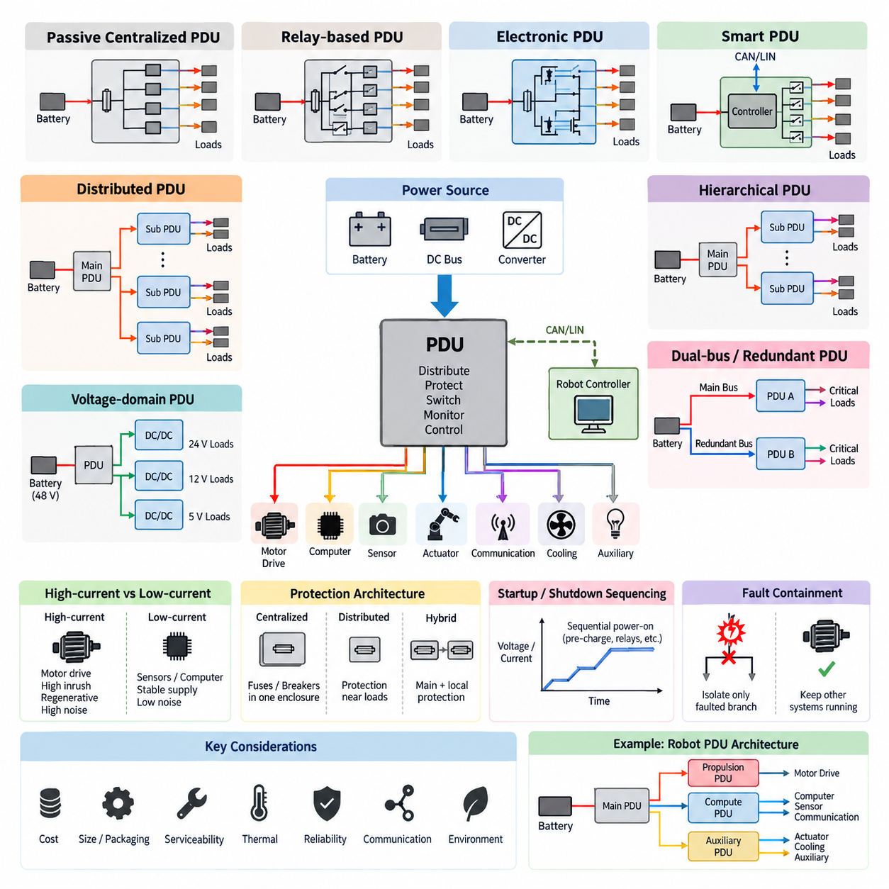
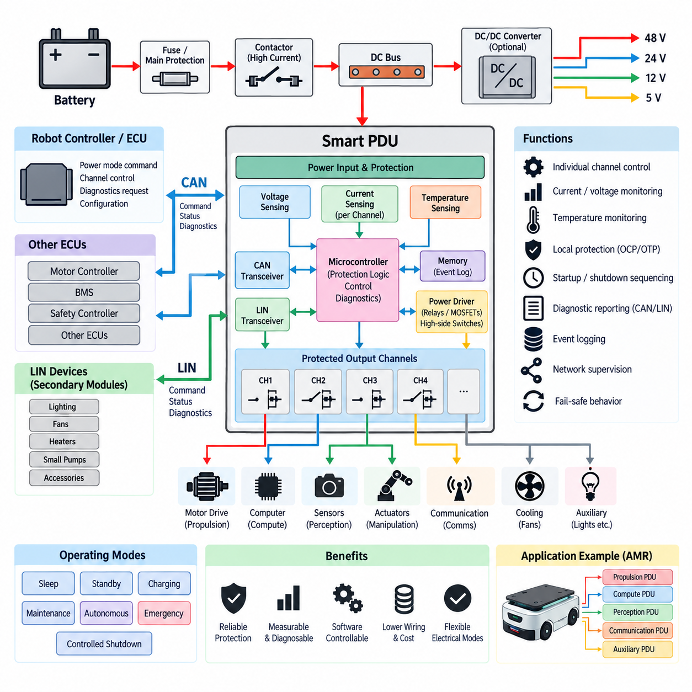
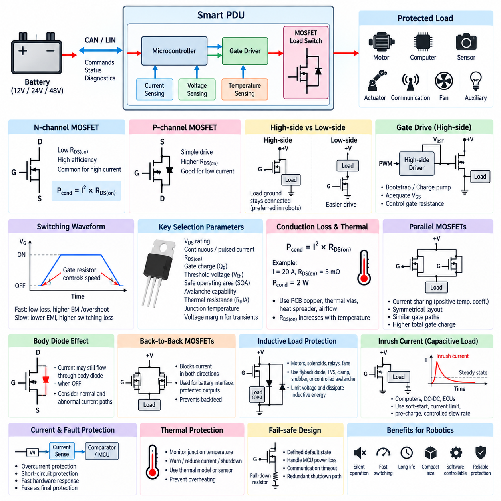
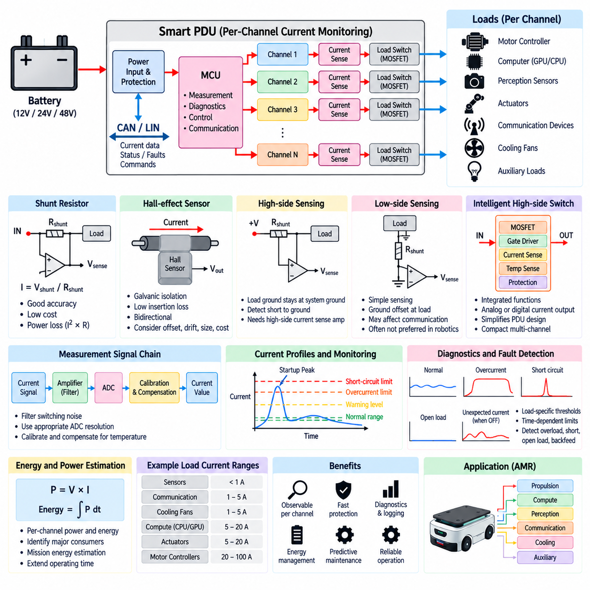
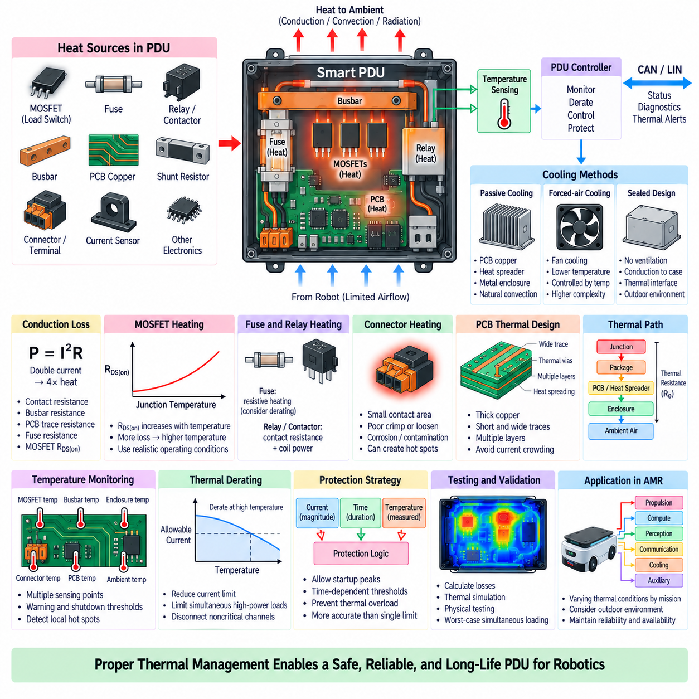

**Volume 04. Fuse, Relay, and Power Distribution Unit**

# Chapter 07. PDU Design

## 07.01. PDU Architecture Types

{width="7.268055555555556in" height="7.268055555555556in"}

전력 분배 장치(Power Distribution Unit, PDU)는 배터리(Battery), 직류 버스(DC Bus) 또는 상위 컨버터(Upstream Converter)로부터 전력을 공급받아 여러 보호 부하(Protected Load)에 분배하는 중앙 전기 노드(Central Electrical Node)이다. 로보틱스(Robotics)에서 PDU는 주 에너지원(Primary Energy Source)과 모터 드라이브(Motor Drive), 컴퓨터(Computer), 센서(Sensor), 액추에이터(Actuator), 통신 장비(Communication Equipment), 냉각 장치(Cooling Device), 보조 전장품(Auxiliary Electronics) 사이에 위치한다. PDU의 아키텍처(Architecture)는 전력 분기 회로가 어떻게 구성되고 보호, 절연, 모니터링 및 정비되는지를 결정한다.

가장 단순한 PDU 아키텍처는 수동형 중앙집중식 분배 구조(Passive Centralized Distribution Structure)이다. 배터리 전력은 버스바(Busbar), 퓨즈(Fuse), 릴레이(Relay), 단자(Terminal), 커넥터(Connector)가 포함된 하나의 인클로저(Enclosure)로 입력되고, 각 부하 그룹으로 개별 보호 분기 회로가 출력된다. 이 아키텍처는 비용이 낮고 기계적 구성이 단순하며 점검이 쉽다. 특히 전기 부하가 비교적 일정하고 정교한 채널별 진단(Channel-Level Diagnostics)이 필요하지 않은 소형 로봇에 적합하다.

중앙집중식 릴레이 기반 PDU(Centralized Relay-Based PDU)는 선택된 분기 회로에 전기기계식 릴레이(Electromechanical Relay) 또는 컨택터(Contactor)를 추가하여 수동형 전력 분배 구조를 확장한다. 이에 따라 시동, 종료, 충전, 비상 정지(Emergency Stop), 정비 등의 운전 모드에 따라 부하를 스위칭할 수 있다. 고전류 추진 분기에는 컨택터를 사용하고 저전류 보조 회로에는 일반 릴레이를 사용할 수 있다. 이 구조는 명확한 물리적 스위칭과 고장 격리(Fault Isolation)를 제공하지만 릴레이 수명, 코일 전력, 접점 마모 및 인클로저 크기를 고려해야 한다.

전자식 PDU(Electronic PDU)는 많은 기계식 스위칭 소자를 전력 MOSFET(Power MOSFET)이나 지능형 하이사이드 스위치(Intelligent High-Side Switch)와 같은 반도체 소자로 대체한다. 전자식 스위칭(Electronic Switching)은 빠른 제어, 높은 스위칭 사이클 내구성, 소형 패키징 및 정교한 보호 기능을 제공한다. 사용되는 소자에 따라 각 출력 채널에 과전류 제한(Overcurrent Limitation), 단락 차단(Short-Circuit Shutdown), 과열 보호(Overtemperature Protection), 개방 부하 검출(Open-Load Detection), 진단 피드백(Diagnostic Feedback)을 통합할 수 있다. 이러한 구조는 로봇의 운전 모드에 따라 빈번한 전력 시퀀싱(Power Sequencing)이 필요한 경우 특히 유리하다.

스마트 PDU(Smart PDU)는 전자식 또는 전기기계식 스위칭과 임베디드 컨트롤러(Embedded Controller), 통신 인터페이스(Communication Interface)를 결합한다. 컨트롤러는 전기적 상태를 측정하고 명령을 해석하며 보호 로직(Protection Logic)을 실행하고 고장을 기록하며 PDU 상태를 차량 컨트롤러(Vehicle Controller) 또는 로봇 컴퓨터(Robot Computer)에 보고한다. 시스템 요구사항에 따라 CAN, LIN 또는 기타 임베디드 통신 네트워크(Embedded Communication Network)를 사용할 수 있다. 이러한 아키텍처는 PDU를 수동적인 전기 접속 장치에서 능동적으로 관리되는 전력 서브시스템(Power Subsystem)으로 변화시킨다.

분산형 PDU 아키텍처(Distributed PDU Architecture)는 전력 분배를 주요 부하 그룹 가까이에 배치된 여러 물리적 노드(Physical Node)로 분리한다. 모든 분기 회로를 하나의 중앙 인클로저에서 배선하는 대신, 주 PDU(Primary PDU)가 추진, 인지, 컴퓨팅, 매니퓰레이션(Manipulation), 보조 장비 근처에 배치된 보조 전력 분배 모듈(Secondary Distribution Module)에 전력을 공급한다. 이러한 방식은 특히 부하가 플랫폼 전체에 물리적으로 분산된 대형 이동 로봇에서 와이어 하니스(Wire Harness) 길이, 도체 질량, 커넥터 집중도 및 패키징 혼잡을 줄일 수 있다.

계층형 아키텍처(Hierarchical Architecture)는 중앙집중식과 분산형 개념을 결합한다. 메인 PDU(Main PDU)는 배터리 수준의 절연과 고전류 전력 분배를 담당하고, 하위 PDU(Subordinate PDU)는 지역별 분기 보호와 스위칭을 수행한다. 예를 들어 이동 로봇은 하나의 주 배터리 분배 모듈(Primary Battery Distribution Module)을 통해 추진, 컴퓨팅, 센서 및 보조 영역에 전력을 공급할 수 있다. 이후 각 영역에는 해당 부하 특성에 적합한 2차 보호(Secondary Protection)를 적용하여 배터리와 최종 장치 사이에 여러 단계의 협조 보호 계층(Coordinated Protection Layer)을 구성할 수 있다.

고전류 부하(High-Current Load)와 저전류 부하(Low-Current Load)는 전기적 특성이 크게 다르기 때문에 아키텍처적으로 분리되는 경우가 많다. 모터 드라이브는 큰 시동 전류, 회생 전류(Regenerative Current), 스위칭 노이즈(Switching Noise), 과도 교란(Transient Disturbance)을 발생시킬 수 있는 반면, 센서와 컴퓨팅 전자장치는 상대적으로 안정적이고 노이즈가 적은 전원을 요구한다. 별도의 버스 구간, 전용 보호 장치, 필터링, 접지 구성 또는 DC-DC 변환 단계를 사용하면 추진 시스템의 교란이 인지, 통신 또는 AI 컴퓨팅 신뢰성을 저하시키는 것을 방지할 수 있다.

이중 버스 및 이중화 PDU 아키텍처(Dual-Bus and Redundant PDU Architecture)는 단일 전기 고장 이후에도 지속적인 운전 또는 제어된 종료(Controlled Shutdown)가 중요한 시스템에 사용된다. 핵심 컨트롤러, 제동 시스템, 위치추정 센서(Localization Sensor), 통신 모듈 또는 안전 회로는 독립적인 분기나 별도의 전원 버스를 통해 전력을 공급받을 수 있다. 이중화(Redundancy)는 단순히 배선을 복제하는 것을 의미하지 않으며, 의미 있는 고장 허용성(Fault Tolerance)을 확보하려면 커넥터, 버스바, 스위칭 장치, 접지 경로 및 상위 보호 장치와 같은 공통 고장 지점(Common Failure Point)도 함께 평가해야 한다.

전압 도메인 아키텍처(Voltage-Domain Architecture)는 로봇 내부에 여러 동작 전압이 존재할 때 중요해진다. 예를 들어 48 V 배터리 버스가 추진 장비에 직접 전력을 공급하고, DC-DC 컨버터(DC-DC Converter)가 컨트롤러와 센서를 위한 24 V, 12 V 또는 그 이하의 전압 도메인을 생성할 수 있다. 전력 분배는 전류 요구량, 변환 효율, 배선 요구사항, 고장 격리, 패키징에 따라 전압 변환 전이나 후에 이루어질 수 있다. 명확한 전압 도메인 경계는 보호 협조(Protection Coordination)를 단순화하고 부적절한 부하가 높은 에너지의 버스에 연결되는 것을 방지한다.

PDU는 보호 기능이 중앙집중식인지 분산형인지에 따라서도 분류할 수 있다. 중앙집중식 보호(Centralized Protection)는 대부분의 퓨즈, 차단기(Breaker), 스위치를 하나의 정비 가능한 인클로저 내부에 배치하여 점검과 교체를 단순화한다. 분산형 보호(Distributed Protection)는 보호 장치를 부하 가까이에 배치함으로써 보호되지 않은 도체의 길이를 줄일 수 있다. 실제 로봇 설계에서는 주요 피더(Feeder)를 중앙에서 보호하면서 하위 분기에는 도체 크기와 장비 특성에 적합한 추가적인 로컬 보호(Local Protection)를 적용하는 하이브리드 보호(Hybrid Protection)가 일반적으로 사용된다.

정비성(Serviceability)은 PDU 아키텍처 선정에 큰 영향을 미친다. 중앙집중식 PDU는 기술자가 퓨즈 점검, 전압 측정, 커넥터 분리 및 분기 회로 고장 진단을 하나의 명확한 위치에서 수행할 수 있도록 한다. 분산형 모듈은 개별 위치에서 접근성을 높일 수 있지만 정비 지점의 수가 증가한다. 교체 가능한 퓨즈 블록, 릴레이 모듈, 전자식 채널 보드 또는 커넥터 방식 서브어셈블리(Connectorized Subassembly)를 갖춘 모듈형 PDU(Modular PDU)는 이러한 요구사항의 균형을 맞추고 전체 전력 분배 장치를 교체하지 않고 손상된 부분만 수리할 수 있도록 한다.

열적 거동(Thermal Behavior) 역시 PDU 아키텍처를 구분하는 중요한 요소이다. 고전류 버스바, 퓨즈 단자, 릴레이, 컨택터, MOSFET, 커넥터 및 PCB 구리는 모두 전도 손실(Conduction Loss)에 의해 열을 발생시킨다. 이러한 부품을 하나의 인클로저에 집중시키면 열적 핫스폿(Thermal Hot Spot)이 발생할 수 있는 반면, 분산형 아키텍처는 열원을 플랫폼 전체로 분산시킬 수 있다. 특히 전자식 PDU는 전류 증가에 따라 반도체 손실이 증가하므로 열 설계(Thermal Design)가 허용 채널 전류와 보호 성능에 직접적으로 영향을 미친다.

고장 격리(Fault Containment)는 개별 퓨즈 정격만으로 해결하기보다는 아키텍처 수준에서 고려해야 한다. 보조 센서의 단락이 추진 시스템을 정지시켜서는 안 되며, 추진 시스템의 고장이 안전 핵심 제어 전자장치(Safety-Critical Control Electronics)의 전력을 불필요하게 차단해서도 안 된다. 부하를 기능별 도메인(Functional Domain)으로 분리하고 독립적인 보호 분기를 할당하면 고장 전파(Fault Propagation)를 제한할 수 있다. 결과적으로 고장 발생 시 가능한 가장 작은 전기 영역만 격리하도록 선택적 차단(Selective Disconnection)을 지원해야 한다.

시동 및 종료 시퀀싱(Startup and Shutdown Sequencing) 또한 적합한 PDU 유형을 결정할 수 있다. 모터 인버터(Motor Inverter), 엣지 컴퓨터(Edge Computer), GPU 시스템, DC 링크 회로(DC-Link Circuit)와 같은 대용량 커패시터성 부하(Capacitive Load)를 동시에 연결하면 상당한 돌입 전류(Inrush Current)가 발생할 수 있다. 제어식 릴레이, 컨택터, 프리차지 회로(Pre-Charge Circuit) 또는 반도체 부하 스위치(Semiconductor Load Switch)를 사용하면 각 분기 회로를 순차적으로 활성화할 수 있다. 따라서 관리형 아키텍처(Managed Architecture)는 로봇 초기화 과정에서 배터리 전압 강하, 불필요한 퓨즈 동작, 커넥터 스트레스 및 과도 교란을 줄일 수 있다.

자율이동로봇(Autonomous Mobile Robot, AMR)의 실용적인 PDU 아키텍처는 하나의 토폴로지(Topology)에만 의존하기보다 여러 PDU 유형을 결합하는 경우가 많다. 배터리 측 주 PDU는 메인 절연과 고전류 보호를 제공하고, 추진부는 모터 드라이브에 전력을 공급하며, 전자적으로 제어되는 보조 전력 분배부는 컴퓨팅 및 인지 장비에 전력을 공급할 수 있다. 안전 회로(Safety Circuit)는 독립적으로 보호하여 비상 기능이 소프트웨어 제어형 전력 분배 계층에 전적으로 의존하지 않도록 구성할 수 있다.

최종적인 PDU 아키텍처 선정은 로봇의 전기 에너지 수준, 물리적 크기, 고장 허용 요구사항, 부하 분포, 정비 전략, 통신 아키텍처 및 예상 운용 환경을 기반으로 이루어져야 한다. 소형 실내 로봇에는 소형 중앙집중식 PDU가 적합할 수 있지만, 대형 실외 자율이동로봇(Outdoor AMR), 이동형 매니퓰레이터(Mobile Manipulator), 사족보행로봇(Quadruped), 휴머노이드(Humanoid), 화물 운송 플랫폼(Cargo Platform)에서는 계층형 및 분산형 구조의 장점이 더욱 커진다. 따라서 PDU는 단순한 전력 분배 장치가 아니라 전력 분배, 보호, 진단, 열 설계, 와이어 하니스 엔지니어링(Wire Harness Engineering), 기능 안전(Functional Safety)을 연결하는 시스템 수준의 핵심 아키텍처 요소가 된다.

## 07.02. Smart PDU with CAN/LIN

{width="7.268055555555556in" height="7.268055555555556in"}

스마트 전력 분배 장치(Smart Power Distribution Unit, Smart PDU)는 기존 전력 분배 기능에 보호된 전기적 스위칭(Protected Electrical Switching), 임베디드 센싱(Embedded Sensing), 제어(Control), 진단(Diagnostics), 네트워크 통신(Network Communication)을 결합한 시스템이다. 단순히 배터리 전력을 퓨즈(Fuse)와 릴레이(Relay)를 통해 분배하는 대신, 스마트 PDU는 개별 부하를 제어하고 CAN 또는 LIN과 같은 통신 인터페이스를 통해 로봇 컨트롤러(Robot Controller)에 동작 상태를 보고할 수 있는 지능형 전기 노드(Intelligent Electrical Node)가 된다.

일반적인 내부 아키텍처(Architecture)는 전원 입력단(Power Input Stage), 보호 장치(Protection Device), 스위칭 소자(Switching Element), 전류 및 전압 센싱 회로(Current and Voltage Sensing Circuit), 임베디드 마이크로컨트롤러(Embedded Microcontroller), 통신 트랜시버(Communication Transceiver), 여러 개의 보호 출력 채널(Protected Output Channel)로 구성된다. 고전류 또는 절연이 중요한 분기에는 기계식 릴레이(Mechanical Relay)를 사용할 수 있으며, 빈번하게 동작하는 부하는 MOSFET이나 지능형 하이사이드 스위치(Intelligent High-Side Switch)와 같은 반도체 소자로 제어할 수 있다. 마이크로컨트롤러는 명령, 로컬 보호 로직(Local Protection Logic), 측정된 전기적 상태에 따라 이러한 요소를 조정한다.

컨트롤러 영역 네트워크(Controller Area Network, CAN)는 여러 전자 제어기 사이에서 신뢰성 높은 통신이 필요한 스마트 PDU 통합에 특히 적합하다. CAN에 연결된 PDU는 모터 컨트롤러(Motor Controller), 배터리 관리 시스템(Battery Management System, BMS), 안전 컨트롤러(Safety Controller), 기타 전자제어장치(Electronic Control Unit, ECU)와 함께 하나의 네트워크 노드(Network Node)로 동작할 수 있다. 로봇 컨트롤러는 채널 활성화 또는 차단 명령을 전송하고, PDU는 전압, 전류, 온도, 스위치 상태 및 진단 정보를 주기적으로 전송할 수 있다.

CAN 통신은 전기 아키텍처에서 상위 수준의 전력 관리 결정(High-Level Power-Management Decision)과 하위 수준의 보호 실행(Low-Level Protection Execution)을 분리하는 데에도 도움이 된다. 중앙 컨트롤러가 인지 장비(Perception Equipment)를 활성화하기로 결정할 수 있지만, 실제 스위칭은 스마트 PDU가 수행하고 그 결과로 나타나는 전기적 동작이 정상인지 확인한다. 과도한 전류 또는 비정상적인 온도가 감지되면 상위 소프트웨어의 판단이나 통신 응답을 기다리지 않고 로컬 보호 기능(Local Protection)이 즉시 동작할 수 있다.

로컬 상호 연결 네트워크(Local Interconnect Network, LIN)는 보다 단순하거나 시간적 요구가 높지 않은 분산 전기 기능에 비용 효율적인 통신 대안을 제공한다. LIN 기반 PDU 또는 보조 전력 모듈(Secondary Power Module)은 높은 대역폭이나 보다 고성능 네트워크의 기능이 필요하지 않은 보조 부하(Auxiliary Load)를 제어할 수 있다. 예를 들어 조명, 팬, 히터, 소형 펌프, 액세서리 전자장치와 같이 상대적으로 저속이며 결정적인 명령과 진단 정보 교환만으로 충분한 장치에 적용할 수 있다.

따라서 CAN과 LIN은 계층형 스마트 PDU 아키텍처(Hierarchical Smart PDU Architecture) 내에서 함께 사용될 수 있다. 메인 PDU(Main PDU)는 주요 로봇 컨트롤러와 CAN으로 통신하고, 보조 모듈이나 로컬 지능형 스위치(Local Intelligent Switch)는 우선순위가 낮은 부하에 대해 LIN을 사용할 수 있다. 이러한 구성은 중요한 전력 관리 기능에는 견고한 CAN 연결을 유지하면서 배선 및 통신 하드웨어 비용을 줄일 수 있다. 네트워크 선택은 요구 대역폭, 고장 허용성(Fault Tolerance), 토폴로지(Topology), 진단 기능 및 시스템 중요도(System Criticality)에 따라 이루어져야 한다.

스마트 PDU의 주요 장점 중 하나는 채널 단위 제어(Channel-Level Control)이다. 각각의 보호 출력은 항상 전원이 공급되는 고정된 분기 회로가 아니라 개별적으로 제어 가능한 전기 자원(Electrical Resource)으로 취급될 수 있다. 소프트웨어는 로봇의 운전 상태에 따라 센서 그룹, 컴퓨터, 통신 장비, 냉각 팬, 액추에이터(Actuator), 보조 장치를 스위칭할 수 있다. 이를 통해 절전(Sleep), 대기(Standby), 충전(Charging), 정비(Maintenance), 자율 운전(Autonomous Operation), 비상 대응(Emergency Response), 제어된 종료(Controlled Shutdown)와 같은 다양한 전기적 운전 모드를 구현할 수 있다.

채널 단위 전류 모니터링(Channel-Level Current Monitoring)은 또 다른 지능화 계층을 제공한다. 전류 센서(Current Sensor) 또는 반도체에 통합된 측정 회로를 이용하면 각 분기 회로가 시동 및 정상 운전 상태에서 소비하는 전류를 측정할 수 있다. 컨트롤러는 측정값을 예상 범위와 비교하여 과부하(Overload), 단락(Short Circuit), 장비의 구속 상태(Stalled Equipment), 과도한 돌입 전류(Excessive Inrush Current), 또는 개방 회로(Open Circuit)나 부하 분리를 나타낼 수 있는 비정상적으로 낮은 전류 소비를 감지할 수 있다.

전압 모니터링(Voltage Monitoring)도 중요하다. 분기 회로의 전압은 전류 측정만으로는 항상 얻을 수 없는 정보를 제공하기 때문이다. PDU는 배터리 입력 전압과 필요한 경우 선택된 출력 전압을 감시하여 저전압(Undervoltage), 과전압(Overvoltage), 과도한 전압 강하(Excessive Voltage Drop), 스위칭 고장(Switching Failure)을 식별할 수 있다. 전압과 전류 정보를 결합하면 상위 전원 공급 문제, 로컬 스위칭 고장, 배선 저항, 분리된 부하, 비정상적인 하위 장비 동작을 구분하는 데 도움이 된다.

온도 모니터링(Temperature Monitoring)은 PDU 자체를 과도한 열 스트레스(Thermal Stress)로부터 보호한다. 센서는 고전류 스위칭 소자, 버스바(Busbar), 커넥터(Connector), PCB 전력 경로(PCB Power Path) 또는 예상되는 열적 핫스폿(Thermal Hot Spot) 근처에 배치할 수 있다. 온도가 정의된 한계값에 접근하면 컨트롤러는 경고를 발생시키거나 허용 전류를 감소시키고, 중요하지 않은 부하를 차단하거나 해당 채널을 종료할 수 있다. 이러한 열 감시(Thermal Supervision)는 공기 흐름이 제한된 밀폐형 로봇 인클로저(Sealed Robot Enclosure)에서 특히 유용하다.

스마트 스위칭(Smart Switching)은 제어된 시동 시퀀싱(Controlled Startup Sequencing)도 가능하게 한다. 모든 부하에 동시에 전원을 공급하는 대신 PDU는 미리 정의된 순서에 따라 분기 회로를 활성화할 수 있다. 저전력 컨트롤러가 먼저 시작되고, 이후 센서, 통신 시스템, 엣지 컴퓨터(Edge Computer), 냉각 장비, 마지막으로 고전류 추진 장치가 활성화될 수 있다. 순차적 활성화(Sequential Activation)는 동시 돌입 전류와 배터리 전압 강하를 줄이는 동시에 다음 단계가 활성화되기 전에 각 전기 도메인(Electrical Domain)의 정상 상태를 확인할 수 있도록 한다.

제어된 종료(Controlled Shutdown) 역시 중요할 수 있다. 로봇이 종료 명령을 수신했을 때 데이터 저장, 컴퓨터 소프트웨어의 안전한 종료, 통신 메시지 전송, 액추에이터의 안전 상태 이동, 또는 고출력 장치 정지 이후의 지속적인 냉각을 위해 일부 부하는 일정 시간 동안 전원을 유지해야 할 수 있다. 스마트 PDU는 이러한 시간 의존성(Time Dependency)을 구현하면서 종료 과정 전체에서 로컬 보호 기능을 유지할 수 있다.

진단 통신(Diagnostic Communication)은 전기적 고장을 상위 로봇 소프트웨어가 활용할 수 있는 정보로 변환한다. 단순히 퓨즈가 단선되었다는 사실만 알려주는 것이 아니라, PDU는 어떤 채널에서 고장이 발생했는지, 언제 발생했는지, 고장 발생 전후의 전류 또는 전압이 어떠했는지, 해당 스위치가 켜짐 또는 꺼짐 상태로 명령되었는지를 보고할 수 있다. 진단 고장 정보(Diagnostic Trouble Information)는 로컬에 저장하거나 CAN 또는 LIN을 통해 유지보수, 플릿 관리(Fleet Management), 서비스 도구(Service Tool)로 전송할 수 있다.

통신 손실이 기본적인 전기 보호 기능을 무력화하지 않도록 고장 처리(Fault Handling)는 계층적으로 구성되어야 한다. 하드웨어 퓨즈, 회로 차단기(Circuit Breaker), 반도체 보호(Semiconductor Protection) 또는 기타 독립적인 보호 메커니즘(Independent Protection Mechanism)은 임베디드 컨트롤러나 네트워크가 사용할 수 없는 상황에서도 도체와 장비를 계속 보호해야 한다. 로컬 펌웨어(Local Firmware)는 통신 타임아웃(Communication Timeout), 잘못된 명령, 컨트롤러 리셋 또는 네트워크 고장 발생 시 각 채널이 적절하게 사전에 정의된 상태로 전환되도록 페일세이프 출력 상태(Fail-Safe Output State)를 정의할 수 있다.

따라서 네트워크 감시(Network Supervision)는 중요한 스마트 PDU 기능이다. 컨트롤러는 메시지 타이밍(Message Timing), 통신 오류(Communication Error), 명령 유효성(Command Validity), 네트워크 가용성(Network Availability)을 감시할 수 있다. CAN 기반 시스템은 주기적인 상태 메시지와 타임아웃 감시(Timeout Supervision)를 사용하여 제어 ECU가 계속 정상적으로 동작하는지를 확인할 수 있다. LIN 기반 보조 모듈 역시 마스터 통신(Master Communication)의 손실을 감지할 수 있다. 이에 대한 대응은 모든 전기 분기에 동일한 종료 동작을 적용하기보다 부하의 중요도에 따라 결정되어야 한다.

자율이동로봇(Autonomous Mobile Robot, AMR)에서 스마트 PDU는 배터리 시스템(Battery System)과 소프트웨어 정의 운전 모드(Software-Defined Operating Mode) 사이의 인터페이스가 될 수 있다. 추진(Propulsion), 컴퓨팅(Compute), 인지(Perception), 통신(Communication), 냉각(Cooling), 보조(Auxiliary) 도메인을 각각 독립적으로 스위칭하고 모니터링하면서 메인 컨트롤러가 CAN을 통해 전체 동작을 조정할 수 있다. 우선순위가 낮은 장치는 LIN으로 제어되는 모듈 뒤에 그룹화할 수 있다. 이를 통해 로봇의 현재 임무와 상태에 따라 활성화된 전력 구성을 유연하게 변경할 수 있는 전기 아키텍처를 구축할 수 있다.

그럼에도 스마트 PDU는 단순한 네트워크 기반 컴퓨터가 아니라 전기 보호 시스템(Electrical Protection System)으로 설계되어야 한다. 퓨즈 협조(Fuse Coordination), 도체 허용 전류(Conductor Current Capacity), 스위칭 소자 정격(Switching-Device Rating), 단락 차단 능력(Short-Circuit Capability), 커넥터 한계(Connector Limit), 열 디레이팅(Thermal Derating), 접지(Grounding), 전자기 적합성(Electromagnetic Compatibility, EMC), 안전 고장 거동(Safe Failure Behavior)은 여전히 기본적인 요구사항이다. 통신과 소프트웨어는 관측 가능성(Observability)과 제어 가능성(Controllability)을 추가하지만, 올바르게 설계된 하드웨어 보호 기능을 대체하는 것이 아니라 이를 보완해야 한다.

적절하게 통합된 CAN/LIN 스마트 PDU는 전통적인 전력 분배(Traditional Electrical Distribution)와 지능형 로봇 제어(Intelligent Robotic Control) 사이를 연결하는 역할을 한다. 각 전기 분기를 측정 가능하고, 진단 가능하며, 소프트웨어로 제어 가능한 자원으로 만들면서도 하드웨어 수준의 전용 보호 기능을 유지한다. 이러한 기능은 추진, 컴퓨팅, 센싱(Sensing), 통신 및 보조 시스템이 하나의 통합된 전기 도메인(Integrated Electrical Domain)으로 협조하여 동작해야 하는 복잡한 자율이동로봇(AMR) 및 기타 로봇 플랫폼에서 특히 중요한 가치를 갖는다.

## 07.03. Load-Switch MOSFET Design

{width="7.268055555555556in" height="7.268055555555556in"}

전력 MOSFET(Power MOSFET)을 기반으로 하는 부하 스위치(Load Switch)는 전원과 전기 부하 사이의 연결 및 차단을 전자적으로 제어한다. 전력 분배 장치(Power Distribution Unit, PDU)에서는 이러한 방식으로 많은 저전력 및 중전력 분기의 기존 기계식 릴레이(Mechanical Relay)를 대체할 수 있다. 기계적으로 움직이는 접점이 없기 때문에 무소음 동작, 빠른 스위칭, 긴 사이클 수명, 소형 패키징, 임베디드 전자장치(Embedded Electronics)를 통한 직접 제어가 가능하다.

N채널 MOSFET(N-Channel MOSFET)은 낮은 온상태 저항(On-State Resistance)을 통해 상당한 전류에서도 효율적인 전도 특성을 제공하기 때문에 부하 스위칭 소자로 널리 사용된다. MOSFET이 완전히 턴온되면 드레인-소스 온저항(Drain-to-Source On-Resistance, RDS(on))이 전도 손실(Conduction Loss)의 대부분을 결정한다. 대략적인 손실은 Pcond = I² × RDS(on)으로 표현할 수 있으며, 이는 채널 전류가 증가할수록 매우 작은 저항도 중요해진다는 것을 보여준다.

P채널 MOSFET(P-Channel MOSFET)은 전용 전압 승압 회로(Voltage-Boost Circuit) 없이도 게이트를 구동할 수 있는 경우가 많아 하이사이드 스위칭(High-Side Switching)을 단순화할 수 있다. 그러나 유사한 조건의 P채널 소자는 일반적으로 N채널 소자보다 높은 RDS(on)을 가지므로 동일한 실리콘 크기에서 더 큰 전도 손실이 발생한다. 따라서 P채널 방식은 단순하거나 낮은 전류의 채널에 적합하며, 고전류 PDU 설계에서는 적절한 게이트 구동 회로(Gate-Drive Circuit)를 사용하는 N채널 MOSFET이 일반적으로 선호된다.

하이사이드 스위칭(High-Side Switching)과 로우사이드 스위칭(Low-Side Switching)은 두 가지 기본적인 회로 구성이다. 하이사이드 스위치는 양극 전원과 부하 사이에 배치되어 부하의 접지가 시스템 접지(System Ground)에 지속적으로 연결되도록 한다. 로우사이드 스위치는 부하와 접지 사이에 배치되며 일반적으로 구동하기가 더 쉽다. 로봇 PDU에서는 차단된 부하도 통신, 센싱 및 진단 인터페이스를 위한 명확한 접지 기준(Ground Reference)을 유지할 수 있기 때문에 하이사이드 스위칭이 자주 선호된다.

하이사이드에서 N채널 MOSFET을 구동하려면 게이트 전압이 MOSFET의 소스 전압보다 충분히 높아야 한다. 따라서 전용 하이사이드 게이트 드라이버(High-Side Gate Driver), 차지 펌프(Charge Pump) 또는 부트스트랩 회로(Bootstrap Circuit)가 필요할 수 있다. 게이트 드라이버는 최대 게이트-소스 전압(Maximum VGS Rating)을 초과하지 않으면서 충분한 게이트-소스 전압을 제공해야 한다. 게이트 전압이 부족하면 소자가 부분적으로만 턴온되어 RDS(on), 전력 손실 및 접합부 온도(Junction Temperature)가 증가한다.

MOSFET 게이트는 주로 용량성 부하(Capacitive Load)처럼 동작하므로 스위칭 속도는 게이트 전하(Gate Charge)를 얼마나 빠르게 공급하거나 제거하는지에 따라 결정된다. 게이트 저항(Gate Resistance)을 사용하여 전환 속도와 최대 게이트 전류를 제어할 수 있다. 지나치게 빠른 전환은 스위칭 손실을 줄이지만 전자기 간섭(Electromagnetic Interference, EMI), 전압 오버슈트(Voltage Overshoot), 링잉(Ringing)을 증가시킬 수 있다. 반대로 느린 전환은 전자기적 특성을 개선할 수 있지만 스위칭 과정에서 소모되는 에너지를 증가시킨다.

MOSFET 선정에서는 정격 부하 전류뿐만 아니라 다양한 전기적 특성을 고려해야 한다. 주요 파라미터에는 드레인-소스 전압 정격(Drain-to-Source Voltage Rating), 연속 및 펄스 드레인 전류(Continuous and Pulsed Drain Current), RDS(on), 게이트 전하, 문턱 전압(Threshold Voltage), 안전 동작 영역(Safe Operating Area, SOA), 애벌랜치 내량(Avalanche Capability), 패키지 열저항(Package Thermal Resistance), 접합부 온도 한계가 포함된다. 특히 로봇 시스템에서는 모터, 유도성 배선, 컨버터 및 스위칭 장치가 공칭 배터리 전압보다 높은 전원 과도전압(Supply Transient)을 발생시킬 수 있으므로 적절한 전압 마진이 중요하다.

전도 손실은 부하 스위치의 열 설계(Thermal Design)에 직접적인 영향을 준다. 예를 들어 유효 RDS(on)이 5 mΩ인 MOSFET에 20 A가 흐르면 전도 손실만으로 약 2 W의 전력이 소모된다. PCB 구리 패턴, 열 비아(Thermal Via), 히트 스프레더(Heat Spreader), 인클로저 전도(Enclosure Conduction), 공기 흐름 등을 이용하여 이러한 열을 제거하고 접합부 온도를 허용 범위 이하로 유지해야 한다. 또한 RDS(on)은 일반적으로 접합부 온도가 상승함에 따라 증가하므로 소자가 뜨거워질수록 추가적인 손실이 발생한다.

단일 소자가 요구 전류를 효율적으로 처리할 수 없는 경우 병렬 MOSFET(Parallel MOSFET)을 사용할 수 있다. MOSFET의 온저항은 일반적으로 온도가 상승하면 증가하기 때문에 음의 온도 계수(Negative Temperature Coefficient)를 갖는 소자에 비해 전류 분담(Current Sharing)에 유리할 수 있다. 그러나 대칭적인 PCB 배선, 유사한 게이트 경로, 균일한 열 환경 및 적절한 소자 선정은 여전히 중요하다. MOSFET을 병렬로 연결하면 전체 게이트 전하도 증가하므로 게이트 드라이버에 더 큰 구동 능력이 요구된다.

전력 MOSFET에 내장된 바디 다이오드(Body Diode)는 부하 스위치 동작에 중요한 영향을 미친다. 단일 MOSFET을 사용하면 트랜지스터가 꺼짐 상태로 명령되더라도 바디 다이오드를 통해 한 방향으로 전류가 흐를 수 있다. 완전한 전기적 절연, 역전류 차단(Reverse-Current Blocking), 역급전(Backfeed) 방지가 필요한 경우 이러한 특성은 문제가 될 수 있다. 따라서 정상적인 전류 흐름과 발생 가능한 비정상 운전 조건을 고려하여 바디 다이오드의 방향을 평가해야 한다.

양방향 차단(Bidirectional Blocking)이 필요한 경우 백투백 MOSFET(Back-to-Back MOSFET)이 일반적인 해결 방법이다. 두 MOSFET의 바디 다이오드가 서로 반대 방향을 향하도록 구성하여 스위치가 꺼졌을 때 어느 방향으로도 제어되지 않은 전류가 흐르지 않도록 한다. 두 MOSFET이 모두 켜지면 채널을 통해 정상적으로 전류가 흐른다. 이 토폴로지(Topology)는 배터리 인터페이스, 보호 출력, 이중화 전원(Redundant Supply), 하위 에너지 저장 장치에서 PDU로 전력이 역급전될 가능성이 있는 분기에 유용하다.

유도성 부하(Inductive Load)는 모터, 솔레노이드(Solenoid), 릴레이, 팬, 펌프 또는 긴 와이어 하니스(Wire Harness)를 통해 흐르는 전류를 차단할 때 상당한 과도전압을 발생시킬 수 있으므로 추가적인 보호가 필요하다. 회로 요구사항에 따라 프리휠 다이오드(Freewheel Diode), 과도전압 억제 소자(Transient-Voltage-Suppression Device, TVS), 클램프(Clamp), 스너버(Snubber), 제어된 MOSFET 애벌랜치(Controlled MOSFET Avalanche)를 사용할 수 있다. 보호 네트워크는 MOSFET의 드레인-소스 전압을 안전한 범위로 제한하면서 저장된 유도 에너지를 안전하게 소모해야 한다.

컴퓨터, 모터 컨트롤러, DC-DC 컨버터(DC-DC Converter), 전자제어장치(Electronic Control Unit, ECU)와 같은 용량성 부하(Capacitive Load)를 스위칭할 때는 돌입 전류(Inrush Current)도 중요한 고려사항이다. 방전된 입력 커패시터는 초기 순간에 매우 낮은 임피던스로 보일 수 있어 정상 상태의 부하 전류보다 훨씬 큰 전류를 발생시킬 수 있다. 제어된 게이트 슬루율(Controlled Gate Slew Rate), 전류 제한(Current Limiting), 소프트 스타트(Soft Start), 프리차지 회로(Pre-Charge Circuit), 지능형 하이사이드 스위치(Intelligent High-Side Switch)를 사용하면 이러한 스트레스를 줄이고 상위 보호 장치의 불필요한 동작을 방지할 수 있다.

MOSFET 채널에 전류 센싱(Current Sensing)을 통합하면 지능형 보호(Intelligent Protection)를 구현할 수 있다. 션트 저항(Shunt Resistor), 홀 효과 센서(Hall-Effect Sensor) 또는 스마트 스위치에 내장된 전류 감지 기능을 통해 PDU 컨트롤러에 피드백을 제공할 수 있다. 이후 펌웨어 또는 하드웨어 비교기(Hardware Comparator)가 과부하 및 단락 상태를 감지할 수 있다. 심각한 단락에서는 일반 소프트웨어가 대응하기 전에 MOSFET의 안전 동작 영역을 초과할 수 있으므로 빠른 하드웨어 보호(Fast Hardware Protection)가 특히 중요하다.

단락 보호(Short-Circuit Protection)는 전류의 크기뿐만 아니라 응답 시간(Response Time)도 함께 고려해야 한다. 과도한 전류를 감지한 후 단순히 MOSFET을 끄는 것만으로는 검출, 필터링, 연산 및 게이트 방전에 지나치게 많은 시간이 소요될 경우 충분하지 않을 수 있다. 지능형 스위치는 빠른 전류 제한과 열 차단(Thermal Shutdown)을 통합할 수 있으며, 개별 소자를 사용하는 설계에서는 전용 비교기와 게이트 제어 회로가 필요할 수 있다. 기존 퓨즈는 치명적인 고장에 대비한 독립적인 최종 보호 계층(Final Protection Layer)으로 유지할 수 있다.

열 보호(Thermal Protection)는 전류 보호를 보완한다. 중간 수준의 과부하는 즉각적인 단락 보호를 작동시키지 않을 수 있지만 시간이 지나면서 반도체를 지속적으로 과열시킬 수 있다. 접합부 온도는 전류와 열 모델(Thermal Model)을 이용하여 추정하거나 통합 온도 센싱(Integrated Temperature Sensing)을 통해 모니터링할 수 있다. 스마트 PDU(Smart PDU)는 연결된 부하의 안전 요구사항에 따라 열 한계에 접근하면 경고를 발생시키거나 전류를 제한하고, 채널을 차단하거나 재시도 로직(Retry Logic)을 수행할 수 있다.

마이크로컨트롤러 전원 손실, 게이트 드라이버 고장, 통신 타임아웃 또는 소프트웨어 리셋 상황에 대한 페일세이프 동작(Fail-Safe Behavior)도 정의해야 한다. 게이트 풀다운 저항(Gate Pull-Down Resistor) 또는 풀업 저항(Pull-Up Resistor)은 MOSFET 게이트가 불확실한 상태로 부유하지 않도록 명확한 기본 상태(Default State)를 설정한다. 중요 채널에는 독립적인 하드웨어 활성화 신호(Hardware Enable Signal) 또는 이중화 차단 경로(Redundant Shutdown Path)가 필요할 수 있다. 적절한 기본 상태는 해당 로봇 서브시스템에서 전원을 유지하는 것과 차단하는 것 중 어느 쪽이 더 안전한지에 따라 결정된다.

따라서 잘 설계된 MOSFET 부하 스위치는 반도체 선정, 게이트 구동 설계, 과도전압 억제, 전류 모니터링, 열 관리, 단락 보호 및 페일세이프 제어를 통합한다. 스마트 PDU 내부에서 이러한 회로는 개별 로봇 부하를 소프트웨어로 제어 가능한 전기 채널(Software-Controlled Electrical Channel)로 만들면서 빠른 로컬 하드웨어 보호 기능을 유지한다. 이러한 특성으로 인해 MOSFET 스위칭은 빈번한 전력 시퀀싱, 진단, 소형 패키징 및 높은 스위칭 사이클 신뢰성이 요구되는 현대적인 자율이동로봇(Autonomous Mobile Robot, AMR)과 로봇 플랫폼에서 특히 중요한 기술이 된다.

## 07.04. Current Monitoring per Channel

{width="7.268055555555556in" height="7.268055555555556in"}

채널별 전류 모니터링(Per-Channel Current Monitoring)을 사용하면 전력 분배 장치(Power Distribution Unit, PDU)가 각각의 보호 출력(Protected Output)을 통해 흐르는 전류를 독립적으로 측정할 수 있다. 전체 배터리 전류만 관찰하는 대신 PDU는 모터 컨트롤러(Motor Controller), 컴퓨터, 센서, 액추에이터(Actuator), 통신 장치, 냉각 팬 및 보조 장비와 같은 개별 부하가 소비하는 전류를 파악할 수 있다. 이를 통해 각 분기 회로는 관측 가능한 전기 채널(Observable Electrical Channel)로 전환된다.

기본적인 측정 원리는 분기 전류(Branch Current)를 PDU 컨트롤러가 해석할 수 있는 전기 신호로 변환하는 것이다. 일반적인 방식에는 션트 저항(Shunt Resistor), 홀 효과 센서(Hall-Effect Sensor), 자기식 전류 센서(Magnetic Current Sensor), 지능형 하이사이드 스위치(Intelligent High-Side Switch)에 통합된 전류 감지 기능이 있다. 적절한 기술은 채널 전류, 요구 정확도, 절연 요구사항, 허용 전력 손실, 비용, 패키징, 대역폭 및 예상 고장 조건에 따라 결정된다.

션트 기반 측정 회로(Shunt-Based Measurement Circuit)는 정확히 알려진 낮은 저항값을 갖는 저항을 전류 경로에 배치하고 그 양단에서 발생하는 전압을 측정한다. 옴의 법칙(Ohm\'s Law)에 따라 전류는 I = Vshunt / Rshunt로 계산할 수 있다. 저항값이 의도적으로 매우 작기 때문에 발생하는 전압은 일반적으로 전류 감지 증폭기(Current-Sense Amplifier)를 이용하여 측정한다. 이 방식은 우수한 정확도와 비교적 낮은 비용을 제공하지만 I² × Rshunt에 비례하는 전력 손실이 발생한다.

하이사이드 전류 센싱(High-Side Current Sensing)은 션트 또는 센싱 소자를 양극 전원과 부하 사이에 배치한다. 이러한 구성은 부하 접지(Load Ground)를 시스템 접지(System Ground)에 직접 연결된 상태로 유지하면서 특정 접지 단락(Short Circuit to Ground)을 감지할 수 있게 한다. 그러나 측정 회로는 전원 전압에 가까운 공통 모드 전압(Common-Mode Voltage)을 견뎌야 한다. 따라서 션트 양단의 작은 차동 전압(Differential Voltage)을 추출하기 위해 전용 하이사이드 전류 감지 증폭기(High-Side Current-Sense Amplifier)가 일반적으로 사용된다.

로우사이드 전류 센싱(Low-Side Current Sensing)은 측정 저항을 부하와 접지 사이에 배치한다. 측정 전압이 접지 전위에 가깝게 유지되기 때문에 센싱 전자회로를 보다 단순하게 구성할 수 있다. 그러나 션트 저항으로 인해 부하 접지와 시스템 접지 사이에 전압 오프셋(Voltage Offset)이 발생하며, 이는 통신, 아날로그 센싱 또는 기타 접지 기준 인터페이스(Ground-Referenced Interface)에 영향을 줄 수 있다. 이러한 이유로 지능형 로봇 전력 분배 시스템에서는 하이사이드 센싱이 자주 선호된다.

홀 효과 전류 센서(Hall-Effect Current Sensor)는 전력 경로에 큰 저항성 소자를 삽입하는 대신 전류에 의해 생성되는 자기장(Magnetic Field)을 측정한다. 고전류 도체와 측정 전자회로 사이에 갈바닉 절연(Galvanic Isolation)을 제공할 수 있어 높은 전류의 분기 회로에 유용하다. 낮은 삽입 손실(Insertion Loss)과 양방향 전류 측정(Bidirectional Current Measurement)이 장점이지만 센서 선정 시 오프셋, 온도 드리프트(Temperature Drift), 대역폭, 물리적 크기 및 비용을 고려해야 한다.

지능형 하이사이드 스위치(Intelligent High-Side Switch)는 전력 MOSFET(Power MOSFET), 게이트 드라이버(Gate Driver), 전류 센싱, 온도 모니터링 및 보호 기능을 하나의 반도체 소자에 통합할 수 있다. 일부 소자는 부하 전류에 비례하는 아날로그 전류 감지 출력(Analog Current-Sense Output)을 제공하고, 다른 소자는 디지털 인터페이스를 통해 진단 정보를 제공한다. 이 방식은 스마트 PDU(Smart PDU)의 하드웨어를 크게 단순화할 수 있으며 스위칭, 모니터링 및 보호 기능이 함께 동작해야 하는 소형 다채널 설계(Multi-Channel Design)를 가능하게 한다.

측정 범위(Measurement Range)는 각 채널에서 예상되는 운전 특성에 맞게 설정해야 한다. 1 A 미만을 소비하는 인지 센서(Perception Sensor)는 수십 A가 흐르는 모터 컨트롤러와 다른 측정 분해능(Measurement Resolution)을 필요로 한다. 모든 채널을 최대 가능 전류에 맞춰 설계하면 저전류 영역에서 유효 분해능이 저하될 수 있다. 따라서 스마트 PDU는 컴퓨팅, 센서, 액추에이터, 보조 장치 및 추진 부하에 따라 서로 다른 센서 범위, 증폭기 이득(Amplifier Gain) 또는 채널 등급(Channel Class)을 사용할 수 있다.

샘플링 속도(Sampling Rate)는 모니터링 시스템이 무엇을 관찰하려는지에 따라 결정된다. 에너지 추정 및 정상 상태 부하 모니터링에는 낮은 샘플링 속도로 충분할 수 있지만, 시동 전류, 짧은 과도현상(Transient), 모터 관련 전류 변화 및 진행 중인 고장을 포착하려면 더 빠른 샘플링이 필요하다. 매우 빠른 단락 보호(Short-Circuit Protection)는 손상을 유발하는 전류가 임베디드 제어 루프보다 훨씬 빠르게 상승할 수 있기 때문에 일반적인 소프트웨어 샘플링에만 의존해서는 안 된다.

로봇 전기 시스템에는 상당한 스위칭 노이즈(Switching Noise)가 존재하므로 필터링(Filtering)이 필요하다. 모터 인버터(Motor Inverter), DC-DC 컨버터(DC-DC Converter), PWM 제어 부하, 릴레이, 통신 장비 및 긴 와이어 하니스(Wire Harness)는 전류 측정에 고주파 교란(High-Frequency Disturbance)을 유입할 수 있다. 아날로그 필터링은 아날로그-디지털 변환 전에 불필요한 성분을 줄이고, 디지털 필터링(Digital Filtering)은 보고되는 측정값을 안정화할 수 있다. 그러나 과도한 필터링은 실제 과전류 이벤트(Overcurrent Event)의 검출을 지연시킬 수 있다.

아날로그-디지털 변환기(Analog-to-Digital Converter, ADC)의 분해능은 구분할 수 있는 최소 전류 변화량에 영향을 준다. 실제 사용 가능한 분해능은 ADC의 비트 수뿐만 아니라 센서 이득, 기준 전압(Reference Voltage), 노이즈, 오프셋 및 측정 범위에도 영향을 받는다. 잘 설계된 전류 모니터링 채널은 ADC 입력 범위를 충분히 활용하여 유용한 분해능을 확보하는 동시에 시동 피크와 비정상적인 운전 조건을 측정할 수 있는 충분한 여유 범위(Headroom)를 유지해야 한다.

캘리브레이션(Calibration)은 저항 허용오차, 증폭기 오프셋, 센서 이득 편차, PCB 저항 및 제조 편차를 보상하여 측정 정확도를 향상시킨다. 캘리브레이션 값은 비휘발성 메모리(Nonvolatile Memory)에 저장하고 PDU 펌웨어에서 적용할 수 있다. 션트 저항, 증폭기 특성 및 자기 센서의 오프셋은 온도에 따라 변하므로 온도 보상(Temperature Compensation)이 필요할 수도 있다. 따라서 생산 단계의 캘리브레이션은 PDU 채널 간 및 생산된 개별 장치 간의 측정 일관성을 향상시킬 수 있다.

채널별 모니터링은 부하별 진단 임계값(Load-Specific Diagnostic Threshold)을 설정할 수 있게 한다. 하나의 공통 과전류 한계를 사용하는 대신 각 분기의 정상적인 전기적 동작을 기준으로 서로 다른 한계를 설정할 수 있다. 팬, 센서, GPU 컴퓨터, 통신 모뎀, 액추에이터 및 모터 컨트롤러는 매우 다른 전류 프로파일(Current Profile)을 갖는다. 임계값에는 정상 운전 범위, 시동 허용 범위, 경고 수준, 과부하 한계, 단락 한계 및 정상적인 과도현상과 지속적인 고장을 구별하기 위한 시간 의존 조건이 포함될 수 있다.

전류 시그니처(Current Signature)는 보호 임계값을 초과하기 전에도 유용한 진단 정보를 제공할 수 있다. 팬 전류가 증가하면 베어링 열화 또는 장애물을 의미할 수 있고, 예상보다 낮은 전류는 부하가 분리되었음을 나타낼 수 있다. 전류를 소비하면서 예상되는 움직임이 없는 전동 액추에이터는 구속 상태(Stall)에 있을 수 있다. 컴퓨터나 센서의 소비 전류가 반복적으로 변화하는 경우에도 비정상적인 시동 동작을 발견할 수 있다. 따라서 전류 모니터링은 즉각적인 전기 보호뿐만 아니라 상태 모니터링(Condition Monitoring)도 지원한다.

채널 측정값을 이용하여 에너지 및 전력 소비도 추정할 수 있다. 전류와 측정된 버스 전압(Bus Voltage)을 결합하면 순간 전력은 P = V × I로 근사할 수 있다. 시간에 따라 전력을 적분하면 개별 서브시스템의 에너지 소비량을 계산할 수 있다. 로봇은 이러한 정보를 이용하여 주요 전력 소비원을 식별하고, 임무 에너지 요구량(Mission Energy Requirement)을 추정하며, 배터리 부족 상태를 관리하거나 불필요한 부하를 선택적으로 차단하여 남은 운용 시간을 연장할 수 있다.

고장 검출(Fault Detection)은 과부하, 단락, 개방 부하(Open Load), 예상하지 않은 전류 흐름을 구별할 수 있어야 한다. 채널이 켜짐 상태로 명령되었을 때 과도한 전류가 흐르면 과부하 또는 하위 회로의 단락을 의미할 수 있다. 거의 0에 가까운 전류는 개방 회로나 분리된 장치를 나타낼 수 있다. 채널이 꺼짐 상태인데 전류가 검출되면 MOSFET 누설, 바디 다이오드(Body Diode) 전도, 릴레이 접점 용착(Welded Relay Contact), 역급전(Backfeed) 또는 의도하지 않은 대체 전원 경로를 의미할 수 있다. 명령 상태와 측정 전류를 결합하면 진단 분해능(Diagnostic Resolution)을 크게 향상시킬 수 있다.

허용 가능한 전류는 지속 시간에 따라 달라지므로 보호 로직(Protection Logic)은 일반적으로 전류 크기와 시간을 함께 사용한다. 모터 컨트롤러나 컴퓨터는 시동 중 일시적으로 큰 전류를 정상적으로 소비할 수 있지만 이러한 전류가 지속되어서는 안 된다. 따라서 PDU는 보호 협조(Protection Coordination)와 유사한 개념의 시간 의존 임계값(Time-Dependent Threshold)을 적용할 수 있다. 심각한 고장은 빠르게 차단하고, 중간 수준의 과부하는 경고, 전류 제한 또는 채널 차단 전에 짧은 시간 동안 허용할 수 있다.

채널별 데이터는 스마트 PDU의 네트워크 인터페이스를 통해 전송될 때 특히 높은 가치를 갖는다. 전류값, 피크 측정값, 누적 에너지, 경고 상태 및 고장 이벤트를 CAN 또는 LIN을 통해 로봇 컨트롤러로 보고할 수 있다. 이러한 정보는 진단 로그(Diagnostic Log)에 기록되고 유지보수 또는 플릿 관리 시스템(Fleet-Management System)으로 전달될 수도 있다. 이를 통해 전기적 동작을 로봇의 전체 상태 모니터링(Health Monitoring) 및 서비스 전략의 일부로 활용할 수 있다.

자율이동로봇(Autonomous Mobile Robot, AMR)에서는 전류 모니터링을 통해 추진(Propulsion), 컴퓨팅(Compute), 인지(Perception), 통신(Communication), 냉각(Cooling), 보조(Auxiliary) 시스템의 전력 동작을 서로 구분할 수 있다. 컨트롤러는 예상하지 못한 배터리 소비의 원인이 되는 전력 도메인을 식별하고 전체 로봇을 불필요하게 정지시키지 않으면서 비정상적인 분기만 격리할 수 있다. 제어 가능한 MOSFET 부하 스위치와 결합하면 각 채널을 독립적으로 측정, 진단, 보호 및 스위칭할 수 있는 폐루프 전력 관리(Closed Electrical Management Loop)를 구성할 수 있다.

따라서 견고한 채널별 전류 모니터링 설계는 적절한 센싱 기술, 측정 범위, 샘플링, 필터링, ADC 설계, 캘리브레이션, 온도 보상, 진단 임계값 및 빠른 독립 보호 기능을 결합해야 한다. 목적은 단순히 전류값을 표시하는 것이 아니라 전력 분배 상태를 관측 가능한 시스템 정보(Observable System Information)로 변환하는 것이다. 스마트 PDU 내부에서 이러한 기능은 채널 수준 진단(Channel-Level Diagnostics), 에너지 관리(Energy Management), 예지 정비(Predictive Maintenance), 협조된 로봇 전력 보호(Coordinated Robot Power Protection)를 구현하는 기반이 된다.

## 07.05. PDU Thermal Management

{width="7.268055555555556in" height="7.268055555555556in"}

전력 분배 장치(Power Distribution Unit, PDU)의 열 관리(Thermal Management)는 전류가 흐르는 모든 부품에서 전기 저항에 의해 열이 발생하기 때문에 필수적이다. 버스바(Busbar), PCB 구리, 퓨즈(Fuse), 릴레이(Relay), 컨택터(Contactor), MOSFET, 션트 저항(Shunt Resistor), 커넥터(Connector), 단자(Terminal)는 모두 내부 온도 상승에 영향을 준다. 로봇의 전력 요구량이 증가할수록 열적 성능은 허용 전류, 보호 정확도, 부품 수명 및 전체 전기 시스템의 신뢰성과 직접적으로 연관된다.

PDU에서 가장 기본적인 열원은 전도 손실(Conduction Loss)이며, 이는 P = I²R로 근사할 수 있다. 전력 손실은 전류의 제곱에 비례하므로 동일한 저항에서 분기 전류가 두 배로 증가하면 저항성 발열은 약 네 배로 증가한다. 따라서 고전류 경로에서는 매우 작은 저항도 중요해진다. 열 해석에서는 접촉 저항(Contact Resistance), 버스바 저항, PCB 패턴 저항, 퓨즈 저항 및 MOSFET의 온저항(RDS(on))을 모두 고려해야 한다.

MOSFET 기반 부하 스위치(Load Switch)는 온상태 저항(On-State Resistance)이 접합부 온도(Junction Temperature)에 따라 변하기 때문에 특별한 주의가 필요하다. MOSFET의 온도가 상승하면 일반적으로 RDS(on)이 증가하여 추가적인 전도 손실과 온도 상승을 유발한다. 이러한 전기-열 상호작용(Electrothermal Interaction)으로 인해 상온에서의 저항값만으로 설계하는 것은 충분하지 않다. 손실 계산에는 데이터시트의 공칭 조건만이 아니라 예상 접합부 온도에 해당하는 현실적인 운전 전류와 저항값을 사용해야 한다.

퓨즈도 퓨즈 소자(Fuse Element)가 유한한 전기 저항을 가지므로 정상 운전 중 열을 발생시킨다. 특히 밀폐형 PDU 내부에서 공칭 정격에 가까운 전류로 지속적으로 동작하는 퓨즈는 주변 환경보다 상당히 높은 온도에 도달할 수 있다. 주변 온도(Ambient Temperature)는 퓨즈의 동작 특성과 허용 전류에 영향을 주므로 퓨즈 디레이팅(Fuse Derating)과 인접 부품 간의 열적 상호작용을 고려해야 한다. 고전류 퓨즈를 밀집 배치하면 서로의 국부 운전 온도를 더욱 상승시킬 수 있다.

릴레이와 컨택터는 접점 저항(Contact Resistance)과 코일 전력(Coil Power) 모두에 의해 열을 발생시킨다. 고전류 접점에서는 상당한 국부 발열이 발생할 수 있으며, 특히 노화, 오염, 산화 또는 기계적 열화로 인해 접점 저항이 증가하면 발열이 더욱 커진다. 장치가 계속 여자(Energized)되어 있는 동안에는 코일 발열도 추가적인 열원이 된다. 따라서 릴레이와 컨택터의 열이 온도에 민감한 전자장치, 전류 센서, 통신 트랜시버 또는 인접 보호 장치를 과도하게 가열하지 않도록 배치해야 한다.

커넥터와 단자는 비교적 작은 접촉 면적을 통해 분기 회로의 전체 전류가 흐르기 때문에 중요한 열적 위치(Thermal Location)가 된다. 불량 압착(Poor Crimping), 불충분한 단자 체결, 오염, 부식, 풀림 또는 커넥터 마모는 접촉 저항을 증가시켜 국부적인 핫스폿(Hot Spot)을 발생시킬 수 있다. P = I²R의 관계에 따라 작은 저항 증가도 고전류에서는 상당한 열을 발생시킬 수 있다. 따라서 열 설계에서는 PCB와 반도체 손실뿐만 아니라 커넥터 인터페이스(Connector Interface)도 포함해야 한다.

버스바는 큰 도전 단면적(Conductive Cross-Section)을 통해 낮은 저항과 우수한 열 확산(Thermal Spreading)을 제공하므로 고전류 PDU에서 일반적으로 사용된다. 재질, 두께, 폭, 길이, 도금(Plating), 접합부 설계 및 체결 압력은 전기적 성능과 열적 성능 모두에 영향을 준다. 도체 면적을 증가시키면 저항 손실을 줄일 수 있지만 패키징 및 질량 제약으로 인해 실제 크기에는 한계가 있다. 버스바는 열을 인클로저(Enclosure) 방향으로 전달할 수도 있으므로 기계적 체결 구조 역시 전체 열 전달 경로의 일부가 된다.

PCB 기반 PDU는 구리 두께, 패턴 폭, 레이어 구성, 열 비아(Thermal Via), 전류 분포에 크게 의존한다. 고전류 패턴은 저항과 국부 전류 밀도(Current Density)를 증가시키는 불필요한 길이와 좁은 구간을 최소화해야 한다. 필요한 경우 여러 구리 레이어를 병렬로 연결할 수 있으며, 열 비아를 사용하여 레이어 사이 또는 열 확산 구조물로 열을 전달할 수 있다. 패드, 비아 및 좁아지는 전이 구간 주변에서는 전류 집중(Current Crowding)이 발생하여 국부적인 핫스폿이 형성될 수 있으므로 이를 평가해야 한다.

반도체 접합부에서 주변 공기까지의 열 전달 경로는 열저항 네트워크(Thermal-Resistance Network)로 표현할 수 있다. 열은 접합부에서 패키지, PCB 또는 히트 스프레더(Heat Spreader), 인클로저를 거쳐 최종적으로 주변 환경으로 전달된다. 대략적인 온도 상승은 소모되는 전력과 전체 열저항의 관계를 이용하여 계산할 수 있다. 이 열 전달 경로에서 주요 열저항을 낮추면 PDU가 부품 온도를 허용 범위 내에서 유지하는 능력을 향상시킬 수 있다.

PDU의 열 손실이 중간 수준이라면 구조가 단순하고 신뢰성이 높기 때문에 수동 냉각(Passive Cooling)이 일반적으로 선호된다. PCB 구리, 열 인터페이스 재료(Thermal Interface Material), 히트 스프레더, 금속 장착판 또는 PDU 인클로저를 통해 열을 전도시킬 수 있다. 이후 자연 대류(Natural Convection)와 복사(Radiation)를 통해 열에너지가 주변 환경으로 전달된다. 전력 소자를 적절한 절연 열전달 경로를 통해 금속 인클로저에 열적으로 결합하면 인클로저는 기계적 보호 구조와 히트 싱크(Heat Sink)의 역할을 동시에 수행할 수 있다.

고출력 전자식 PDU(Electronic PDU), 특히 다수의 MOSFET 채널, 컨버터 또는 기타 발열 전자장치를 소형 인클로저에 집중 배치하는 경우 강제 공랭(Forced-Air Cooling)이 필요할 수 있다. 팬은 열저항을 크게 감소시킬 수 있지만 움직이는 부품, 소음, 전력 소비, 오염물 유입 경로 및 추가적인 고장 모드를 발생시킨다. 따라서 팬을 항상 최대 속도로 운전하는 대신 측정된 온도에 따라 동작을 제어할 수 있다.

밀폐형 PDU(Sealed PDU)는 환경 보호 때문에 공기 흐름이 제한되므로 더욱 어려운 열적 문제를 갖는다. 실외 자율이동로봇(Outdoor AMR)은 물, 먼지, 진흙 및 기타 오염물에 대한 내성이 요구될 수 있어 환기 구조가 바람직하지 않을 수 있다. 이러한 시스템에서는 내부 부품에서 인클로저로, 다시 인클로저에서 주변 공기 또는 로봇 섀시(Chassis)로의 전도를 통해 대부분의 열을 방출해야 한다. 열 인터페이스 재료와 기계적으로 제어된 접촉 압력(Contact Pressure)은 중요한 열 전달 설계 요소가 된다.

부품 배치는 온도 분포에 큰 영향을 준다. 손실이 큰 장치를 불필요하게 한곳에 집중해서는 안 되며, 온도에 민감한 부품은 주요 열원과 분리해야 한다. MOSFET, 션트, 퓨즈, 릴레이, 컨택터 및 고전류 커넥터는 충분한 열 확산과 측정 접근성을 확보할 수 있도록 배치해야 한다. 평균 PCB 온도가 가장 큰 열적 스트레스를 받는 부품의 상태를 나타내지 못할 수 있으므로 온도 센서는 단순히 PCB 배치가 편리한 위치가 아니라 예상되는 핫스폿 근처에 배치해야 한다.

온도 모니터링(Temperature Monitoring)을 적용하면 스마트 PDU(Smart PDU)가 열적 상태에 동적으로 대응할 수 있다. 센서를 이용하여 MOSFET 영역, 버스바, 퓨즈 뱅크(Fuse Bank), 커넥터, PCB 핫스폿 또는 인클로저 온도를 모니터링할 수 있다. 컨트롤러는 측정값을 경고 및 차단 임계값과 비교할 수 있다. 대형 PDU에서는 하나의 인클로저 온도 센서만으로 열화된 접속부나 과부하 채널에서 발생하는 국부적인 발열을 감지하지 못할 수 있으므로 여러 위치에서 온도를 측정하는 것이 유용하다.

열 디레이팅(Thermal Derating)은 온도가 상승함에 따라 허용 가능한 전기 부하를 감소시키는 방식이다. 보통의 주변 온도에서 특정 전류를 전달할 수 있는 채널이라도 고온의 인클로저나 실외 환경에서는 더 낮은 전류 한계가 필요할 수 있다. 스마트 PDU는 허용 전류를 감소시키거나, 여러 고출력 부하의 동시 작동을 제한하거나, 중요하지 않은 채널을 차단하는 방식으로 동적 디레이팅(Dynamic Derating)을 구현할 수 있다. 이를 통해 열적 용량(Thermal Capability)을 고정된 한계가 아니라 능동적으로 관리되는 시스템 자원으로 취급할 수 있다.

전기적 한계와 열적 한계는 밀접하게 관련되므로 보호 임계값(Protection Threshold)은 열적 거동을 고려해야 한다. 중간 수준의 과부하는 짧은 시간 동안 전기적으로 허용될 수 있지만 지속될 경우 열적으로 허용되지 않을 수 있다. 반대로 짧은 시동 피크는 전체 열에너지를 거의 발생시키지 않을 수 있다. 전류 크기, 지속 시간 및 측정 온도를 결합하면 모든 운전 조건에 하나의 순간 전류 임계값만 사용하는 것보다 더욱 정확한 보호 판단을 수행할 수 있다.

열 시뮬레이션(Thermal Simulation)과 실제 물리 시험(Physical Testing)은 PDU 개발 과정에서 상호 보완적인 역할을 한다. 초기 계산을 통해 전도 손실을 추정하고 주요 열원을 파악할 수 있으며, 상세 시뮬레이션을 통해 온도 분포와 열 전달 경로를 평가할 수 있다. 이후 시제품 시험을 통해 대표적인 전류 부하, 주변 온도, 인클로저 구성 및 운전 모드에서 실제 온도를 측정해야 한다. 개별 채널 시험뿐만 아니라 최악 조건의 동시 부하(Worst-Case Simultaneous Loading)에 특별한 주의를 기울여야 한다.

자율이동로봇(Autonomous Mobile Robot, AMR)에서는 임무 상태에 따라 PDU의 열적 조건이 크게 달라진다. 자율 주행 중에는 추진(Propulsion), 컴퓨팅(Compute), 인지(Perception), 통신(Communication), 냉각(Cooling), 보조(Auxiliary) 부하가 동시에 동작할 수 있으며, 충전이나 대기 상태에서는 서로 다른 열 분포가 형성된다. 실외 주변 온도, 태양 복사열(Solar Heating), 인클로저 설치 위치 및 제한된 공기 흐름도 열적 여유도(Thermal Margin)를 변화시킬 수 있다. 따라서 열 설계는 단일 실험실 조건이 아니라 로봇의 전체 운용 시나리오를 고려해야 한다.

견고한 PDU 열 관리 전략은 전기 손실 감소, 도체 크기 선정, 부품 배치, 열 확산, 인클로저 설계, 온도 센싱, 전류 모니터링 및 동적 디레이팅을 통합한다. 열 관리는 독립적인 기계 설계 업무가 아니라 보호 협조(Protection Coordination) 및 전기 아키텍처(Electrical Architecture)의 일부이다. 적절한 온도 제어를 통해 PDU는 필요한 전류를 안전하게 공급하면서 반도체 신뢰성, 커넥터 건전성, 보호 성능 및 로봇의 장기적인 가용성(Long-Term Availability)을 유지할 수 있다.
