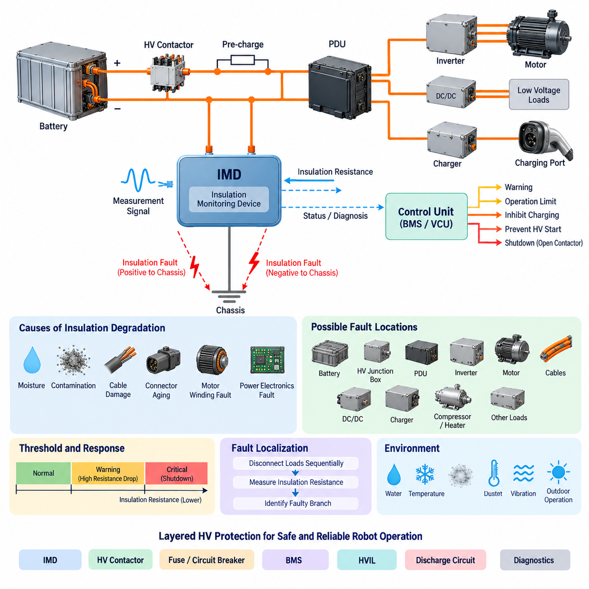
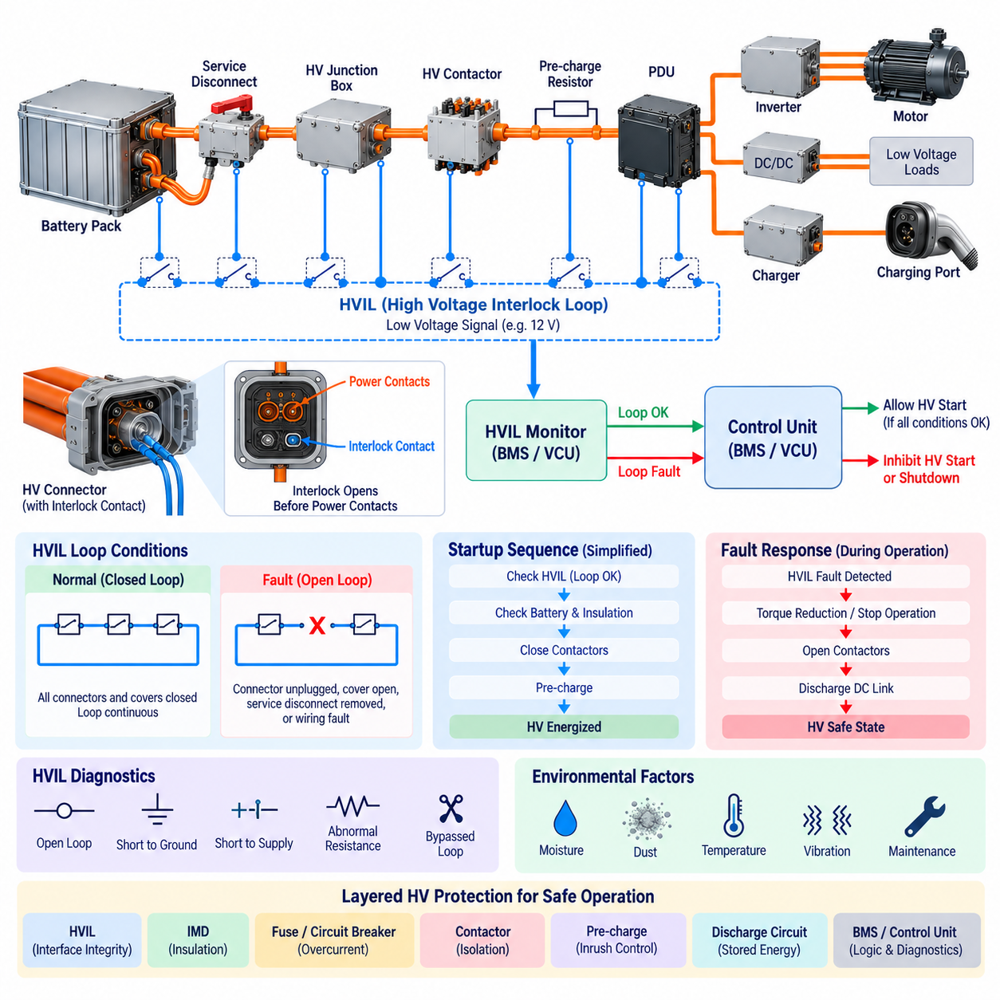
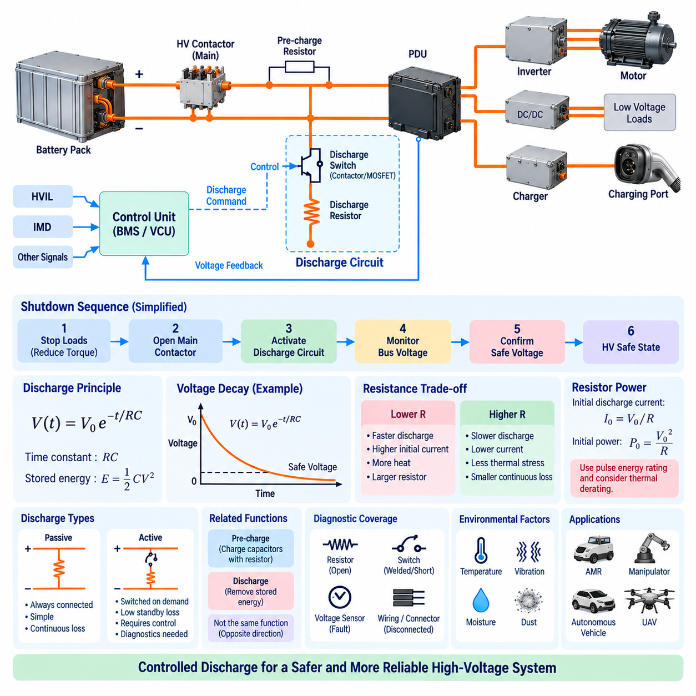
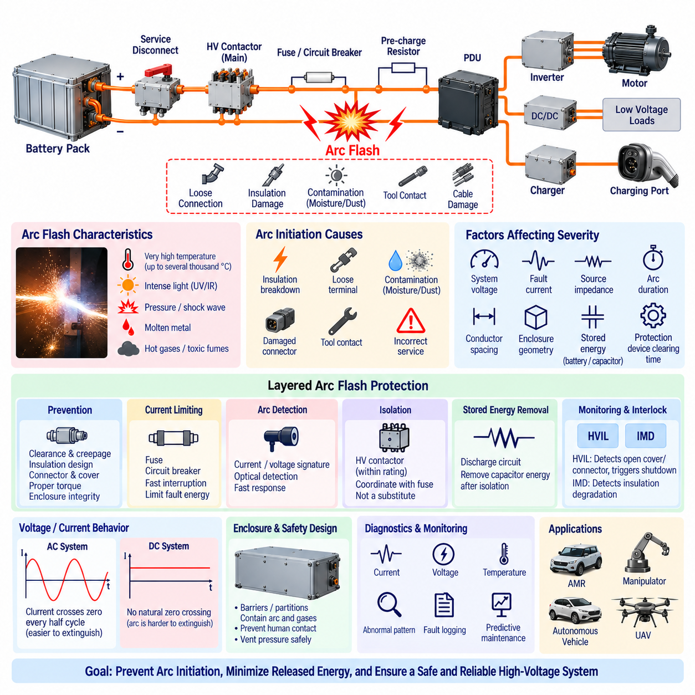
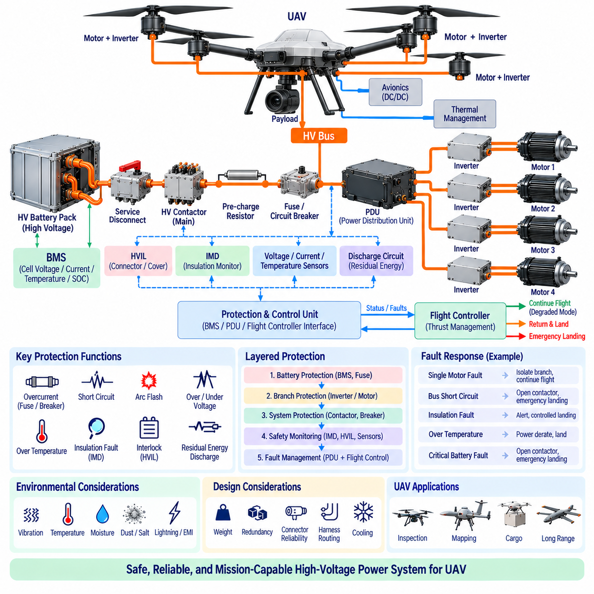

**Volume 04. Fuse, Relay, and Power Distribution Unit**


# Chapter 08. HV Protection

##  

## 08.01. Insulation Monitoring Device (IMD)

{width="7.268055555555556in" height="7.268055555555556in"}

An Insulation Monitoring Device (IMD) is a protective monitoring component used in unearthed or high-resistance-grounded electrical systems to continuously evaluate the insulation condition between energized conductors and the chassis, protective earth, or other accessible conductive structures. In robotic high-voltage architectures, the IMD provides early detection of insulation degradation before a fault develops into hazardous leakage current, electric shock risk, or a secondary short circuit.

Unlike an overcurrent fuse or circuit breaker, an IMD does not primarily detect excessive load current. Instead, it evaluates the effective insulation resistance of the energized power network relative to the conductive structure surrounding it. A healthy isolated electrical system normally exhibits very high resistance to chassis. Contamination, damaged cable insulation, moisture ingress, connector degradation, motor winding defects, or internal power-electronic failures can progressively reduce this resistance.

The fundamental monitoring quantity is insulation resistance, commonly expressed as resistance from the isolated DC bus to chassis or protective earth. In a floating HV system, both the positive and negative conductors are intentionally isolated from the chassis. The IMD supervises this isolation continuously and identifies abnormal resistance reduction on either side of the bus. This makes insulation monitoring particularly important where conventional ground-fault protection cannot reliably detect the first insulation fault.

Practical IMDs typically inject or superimpose a controlled measurement signal between the monitored electrical network and chassis. By observing the resulting electrical response, the device estimates insulation resistance while the system remains energized. The measurement technique must tolerate DC voltage, switching ripple, distributed capacitance, inverter activity, DC/DC converters, motor drives, and electromagnetic noise without interpreting normal operating behavior as an insulation failure.

System capacitance to chassis strongly influences IMD behavior. Long cables, EMI capacitors, motor windings, battery packs, inverter assemblies, and distributed power electronics can create substantial parasitic capacitance. The monitoring algorithm therefore has to distinguish resistive leakage from capacitive current. Excessive network capacitance can increase measurement settling time and complicate fault localization, so IMD selection must consider both nominal system voltage and expected system leakage capacitance.

An insulation fault does not always require immediate removal of power. In an isolated power architecture, a single insulation fault may establish one unintended connection between the energized circuit and chassis without producing a large fault current. Nevertheless, the system has lost an important layer of electrical isolation. A second fault on the opposite potential can then create a dangerous current path through the chassis, making early detection of the first fault a central objective of insulation monitoring.

The IMD should therefore be integrated with the overall HV protection strategy rather than treated as an independent alarm sensor. Its status may be transmitted to a battery management system, vehicle control unit, safety controller, or power distribution controller. Depending on fault severity and operating state, the supervisory controller can generate a warning, restrict operation, inhibit charging, prevent HV startup, request controlled shutdown, or command the main contactors to disconnect the battery from the HV bus.

Threshold definition requires coordination with system voltage, electrical safety requirements, insulation design targets, measurement tolerance, and expected environmental degradation. A single fixed threshold may be insufficient for complex robotic platforms. Designs can use warning and critical thresholds so that gradual insulation deterioration is identified before reaching a shutdown condition. Hysteresis and time qualification are also useful for preventing repeated state transitions caused by noise or temporary environmental effects.

Startup monitoring is especially important because an insulation defect may exist before the HV contactors are closed. A protection architecture can perform insulation verification during initialization and permit energization only when the measured condition satisfies the required criteria. After HV activation, continuous monitoring detects faults that develop during operation. This combination provides protection against both pre-existing insulation failures and dynamic failures caused by vibration, motion, temperature, or component damage.

Fault response should consider whether the detected condition is transient, persistent, localized, or progressively deteriorating. Moisture inside a connector, for example, may gradually reduce insulation resistance, while cable abrasion against a metallic frame may create intermittent faults dependent on vibration. Logging insulation resistance over time therefore provides valuable diagnostic information. Trend analysis can reveal degradation before the resistance reaches a critical protection threshold and supports predictive maintenance.

In battery-powered robots, possible insulation-fault locations include the battery enclosure, HV junction box, PDU, traction inverter, motor cables, DC/DC converter, charger interface, electric compressor, heater, and other high-energy loads. Because these devices share the same isolated bus, a single IMD may observe the combined insulation condition of the entire energized network. Detection therefore indicates that a problem exists, but it does not necessarily identify the exact defective component.

Fault localization can be improved through sectional isolation and diagnostic sequencing. Loads or branches can be disconnected individually while insulation resistance is re-evaluated, allowing the controller or service technician to determine which branch causes the abnormal condition. Smart PDUs and controllable contactors can support this process. However, diagnostic switching must be carefully coordinated so that fault localization does not unintentionally energize unsafe circuits or disrupt required safety functions.

The IMD also interacts with HV contactors, the pre-charge circuit, and the HV Interlock Loop. These mechanisms perform different functions. Contactors provide electrical isolation, pre-charge limits capacitor charging current, HVIL detects interrupted or improperly connected HV interfaces, and the IMD detects deterioration of electrical insulation to chassis. Combining these mechanisms creates layered protection because no single device can detect every hazardous failure mode in a high-voltage robotic system.

Environmental robustness is critical in mobile robots and autonomous vehicles. Water, conductive dust, coolant, salt contamination, condensation, mechanical vibration, connector movement, and cable abrasion can alter insulation characteristics during field operation. Outdoor AMRs and UAVs can experience wider temperature and humidity ranges than indoor industrial equipment. The IMD and its measurement strategy must therefore remain stable under realistic environmental and electromagnetic conditions while maintaining adequate diagnostic coverage.

IMD diagnostics should distinguish device failure from genuine insulation degradation. Internal self-tests, supply monitoring, communication supervision, measurement plausibility checks, and fault-status outputs can help a supervisory controller determine whether insulation information remains trustworthy. A communication failure should not automatically be interpreted as healthy insulation. Safety-oriented architectures normally define a deterministic fallback state when the monitoring function becomes unavailable or its measurement validity cannot be confirmed.

For AMRs, mobile manipulators, heavy autonomous vehicles, and electrically powered UAVs, insulation monitoring becomes increasingly important as battery voltage and stored energy increase. The IMD acts as a continuous observer of the electrical boundary separating hazardous energy from the mechanical structure. When coordinated with contactors, fuses, circuit breakers, BMS functions, HVIL, discharge circuits, and supervisory diagnostics, it forms a fundamental element of layered HV protection and safe power-system operation.

절연 감시 장치(Insulation Monitoring Device, IMD)는 비접지식(unearthed) 또는 고저항 접지식(high-resistance-grounded) 전기 시스템에서 사용되는 보호 감시 장치로, 활선 도체(energized conductor)와 섀시(chassis), 보호 접지(protective earth), 기타 접촉 가능한 도전성 구조물 사이의 절연 상태를 지속적으로 평가한다. 로봇의 고전압(HV) 아키텍처에서는 위험한 누설 전류(leakage current), 감전 위험 또는 2차 단락으로 발전하기 전에 절연 성능 저하를 조기에 검출하는 역할을 한다.

과전류 퓨즈(overcurrent fuse)나 회로 차단기(circuit breaker)와 달리 절연 감시 장치(IMD)는 주로 과도한 부하 전류를 검출하는 장치가 아니다. 대신 전원이 인가된 전력 네트워크와 섀시 사이의 유효 절연 저항(insulation resistance)을 평가한다. 정상적인 절연 전기 시스템에서는 섀시에 대한 저항이 매우 높지만, 오염, 케이블 절연 손상, 수분 침투, 커넥터 열화, 모터 권선 결함 또는 전력전자 장치 내부 고장으로 인해 이 저항이 점진적으로 감소할 수 있다.

기본적인 감시 대상은 절연 저항(insulation resistance)이며, 일반적으로 절연된 직류 버스(DC bus)에서 섀시 또는 보호 접지까지의 저항으로 표현된다. 부유형 고전압 시스템(floating HV system)에서는 양극과 음극 도체 모두 섀시로부터 의도적으로 절연된다. 절연 감시 장치(IMD)는 이러한 절연 상태를 지속적으로 감시하고 버스의 양극 또는 음극 측에서 발생하는 비정상적인 저항 감소를 검출한다. 따라서 일반적인 지락 보호(ground-fault protection)로 첫 번째 절연 고장을 안정적으로 검출하기 어려운 시스템에서 특히 중요하다.

실제 절연 감시 장치(IMD)는 일반적으로 감시 대상 전기 네트워크와 섀시 사이에 제어된 측정 신호(measurement signal)를 주입하거나 중첩한다. 장치는 이에 따른 전기적 응답을 관찰하여 시스템에 전원이 공급되는 상태에서도 절연 저항을 추정한다. 측정 방식은 직류 전압, 스위칭 리플(switching ripple), 분포 정전용량(distributed capacitance), 인버터 동작, DC/DC 컨버터, 모터 드라이브 및 전자기 잡음(EM noise)을 정상 동작이 절연 고장으로 잘못 판단되지 않도록 처리할 수 있어야 한다.

섀시에 대한 시스템 정전용량(system capacitance)은 절연 감시 장치(IMD)의 동작에 큰 영향을 준다. 긴 케이블, EMI 커패시터, 모터 권선, 배터리 팩, 인버터 어셈블리 및 분산 전력전자 장치는 상당한 기생 정전용량(parasitic capacitance)을 형성할 수 있다. 따라서 감시 알고리즘은 저항성 누설(resistive leakage)과 용량성 전류(capacitive current)를 구분해야 한다. 과도한 네트워크 정전용량은 측정 안정화 시간을 증가시키고 고장 위치 확인을 어렵게 하므로, IMD 선정 시 정격 시스템 전압과 예상 시스템 누설 정전용량을 함께 고려해야 한다.

절연 고장(insulation fault)이 발생했다고 해서 항상 즉시 전원을 차단해야 하는 것은 아니다. 절연 전력 아키텍처(isolated power architecture)에서는 첫 번째 절연 고장이 활선 회로와 섀시 사이에 의도하지 않은 하나의 연결을 형성하더라도 큰 고장 전류가 발생하지 않을 수 있다. 그러나 시스템은 중요한 전기적 절연 계층을 상실한 상태가 된다. 이후 반대 전위 측에서 두 번째 고장이 발생하면 섀시를 통한 위험한 전류 경로가 형성될 수 있으므로, 첫 번째 고장을 조기에 검출하는 것이 절연 감시의 핵심 목적이다.

따라서 절연 감시 장치(IMD)는 독립적인 경보 센서가 아니라 전체 고전압 보호 전략(HV protection strategy)과 통합되어야 한다. IMD 상태는 배터리 관리 시스템(Battery Management System, BMS), 차량 제어 장치(Vehicle Control Unit, VCU), 안전 제어기(safety controller) 또는 전력 분배 제어기(power distribution controller)로 전달될 수 있다. 고장 심각도와 운전 상태에 따라 경고 발생, 운전 제한, 충전 금지, HV 기동 방지, 제어된 정지 요청 또는 메인 접촉기(main contactor)를 통한 배터리와 HV 버스 분리 등의 조치를 수행할 수 있다.

임계값(threshold)은 시스템 전압, 전기 안전 요구사항, 절연 설계 목표, 측정 허용오차 및 예상되는 환경적 열화를 함께 고려하여 설정해야 한다. 복잡한 로봇 플랫폼에서는 하나의 고정 임계값만으로 충분하지 않을 수 있다. 경고 임계값(warning threshold)과 위험 임계값(critical threshold)을 구분하면 절연 상태가 정지 조건에 도달하기 전에 점진적인 열화를 식별할 수 있다. 또한 히스테리시스(hysteresis)와 시간 검증(time qualification)을 적용하면 잡음이나 일시적인 환경 변화로 인한 반복적인 상태 전환을 방지할 수 있다.

기동 시 감시(startup monitoring)는 HV 접촉기(HV contactor)가 닫히기 전에 이미 절연 결함이 존재할 수 있기 때문에 특히 중요하다. 보호 아키텍처는 초기화 과정에서 절연 상태를 검증하고 측정 결과가 요구 조건을 충족하는 경우에만 고전압 활성화를 허용할 수 있다. HV 활성화 이후에는 연속 감시를 통해 운전 중 발생하는 고장을 검출한다. 이를 통해 기존에 존재하던 절연 결함뿐 아니라 진동, 움직임, 온도 또는 부품 손상으로 인해 동적으로 발생하는 고장도 보호할 수 있다.

고장 대응(fault response)에서는 검출된 상태가 일시적인지, 지속적인지, 특정 위치에 국한되는지 또는 점진적으로 악화되는지를 고려해야 한다. 예를 들어 커넥터 내부의 수분은 절연 저항을 서서히 감소시킬 수 있으며, 금속 프레임과 마찰하는 케이블은 진동 조건에 따라 간헐적인 고장을 발생시킬 수 있다. 따라서 시간에 따른 절연 저항 기록은 중요한 진단 정보를 제공한다. 추세 분석(trend analysis)을 통해 임계 보호 저항에 도달하기 전에 열화를 식별할 수 있으며 예지 정비(predictive maintenance)에도 활용할 수 있다.

배터리 구동 로봇에서 가능한 절연 고장 위치에는 배터리 인클로저(battery enclosure), 고전압 정션 박스(HV junction box), 전력 분배 장치(Power Distribution Unit, PDU), 구동 인버터(traction inverter), 모터 케이블, DC/DC 컨버터, 충전 인터페이스(charger interface), 전기식 컴프레서 및 히터 등의 고에너지 부하가 포함된다. 이러한 장치가 동일한 절연 버스를 공유하면 하나의 IMD가 전체 활성 네트워크의 종합적인 절연 상태를 감시할 수 있다. 따라서 고장을 검출할 수는 있지만 반드시 정확한 고장 부품까지 직접 식별하는 것은 아니다.

고장 위치 확인(fault localization)은 구간별 절연(sectional isolation)과 진단 시퀀싱(diagnostic sequencing)을 통해 향상할 수 있다. 각각의 부하 또는 분기 회로를 개별적으로 분리한 후 절연 저항을 다시 측정하면 제어기나 서비스 기술자가 비정상 상태를 발생시키는 분기를 식별할 수 있다. 스마트 전력 분배 장치(Smart PDU)와 제어 가능한 접촉기(contactor)는 이러한 과정을 지원할 수 있다. 다만 진단 스위칭으로 인해 안전하지 않은 회로가 의도치 않게 활성화되거나 필요한 안전 기능이 중단되지 않도록 신중하게 조정해야 한다.

절연 감시 장치(IMD)는 HV 접촉기(HV contactor), 프리차지 회로(pre-charge circuit), 고전압 인터록 루프(High Voltage Interlock Loop, HVIL)와도 상호 연계된다. 각각의 장치는 서로 다른 기능을 수행한다. 접촉기는 전기적 분리를 제공하고, 프리차지는 커패시터 충전 전류를 제한하며, HVIL은 HV 인터페이스의 단선 또는 부적절한 연결을 검출하고, IMD는 섀시에 대한 전기적 절연 성능 저하를 검출한다. 이러한 보호 수단을 결합하면 하나의 장치로 모든 위험 고장 모드를 검출할 수 없는 한계를 보완하는 계층형 보호(layered protection)를 구성할 수 있다.

환경적 강건성(environmental robustness)은 이동 로봇과 자율주행 차량에서 매우 중요하다. 물, 전도성 먼지, 냉각수, 염분 오염, 결로, 기계적 진동, 커넥터 움직임 및 케이블 마찰은 실제 운전 중 절연 특성을 변화시킬 수 있다. 실외 자율이동로봇(Outdoor AMR)과 무인항공기(UAV)는 실내 산업 장비보다 더 넓은 온도 및 습도 범위를 경험할 수 있다. 따라서 IMD와 측정 전략은 실제 환경 및 전자기 조건에서도 안정적으로 동작하면서 충분한 진단 범위를 유지해야 한다.

IMD 진단 기능은 장치 자체의 고장과 실제 절연 열화를 구분할 수 있어야 한다. 내부 자가진단(self-test), 전원 감시(supply monitoring), 통신 감시(communication supervision), 측정 타당성 검사(measurement plausibility check), 고장 상태 출력 등을 이용하면 상위 제어기가 절연 정보의 신뢰성을 판단할 수 있다. 통신 장애가 발생했다고 해서 절연 상태가 정상이라고 판단해서는 안 된다. 안전 중심 아키텍처에서는 감시 기능을 사용할 수 없거나 측정값의 유효성을 확인할 수 없는 경우를 위한 결정론적 안전 상태(deterministic fallback state)를 정의한다.

자율이동로봇(AMR), 이동형 매니퓰레이터(mobile manipulator), 대형 자율주행 차량(heavy autonomous vehicle), 전동 무인항공기(electrically powered UAV)에서는 배터리 전압과 저장 에너지가 증가할수록 절연 감시의 중요성이 더욱 커진다. IMD는 위험 에너지와 기계 구조물을 분리하는 전기적 경계를 지속적으로 감시하는 역할을 한다. 접촉기, 퓨즈, 회로 차단기, BMS 기능, HVIL, 방전 회로(discharge circuit), 상위 진단 기능과 연계하면 계층형 HV 보호(layered HV protection)와 안전한 전력 시스템 운용을 구성하는 핵심 요소가 된다.

##  

## 08.02. HV Interlock Loop (HVIL)

{width="7.268055555555556in" height="7.268055555555556in"}

A High Voltage Interlock Loop (HVIL) is a low-voltage supervisory circuit used to verify that high-voltage connectors, covers, service disconnects, and other accessible interfaces remain correctly installed and mechanically secured. In robotic high-voltage systems, the HVIL provides an independent indication that the physical containment of hazardous electrical energy has not been compromised before or during operation.

The fundamental concept of HVIL is to route a dedicated low-energy electrical loop through selected high-voltage components and interfaces. When every monitored connector and enclosure is properly assembled, the loop remains electrically continuous and the supervisory controller recognizes a valid condition. If a connector is unplugged, a cover is opened, a service disconnect is removed, or the interlock wiring is damaged, continuity changes and an HVIL fault is detected.

HVIL is different from insulation monitoring, overcurrent protection, and voltage monitoring because it primarily supervises the physical integrity of the HV connection path rather than the electrical quality of the power circuit itself. An insulation monitoring device detects degraded isolation to chassis, while a fuse detects excessive current. The HVIL instead determines whether components intended to contain or connect hazardous voltage remain correctly engaged.

A typical HVIL architecture contains a low-voltage signal source, interlock wiring, interlock contacts integrated into HV connectors or covers, and a monitoring input in the Battery Management System (BMS), Vehicle Control Unit (VCU), or dedicated safety controller. These elements form a continuous series loop. Because multiple devices can be connected in series, one monitoring channel can supervise several HV interfaces distributed throughout the robot.

High-voltage connectors commonly use dedicated interlock contacts that are mechanically coordinated with the main power contacts. Their geometry can be designed so that the HVIL state changes before the high-current terminals become accessible during disconnection. During connection, the main terminals can be mechanically engaged before the interlock circuit confirms complete connector seating. This sequencing supports controlled energization and de-energization of the HV system.

The concept is often described through first-mate-last-break or last-mate-first-break contact behavior, depending on the connector architecture and reference convention. The essential engineering objective is that the supervisory system receives sufficient indication of connector movement before hazardous exposure occurs. Contact sequencing must therefore be evaluated together with contactor opening time, stored electrical energy, discharge behavior, and connector separation mechanics.

When the HVIL loop is healthy, the supervisory controller may permit the HV system to proceed through its normal startup sequence. This can include checking battery conditions, insulation status, contactor diagnostics, pre-charge operation, and DC bus voltage before closing the main contactors. HVIL validity is therefore generally one prerequisite for HV activation rather than the sole condition determining whether the power system can be energized.

If an HVIL fault is detected before startup, the controller should normally inhibit HV activation and prevent the main contactors from closing. This prevents hazardous voltage from being intentionally applied to a system whose connector or enclosure integrity cannot be confirmed. Diagnostic information can identify the HVIL as the reason for the startup inhibition and support service personnel in locating an improperly connected component.

An HVIL interruption during operation requires a carefully defined response strategy. The system can immediately request torque removal or load reduction, stop high-power operation, open the main contactors, and initiate controlled discharge of the DC link. The exact sequence depends on system architecture and safety requirements because uncontrolled removal of propulsion or actuator power can itself create mechanical hazards in mobile robots, manipulators, or autonomous vehicles.

The response time must consider the complete energy-removal chain rather than only HVIL detection latency. After an interlock fault is detected, software processing, communication, contactor actuation, inverter shutdown, and capacitor discharge all require finite time. Consequently, the safety analysis should determine how quickly accessible conductors can become exposed and ensure that hazardous voltage is reduced appropriately before physical access becomes possible.

Stored energy is particularly important because opening the battery contactors does not immediately guarantee that every downstream conductor is safe. Inverters, DC/DC converters, motor drives, filters, and other power-electronic devices can contain large DC-link capacitors. A discharge circuit is therefore commonly coordinated with HVIL operation so that residual bus voltage falls to an acceptable level after the primary energy source has been disconnected.

The HVIL circuit itself must also be diagnosed because simple continuity monitoring can confuse a genuine connector opening with wiring faults or electrical shorts. More sophisticated implementations can supervise expected voltage or resistance ranges rather than using only binary open-versus-closed detection. This enables the controller to identify conditions such as an open loop, short to ground, short to supply, abnormal loop resistance, or potentially bypassed interlock circuitry.

Series-connected HVIL loops provide architectural simplicity but can make fault localization difficult. If several connectors, access covers, and service disconnects share one loop, an interruption indicates that at least one monitored interface is invalid without necessarily identifying which one. Systems requiring better service diagnostics can divide the HVIL into multiple monitored zones or combine loop monitoring with component-specific status information.

HVIL wiring should be routed and protected with the same attention given to other safety-related signals. Connector vibration, harness abrasion, water ingress, corrosion, contamination, poor terminal retention, and repeated maintenance cycles can cause intermittent continuity changes. In mobile robots, these transient faults may appear only during acceleration, steering, vibration, or chassis deformation, making event logging and timestamped diagnostic information valuable for root-cause analysis.

The HVIL should not be used as a substitute for a dedicated emergency-stop circuit, functional safety controller, or electrical isolation system. An emergency stop addresses hazardous machine behavior, while HVIL supervises selected physical interfaces in the high-voltage system. Similarly, HVIL does not measure insulation resistance or directly determine whether residual voltage remains present. These functions must be provided by coordinated protection mechanisms.

Integration with the main contactors creates an important protection relationship. The HVIL reports whether the monitored HV interfaces are intact, while the contactors physically connect or disconnect the battery from the HV bus. A valid HVIL can be included among the permissive conditions for contactor closure, whereas an invalid HVIL can generate an opening request. Contactor feedback should then confirm whether the commanded isolation actually occurred.

The pre-charge circuit must also be coordinated with HVIL status. During startup, an invalid interlock should normally prevent initiation or completion of pre-charge because charging downstream DC-link capacitors would establish hazardous voltage in a system with uncertain physical integrity. If the interlock opens during pre-charge, the sequence should be aborted and the accumulated energy safely discharged before another startup attempt is permitted.

In robotic platforms, HVIL monitoring can cover the battery pack, HV junction box, PDU, traction inverter, motor controller, DC/DC converter, charger, service disconnect, and removable high-voltage modules. The exact coverage depends on where human access, maintenance operations, removable connectors, and hazardous voltage exposure can occur. Interfaces that can be opened during service deserve particular attention because maintenance activity creates foreseeable opportunities for accidental HV exposure.

Outdoor AMRs, heavy autonomous vehicles, mobile manipulators, and high-power UAVs introduce additional requirements because vibration, shock, moisture, dust, thermal cycling, and frequent connector servicing can affect interlock reliability. Mechanical connector retention and electrical HVIL diagnostics should therefore be considered together. A robust design must avoid nuisance shutdowns while still detecting genuine loss of connector engagement before the condition develops into an electrical safety hazard.

HVIL becomes most effective when incorporated into a layered high-voltage protection architecture. The HVIL supervises physical connection integrity, the insulation monitoring device supervises isolation to chassis, fuses and circuit breakers protect against excessive current, contactors provide controlled electrical separation, pre-charge manages inrush current, and discharge circuits remove stored energy. The BMS or supervisory controller coordinates these functions into a consistent HV state machine.

For high-energy robotic systems, the HVIL should ultimately be regarded as part of the transition logic between safe, de-energized, pre-charge, energized, fault, and discharge states. Its value is not merely detecting an unplugged connector but ensuring that mechanical access to the HV network is linked to electrical energy control. Properly coordinated with diagnostics and power switching, HVIL provides a fundamental layer of protection against unintended exposure to hazardous voltage.

고전압 인터록 루프(High Voltage Interlock Loop, HVIL)는 고전압 커넥터(HV connector), 커버(cover), 서비스 차단 장치(service disconnect) 및 기타 접근 가능한 인터페이스가 올바르게 설치되고 기계적으로 안전하게 체결되어 있는지를 확인하기 위한 저전압 감시 회로(low-voltage supervisory circuit)이다. 로봇 고전압 시스템에서 HVIL은 위험한 전기 에너지를 물리적으로 차폐하는 구조가 운전 전이나 운전 중에 손상되지 않았음을 독립적으로 확인하는 기능을 제공한다.

HVIL의 기본 개념은 선택된 고전압 부품과 인터페이스를 통과하도록 전용 저에너지 전기 루프(low-energy electrical loop)를 구성하는 것이다. 감시 대상인 모든 커넥터와 인클로저(enclosure)가 올바르게 조립되어 있으면 루프의 전기적 연속성(electrical continuity)이 유지되고 상위 제어기는 이를 정상 상태로 인식한다. 커넥터가 분리되거나, 커버가 열리거나, 서비스 차단 장치가 제거되거나, 인터록 배선이 손상되면 연속성 상태가 변화하여 HVIL 고장이 검출된다.

HVIL은 전력 회로 자체의 전기적 품질보다 고전압 연결 경로의 물리적 건전성(physical integrity)을 주로 감시한다는 점에서 절연 감시(insulation monitoring), 과전류 보호(overcurrent protection), 전압 감시(voltage monitoring)와 다르다. 절연 감시 장치(Insulation Monitoring Device, IMD)는 섀시에 대한 절연 성능 저하를 검출하고 퓨즈(fuse)는 과도한 전류를 검출한다. 반면 HVIL은 위험 전압을 차폐하거나 연결하도록 설계된 부품들이 올바르게 체결되어 있는지를 판단한다.

일반적인 HVIL 아키텍처는 저전압 신호원(low-voltage signal source), 인터록 배선(interlock wiring), HV 커넥터 또는 커버에 통합된 인터록 접점(interlock contact), 그리고 배터리 관리 시스템(Battery Management System, BMS), 차량 제어 장치(Vehicle Control Unit, VCU) 또는 전용 안전 제어기(dedicated safety controller)의 감시 입력으로 구성된다. 이러한 요소들은 하나의 연속적인 직렬 루프(series loop)를 형성한다. 여러 장치를 직렬로 연결할 수 있기 때문에 하나의 감시 채널로 로봇 전체에 분산된 여러 HV 인터페이스를 감시할 수 있다.

고전압 커넥터에는 일반적으로 주 전력 접점(main power contact)과 기계적으로 연동되는 전용 인터록 접점이 사용된다. 커넥터를 분리할 때 고전류 단자(high-current terminal)가 접근 가능한 상태가 되기 전에 HVIL 상태가 먼저 변경되도록 접점 형상을 설계할 수 있다. 반대로 연결 과정에서는 인터록 회로가 완전한 커넥터 체결을 확인하기 전에 주 단자가 기계적으로 먼저 결합되도록 구성할 수 있다. 이러한 순차 동작은 HV 시스템의 제어된 전원 인가 및 차단을 지원한다.

이러한 개념은 커넥터 아키텍처와 기준 정의에 따라 선접속-후차단(first-mate-last-break) 또는 후접속-선차단(last-mate-first-break) 접점 동작으로 설명되기도 한다. 핵심적인 엔지니어링 목표는 위험한 전압 노출이 발생하기 전에 상위 감시 시스템이 커넥터 움직임을 충분히 인식하도록 하는 것이다. 따라서 접점 동작 순서는 접촉기 개방 시간(contactor opening time), 저장 전기 에너지(stored electrical energy), 방전 동작(discharge behavior), 커넥터 분리 메커니즘과 함께 평가해야 한다.

HVIL 루프가 정상 상태이면 상위 제어기는 HV 시스템이 정상적인 기동 시퀀스(startup sequence)를 진행하도록 허용할 수 있다. 여기에는 메인 접촉기(main contactor)를 닫기 전에 배터리 상태, 절연 상태, 접촉기 진단, 프리차지(pre-charge) 동작 및 직류 버스 전압(DC bus voltage)을 확인하는 과정이 포함될 수 있다. 따라서 HVIL 정상 상태는 일반적으로 전력 시스템의 활성화를 결정하는 유일한 조건이 아니라 HV 활성화를 위한 여러 선행 조건 중 하나이다.

기동 전에 HVIL 고장이 검출되면 제어기는 일반적으로 HV 활성화를 금지하고 메인 접촉기가 닫히지 않도록 해야 한다. 이를 통해 커넥터 또는 인클로저의 건전성을 확인할 수 없는 시스템에 위험한 전압이 의도적으로 인가되는 것을 방지한다. 진단 정보(diagnostic information)를 통해 HVIL이 기동 금지의 원인임을 식별하고 서비스 작업자가 잘못 연결된 부품을 찾을 수 있도록 지원할 수 있다.

운전 중 HVIL이 단선되거나 비정상 상태가 되면 신중하게 정의된 대응 전략(response strategy)이 필요하다. 시스템은 즉시 토크 제거(torque removal) 또는 부하 감소를 요청하고, 고출력 운전을 중단하며, 메인 접촉기를 개방하고, 직류 링크(DC link)의 제어된 방전을 시작할 수 있다. 정확한 순서는 시스템 아키텍처와 안전 요구사항에 따라 결정되는데, 이동 로봇, 매니퓰레이터 또는 자율주행 차량에서 추진력이나 액추에이터 전력을 제어되지 않은 방식으로 제거하는 것 자체가 기계적 위험을 발생시킬 수 있기 때문이다.

응답 시간(response time)은 HVIL 검출 지연 시간만이 아니라 전체 에너지 제거 체인(energy-removal chain)을 고려해야 한다. 인터록 고장이 검출된 이후에도 소프트웨어 처리, 통신, 접촉기 작동, 인버터 정지 및 커패시터 방전에는 각각 일정한 시간이 필요하다. 따라서 안전 분석에서는 접근 가능한 도체가 얼마나 빠르게 노출될 수 있는지를 판단하고, 물리적 접근이 가능해지기 전에 위험 전압이 적절한 수준까지 감소하도록 설계해야 한다.

저장 에너지(stored energy)는 배터리 접촉기를 개방하더라도 모든 하류 도체가 즉시 안전해지는 것은 아니기 때문에 특히 중요하다. 인버터, DC/DC 컨버터, 모터 드라이브, 필터 및 기타 전력전자 장치는 대용량 직류 링크 커패시터(DC-link capacitor)를 포함할 수 있다. 따라서 주 에너지원이 차단된 이후 잔류 버스 전압(residual bus voltage)이 허용 가능한 수준까지 감소하도록 방전 회로(discharge circuit)를 HVIL 동작과 연계하는 것이 일반적이다.

HVIL 회로 자체에 대한 진단도 필요하다. 단순한 연속성 감시만으로는 실제 커넥터 분리와 배선 고장 또는 전기적 단락을 구분하기 어렵기 때문이다. 보다 정교한 구현에서는 단순한 개방 또는 폐쇄의 이진 검출(binary detection) 대신 예상 전압 또는 저항 범위를 감시할 수 있다. 이를 통해 루프 단선(open loop), 접지 단락(short to ground), 전원 단락(short to supply), 비정상 루프 저항(abnormal loop resistance), 또는 인터록 회로가 우회된 상태를 식별할 수 있다.

직렬 연결된 HVIL 루프는 아키텍처를 단순화할 수 있지만 고장 위치 확인(fault localization)을 어렵게 만들 수 있다. 여러 커넥터, 접근 커버 및 서비스 차단 장치가 하나의 루프를 공유하는 경우, 루프 단선은 감시 대상 인터페이스 중 적어도 하나가 비정상임을 의미하지만 정확히 어느 위치에서 문제가 발생했는지는 알려주지 못한다. 더 높은 수준의 정비 진단성이 필요한 시스템에서는 HVIL을 여러 감시 구역(monitored zone)으로 분할하거나 루프 감시와 부품별 상태 정보를 결합할 수 있다.

HVIL 배선은 다른 안전 관련 신호(safety-related signal)와 동일한 수준의 주의를 기울여 배치하고 보호해야 한다. 커넥터 진동, 하네스 마모, 수분 침투, 부식, 오염, 불충분한 단자 유지력 및 반복적인 정비 작업으로 인해 간헐적인 연속성 변화가 발생할 수 있다. 이동 로봇에서는 이러한 일시적 고장이 가속, 조향, 진동 또는 섀시 변형 중에만 나타날 수 있으므로 이벤트 기록(event logging)과 시간 정보가 포함된 진단 데이터(timestamped diagnostic information)가 근본 원인 분석에 유용하다.

HVIL을 전용 비상 정지 회로(emergency-stop circuit), 기능 안전 제어기(functional safety controller) 또는 전기적 절연 시스템(electrical isolation system)의 대체 수단으로 사용해서는 안 된다. 비상 정지는 위험한 기계 동작을 제어하는 반면 HVIL은 고전압 시스템에서 선택된 물리적 인터페이스를 감시한다. 또한 HVIL은 절연 저항을 측정하거나 잔류 전압이 실제로 존재하는지를 직접 판단하지 않는다. 이러한 기능은 서로 연계된 별도의 보호 메커니즘을 통해 제공되어야 한다.

메인 접촉기와의 통합은 중요한 보호 관계를 형성한다. HVIL은 감시 대상 HV 인터페이스가 정상적으로 유지되고 있는지를 알려주고, 접촉기는 배터리를 HV 버스에 물리적으로 연결하거나 분리한다. 정상적인 HVIL 상태는 접촉기 폐쇄 허용 조건(permissive condition) 중 하나로 사용할 수 있으며, 비정상 HVIL 상태에서는 접촉기 개방 요청을 발생시킬 수 있다. 이후 접촉기 피드백(contactor feedback)을 이용하여 명령된 전기적 분리가 실제로 수행되었는지를 확인해야 한다.

프리차지 회로(pre-charge circuit) 역시 HVIL 상태와 연계되어야 한다. 기동 과정에서 인터록 상태가 비정상이면 일반적으로 프리차지의 시작 또는 완료를 금지해야 한다. 물리적 건전성을 확인할 수 없는 시스템에서 하류 직류 링크 커패시터를 충전하면 위험한 전압이 형성되기 때문이다. 프리차지 과정에서 인터록이 개방되면 해당 시퀀스를 중단하고 축적된 에너지를 안전하게 방전한 이후에만 다시 기동을 시도하도록 해야 한다.

로봇 플랫폼에서 HVIL 감시 범위에는 배터리 팩(battery pack), 고전압 정션 박스(HV junction box), 전력 분배 장치(Power Distribution Unit, PDU), 구동 인버터(traction inverter), 모터 제어기(motor controller), DC/DC 컨버터, 충전기(charger), 서비스 차단 장치(service disconnect) 및 탈착 가능한 고전압 모듈(removable HV module)이 포함될 수 있다. 정확한 감시 범위는 사람의 접근, 정비 작업, 탈착 가능한 커넥터 및 위험 전압 노출이 발생할 수 있는 위치를 기준으로 결정해야 한다. 특히 정비 중 개방될 수 있는 인터페이스는 우발적인 HV 노출 가능성이 있으므로 특별한 주의가 필요하다.

실외 자율이동로봇(Outdoor AMR), 대형 자율주행 차량(heavy autonomous vehicle), 이동형 매니퓰레이터(mobile manipulator), 고출력 무인항공기(high-power UAV)는 진동, 충격, 수분, 먼지, 열 사이클(thermal cycling), 빈번한 커넥터 정비가 인터록 신뢰성에 영향을 줄 수 있으므로 추가적인 요구사항이 발생한다. 따라서 기계적 커넥터 유지력(mechanical connector retention)과 전기적 HVIL 진단을 함께 고려해야 한다. 강건한 설계는 실제 커넥터 체결 손실을 전기 안전 위험으로 발전하기 전에 검출하면서도 불필요한 정지(nuisance shutdown)를 최소화해야 한다.

HVIL은 계층형 고전압 보호 아키텍처(layered high-voltage protection architecture)에 통합될 때 가장 효과적으로 작동한다. HVIL은 물리적 연결 건전성을 감시하고, 절연 감시 장치(IMD)는 섀시에 대한 절연 상태를 감시하며, 퓨즈와 회로 차단기는 과도한 전류로부터 시스템을 보호한다. 접촉기는 제어된 전기적 분리를 제공하고, 프리차지는 돌입 전류(inrush current)를 관리하며, 방전 회로는 저장 에너지를 제거한다. BMS 또는 상위 제어기는 이러한 기능을 일관된 HV 상태 머신(HV state machine)으로 통합하고 조정한다.

고에너지 로봇 시스템에서 HVIL은 궁극적으로 안전한 무전압 상태(safe de-energized state), 프리차지 상태(pre-charge state), 활성 상태(energized state), 고장 상태(fault state), 방전 상태(discharge state) 사이의 전환 로직(transition logic)을 구성하는 요소로 이해해야 한다. HVIL의 가치는 단순히 커넥터 분리를 검출하는 데 있는 것이 아니라 HV 네트워크에 대한 기계적 접근과 전기 에너지 제어를 연계하는 데 있다. 진단 및 전력 스위칭 기능과 적절하게 조정된 HVIL은 위험 전압에 대한 의도하지 않은 노출을 방지하는 핵심적인 보호 계층을 제공한다.

##  

## 08.03. Discharge Circuit Design

{width="7.268055555555556in" height="7.268055555555556in"}

A discharge circuit is a protective function used to remove electrical energy stored in high-voltage DC buses and power-electronic capacitors after the primary power source has been disconnected. In robotic HV architectures, opening the battery contactors does not immediately make every downstream conductor safe because inverter, converter, and filter capacitors may remain charged. The discharge circuit reduces this residual voltage in a controlled and predictable manner.

The principal energy source requiring discharge is usually the DC-link capacitance distributed across traction inverters, motor drives, DC/DC converters, chargers, and other high-power electronic modules. The energy stored in a capacitor follows E = 1/2 CV², meaning that stored energy increases with capacitance and with the square of voltage. Consequently, even moderate capacitance can retain significant hazardous energy when the HV bus operates at several hundred volts.

The simplest discharge architecture places a resistor across the HV DC bus so that stored capacitor energy is converted into heat after power removal. If resistance R is connected across capacitance C, the ideal voltage decay follows an exponential relationship, V(t) = V₀e\^(-t/RC). The product RC is the electrical time constant, and it provides the fundamental relationship between discharge resistance, system capacitance, initial voltage, and the time required to reach a safe voltage.

A lower discharge resistance produces faster voltage reduction but creates higher initial current and greater resistor power dissipation. A higher resistance reduces current and thermal stress but extends the time during which hazardous voltage remains present. Discharge circuit design therefore requires a compromise between safe-voltage timing requirements, resistor size, peak power, energy capability, thermal limits, packaging, reliability, and the electrical loading permitted during normal operation.

Passive discharge uses a resistor that remains permanently connected across the DC bus. This architecture is simple and inherently available without requiring a control command, but it continuously consumes power whenever the HV bus is energized. The resulting losses may be undesirable in battery-powered robots. The resistor must also tolerate continuous voltage and thermal loading, making passive discharge less attractive when high efficiency or long operating duration is important.

Active discharge connects the discharge resistor only when energy removal is required. A relay, contactor, MOSFET, IGBT, or other switching element can establish the discharge path after the main HV source has been isolated. Because the resistor is disconnected during normal operation, continuous power loss can be greatly reduced. However, active discharge introduces additional switching, control, diagnostics, and failure modes that must be considered in the protection architecture.

The discharge resistor is selected from both resistance and energy requirements. Its resistance determines the initial discharge current according to I₀ = V₀/R and strongly influences the decay time. At the instant discharge begins, resistor power is approximately P₀ = V₀²/R, which can be much higher than its normal continuous power rating. Therefore, pulse-energy capability, transient thermal impedance, operating temperature, and repetitive discharge duty are often more important than the continuous wattage value alone.

For example, a system with a large DC-link capacitance can produce a short but intense thermal pulse each time the HV system shuts down. Repeated startup and shutdown cycles may prevent the discharge resistor from cooling completely between events. Thermal accumulation must therefore be evaluated using the expected duty cycle rather than assuming each discharge begins at ambient temperature. Enclosure temperature and cooling conditions should also be included in resistor derating.

The discharge switching device must be rated for the maximum bus voltage, discharge current, transient conditions, and expected switching life. In an active design, the switch is normally commanded only after the main contactors have opened or the energy source has otherwise been isolated. Incorrect sequencing can connect the discharge resistor directly across an energized battery, potentially producing excessive continuous current and severe thermal stress or damaging the discharge components.

Coordination between the main contactors and discharge circuit is therefore fundamental. During normal HV operation, the discharge path should remain inactive unless the architecture intentionally uses permanent passive discharge. When shutdown begins, torque-producing loads are first brought to an appropriate state, the main energy source is disconnected, and the discharge path is activated. The controller then monitors bus voltage until the electrical system reaches the defined safe state.

Voltage feedback provides confirmation that discharge has actually occurred. A voltage sensing circuit can measure the HV bus after the contactors open and verify that voltage decreases according to the expected profile. If the voltage remains unexpectedly high, the controller can identify a discharge failure. Conversely, an unusually rapid or abnormal voltage collapse may indicate an unexpected load, short circuit, measurement problem, or another condition requiring diagnostic investigation.

Discharge timing should be based on measured voltage rather than relying exclusively on a fixed delay. Component tolerances, temperature, bus capacitance, connected loads, and aging can change the actual decay rate. A timer can provide supervision, but voltage feedback confirms the physical result. A robust state machine can therefore require both sufficient elapsed time and measured bus voltage below the defined threshold before declaring the HV network safe.

The discharge function is closely related to the High Voltage Interlock Loop (HVIL). If an HV connector is unplugged, an access cover is opened, or a service disconnect changes state, the HVIL can request removal of high-voltage energy. Opening the main contactors isolates the battery, while the discharge circuit removes energy remaining in downstream capacitors. This coordination reduces the possibility that accessible HV terminals remain energized after physical containment has been compromised.

Insulation monitoring provides another complementary function. The Insulation Monitoring Device (IMD) evaluates isolation between the energized HV network and chassis, whereas the discharge circuit removes stored energy after shutdown. An insulation fault may initiate a controlled HV shutdown, after which the contactors isolate the source and the discharge circuit lowers residual voltage. These functions therefore operate as different layers within the same HV protection architecture.

The discharge circuit must also be distinguished from the pre-charge circuit. Both commonly use resistive components, but their energy-flow directions and purposes differ. Pre-charge limits inrush current while charging downstream DC-link capacitors before the main contactors fully connect the battery. Discharge performs the opposite transition by removing energy from those capacitors after isolation. Some architectures may share components, but independent functional analysis is necessary before combining these functions.

Diagnostic coverage should include the discharge resistor, switching element, command path, voltage sensor, wiring, and connectors. Possible faults include an open resistor, welded relay, shorted semiconductor, failed control output, disconnected harness, or incorrect voltage measurement. A system that commands discharge without verifying the resulting voltage reduction cannot reliably determine whether the stored electrical energy has actually been removed.

A welded or permanently closed discharge switch represents a different hazard from an open discharge path. An open path prevents energy removal, while a permanently active path may continuously load the HV bus and overheat the resistor. Diagnostic logic can compare commanded discharge state, measured bus voltage, expected decay rate, current behavior, and thermal information to distinguish these conditions and select an appropriate fault response.

Physical placement influences both safety and performance. The discharge path should be electrically connected where it can remove energy from the hazardous capacitance that remains isolated from the battery after contactor opening. Placing the resistor on the wrong side of the main contactor may discharge the battery-side circuit while leaving downstream DC-link capacitors charged. System-level schematics must therefore identify all capacitances and switching boundaries that can trap hazardous energy.

In AMRs, mobile manipulators, heavy autonomous vehicles, and high-power UAVs, several distributed power converters may each contain local capacitors. A centralized discharge circuit may not remove energy trapped behind internal switches or converters. Local discharge elements may therefore be required inside individual inverter or converter modules. The overall HV architecture should verify that every service-accessible hazardous node reaches its intended safe-voltage condition.

Environmental conditions also affect discharge design. High ambient temperature reduces resistor thermal margin, while vibration and shock can damage large power resistors, terminals, or mounting structures. Moisture, conductive contamination, and inadequate creepage or clearance can create unintended leakage paths around HV components. Mechanical mounting, insulation materials, enclosure design, thermal management, and electrical spacing must therefore be considered together.

A complete shutdown sequence can be represented as a controlled transition from energized operation to an electrically safe condition. The system reduces or disables active loads, opens the main contactors, activates discharge, measures the falling DC bus voltage, detects abnormal behavior, and confirms that the safe-voltage criterion has been reached. Only after this confirmation should the supervisory logic consider the downstream HV network de-energized for the intended operating or service state.

Discharge circuit design is therefore not simply the selection of a resistor across a capacitor. It is a coordinated safety function involving stored-energy calculation, RC decay behavior, switching devices, contactor sequencing, voltage measurement, thermal design, diagnostics, HVIL interaction, insulation monitoring, and system state management. Proper integration ensures that disconnecting the energy source results not merely in an open circuit, but in a verified reduction of hazardous stored electrical energy.

방전 회로(discharge circuit)는 주 전원이 차단된 이후 고전압 직류 버스(HV DC bus)와 전력전자 커패시터(power-electronic capacitor)에 저장된 전기 에너지를 제거하기 위한 보호 기능이다. 로봇 고전압 아키텍처에서는 배터리 접촉기(battery contactor)를 개방하더라도 인버터, 컨버터 및 필터의 커패시터에 전하가 남아 있을 수 있으므로 모든 하류 도체가 즉시 안전해지는 것은 아니다. 방전 회로는 이러한 잔류 전압(residual voltage)을 제어되고 예측 가능한 방식으로 감소시킨다.

방전이 필요한 주요 에너지원은 일반적으로 구동 인버터(traction inverter), 모터 드라이브(motor drive), DC/DC 컨버터, 충전기(charger) 및 기타 고출력 전자 모듈에 분산된 직류 링크 정전용량(DC-link capacitance)이다. 커패시터에 저장되는 에너지는 E = 1/2 CV²의 관계를 따르므로 정전용량에 비례하고 전압의 제곱에 비례하여 증가한다. 따라서 HV 버스가 수백 볼트에서 동작하면 비교적 작은 정전용량도 상당한 위험 에너지를 저장할 수 있다.

가장 단순한 방전 아키텍처는 HV DC 버스 양단에 저항을 연결하여 전원이 차단된 후 저장된 커패시터 에너지를 열로 변환하는 방식이다. 저항 R이 정전용량 C 양단에 연결되면 이상적인 전압 감소는 V(t) = V₀e\^(-t/RC)의 지수 함수 관계를 따른다. 곱 RC는 전기적 시정수(electrical time constant)이며, 방전 저항, 시스템 정전용량, 초기 전압 및 안전 전압에 도달하는 데 필요한 시간 사이의 기본적인 관계를 결정한다.

낮은 방전 저항은 전압을 더 빠르게 감소시키지만 초기 전류가 증가하고 저항에서 발생하는 전력 손실도 커진다. 높은 저항은 전류와 열적 스트레스(thermal stress)를 줄일 수 있지만 위험 전압이 유지되는 시간을 증가시킨다. 따라서 방전 회로 설계에서는 안전 전압 도달 시간, 저항 크기, 최대 전력, 에너지 처리 능력, 열적 한계, 패키징, 신뢰성 및 정상 운전 중 허용되는 전기적 부하 사이의 절충이 필요하다.

수동 방전(passive discharge)은 DC 버스 양단에 저항을 항상 연결해 두는 방식이다. 이 아키텍처는 구조가 단순하고 별도의 제어 명령 없이 항상 방전 경로를 확보할 수 있지만, HV 버스가 활성화되어 있는 동안 지속적으로 전력을 소비한다. 이러한 손실은 배터리 구동 로봇에서 불리할 수 있다. 또한 저항은 연속적인 전압과 열 부하를 견뎌야 하므로 높은 효율이나 긴 운전 시간이 중요한 시스템에서는 수동 방전 방식의 적용성이 낮아질 수 있다.

능동 방전(active discharge)은 에너지 제거가 필요한 경우에만 방전 저항을 연결한다. 릴레이(relay), 접촉기(contactor), MOSFET, IGBT 또는 기타 스위칭 소자를 사용하여 주 HV 전원이 분리된 후 방전 경로를 형성할 수 있다. 정상 운전 중에는 저항이 분리되어 있으므로 지속적인 전력 손실을 크게 줄일 수 있다. 그러나 능동 방전에는 추가적인 스위칭, 제어, 진단 및 고장 모드가 발생하므로 보호 아키텍처에서 이를 함께 고려해야 한다.

방전 저항(discharge resistor)은 저항값과 에너지 요구조건을 모두 기준으로 선정한다. 저항값은 I₀ = V₀/R에 따라 초기 방전 전류를 결정하며 전압 감소 시간에도 큰 영향을 준다. 방전이 시작되는 순간 저항의 전력은 대략 P₀ = V₀²/R이며, 이는 저항의 일반적인 연속 정격 전력보다 훨씬 클 수 있다. 따라서 연속 와트 정격만이 아니라 펄스 에너지 처리 능력(pulse-energy capability), 과도 열 임피던스(transient thermal impedance), 동작 온도 및 반복 방전 듀티(repetitive discharge duty)가 더욱 중요할 수 있다.

예를 들어 대용량 직류 링크 정전용량을 가진 시스템에서는 HV 시스템이 종료될 때마다 짧지만 강한 열 펄스(thermal pulse)가 발생할 수 있다. 기동과 종료가 반복되면 방전 저항이 각 방전 이벤트 사이에 완전히 냉각되지 못할 수 있다. 따라서 각각의 방전이 주변 온도에서 시작한다고 가정해서는 안 되며 예상 듀티 사이클(duty cycle)을 기준으로 열 축적을 평가해야 한다. 인클로저 온도와 냉각 조건 역시 저항의 디레이팅(derating)에 포함해야 한다.

방전 스위칭 장치(discharge switching device)는 최대 버스 전압, 방전 전류, 과도 조건 및 예상 스위칭 수명을 견딜 수 있도록 정격을 선정해야 한다. 능동 방전 설계에서는 일반적으로 메인 접촉기가 개방되거나 에너지원이 다른 방식으로 분리된 이후에만 스위치에 방전 명령을 내린다. 순서가 잘못되면 방전 저항이 활성화된 배터리 양단에 직접 연결되어 과도한 연속 전류와 심각한 열적 스트레스를 발생시키거나 방전 부품을 손상시킬 수 있다.

따라서 메인 접촉기(main contactor)와 방전 회로의 협조 제어(coordination)는 매우 중요하다. 정상적인 HV 운전 중에는 아키텍처가 영구적인 수동 방전을 의도적으로 사용하는 경우를 제외하고 방전 경로를 비활성 상태로 유지해야 한다. 시스템 종료가 시작되면 먼저 토크를 발생시키는 부하를 적절한 상태로 전환하고 주 에너지원을 분리한 후 방전 경로를 활성화한다. 이후 제어기는 버스 전압을 감시하여 전기 시스템이 정의된 안전 상태에 도달했는지 확인한다.

전압 피드백(voltage feedback)은 실제로 방전이 이루어졌는지를 확인하는 기능을 제공한다. 전압 감지 회로(voltage sensing circuit)는 접촉기가 개방된 후 HV 버스 전압을 측정하여 예상된 특성에 따라 전압이 감소하는지를 확인할 수 있다. 전압이 예상보다 높은 상태로 유지되면 제어기는 방전 고장(discharge failure)을 식별할 수 있다. 반대로 비정상적으로 빠른 전압 감소는 예상하지 못한 부하, 단락, 측정 문제 또는 추가적인 진단이 필요한 다른 상태를 의미할 수 있다.

방전 시간(discharge timing)은 고정된 지연 시간에만 의존하기보다는 측정된 전압을 기준으로 판단해야 한다. 부품 공차, 온도, 버스 정전용량, 연결된 부하 및 노화에 따라 실제 전압 감소 속도가 달라질 수 있다. 타이머(timer)는 감시 기능으로 사용할 수 있지만 전압 피드백은 실제 물리적인 결과를 확인한다. 따라서 강건한 상태 머신(state machine)은 HV 네트워크가 안전하다고 선언하기 전에 충분한 시간이 경과하고 측정된 버스 전압이 정의된 임계값 이하라는 두 조건을 모두 요구할 수 있다.

방전 기능은 고전압 인터록 루프(High Voltage Interlock Loop, HVIL)와 밀접하게 관련된다. HV 커넥터가 분리되거나 접근 커버가 열리거나 서비스 차단 장치(service disconnect)의 상태가 변경되면 HVIL은 고전압 에너지 제거를 요청할 수 있다. 메인 접촉기를 개방하여 배터리를 분리하고 방전 회로를 통해 하류 커패시터에 남아 있는 에너지를 제거한다. 이러한 협조 제어는 물리적인 차폐 상태가 손상된 이후에도 접근 가능한 HV 단자에 전압이 남아 있을 가능성을 감소시킨다.

절연 감시(insulation monitoring)는 또 다른 상호 보완적인 기능을 제공한다. 절연 감시 장치(Insulation Monitoring Device, IMD)는 활성화된 HV 네트워크와 섀시 사이의 절연 상태를 평가하는 반면, 방전 회로는 시스템 종료 이후 저장된 에너지를 제거한다. 절연 고장(insulation fault)이 제어된 HV 종료를 발생시키면 접촉기가 전원을 분리하고 이후 방전 회로가 잔류 전압을 감소시킬 수 있다. 따라서 이러한 기능들은 동일한 HV 보호 아키텍처 내에서 서로 다른 보호 계층으로 동작한다.

방전 회로는 프리차지 회로(pre-charge circuit)와도 구분해야 한다. 두 회로 모두 일반적으로 저항성 부품을 사용하지만 에너지 흐름의 방향과 목적이 서로 다르다. 프리차지는 메인 접촉기가 배터리를 완전히 연결하기 전에 하류 직류 링크 커패시터를 충전하면서 돌입 전류(inrush current)를 제한한다. 반면 방전은 시스템 분리 이후 해당 커패시터에서 에너지를 제거하는 반대 방향의 전환 과정이다. 일부 아키텍처에서는 부품을 공유할 수 있지만 두 기능을 결합하기 전에 독립적인 기능 분석이 필요하다.

진단 범위(diagnostic coverage)에는 방전 저항, 스위칭 소자, 명령 경로, 전압 센서, 배선 및 커넥터가 포함되어야 한다. 발생 가능한 고장에는 저항 단선(open resistor), 릴레이 용착(welded relay), 반도체 단락(shorted semiconductor), 제어 출력 고장, 하네스 단선 및 잘못된 전압 측정 등이 있다. 방전 명령만 내리고 실제 전압 감소를 확인하지 않는 시스템은 저장된 전기 에너지가 실제로 제거되었는지를 신뢰성 있게 판단할 수 없다.

방전 스위치가 용착되거나 영구적으로 닫힌 상태가 되는 것은 방전 경로가 개방되는 고장과 다른 위험을 발생시킨다. 개방된 경로는 에너지 제거를 방해하지만 영구적으로 활성화된 경로는 HV 버스에 지속적인 부하를 가하고 저항을 과열시킬 수 있다. 진단 로직은 명령된 방전 상태, 측정된 버스 전압, 예상 전압 감소율, 전류 거동 및 열 정보를 비교하여 이러한 상태를 구분하고 적절한 고장 대응을 선택할 수 있다.

물리적인 배치(physical placement)는 안전성과 성능 모두에 영향을 준다. 방전 경로는 접촉기가 개방된 이후 배터리로부터 분리되면서도 위험한 정전용량에 저장된 에너지를 제거할 수 있는 위치에 전기적으로 연결되어야 한다. 방전 저항을 메인 접촉기의 잘못된 측면에 배치하면 배터리 측 회로는 방전하면서도 하류 직류 링크 커패시터에는 전하가 남을 수 있다. 따라서 시스템 수준 회로도에서는 위험 에너지를 가둘 수 있는 모든 정전용량과 스위칭 경계를 식별해야 한다.

자율이동로봇(AMR), 이동형 매니퓰레이터(mobile manipulator), 대형 자율주행 차량(heavy autonomous vehicle), 고출력 무인항공기(high-power UAV)에서는 여러 개의 분산 전력 컨버터가 각각 로컬 커패시터(local capacitor)를 포함할 수 있다. 중앙 집중식 방전 회로 하나만으로는 내부 스위치나 컨버터 뒤에 고립된 에너지를 제거하지 못할 수 있다. 따라서 개별 인버터 또는 컨버터 모듈 내부에 로컬 방전 요소(local discharge element)가 필요할 수 있으며, 전체 HV 아키텍처에서는 정비 시 접근 가능한 모든 위험 노드가 목표 안전 전압 상태에 도달하는지를 확인해야 한다.

환경 조건(environmental condition) 역시 방전 설계에 영향을 준다. 높은 주변 온도는 저항의 열적 여유(thermal margin)를 감소시키고, 진동과 충격은 대형 전력 저항, 단자 또는 장착 구조물을 손상시킬 수 있다. 수분, 전도성 오염 및 불충분한 연면거리(creepage)나 공간거리(clearance)는 HV 부품 주변에 의도하지 않은 누설 경로를 형성할 수 있다. 따라서 기계적 장착, 절연 재료, 인클로저 설계, 열 관리 및 전기적 이격 거리를 함께 고려해야 한다.

완전한 종료 시퀀스(shutdown sequence)는 활성 운전 상태에서 전기적으로 안전한 상태로 이동하는 제어된 전환 과정으로 표현할 수 있다. 시스템은 활성 부하를 감소시키거나 비활성화하고, 메인 접촉기를 개방한 후 방전을 활성화한다. 이어서 감소하는 DC 버스 전압을 측정하고 비정상 동작을 검출하며 안전 전압 기준에 도달했는지를 확인한다. 이러한 확인이 완료된 이후에만 상위 제어 로직은 하류 HV 네트워크가 의도된 운전 또는 정비 상태에서 무전압 상태(de-energized state)가 되었다고 판단해야 한다.

따라서 방전 회로 설계(discharge circuit design)는 단순히 커패시터 양단에 연결할 저항을 선정하는 작업이 아니다. 저장 에너지 계산, RC 전압 감소 특성(RC decay behavior), 스위칭 장치, 접촉기 시퀀싱, 전압 측정, 열 설계, 진단, HVIL 연계, 절연 감시 및 시스템 상태 관리가 통합된 안전 기능이다. 적절한 시스템 통합을 통해 에너지원의 분리가 단순한 개방 회로(open circuit)에 그치지 않고 위험하게 저장된 전기 에너지가 실제로 감소했다는 사실까지 검증할 수 있다.

##  

## 08.04. Arc-Flash Protection

{width="7.268055555555556in" height="7.268055555555556in"}

Arc flash is a hazardous release of thermal and electromagnetic energy produced when electrical current flows through an ionized path between conductors or between a conductor and ground. The resulting plasma can reach extremely high temperatures and generate intense light, pressure, molten metal, and hot gases. In high-energy robotic power systems, arc-flash protection is therefore an important consideration wherever fault energy can be released rapidly.

An arc can begin when insulation breaks down across an air gap or when conductive material bridges normally isolated electrical potentials. Loose terminals, damaged connectors, contamination, moisture, conductive debris, incorrect service procedures, insulation deterioration, or accidental tool contact can initiate the event. Once the air becomes ionized, the arc may continue even after the original physical contact has disappeared, provided sufficient electrical energy remains available.

Arc-flash severity depends strongly on system voltage, available fault current, source impedance, arc duration, conductor spacing, enclosure geometry, and the protective device clearing time. Stored energy in batteries and DC-link capacitors can also contribute to the event. Consequently, protection cannot be based only on nominal voltage. A relatively compact battery system may still present substantial hazard if it can deliver very high current into a low-impedance fault.

DC systems require particular attention because direct current does not naturally cross zero every half cycle as AC current does. An established DC arc can therefore be difficult to extinguish if the circuit continues supplying sufficient voltage and current. High-voltage battery systems used in robots, autonomous vehicles, mobile manipulators, and UAVs should use switching and protection devices specifically capable of interrupting the expected DC fault conditions.

The first protection principle is to prevent an arc from being initiated. Adequate electrical clearance, creepage distance, insulation coordination, connector design, terminal covers, barriers, enclosure integrity, cable protection, and proper torque control reduce the probability of unintended conductive paths. Mechanical design is equally important because vibration, shock, harness movement, connector loosening, and foreign-object intrusion can gradually create conditions from which an electrical arc develops.

Current-limiting protection reduces the energy available during a fault. Properly selected fuses, circuit breakers, and other interruption devices should disconnect the affected circuit before excessive thermal and mechanical energy accumulates. The clearing characteristic of the protective device must be coordinated with the prospective fault current. A device with an adequate current rating but excessively slow interruption can permit significantly greater arc energy than the surrounding components can tolerate.

Fuse selection for arc-flash protection therefore involves more than preventing conductor overheating. The fuse interrupting rating must exceed the maximum prospective fault current, and its time-current and current-limiting characteristics should be evaluated against the energy available from the battery and connected capacitances. High-speed fuses can substantially reduce fault energy in suitable applications, although coordination with inrush, motor acceleration, regenerative current, and normal transient loads remains necessary.

Circuit breakers and electronically controlled protection can provide additional flexibility. Electronic current measurement allows abnormal current to be detected independently of purely thermal mechanisms, while configurable trip logic can respond differently to overloads and severe short circuits. In smart PDUs, current sensors and semiconductor switches can isolate individual branches rapidly, potentially preventing a local wiring or load fault from propagating into a larger system-level event.

The main HV contactors provide another layer of isolation, but they should not automatically be considered substitutes for dedicated short-circuit protection. Contactors have finite interruption capability and may not safely clear every prospective fault current. Severe current can weld or damage their contacts. Fuses or appropriately rated circuit breakers are therefore commonly coordinated with contactors so that each device operates within its intended electrical and mechanical capability.

Arc detection can supplement conventional overcurrent protection in systems where an arc may not produce current high enough for rapid short-circuit protection. Electrical arc signatures can include rapid current fluctuations, voltage disturbances, broadband electrical noise, or optical emission. Specialized detection methods can combine current, voltage, or light information to distinguish an abnormal arc from normal switching behavior, although nuisance detection must be carefully controlled.

Detection speed is important because incident energy increases as the arc continues. A protection system should minimize the time between fault initiation, detection, decision, and energy interruption. This total response includes sensor delay, processing time, communication latency, switching command generation, contactor or breaker opening time, and any remaining energy supplied by downstream capacitors. System-level analysis must therefore consider the complete fault-clearing chain.

Stored electrical energy remains relevant even after the battery has been disconnected. Inverters, motor drives, DC/DC converters, chargers, and filters can contain charged capacitors capable of feeding an existing arc for a short period. A coordinated discharge circuit helps remove this residual energy after source isolation. However, discharge circuitry must itself be positioned and protected so that it does not introduce an additional unintended high-energy fault path.

The High Voltage Interlock Loop (HVIL) provides complementary protection by detecting when monitored HV connectors, covers, or service disconnects are opened. If access to an energized region is attempted, HVIL can initiate controlled power removal before conductive parts become accessible. HVIL does not directly detect an arc, but it reduces exposure opportunities by linking mechanical access to electrical isolation, contactor control, and subsequent discharge of stored energy.

The Insulation Monitoring Device (IMD) provides another preventive layer by detecting deterioration of insulation between the isolated HV network and chassis. Progressive contamination, damaged cables, moisture, or component degradation may lower insulation resistance before a severe fault develops. Detecting these conditions early allows maintenance or controlled shutdown before a second insulation fault or conductive path creates conditions favorable to a high-energy electrical event.

Enclosure design influences both arc prevention and the consequences of an internal failure. Barriers and partitions can limit propagation between adjacent conductors or branches, while appropriately designed covers reduce accidental human contact. The designer should also consider pressure and hot-gas behavior if an internal arc occurs. A mechanically strong enclosure that traps rapidly expanding gases without appropriate consideration can create a different mechanical hazard.

Maintenance state is particularly important because many electrical incidents occur when protective covers are removed or equipment is being inspected, measured, or repaired. Service procedures should minimize energized work and require verification that the HV source is isolated and residual voltage has fallen to the defined safe level. Service disconnects, lockout provisions, voltage measurement points, warning labels, and clear maintenance instructions support controlled access to HV components.

Protection architecture should also consider faults created by incorrect assembly. A partially seated connector, loose busbar, improperly tightened terminal, damaged insulating washer, or forgotten conductive tool may operate normally at first but later generate localized heating and arcing. Manufacturing inspection, torque verification, connector-position assurance, end-of-line electrical testing, and maintenance diagnostics therefore contribute directly to arc-flash risk reduction.

Thermal monitoring can provide useful early warning in high-current joints. Abnormal contact resistance at a loose or degraded connection generates localized heating before catastrophic failure occurs. Temperature sensors placed near busbars, contactors, connectors, or fuse terminals can reveal developing problems. Current and temperature trends can be combined with diagnostic thresholds to identify connections whose behavior is inconsistent with the expected electrical load.

Robotic platforms introduce mechanical conditions that stationary electrical cabinets may not experience. Repeated acceleration, impacts, steering loads, manipulator motion, vibration, and chassis flex can stress HV cables and terminals. Outdoor AMRs additionally encounter water, dust, salt, temperature cycling, and contamination. Arc-flash prevention must therefore integrate electrical protection with harness routing, connector retention, strain relief, sealing, and environmental qualification.

Fault containment can be improved by segmenting the power distribution architecture. Instead of exposing the entire HV bus to every downstream failure, branch fuses, controllable contactors, circuit breakers, or smart PDU channels can isolate affected loads. Selective protection limits the portion of the system that remains connected to the fault and can reduce fault propagation while preserving diagnostic information needed to determine the origin of the event.

A complete arc-flash protection strategy combines prevention, rapid detection, current limitation, electrical isolation, stored-energy removal, and controlled service access. Fuses and breakers interrupt excessive current, contactors isolate the source, HVIL supervises physical access, IMD monitors insulation integrity, discharge circuits remove residual energy, and diagnostics identify abnormal electrical or thermal behavior. These functions should be coordinated rather than designed as independent protective features.

For AMRs, mobile manipulators, autonomous vehicles, and high-power UAVs, increasing battery voltage and stored energy make this coordinated approach increasingly important. Arc-flash protection is not a single component but a system-level engineering discipline involving electrical architecture, component ratings, mechanical packaging, environmental robustness, fault detection, protection coordination, and maintenance procedures. The objective is to prevent arc initiation wherever possible and minimize released energy when prevention fails.

아크 플래시(arc flash)는 전류가 도체와 도체 사이 또는 도체와 접지 사이에 형성된 이온화 경로(ionized path)를 통해 흐를 때 발생하는 위험한 열 및 전자기 에너지의 방출 현상이다. 이 과정에서 형성되는 플라즈마(plasma)는 극도로 높은 온도에 도달할 수 있으며 강렬한 빛, 압력, 용융 금속 및 고온 가스를 발생시킬 수 있다. 따라서 고에너지 로봇 전력 시스템에서는 고장 에너지가 빠르게 방출될 수 있는 모든 영역에서 아크 플래시 보호(arc-flash protection)를 중요하게 고려해야 한다.

아크(arc)는 공기 간극(air gap)을 가로질러 절연 파괴가 발생하거나 도전성 물질이 정상적으로 절연되어 있어야 하는 서로 다른 전위 사이를 연결할 때 시작될 수 있다. 느슨한 단자, 손상된 커넥터, 오염, 수분, 도전성 이물질, 잘못된 정비 절차, 절연 열화 또는 공구의 우발적인 접촉 등이 아크 발생의 원인이 될 수 있다. 공기가 일단 이온화되면 최초의 물리적 접촉이 사라진 이후에도 충분한 전기 에너지가 공급되는 한 아크가 지속될 수 있다.

아크 플래시의 심각도는 시스템 전압, 가용 고장 전류(available fault current), 전원 임피던스(source impedance), 아크 지속 시간, 도체 간격, 인클로저 형상(enclosure geometry), 보호 장치 차단 시간(clearing time)에 크게 영향을 받는다. 배터리와 직류 링크 커패시터(DC-link capacitor)에 저장된 에너지 역시 사고 에너지에 기여할 수 있다. 따라서 보호 설계는 공칭 전압만을 기준으로 판단해서는 안 된다. 비교적 작은 배터리 시스템도 낮은 임피던스 고장에 매우 높은 전류를 공급할 수 있다면 상당한 위험을 발생시킬 수 있다.

직류 시스템(DC system)은 교류 전류처럼 매 반주기마다 자연스럽게 영점을 통과하지 않기 때문에 특별한 주의가 필요하다. 일단 형성된 직류 아크(DC arc)는 회로에서 충분한 전압과 전류가 계속 공급되면 소호하기 어려울 수 있다. 따라서 로봇, 자율주행 차량, 이동형 매니퓰레이터(mobile manipulator), 무인항공기(UAV)에 사용되는 고전압 배터리 시스템에서는 예상되는 직류 고장 조건을 실제로 차단할 수 있는 스위칭 및 보호 장치를 사용해야 한다.

첫 번째 보호 원칙은 아크가 시작되는 것 자체를 방지하는 것이다. 적절한 공간거리(electrical clearance), 연면거리(creepage distance), 절연 협조(insulation coordination), 커넥터 설계, 단자 커버, 배리어(barrier), 인클로저 건전성, 케이블 보호 및 적절한 체결 토크 관리를 통해 의도하지 않은 도전 경로가 형성될 가능성을 줄일 수 있다. 진동, 충격, 하네스 움직임, 커넥터 풀림 및 이물질 침입이 점진적으로 아크 발생 조건을 만들 수 있으므로 기계적 설계 역시 중요하다.

전류 제한 보호(current-limiting protection)는 고장 발생 시 사용 가능한 에너지를 감소시킨다. 적절하게 선정된 퓨즈(fuse), 회로 차단기(circuit breaker) 및 기타 차단 장치는 과도한 열적·기계적 에너지가 축적되기 전에 고장 회로를 분리해야 한다. 보호 장치의 차단 특성은 예상 고장 전류(prospective fault current)와 협조되어야 한다. 전류 정격은 충분하지만 차단 시간이 지나치게 느린 장치는 주변 부품이 견딜 수 있는 수준보다 훨씬 큰 아크 에너지를 허용할 수 있다.

따라서 아크 플래시 보호를 위한 퓨즈 선정은 단순히 도체의 과열을 방지하는 것 이상의 의미를 갖는다. 퓨즈의 차단 정격(interrupting rating)은 최대 예상 고장 전류보다 높아야 하며, 시간-전류 특성(time-current characteristic)과 전류 제한 특성(current-limiting characteristic)을 배터리와 연결된 정전용량에서 공급될 수 있는 에너지와 함께 평가해야 한다. 고속 퓨즈(high-speed fuse)는 적절한 응용에서 고장 에너지를 크게 감소시킬 수 있지만 돌입 전류, 모터 가속 전류, 회생 전류 및 정상적인 과도 부하와의 보호 협조가 필요하다.

회로 차단기와 전자 제어식 보호(electronically controlled protection)는 추가적인 유연성을 제공할 수 있다. 전자식 전류 측정은 순수한 열적 메커니즘과 독립적으로 비정상 전류를 검출할 수 있으며 설정 가능한 트립 로직(configurable trip logic)을 통해 과부하와 심각한 단락에 서로 다른 방식으로 대응할 수 있다. 스마트 전력 분배 장치(Smart PDU)에서는 전류 센서와 반도체 스위치를 사용하여 개별 분기를 신속하게 분리함으로써 국부적인 배선 또는 부하 고장이 전체 시스템으로 확대되는 것을 방지할 수 있다.

메인 고전압 접촉기(main HV contactor)는 또 하나의 절연 계층을 제공하지만 전용 단락 보호(short-circuit protection)의 대체 장치로 간주해서는 안 된다. 접촉기는 차단 능력(interruption capability)에 한계가 있으며 모든 예상 고장 전류를 안전하게 차단할 수 있는 것은 아니다. 심각한 전류가 흐르면 접점이 용착되거나 손상될 수 있다. 따라서 일반적으로 퓨즈 또는 적절한 정격의 회로 차단기를 접촉기와 협조시켜 각 장치가 설계된 전기적·기계적 능력 범위 내에서 동작하도록 한다.

아크 검출(arc detection)은 아크 전류가 신속한 단락 보호를 작동시킬 만큼 충분히 크지 않은 시스템에서 기존 과전류 보호를 보완할 수 있다. 전기 아크의 특징에는 빠른 전류 변동, 전압 교란, 광대역 전기 잡음(broadband electrical noise), 광 방출(optical emission) 등이 포함될 수 있다. 특수 검출 방식에서는 전류, 전압 또는 광 정보를 조합하여 비정상 아크를 정상적인 스위칭 동작과 구분할 수 있지만 오검출(nuisance detection)을 신중하게 억제해야 한다.

아크가 지속될수록 사고 에너지(incident energy)가 증가하므로 검출 속도는 매우 중요하다. 보호 시스템은 고장 발생부터 검출, 판단 및 에너지 차단까지 걸리는 시간을 최소화해야 한다. 전체 응답 시간에는 센서 지연, 처리 시간, 통신 지연, 스위칭 명령 생성, 접촉기 또는 차단기의 개방 시간, 그리고 하류 커패시터가 계속 공급하는 잔류 에너지까지 포함된다. 따라서 시스템 수준 분석에서는 전체 고장 차단 체인(fault-clearing chain)을 고려해야 한다.

배터리가 분리된 이후에도 저장 전기 에너지(stored electrical energy)는 여전히 중요하다. 인버터, 모터 드라이브, DC/DC 컨버터, 충전기 및 필터에는 기존 아크에 짧은 시간 동안 에너지를 공급할 수 있는 충전된 커패시터가 존재할 수 있다. 연계된 방전 회로(discharge circuit)는 전원이 분리된 이후 이러한 잔류 에너지를 제거하는 데 도움을 준다. 그러나 방전 회로 자체가 의도하지 않은 새로운 고에너지 고장 경로를 만들지 않도록 적절한 위치에 배치하고 보호해야 한다.

고전압 인터록 루프(High Voltage Interlock Loop, HVIL)는 감시 대상 HV 커넥터, 커버 또는 서비스 차단 장치(service disconnect)가 개방되는 것을 검출하여 상호 보완적인 보호 기능을 제공한다. 활성화된 영역에 접근하려는 경우 HVIL은 도전성 부품이 접근 가능한 상태가 되기 전에 제어된 전원 차단을 시작할 수 있다. HVIL이 아크를 직접 검출하는 것은 아니지만 기계적 접근을 전기적 절연, 접촉기 제어 및 저장 에너지 방전과 연계함으로써 위험 노출 가능성을 감소시킨다.

절연 감시 장치(Insulation Monitoring Device, IMD)는 절연된 HV 네트워크와 섀시 사이의 절연 성능 저하를 검출함으로써 또 다른 예방적 보호 계층을 제공한다. 점진적인 오염, 케이블 손상, 수분 또는 부품 열화는 심각한 고장이 발생하기 전에 절연 저항을 감소시킬 수 있다. 이러한 상태를 조기에 검출하면 두 번째 절연 고장이나 도전 경로가 고에너지 전기 사고에 유리한 조건을 만들기 전에 정비 또는 제어된 시스템 종료를 수행할 수 있다.

인클로저 설계(enclosure design)는 아크 발생 방지뿐 아니라 내부 고장 발생 시 그 결과에도 영향을 준다. 배리어와 격벽(partition)은 인접한 도체 또는 분기 사이로 고장이 확산되는 것을 제한할 수 있으며 적절하게 설계된 커버는 사람의 우발적인 접촉을 줄인다. 설계자는 내부 아크가 발생하는 경우 압력과 고온 가스의 거동도 고려해야 한다. 빠르게 팽창하는 가스를 적절한 대책 없이 가두는 기계적으로 강한 인클로저는 또 다른 기계적 위험을 만들 수 있다.

정비 상태(maintenance state)는 많은 전기 사고가 보호 커버를 제거하거나 장비를 검사, 측정 또는 수리하는 과정에서 발생하기 때문에 특히 중요하다. 정비 절차에서는 활선 작업(energized work)을 최소화하고 HV 전원이 분리되었으며 잔류 전압이 정의된 안전 수준까지 감소했음을 확인해야 한다. 서비스 차단 장치, 잠금 장치(lockout provision), 전압 측정 지점, 경고 라벨 및 명확한 정비 지침은 HV 부품에 대한 통제된 접근을 지원한다.

보호 아키텍처에서는 잘못된 조립으로 발생하는 고장도 고려해야 한다. 부분적으로만 체결된 커넥터, 느슨한 버스바(busbar), 부적절하게 조여진 단자, 손상된 절연 와셔(insulating washer) 또는 내부에 남겨진 도전성 공구는 처음에는 정상적으로 동작하더라도 이후 국부적인 발열과 아크를 발생시킬 수 있다. 따라서 제조 검사, 체결 토크 검증, 커넥터 위치 확인, 생산 종료 전기 시험(end-of-line electrical testing) 및 정비 진단은 아크 플래시 위험 감소에 직접적으로 기여한다.

열 감시(thermal monitoring)는 고전류 접속부에서 유용한 조기 경고 기능을 제공할 수 있다. 느슨하거나 열화된 접속부의 비정상적인 접촉 저항(contact resistance)은 심각한 고장이 발생하기 전에 국부적인 발열을 발생시킨다. 버스바, 접촉기, 커넥터 또는 퓨즈 단자 주변에 배치된 온도 센서는 진행 중인 문제를 식별할 수 있다. 전류와 온도 추세를 진단 임계값과 결합하면 예상 전기 부하와 일치하지 않는 거동을 나타내는 접속부를 찾아낼 수 있다.

로봇 플랫폼은 고정식 전기 캐비닛이 경험하지 않는 기계적 조건에 노출될 수 있다. 반복적인 가속, 충격, 조향 하중, 매니퓰레이터 움직임, 진동 및 섀시 변형은 HV 케이블과 단자에 스트레스를 가할 수 있다. 실외 자율이동로봇(Outdoor AMR)은 추가적으로 물, 먼지, 염분, 온도 사이클 및 오염에 노출된다. 따라서 아크 플래시 예방은 전기 보호뿐 아니라 하네스 라우팅, 커넥터 유지력, 스트레인 릴리프(strain relief), 밀봉 및 환경 적합성 검증(environmental qualification)과 통합되어야 한다.

전력 분배 아키텍처(power distribution architecture)를 분할하면 고장 억제(fault containment) 성능을 향상시킬 수 있다. 전체 HV 버스를 모든 하류 고장에 노출시키는 대신 분기 퓨즈, 제어 가능한 접촉기, 회로 차단기 또는 스마트 PDU 채널을 사용하여 문제가 발생한 부하를 분리할 수 있다. 선택적 보호(selective protection)는 고장에 연결된 시스템 영역을 제한하고 고장 확산을 감소시키는 동시에 사고 발생 위치를 판단하는 데 필요한 진단 정보를 유지할 수 있다.

완전한 아크 플래시 보호 전략(arc-flash protection strategy)은 예방, 신속한 검출, 전류 제한, 전기적 분리, 저장 에너지 제거 및 제어된 정비 접근을 결합한다. 퓨즈와 회로 차단기는 과도한 전류를 차단하고, 접촉기는 전원을 분리하며, HVIL은 물리적 접근 상태를 감시한다. IMD는 절연 건전성을 감시하고, 방전 회로는 잔류 에너지를 제거하며, 진단 기능은 비정상적인 전기적 또는 열적 거동을 식별한다. 이러한 기능들은 독립적인 보호 기능이 아니라 상호 협조되도록 설계해야 한다.

자율이동로봇(AMR), 이동형 매니퓰레이터(mobile manipulator), 자율주행 차량(autonomous vehicle), 고출력 무인항공기(high-power UAV)에서는 배터리 전압과 저장 에너지가 증가할수록 이러한 통합적 접근 방식의 중요성이 더욱 커진다. 아크 플래시 보호는 하나의 부품이 아니라 전기 아키텍처, 부품 정격, 기계적 패키징, 환경적 강건성, 고장 검출, 보호 협조 및 정비 절차를 포함하는 시스템 수준 엔지니어링(system-level engineering) 분야이다. 궁극적인 목표는 가능한 경우 아크 발생 자체를 방지하고, 예방에 실패한 경우 방출되는 에너지를 최소화하는 것이다.

##  

## 08.05. HV Protection for UAV

{width="7.268055555555556in" height="7.268055555555556in"}

High-voltage protection for an Unmanned Aerial Vehicle (UAV) must manage electrical hazards while preserving the power availability required for controlled flight. Unlike stationary equipment, an airborne platform cannot always respond to an electrical fault by immediately disconnecting all propulsion energy. The protection architecture must therefore coordinate fault isolation, battery protection, propulsion continuity, diagnostics, and emergency landing behavior according to fault severity.

As UAV payload, range, and propulsion power increase, battery voltage generally increases to reduce current for a given power level. Higher voltage can reduce conductor mass and resistive losses, but it introduces greater requirements for insulation, connector spacing, switching devices, maintenance safety, and fault interruption. Large cargo UAVs may contain substantial stored electrical energy, making HV protection a system-level architectural function rather than a collection of individual protective components.

The HV architecture commonly begins with one or more battery packs connected through pack-level protection, contactors, current sensing, and a power distribution stage. The resulting HV bus supplies propulsion inverters, motors, DC/DC converters, avionics supplies, thermal-management equipment, and other high-power loads. Protection boundaries should be defined so that a fault in one propulsion branch does not unnecessarily remove electrical power from every remaining propulsion channel.

Battery protection forms the first major layer. The Battery Management System (BMS) supervises cell voltage, pack current, temperature, state of charge, and other battery conditions while coordinating contactor operation. Pack fuses or other high-current interruption devices provide protection against severe short circuits beyond the intended capability of electronic control. The BMS and passive protection devices should therefore be coordinated rather than treated as interchangeable protection mechanisms.

Branch protection is especially important in multi-motor UAV architectures. Each propulsion inverter or motor branch can be protected independently using appropriately rated fuses, circuit breakers, contactors, or electronic switching devices. Selective isolation allows a failed propulsion channel to be disconnected while healthy channels remain energized when the aircraft architecture can tolerate the resulting asymmetric thrust. This requires close coordination between electrical protection and flight-control logic.

Protection selectivity must consider both electrical and flight consequences. A branch device should ideally clear a local fault before upstream battery protection disconnects the entire HV bus. However, the remaining propulsion system must be capable of maintaining controllability after that branch is isolated. Electrical protection coordination therefore becomes linked to thrust allocation, motor redundancy, vehicle dynamics, aircraft mass, mission phase, and emergency flight-control strategies.

The main HV contactors provide controlled connection and isolation between the battery and the downstream power network. During startup, contactor operation is normally coordinated with system diagnostics and pre-charge. During a critical fault, contactors can isolate the battery from the HV bus, but complete battery disconnection should occur only when required by the safety strategy because opening the main source during flight can remove propulsion power from otherwise healthy motors.

Pre-charge is required where propulsion inverters and converters contain significant DC-link capacitance. Directly connecting a high-voltage battery to discharged capacitors can generate large inrush current, damaging contactors, connectors, fuses, and capacitors. A pre-charge resistor limits this current while the downstream bus voltage rises. The controller verifies successful pre-charge before closing the main current path and should detect incomplete, excessively slow, or abnormal charging behavior.

Stored energy must also be considered after the HV source is disconnected. Inverter and converter DC-link capacitors can retain hazardous voltage even after battery contactors open. A discharge circuit removes this energy in a controlled manner and voltage sensing confirms that the bus has reached the defined safe condition. For UAVs, discharge is particularly relevant during maintenance, post-flight servicing, emergency shutdown, and recovery after an accident or hard landing.

An Insulation Monitoring Device (IMD) can continuously supervise the isolation between a floating HV network and the aircraft structure. Cable damage, moisture, contamination, inverter defects, motor winding deterioration, or mechanical abrasion can reduce insulation resistance. The first insulation fault may not immediately produce a large current in an isolated system, but detecting it early is important because a second fault can establish a hazardous current path through conductive structures.

The High Voltage Interlock Loop (HVIL) can supervise removable battery connectors, service disconnects, access covers, and other HV interfaces. If an interlocked connection is not correctly seated, HV activation can be inhibited before takeoff. During maintenance, opening an interlocked interface can request electrical isolation and subsequent discharge. In-flight HVIL responses require careful design because a mechanically intermittent signal should not automatically cause an uncontrolled total propulsion shutdown.

Arc and short-circuit protection require particular attention because UAV batteries can supply very high fault current. Damaged cables, loose terminals, connector separation, contamination, or insulation breakdown can initiate high-energy faults. DC arcs can be difficult to extinguish because direct current lacks the natural zero crossings of AC systems. Fuses, breakers, contactors, and semiconductor switches must therefore have suitable DC voltage and interruption capability for the prospective fault conditions.

Electrical harness design is directly connected to HV protection. UAV cables experience vibration, airframe movement, repeated maintenance, temperature changes, and potentially severe mechanical loads during takeoff and landing. Routing should prevent abrasion, crushing, excessive bending, and contact with sharp structures. Strain relief, connector retention, insulation protection, and physical separation between redundant power channels reduce the probability that one mechanical event disables multiple electrical paths.

Weight creates a distinctive design constraint for airborne HV protection. Increasing conductor size, adding contactors, installing duplicate batteries, or using heavy protective enclosures improves certain safety margins but reduces payload and endurance. Protection architecture must therefore achieve fault tolerance without uncontrolled mass growth. Strategic redundancy and selective branch isolation are generally more effective than simply duplicating every electrical component throughout the aircraft.

Thermal design is equally important because fuses, contactors, busbars, cables, inverters, and batteries generate heat while operating at high power. Reduced cooling performance, high ambient temperature, solar heating, or repeated high-thrust operation can reduce electrical component margins. Temperature sensing near batteries, connectors, power distribution components, and propulsion electronics allows the controller to detect abnormal thermal behavior before insulation or connection damage progresses into a severe electrical fault.

Environmental exposure can significantly affect UAV HV insulation. Moisture, condensation, conductive dust, salt, and rapid temperature changes can reduce surface insulation resistance and accelerate connector degradation. Creepage distance, clearance, sealing, drainage, conformal protection, and material selection should reflect the expected operating environment. Outdoor and cargo UAVs require particular attention because their electrical systems may be exposed to harsher conditions than indoor robotic equipment.

Lightning, electrostatic charging, and electromagnetic disturbances introduce additional aircraft-specific considerations. These effects should be controlled through appropriate bonding, shielding, grounding strategy, surge protection, and physical routing without compromising the intended isolation of the HV network. Protection design must distinguish the structural current paths required for electromagnetic control from unintended HV leakage paths monitored by the insulation protection system.

Fault detection should combine current, voltage, temperature, insulation, contactor feedback, and communication information rather than depending on a single measurement. A propulsion branch drawing abnormal current while its inverter reports a fault should be treated differently from a system-wide bus-voltage collapse. Correlated diagnostics improve fault classification and allow the controller to determine whether the appropriate response is warning, power derating, branch isolation, mission termination, or complete HV shutdown.

The protection controller and flight controller therefore require a clearly defined interface. Electrical faults should be translated into operational states that the flight-control system can understand. A degraded propulsion channel may require thrust redistribution and immediate landing, whereas a battery thermal emergency may require more aggressive mission termination. This relationship connects electrical fault management with vehicle-level functional safety rather than leaving protection decisions entirely inside the PDU or BMS.

Redundant battery architectures can further improve availability. Independent battery strings, contactors, distribution paths, or propulsion groups can prevent a single electrical failure from eliminating all thrust. However, redundancy is useful only when common-cause failures are controlled. Shared connectors, busbars, cooling systems, software, structural routing, or protection devices can create hidden single points of failure even when multiple battery packs or motors are installed.

Ground maintenance requires a different protection state from flight. HV activation should be prevented when service conditions are not satisfied, and maintenance personnel should have a reliable method to isolate battery energy. Service disconnects, HVIL, contactor status, bus-voltage measurement, discharge verification, warning indicators, and controlled startup procedures together establish a safer transition between energized operation and maintenance access.

After a crash, hard landing, water exposure, or structural damage, the HV system may require an emergency isolation strategy. Damaged batteries or cables can remain energized even when normal control electronics are unavailable. Physical battery segmentation, appropriately positioned protection devices, robust enclosures, and clearly defined emergency-disconnect mechanisms can limit the amount of electrical energy available at damaged sections and support safer recovery operations.

A robust UAV HV protection architecture therefore combines BMS supervision, fuses or breakers, selective branch protection, HV contactors, pre-charge, discharge, insulation monitoring, HVIL, thermal monitoring, diagnostics, and flight-control coordination. These mechanisms should form a layered system in which local faults are contained whenever possible, critical faults lead to controlled vehicle-level responses, and hazardous stored energy is managed during both operation and maintenance.

For high-power and cargo UAVs, the central engineering objective is not simply to disconnect electricity whenever a fault occurs. The protection system must distinguish faults that require immediate isolation from faults that permit degraded flight long enough to reach a safer condition. Effective HV protection therefore balances electrical safety, propulsion availability, fault containment, mass, redundancy, environmental robustness, and controlled emergency behavior as one integrated aircraft-level design problem.

무인항공기(Unmanned Aerial Vehicle, UAV)의 고전압 보호(high-voltage protection)는 제어된 비행(controlled flight)에 필요한 전력 가용성을 유지하면서 전기적 위험을 관리해야 한다. 고정식 장비와 달리 공중에 있는 플랫폼은 전기적 고장이 발생했다고 해서 모든 추진 에너지를 항상 즉시 차단할 수 있는 것은 아니다. 따라서 보호 아키텍처는 고장의 심각도에 따라 고장 분리, 배터리 보호, 추진 연속성, 진단 및 비상 착륙 동작을 서로 협조시켜야 한다.

UAV의 페이로드(payload), 항속거리(range), 추진 출력(propulsion power)이 증가함에 따라 동일한 전력을 더 낮은 전류로 전달하기 위해 일반적으로 배터리 전압도 증가한다. 높은 전압은 도체 질량과 저항 손실(resistive loss)을 감소시킬 수 있지만 절연, 커넥터 간격, 스위칭 장치, 정비 안전 및 고장 차단에 대한 요구사항을 증가시킨다. 대형 화물 UAV(cargo UAV)는 상당한 전기 에너지를 저장할 수 있으므로 HV 보호는 개별 보호 부품의 집합이 아니라 시스템 수준 아키텍처 기능으로 다루어야 한다.

HV 아키텍처는 일반적으로 하나 이상의 배터리 팩(battery pack)에서 시작하여 팩 수준 보호 장치, 접촉기(contactor), 전류 감지(current sensing) 및 전력 분배 단계를 통해 구성된다. 형성된 HV 버스는 추진 인버터, 모터, DC/DC 컨버터, 항공전자 전원(avionics supply), 열 관리 장비 및 기타 고출력 부하에 전력을 공급한다. 하나의 추진 분기에서 발생한 고장이 불필요하게 나머지 모든 추진 채널의 전력을 제거하지 않도록 보호 경계(protection boundary)를 정의해야 한다.

배터리 보호는 첫 번째 주요 보호 계층을 형성한다. 배터리 관리 시스템(Battery Management System, BMS)은 셀 전압, 팩 전류, 온도, 충전 상태(State of Charge, SOC) 및 기타 배터리 상태를 감시하면서 접촉기 동작을 제어한다. 팩 퓨즈(pack fuse) 또는 기타 고전류 차단 장치는 전자 제어 장치의 의도된 보호 능력을 초과하는 심각한 단락으로부터 시스템을 보호한다. 따라서 BMS와 수동 보호 장치(passive protection device)는 서로 대체 가능한 기능이 아니라 상호 협조되는 보호 수단으로 설계해야 한다.

다중 모터 UAV 아키텍처에서는 분기 보호(branch protection)가 특히 중요하다. 각각의 추진 인버터 또는 모터 분기를 적절한 정격의 퓨즈, 회로 차단기(circuit breaker), 접촉기 또는 전자식 스위칭 장치로 독립적으로 보호할 수 있다. 항공기가 비대칭 추력(asymmetric thrust)을 허용할 수 있는 아키텍처라면 선택적 분리(selective isolation)를 통해 고장 난 추진 채널만 차단하면서 정상 채널에는 계속 전력을 공급할 수 있다. 이를 위해서는 전기 보호와 비행 제어 로직(flight-control logic)의 긴밀한 협조가 필요하다.

보호 선택성(protection selectivity)은 전기적인 결과뿐 아니라 비행에 미치는 영향까지 고려해야 한다. 이상적으로는 상위 배터리 보호 장치가 전체 HV 버스를 차단하기 전에 분기 보호 장치가 국부적인 고장을 먼저 제거해야 한다. 그러나 해당 분기가 분리된 이후에도 나머지 추진 시스템이 항공기의 제어 가능성(controllability)을 유지할 수 있어야 한다. 따라서 전기적 보호 협조는 추력 배분, 모터 이중화, 기체 동역학, 항공기 질량, 임무 단계 및 비상 비행 제어 전략과 연계된다.

메인 HV 접촉기(main HV contactor)는 배터리와 하류 전력 네트워크 사이의 제어된 연결과 분리를 제공한다. 기동 과정에서는 일반적으로 시스템 진단 및 프리차지(pre-charge)와 접촉기 동작을 협조시킨다. 치명적인 고장이 발생하면 접촉기를 이용하여 배터리를 HV 버스로부터 분리할 수 있지만, 비행 중 주 전원을 완전히 차단하면 정상적인 모터의 추진 전력까지 제거될 수 있으므로 안전 전략에서 요구되는 경우에만 전체 배터리를 분리해야 한다.

추진 인버터와 컨버터가 상당한 직류 링크 정전용량(DC-link capacitance)을 갖는 경우 프리차지가 필요하다. 방전된 커패시터에 고전압 배터리를 직접 연결하면 큰 돌입 전류(inrush current)가 발생하여 접촉기, 커넥터, 퓨즈 및 커패시터가 손상될 수 있다. 프리차지 저항(pre-charge resistor)은 하류 버스 전압이 상승하는 동안 이러한 전류를 제한한다. 제어기는 주 전류 경로를 연결하기 전에 프리차지가 정상적으로 완료되었는지를 확인하고, 불완전하거나 지나치게 느리거나 비정상적인 충전 상태를 검출해야 한다.

HV 전원이 차단된 이후에는 저장 에너지(stored energy)도 고려해야 한다. 인버터와 컨버터의 직류 링크 커패시터는 배터리 접촉기가 개방된 이후에도 위험 전압을 유지할 수 있다. 방전 회로(discharge circuit)는 이러한 에너지를 제어된 방식으로 제거하며 전압 감지(voltage sensing)를 통해 버스가 정의된 안전 상태에 도달했는지를 확인한다. UAV에서는 정비, 비행 후 서비스, 비상 정지 및 사고나 경착륙(hard landing) 이후의 기체 회수 과정에서 방전 기능이 특히 중요하다.

절연 감시 장치(Insulation Monitoring Device, IMD)는 부유형 고전압 네트워크(floating HV network)와 항공기 구조물 사이의 절연 상태를 지속적으로 감시할 수 있다. 케이블 손상, 수분, 오염, 인버터 결함, 모터 권선 열화 또는 기계적 마찰로 인해 절연 저항이 감소할 수 있다. 절연 시스템에서 첫 번째 절연 고장은 즉시 큰 전류를 발생시키지 않을 수 있지만 두 번째 고장이 도전성 구조물을 통한 위험한 전류 경로를 형성할 수 있으므로 첫 번째 고장을 조기에 검출하는 것이 중요하다.

고전압 인터록 루프(High Voltage Interlock Loop, HVIL)는 탈착식 배터리 커넥터, 서비스 차단 장치(service disconnect), 접근 커버 및 기타 HV 인터페이스를 감시할 수 있다. 인터록 연결이 올바르게 체결되지 않았다면 이륙 전에 HV 활성화를 금지할 수 있다. 정비 중에는 인터록 인터페이스가 개방될 경우 전기적 분리와 후속 방전을 요청할 수 있다. 그러나 비행 중에는 기계적으로 간헐적인 HVIL 신호가 전체 추진 시스템의 제어되지 않은 즉각적인 정지로 이어지지 않도록 세심한 대응 설계가 필요하다.

UAV 배터리는 매우 높은 고장 전류를 공급할 수 있으므로 아크 및 단락 보호(arc and short-circuit protection)에 특별한 주의가 필요하다. 손상된 케이블, 느슨한 단자, 커넥터 분리, 오염 또는 절연 파괴는 고에너지 고장을 발생시킬 수 있다. 직류는 교류 시스템과 같은 자연적인 영점 교차(natural zero crossing)가 없기 때문에 직류 아크(DC arc)를 소호하기 어려울 수 있다. 따라서 퓨즈, 차단기, 접촉기 및 반도체 스위치는 예상되는 고장 조건에 적합한 직류 전압 정격과 차단 능력을 갖추어야 한다.

전기 하네스 설계(electrical harness design)는 HV 보호와 직접적으로 연결된다. UAV 케이블은 진동, 기체 움직임, 반복적인 정비, 온도 변화 및 이착륙 과정의 심한 기계적 하중에 노출된다. 하네스 라우팅은 마찰, 압착, 과도한 굽힘 및 날카로운 구조물과의 접촉을 방지해야 한다. 스트레인 릴리프(strain relief), 커넥터 유지력, 절연 보호 및 이중화된 전력 채널 사이의 물리적 분리는 하나의 기계적 사고가 여러 전기 경로를 동시에 손상시킬 가능성을 감소시킨다.

중량(weight)은 항공용 HV 보호에서 특징적인 설계 제약조건이다. 도체 크기를 증가시키고 접촉기를 추가하며 배터리를 이중화하거나 무거운 보호 인클로저를 적용하면 일부 안전 여유는 향상되지만 페이로드와 비행 지속시간(endurance)이 감소한다. 따라서 보호 아키텍처는 무분별한 질량 증가 없이 내고장성(fault tolerance)을 확보해야 한다. 일반적으로 모든 전기 부품을 단순히 중복하는 것보다 전략적 이중화(strategic redundancy)와 선택적 분기 분리를 적용하는 것이 효과적이다.

퓨즈, 접촉기, 버스바, 케이블, 인버터 및 배터리는 높은 전력으로 동작하면서 열을 발생시키므로 열 설계(thermal design) 역시 중요하다. 냉각 성능 저하, 높은 주변 온도, 태양 복사열 또는 반복적인 고추력 운전은 전기 부품의 안전 여유를 감소시킬 수 있다. 배터리, 커넥터, 전력 분배 부품 및 추진 전자장치 주변의 온도 감지를 통해 절연 또는 접속부 손상이 심각한 전기적 고장으로 발전하기 전에 비정상적인 열적 거동을 검출할 수 있다.

환경 노출(environmental exposure)은 UAV의 HV 절연에 상당한 영향을 미칠 수 있다. 수분, 결로, 도전성 먼지, 염분 및 급격한 온도 변화는 표면 절연 저항을 감소시키고 커넥터 열화를 가속할 수 있다. 연면거리(creepage distance), 공간거리(clearance), 밀봉(sealing), 배수, 컨포멀 보호(conformal protection) 및 재료 선정은 예상 운용 환경을 반영해야 한다. 실외 및 화물 UAV는 실내 로봇 장비보다 가혹한 환경에 노출될 가능성이 높으므로 특별한 주의가 필요하다.

낙뢰(lightning), 정전기 대전(electrostatic charging) 및 전자기 교란(electromagnetic disturbance)은 항공기 특유의 추가적인 고려사항을 발생시킨다. 이러한 영향은 HV 네트워크의 의도된 절연을 손상시키지 않으면서 적절한 본딩(bonding), 차폐(shielding), 접지 전략, 서지 보호(surge protection) 및 물리적 라우팅을 통해 제어해야 한다. 보호 설계에서는 전자기적 제어를 위해 필요한 구조적 전류 경로와 절연 보호 시스템이 감시하는 의도하지 않은 HV 누설 경로를 구분해야 한다.

고장 검출(fault detection)은 하나의 측정값에 의존하기보다 전류, 전압, 온도, 절연 상태, 접촉기 피드백 및 통신 정보를 결합해야 한다. 추진 분기에서 비정상적인 전류가 흐르면서 인버터가 고장을 보고하는 상태는 시스템 전체의 버스 전압이 붕괴하는 상태와 다르게 처리해야 한다. 상관 진단(correlated diagnostics)은 고장 분류를 향상시키고 제어기가 경고, 출력 디레이팅(power derating), 분기 분리, 임무 종료 또는 전체 HV 정지 중 적절한 대응을 선택할 수 있도록 한다.

따라서 보호 제어기(protection controller)와 비행 제어기(flight controller) 사이에는 명확하게 정의된 인터페이스가 필요하다. 전기적 고장은 비행 제어 시스템이 이해할 수 있는 운용 상태로 변환되어야 한다. 성능이 저하된 추진 채널은 추력 재분배와 즉각적인 착륙을 요구할 수 있는 반면, 배터리 열 비상 상태는 보다 적극적인 임무 종료를 요구할 수 있다. 이러한 관계를 통해 전기적 고장 관리는 PDU나 BMS 내부의 독립적인 보호 판단에 머무르지 않고 기체 수준 기능 안전(vehicle-level functional safety)과 연결된다.

이중화 배터리 아키텍처(redundant battery architecture)는 전력 가용성을 더욱 향상시킬 수 있다. 독립적인 배터리 스트링(battery string), 접촉기, 전력 분배 경로 또는 추진 그룹을 구성하면 하나의 전기적 고장으로 전체 추력이 상실되는 것을 방지할 수 있다. 그러나 이중화는 공통 원인 고장(common-cause failure)이 제어되는 경우에만 효과적이다. 여러 배터리 팩이나 모터를 사용하더라도 공용 커넥터, 버스바, 냉각 시스템, 소프트웨어, 구조적 라우팅 또는 보호 장치가 숨겨진 단일 고장점(single point of failure)을 형성할 수 있다.

지상 정비(ground maintenance)에서는 비행 중과 다른 보호 상태가 필요하다. 정비 조건이 충족되지 않은 경우 HV 활성화를 방지해야 하며 정비 작업자가 배터리 에너지를 신뢰성 있게 분리할 수 있는 방법을 제공해야 한다. 서비스 차단 장치, HVIL, 접촉기 상태, 버스 전압 측정, 방전 확인, 경고 표시 및 제어된 기동 절차를 함께 사용하면 활성 운전 상태와 정비 접근 상태 사이를 보다 안전하게 전환할 수 있다.

추락(crash), 경착륙, 침수 또는 구조적 손상 이후에는 HV 시스템에 비상 분리 전략(emergency isolation strategy)이 필요할 수 있다. 정상적인 제어 전자장치가 동작하지 않더라도 손상된 배터리나 케이블에는 전압이 남아 있을 수 있다. 물리적인 배터리 분할, 적절한 위치의 보호 장치, 강건한 인클로저 및 명확하게 정의된 비상 차단 메커니즘을 통해 손상된 구역에서 사용 가능한 전기 에너지를 제한하고 보다 안전한 기체 회수 작업을 지원할 수 있다.

강건한 UAV HV 보호 아키텍처는 BMS 감시, 퓨즈 또는 회로 차단기, 선택적 분기 보호, HV 접촉기, 프리차지, 방전, 절연 감시, HVIL, 열 감시, 진단 및 비행 제어 협조를 통합한다. 이러한 메커니즘은 가능한 경우 국부적인 고장을 해당 영역에 제한하고, 치명적인 고장에서는 제어된 기체 수준 대응을 수행하며, 운전과 정비 과정 모두에서 위험한 저장 에너지를 관리하는 계층형 시스템(layered system)을 형성해야 한다.

고출력 및 화물 무인항공기(cargo UAV)에서 핵심적인 엔지니어링 목표는 고장이 발생할 때마다 단순히 전력을 차단하는 것이 아니다. 보호 시스템은 즉각적인 분리가 필요한 고장과 더 안전한 상태에 도달할 때까지 제한적인 비행(degraded flight)을 허용할 수 있는 고장을 구분해야 한다. 따라서 효과적인 HV 보호는 전기 안전, 추진 가용성, 고장 억제, 중량, 이중화, 환경적 강건성 및 제어된 비상 동작을 하나의 통합된 항공기 수준 설계 문제로 균형 있게 다루어야 한다.
