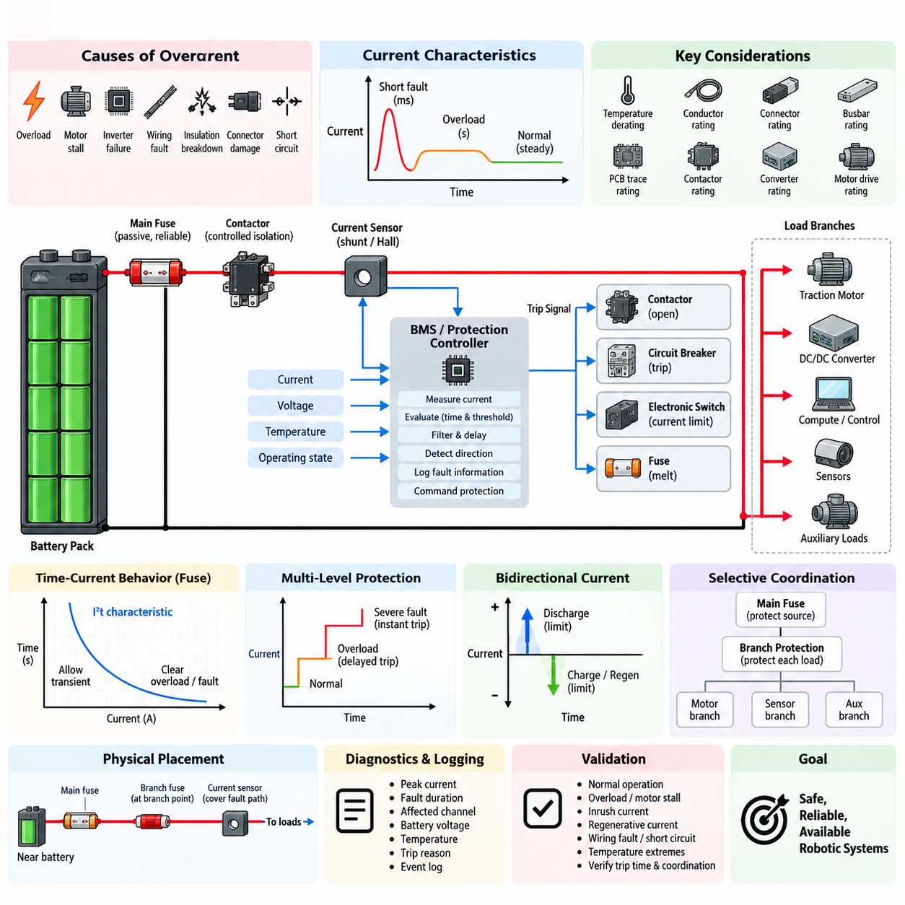
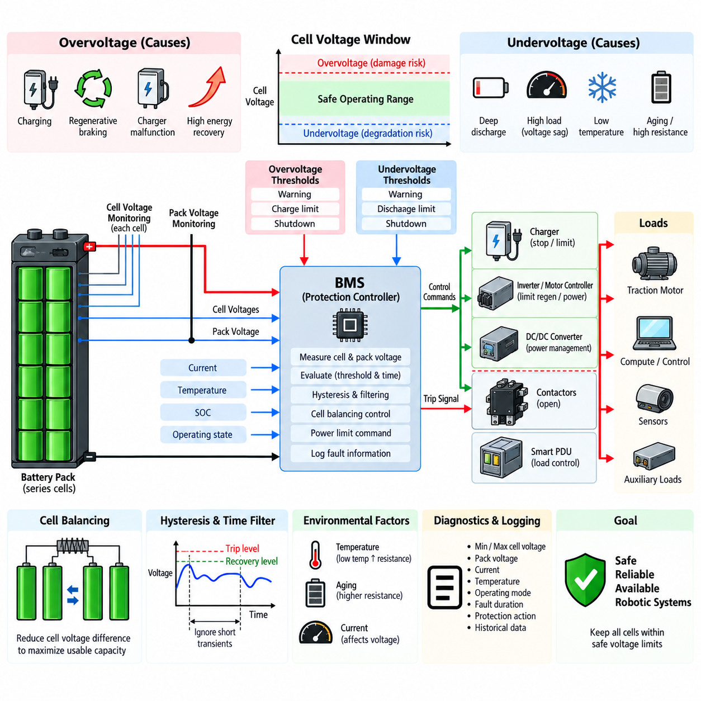
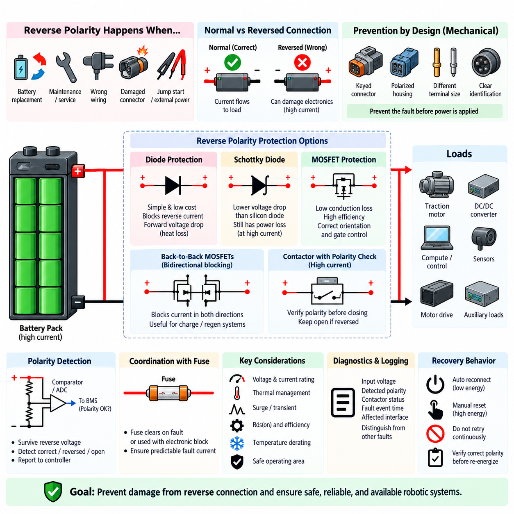
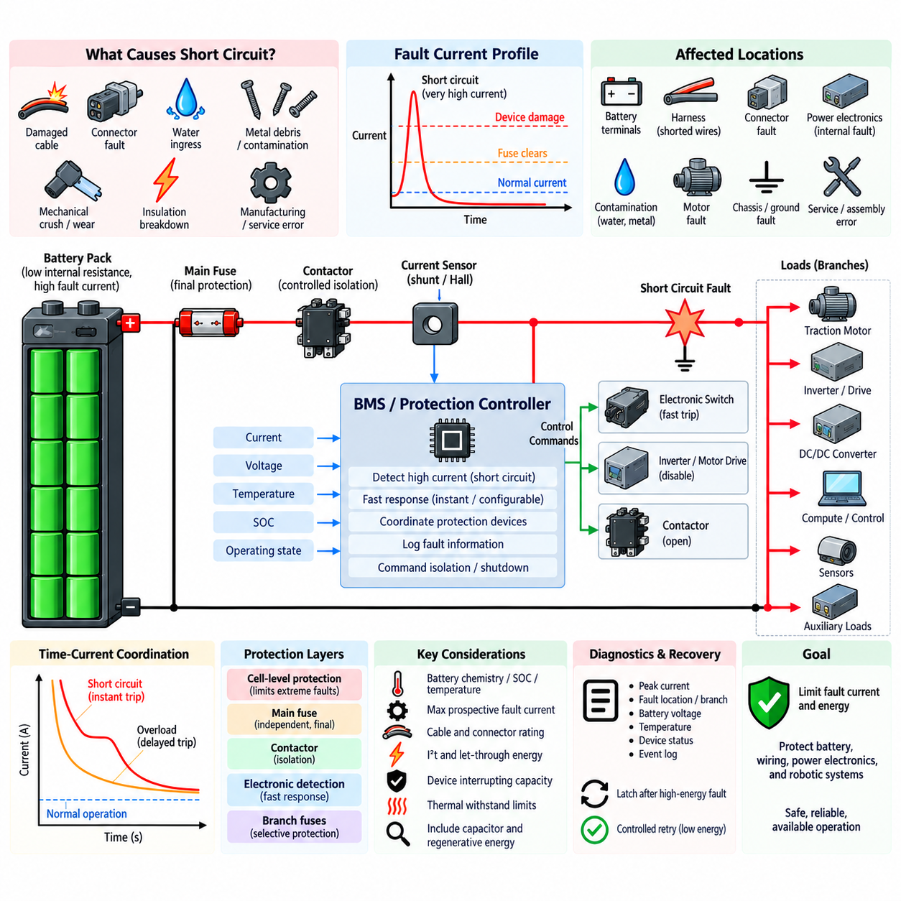
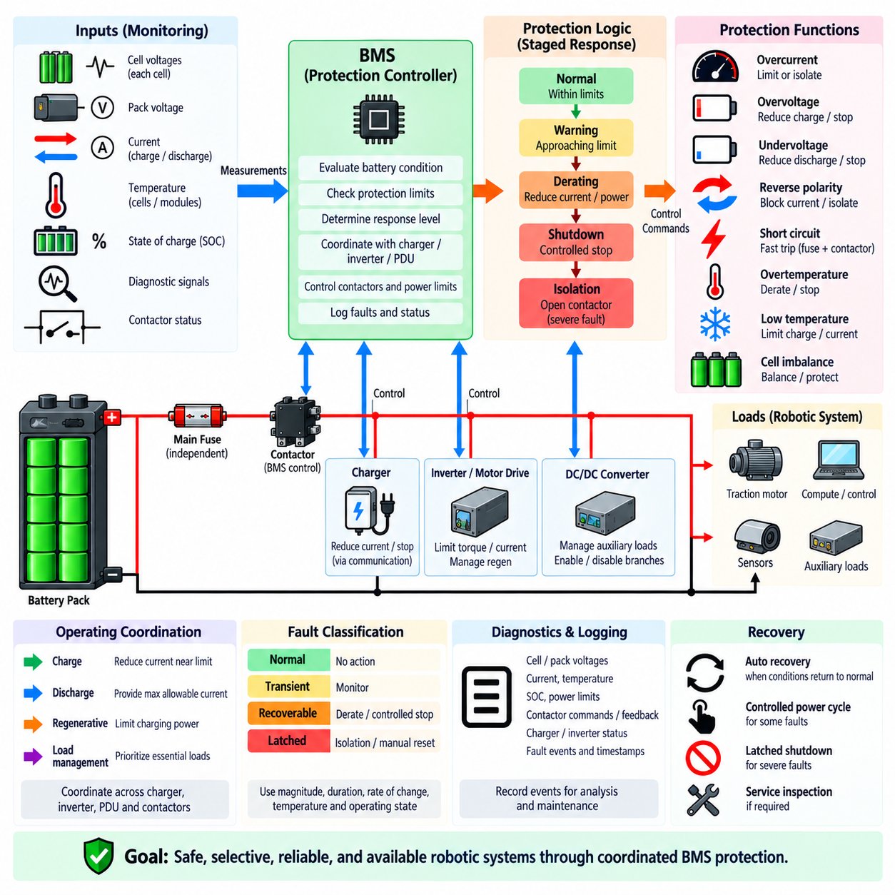

**Volume 04. Fuse, Relay, and Power Distribution Unit**

# Chapter 09. Battery Protection

## 09.01. Overcurrent Protection

{width="7.268055555555556in" height="7.268055555555556in"}

Overcurrent protection in a battery system prevents conductors, cells, busbars, contactors, connectors, and downstream electronics from being exposed to current levels that can cause excessive heating or permanent damage. Unlike normal load control, the protection function must remain effective during abnormal operating conditions. It therefore forms a fundamental safety layer between the stored battery energy and the electrical loads connected to the power distribution network.

Battery overcurrent can result from overload, motor stall, inverter failure, wiring faults, insulation breakdown, connector damage, or unintended low-impedance paths. The magnitude and duration of the current are both important because electrical components possess thermal inertia. A moderate overload may be tolerated for several seconds, while a severe fault may require interruption within milliseconds. Protection must therefore evaluate current together with time rather than relying on a single fixed threshold.

The basic protection structure combines current sensing, decision logic, and an interruption device. Current may be measured using a shunt resistor, Hall-effect sensor, magnetic sensor, or intelligent power device. The measured value is compared with predefined protection limits by analog circuitry, a battery management system, or an electronic protection controller. When an unsafe condition is confirmed, the system isolates the affected current path using a fuse, contactor, circuit breaker, or semiconductor switch.

A fuse provides simple and highly reliable passive protection because its element melts when accumulated thermal energy exceeds its design capability. Its behavior is commonly characterized by a time-current curve and I²t relationship, allowing short transient currents while clearing sustained overloads or high-current faults. In battery applications, fuse selection must consider continuous current, ambient temperature, conductor capacity, expected inrush current, available fault current, voltage rating, and interruption capability.

Contactors provide controllable isolation and allow the battery management system to disconnect the battery when an abnormal current is detected. Unlike a fuse, however, a contactor is not inherently capable of safely interrupting every possible short-circuit current. Very high DC current can create severe arcing, contact erosion, or contact welding. For this reason, battery architectures commonly use contactors for controlled protection and isolation while retaining a properly rated fuse as the final passive protection barrier.

Electronic overcurrent protection enables multiple current thresholds and different response times. A relatively low threshold may detect a sustained overload, while a higher threshold can identify a severe fault requiring rapid shutdown. Filtering and qualification delays prevent harmless switching transients or motor acceleration currents from causing unnecessary trips. This multi-level strategy provides better discrimination between normal dynamic operation and dangerous electrical conditions than a single instantaneous current limit.

Protection thresholds should be established from the safe operating limits of the entire current path rather than only from the battery cell rating. The allowable current of cables, connectors, busbars, PCB traces, contactors, fuses, converters, and motor drives must all be considered. Temperature derating is particularly important because increased ambient or enclosure temperature reduces thermal margin. The weakest protected component can therefore determine the practical continuous-current limit of the complete branch.

The battery pack and individual downstream branches require coordinated protection. A main battery fuse protects the high-energy source and primary distribution path, while branch fuses, circuit breakers, or electronic switches protect smaller conductors and loads. Proper coordination ensures that a local fault disconnects only the affected branch whenever possible instead of shutting down the entire robot. This selective behavior improves availability while preserving protection against faults that propagate toward the battery.

Overcurrent protection must also accommodate legitimate transient loads. Motors, pumps, compressors, DC/DC converters, capacitive inputs, and computing equipment may produce startup or inrush currents considerably higher than their steady-state values. If protection is sized only from nominal operating current, nuisance trips may occur. Conversely, excessively increasing the protection rating to tolerate these transients can leave wiring insufficiently protected. Time-current characteristics therefore provide an essential engineering compromise.

Battery current can flow in both directions in systems supporting regenerative braking or bidirectional power conversion. Protection logic must consequently distinguish permitted charging and regenerative current from abnormal reverse or discharge current. Separate positive and negative thresholds may be appropriate because battery charging limits can differ significantly from discharge limits. Direction-aware monitoring also allows the controller to identify faults that would be hidden by a protection strategy based only on absolute current magnitude.

The physical placement of protection devices strongly influences fault coverage. A main fuse should normally be located close to the battery energy source so that the length of unprotected conductor is minimized. Branch protection should be positioned near the point where conductor size or allowable current changes. Current sensors must cover the intended fault paths, and parallel conductors or alternative return paths must be considered to prevent current from bypassing the measurement or interruption mechanism.

Overcurrent detection should interact with system diagnostics instead of functioning only as an emergency shutdown mechanism. The controller can record peak current, fault duration, affected channel, battery voltage, temperature, operating state, and trip reason. Such information helps distinguish wiring faults from repeated overload, stalled actuators, deteriorating connectors, or abnormal motor behavior. Logged events also support service diagnostics and allow recurring electrical problems to be identified before they develop into severe failures.

Protection coordination becomes particularly important in mobile robots because traction motors can demand large transient currents while sensors and computing systems require stable uninterrupted power. A traction overload should not unnecessarily remove power from safety controllers, communication devices, or essential perception equipment. Separating high-current propulsion branches from critical low-power branches and coordinating their protective devices allows the system to isolate faults while maintaining controlled shutdown and diagnostic capability.

Overcurrent protection should be designed as layered defense rather than as a single device. Electronic current limiting can react quickly and preserve semiconductor hardware, the battery management system can command contactor opening when operating limits are exceeded, branch protection can isolate local faults, and the main fuse can provide independent protection against extreme current. Each layer addresses a different fault magnitude and response time, reducing dependence on any one detection or switching mechanism.

Validation must demonstrate correct behavior across normal operation, overload, motor stall, inrush, regenerative current, wiring faults, and severe short-circuit conditions. Tests should include temperature extremes, minimum and maximum battery voltage, aged components, and representative conductor resistance. Trip thresholds, clearing times, contactor behavior, fuse coordination, and post-fault isolation must be verified together so that the implemented system matches the intended protection hierarchy rather than merely satisfying individual component ratings.

A well-designed battery overcurrent protection system therefore balances safety, availability, transient tolerance, and fault isolation. Its objective is not simply to disconnect whenever current becomes high, but to determine whether the magnitude, direction, duration, and operating context represent an unsafe condition. Coordinated sensing, intelligent control, contactors, branch protection, and passive fusing create a robust protection architecture suitable for AMRs, manipulators, mobile platforms, and other battery-powered robotic systems.

## 09.02. Overvoltage/Undervoltage Protection

{width="7.268055555555556in" height="7.268055555555556in"}

Battery overvoltage and undervoltage protection maintains every cell and the complete battery pack within defined electrical operating limits. Excessive voltage can accelerate electrolyte decomposition, increase heat generation, damage cell chemistry, and create serious safety risks, while excessive discharge can cause irreversible capacity loss or internal degradation. Protection therefore monitors voltage continuously and prevents operation beyond the safe operating area.

Voltage protection must distinguish between cell-level and pack-level conditions. Pack voltage provides an overall indication of battery state, but individual cells can reach dangerous limits even while total pack voltage appears acceptable. Manufacturing variation, temperature gradients, aging, unequal self-discharge, and cell imbalance can cause different cell voltages within the same series string. Reliable protection therefore requires individual cell monitoring in addition to pack-level measurement.

Overvoltage most commonly occurs during charging, regenerative braking, incorrect charger operation, or abnormal energy recovery. When a cell approaches its upper voltage limit, the battery management system must reduce or stop charging before the electrochemical operating boundary is exceeded. In mobile robots, regenerative energy from traction motors can also raise battery voltage rapidly, requiring coordination between the BMS, motor controller, inverter, charger, and power distribution system.

Undervoltage generally develops when a battery is deeply discharged or when a high load causes temporary voltage sag. The protection system must differentiate between a recoverable transient voltage drop and genuine excessive discharge. Motors can produce substantial current during acceleration, climbing, steering, or stall conditions, temporarily reducing terminal voltage because of battery internal resistance. Immediate shutdown at every voltage dip would therefore cause unnecessary interruptions during normal robot operation.

Cell voltage thresholds normally include warning, control, and shutdown regions rather than a single trip point. As voltage approaches a limit, the system may first report a warning or reduce allowable power. If voltage continues toward a critical boundary, charging or discharging can be restricted. A final protection threshold commands isolation of the battery when necessary. This staged response provides controlled degradation of system capability before complete electrical disconnection.

Hysteresis is important because battery voltage can recover immediately after a load or charging source is removed. Without hysteresis, the system may repeatedly switch between fault and normal states near the protection threshold. Separate trip and recovery levels prevent this oscillation. Time qualification is also commonly applied so that short harmless voltage excursions are ignored while persistent or severe violations initiate protection according to their magnitude and duration.

Voltage sensing accuracy directly influences protection margin. Cell-monitoring circuits, analog front ends, ADC resolution, reference accuracy, wiring resistance, connector integrity, and temperature drift contribute measurement uncertainty. Protection thresholds must therefore include sufficient margin between the actual electrochemical cell limit and the commanded trip point. Calibration and diagnostic checks are required to ensure that measurement errors cannot allow a cell to operate outside its intended safe voltage range.

Overvoltage protection during charging should normally use several coordinated actions. The BMS can request reduced charging current as cells approach their upper limit, perform cell balancing to reduce voltage differences, and command the charger to stop when necessary. If communication or charger control fails, independent protection may open the charging contactor or isolate the battery. This layered approach prevents a single control or communication failure from becoming the only barrier against overcharging.

Cell balancing supports overvoltage protection but should not be treated as a substitute for it. In a series battery pack, the highest-voltage cell determines how much additional charging can safely occur. Passive or active balancing can reduce cell-to-cell differences and increase usable pack capacity, but balancing capability is normally much smaller than propulsion or charging current. Protection logic must therefore respond to the actual maximum cell voltage regardless of the average pack voltage.

Undervoltage protection must similarly consider the lowest-voltage cell rather than relying only on total pack voltage. A weak or degraded cell can reach its minimum safe voltage before the remaining cells, particularly under high current. Continuing discharge based solely on acceptable pack voltage can drive that cell into excessive depletion. Monitoring the minimum cell voltage allows the BMS to reduce load, issue a low-energy warning, or disconnect the discharge path before irreversible degradation occurs.

Battery voltage also depends strongly on current, temperature, state of charge, and internal resistance. At low temperature, increased internal resistance can produce greater voltage sag under load even when significant stored energy remains. An aged battery may exhibit similar behavior because its resistance has increased. Protection calibration must therefore avoid interpreting every low terminal voltage as equivalent to complete discharge, while still maintaining absolute cell voltage limits that cannot be violated.

For robotic platforms, controlled power reduction is often preferable to immediate shutdown when an undervoltage condition begins developing. The supervisory controller may reduce acceleration, limit traction torque, disable nonessential auxiliary loads, or command the robot to return to a charging station. Critical computing, communication, braking, and safety systems can be maintained through prioritized power distribution. Complete battery isolation is reserved for conditions where continued discharge threatens battery integrity.

Pack contactors provide the primary controlled isolation mechanism in many battery systems. When critical overvoltage or undervoltage conditions are confirmed, the BMS can command the appropriate contactor to open and prevent further charging or discharging. The architecture must nevertheless consider contactor failure, welded contacts, auxiliary power paths, charger connections, and regenerative current paths. Protection is effective only when every possible path capable of violating the battery voltage limits is properly controlled.

Overvoltage and undervoltage diagnostics should preserve information about the affected cell, minimum and maximum cell voltages, pack voltage, current, temperature, operating mode, fault duration, and protection action. Historical data can reveal progressive cell imbalance, capacity degradation, abnormal charger behavior, excessive regenerative events, or increasing internal resistance. Voltage protection consequently becomes both an immediate safety mechanism and an important source of battery health information.

Protection coordination must include the charger, DC/DC converters, inverter, motor drives, smart PDU, and supervisory controller. A charger should respond to BMS voltage limits before contactor isolation becomes necessary, while a traction controller should reduce regenerative current when the battery cannot accept additional energy. During low-voltage operation, downstream loads should respond to power-limiting commands before the battery reaches its final disconnect threshold. Coordinated control reduces abrupt shutdowns and unnecessary component stress.

Validation should cover normal charging and discharge, maximum charging voltage, deep discharge, high-current voltage sag, regenerative braking, charger malfunction, cell imbalance, low-temperature operation, aged-cell behavior, sensor faults, and communication failures. Threshold accuracy, response delay, hysteresis, recovery behavior, contactor operation, warning functions, and fault logging should be verified across the intended operating range to confirm that protection remains effective under both transient and persistent voltage abnormalities.

A robust battery voltage protection architecture therefore combines accurate cell and pack measurement, staged thresholds, time qualification, hysteresis, balancing, power limiting, coordinated charger and motor control, contactor isolation, and diagnostic monitoring. Overvoltage and undervoltage protection should not merely disconnect the battery at fixed limits; it should manage energy flow intelligently while maintaining every cell within its safe operating region and preserving the availability, reliability, and safety of the robotic platform.

## 09.03. Reverse-Polarity Protection

{width="7.268055555555556in" height="7.268055555555556in"}

Reverse polarity protection prevents a battery or electrical subsystem from being damaged when positive and negative terminals are connected incorrectly. A reversed connection can force current through semiconductor junctions, polarized capacitors, control electronics, motor drives, sensors, and communication modules in unintended directions. Because battery systems can deliver very high current, even a brief polarity error can cause immediate component failure, overheating, or conductor damage.

Reverse polarity events can occur during battery replacement, maintenance, connector assembly, service operations, jump-start procedures, or integration of removable battery modules. Incorrect wiring or damaged connectors may produce the same condition. Robotic systems are particularly exposed when batteries, payload modules, chargers, or auxiliary equipment are frequently connected and disconnected, making both mechanical prevention and electrical protection necessary.

The first protection layer should normally be prevention through connector and harness design. Polarized connectors, keyed housings, different terminal dimensions, mechanical coding, clear identification, and controlled assembly procedures reduce the probability of reverse connection. These measures are highly effective because they prevent the fault before electrical energy is applied. Electrical protection should nevertheless remain available for foreseeable wiring, service, or connector failures.

A simple series diode provides one of the most basic reverse polarity protection methods. With correct polarity, the diode conducts and supplies the load, while reversed polarity blocks current flow. The approach is inexpensive and inherently simple, but the forward voltage drop creates continuous power loss and heat. At high battery currents, this loss can become unacceptable, making conventional diode protection more suitable for low-power control and auxiliary circuits than propulsion power paths.

A Schottky diode can reduce the forward voltage drop compared with a conventional silicon diode and therefore decrease conduction losses. However, significant dissipation can still occur at high current, and reverse-voltage capability, leakage current, junction temperature, and thermal management must be considered. For battery-powered robots where energy efficiency and operating time are important, semiconductor conduction losses directly reduce available runtime and increase cooling requirements.

MOSFET-based reverse polarity protection provides substantially lower conduction loss and is widely suitable for electronic battery interfaces. A properly configured MOSFET uses its channel as a low-resistance current path during correct connection while blocking current when the battery polarity is reversed. Because conduction loss is approximately related to current squared and on-state resistance, selecting a sufficiently low RDS(on) device can provide much better efficiency than a series diode.

The intrinsic body diode of a MOSFET must be considered carefully because it determines current behavior before the MOSFET is fully enhanced. Device orientation is therefore different from what might initially be expected for a conventional switching application. The gate-control circuit must ensure that correct battery polarity turns the MOSFET on while reverse polarity keeps it off, without exceeding the permitted gate-to-source voltage under maximum battery voltage or transient conditions.

For higher-current battery systems, multiple MOSFETs may be connected in parallel to reduce effective resistance and distribute thermal loading. Current sharing, gate resistance, PCB copper area, busbar design, thermal interfaces, and device parameter variation must be considered. Simply adding parallel devices does not guarantee equal current distribution, particularly during switching transients, so electrical and thermal symmetry should be incorporated into the physical design.

Back-to-back MOSFET arrangements can provide bidirectional current blocking when the application requires isolation in both directions. This is useful where charging, regenerative braking, or external power sources can cause current to flow toward the battery as well as away from it. By controlling two MOSFETs with opposing body-diode orientations, the circuit can permit intentional bidirectional operation while blocking unwanted current when protection is commanded.

High-current robotic battery systems may use contactors as part of the reverse polarity protection strategy. Before closing the main contactors, the controller can verify battery polarity and voltage using a protected sensing path. If the measured polarity is incorrect, the contactors remain open and the main power bus is never energized. This approach is particularly useful when the propulsion system operates at currents too high for simple series semiconductor protection.

Polarity detection circuitry must itself survive the fault it is intended to detect. Voltage dividers, comparators, isolated measurement circuits, ADC inputs, and protection components should be designed so that reverse battery voltage cannot damage the monitoring electronics. The sensing circuit can report correct polarity, reversed polarity, disconnected battery, or abnormal voltage to the BMS or supervisory controller before permission is given to energize downstream power stages.

Reverse polarity protection should be coordinated with fuses and overcurrent protection rather than treated independently. Some protection arrangements intentionally create a low-impedance path under reverse connection so that a fuse opens, while others block reverse current electronically. A fuse-based strategy must ensure that the resulting fault current is predictable and that the fuse clears before wiring or components are damaged. Repeated service after such an event must also be considered.

Protection devices must be rated for the maximum battery voltage, expected current, reverse voltage, surge conditions, and thermal environment. MOSFET drain-source voltage rating requires adequate margin for switching transients, cable inductance, and load disturbances. Continuous-current capability alone is insufficient because transient energy and safe operating area can determine whether the device survives abnormal conditions. Temperature derating should be included when establishing design margins.

Robotic power architectures often contain several voltage domains, including the main traction battery, DC/DC converter outputs, computing rails, sensor supplies, and auxiliary interfaces. Reverse polarity protection may therefore be required at more than one boundary. A protected main battery connection does not automatically protect an auxiliary connector that can be incorrectly wired. Each externally accessible or serviceable power interface should be evaluated according to its own fault exposure.

Diagnostics can improve maintainability by distinguishing reverse polarity from undervoltage, open-circuit, fuse failure, or communication faults. The controller may record measured input voltage, detected polarity, contactor state, protection-device status, time of occurrence, and affected interface. Clear diagnostic information prevents repeated connection attempts and helps technicians identify incorrect wiring or damaged connectors without unnecessarily replacing functional battery or electronic modules.

The protection architecture should also define recovery behavior after a reverse polarity event. Automatic reconnection may be acceptable for low-energy interfaces after correct polarity is restored, while high-energy battery systems may require a deliberate reset or diagnostic confirmation. Contactors should not repeatedly attempt to close against an unresolved wiring fault. Controlled recovery ensures that removal of the immediate fault does not introduce repeated electrical or mechanical stress.

Validation should include correct connection, reverse connection, open input, minimum and maximum battery voltage, hot-plug events, partially engaged connectors, transient disturbances, and representative load conditions. Tests should confirm that downstream electronics remain protected, protective devices stay within thermal and electrical limits, contactors do not close under reversed polarity, and the system recovers correctly after the battery connection is restored.

A robust reverse polarity protection design therefore combines mechanical prevention, protected polarity detection, semiconductor or contactor-based isolation, appropriate overcurrent protection, diagnostics, and controlled recovery. The exact implementation depends on voltage, current, efficiency, bidirectional energy flow, and service requirements. For battery-powered robotic platforms, the objective is to ensure that a simple connection error cannot propagate into damage to the battery, power distribution system, computing hardware, sensors, or propulsion electronics.

## 09.04. Short-Circuit Protection

{width="7.268055555555556in" height="7.268055555555556in"}

A short circuit is one of the most severe electrical faults in a battery-powered system because it creates an unintended very-low-impedance path between conductors at different potentials. The resulting current can rise far above normal operating levels within milliseconds, limited mainly by cell internal resistance, busbar and cable impedance, connector resistance, and fault-path impedance. Protection must interrupt this energy before conductors, cells, or switching devices are damaged.

Short circuits may occur between battery positive and negative terminals, between conductors inside a harness, across damaged connectors, within a power electronic module, or through conductive contamination. Mechanical abrasion, crushed cables, loose hardware, insulation breakdown, water ingress, manufacturing defects, and service errors can all create fault paths. Robotic platforms add vibration, repeated motion, impact, and environmental exposure that can increase these risks throughout service life.

The available short-circuit current depends strongly on battery chemistry, state of charge, temperature, pack configuration, and total circuit impedance. Large parallel cell groups can deliver extremely high fault currents because their individual currents combine at the pack terminals. Consequently, protection cannot be designed from normal continuous current alone. The maximum prospective fault current must be estimated so every interrupting device can safely withstand and clear the expected electrical energy.

Battery short-circuit protection normally uses multiple layers with different response characteristics. Cell-level protective elements can limit extreme internal or localized faults, while pack fuses protect the primary energy path. Contactors provide controlled isolation, and electronic switches or motor drives can respond rapidly to detected abnormal current. The BMS supervises these devices and coordinates shutdown, but independent passive protection remains important when electronic control cannot react quickly enough.

The main battery fuse is a fundamental final protection element because it operates independently of software, communication, and controller power. Its current rating must allow normal continuous load and legitimate transient current while its time-current characteristic must clear severe faults before protected conductors exceed their thermal withstand capability. The fuse voltage rating and interrupting capacity must also be sufficient to extinguish the DC arc produced when a high-energy battery circuit opens.

Fuse selection for short-circuit protection requires consideration of I²t, often called let-through energy. During a fault, the conductor and downstream components absorb energy while current flows before the fuse completely clears. The fuse should therefore have a clearing characteristic compatible with the thermal and electrical withstand limits of cables, busbars, contactors, connectors, and semiconductor devices. Merely selecting a fuse slightly above nominal operating current does not guarantee adequate fault protection.

Electronic short-circuit detection can provide substantially faster and more configurable response than thermal protection alone. Current sensors, shunt measurements, Hall-effect sensors, desaturation detection, or semiconductor current-sense functions can identify a rapidly increasing fault current. The controller can then disable a power stage or command isolation. Detection must be sufficiently fast, but filtering is still necessary to distinguish genuine short circuits from motor startup, inverter switching, and capacitive inrush.

Multiple protection thresholds are useful because overload and short-circuit faults occur on very different time scales. A moderate overload may be tolerated temporarily and handled by delayed protection, whereas an extreme current should trigger an instantaneous or near-instantaneous response. This time-current discrimination allows propulsion motors and converters to operate through legitimate transients without sacrificing protection against severe faults. Thresholds must be coordinated with actual component withstand limits.

Contactors should not be assumed to provide unlimited short-circuit interruption capability. Opening a contactor under very high DC fault current can generate an intense arc, damage the contacts, or prevent successful interruption. In some architectures, the fuse is expected to clear the highest fault currents while contactors handle lower-energy controlled disconnection. The contactor making, carrying, and breaking capabilities must therefore be evaluated separately for the intended fault conditions.

Pyrotechnic disconnect devices or other ultra-fast isolation technologies may be considered in high-energy battery systems where conventional contactors cannot safely interrupt the maximum fault current. Such devices can physically separate the electrical path rapidly after receiving a trigger. They are generally one-time devices and therefore require replacement after activation, but they can provide an additional protection layer between electronic detection and conventional fuse clearing in demanding applications.

Protection placement determines how much of the electrical system remains unprotected. The main fuse should generally be positioned as close as practical to the battery source so that a short circuit along the outgoing cable cannot bypass protection. Each branch whose conductor size or current capability is lower than the main distribution path may require separate branch protection. Protection should follow changes in conductor capability throughout the power distribution architecture.

Ground faults and chassis-related short circuits require additional consideration because the current path may differ from a direct positive-to-negative short. Depending on grounding architecture and electrical isolation, a first insulation fault may produce little current while a second fault creates a hazardous low-impedance path. Battery protection should therefore be coordinated with insulation monitoring, grounding strategy, enclosure design, and fault detection so indirect short-circuit conditions are also identified.

Short-circuit protection must account for energy stored outside the battery. DC-link capacitors in inverters, motor drives, DC/DC converters, and other power electronics can discharge rapidly into a fault even after the battery contactor begins opening. Motors can also temporarily contribute electrical energy during regenerative operation. The complete fault-energy analysis must therefore include distributed capacitive and electromechanical energy rather than assuming the battery is the only source.

Selective coordination is important in robotic systems containing many electrical branches. A short circuit in an auxiliary sensor circuit should ideally open its local fuse or electronic switch without removing traction, safety control, and computing power from the entire robot. Conversely, a fault on the main bus requires rapid pack-level isolation. Coordinated branch and main protection improves system availability while preventing local faults from propagating through the complete electrical architecture.

Short-circuit diagnostics should record the measured peak current, fault location or affected branch, battery voltage, temperature, operating state, protection device activated, and contactor status. High-resolution event information can help distinguish a genuine hard short from motor stall, inverter failure, intermittent harness damage, or connector contamination. Repeated transient fault records can also reveal deteriorating wiring before a permanent short circuit develops.

Recovery after a short-circuit event must be carefully controlled. Automatically reclosing a contactor into a persistent short can repeatedly expose the battery and switching devices to destructive current. High-energy faults should normally latch the protection state until diagnostic conditions confirm that the fault has disappeared or service intervention has occurred. Lower-energy protected branches may permit controlled retry only when the architecture can demonstrate that repeated energization remains safe.

Validation must include short circuits at representative locations and impedances, including main-bus faults, branch faults, downstream electronic faults, and conditions near the battery terminals. Testing should verify detection time, peak current, fuse clearing behavior, contactor response, conductor temperature, arc containment, diagnostic logging, and post-fault isolation. Minimum and maximum battery voltage, temperature extremes, component tolerances, and aged-system conditions should also be considered.

A robust short-circuit protection architecture therefore combines fault prevention, low-impedance current-path analysis, properly rated fuses, rapid electronic detection, coordinated contactor operation, branch protection, diagnostics, and controlled recovery. Its objective is not merely to detect excessive current, but to limit the peak current and total released energy before damage propagates. This layered strategy protects the battery, wiring, power electronics, and critical robotic systems against one of the most energetic electrical failure modes.

## 09.05. BMS-Coordinated Protection

{width="7.268055555555556in" height="7.268055555555556in"}

BMS-coordinated protection integrates battery sensing, fault evaluation, power control, and physical isolation into a unified protection strategy. Rather than treating overcurrent, overvoltage, undervoltage, reverse polarity, and short-circuit protection as independent functions, the Battery Management System coordinates their responses according to battery condition, fault severity, operating state, and the capabilities of connected protection devices.

The BMS continuously observes individual cell voltages, pack voltage, charge and discharge current, cell and module temperatures, state of charge, and relevant diagnostic signals. These measurements establish the electrical and thermal condition of the battery in real time. Protection decisions are therefore based not only on a single threshold but on the relationship between measured values, operating limits, duration, direction of energy flow, and system state.

Protection limits are normally organized into several response levels. A condition approaching an operating boundary may first generate a warning, while a more significant deviation can cause current or power derating. Continued deterioration can trigger controlled shutdown, and a severe fault may require immediate isolation. This staged strategy allows the BMS to preserve system availability whenever safe operation remains possible instead of disconnecting the battery for every abnormal measurement.

Overcurrent coordination illustrates this layered behavior clearly. Moderate overload can be handled through torque reduction, converter current limiting, or load shedding, while a higher current threshold may command contactor opening. Extremely high short-circuit current may be cleared by the main fuse independently of BMS software. Electronic detection, controllable isolation, and passive protection therefore operate across different current and time regions rather than duplicating the same function.

Voltage protection is coordinated at both cell and pack levels. During charging, the BMS can request lower charging current as the highest cell approaches its upper limit, while balancing reduces cell-to-cell variation. During discharge, the lowest cell voltage can initiate power reduction before reaching the final undervoltage threshold. Pack-level contactor isolation is used when continued charging or discharging could move any cell outside its permitted operating region.

Temperature is an essential input to coordinated protection because electrical limits depend strongly on thermal condition. High cell or connector temperature may require reduced charge or discharge current even when voltage and current remain within nominal limits. Low temperature can restrict charging and increase voltage sag under load. The BMS can therefore apply temperature-dependent limits rather than treating electrical thresholds as fixed values across the complete environmental range.

The BMS should coordinate with the charger rather than relying on contactor opening as the normal method of terminating charge. Charging current can first be reduced through a command interface, followed by controlled charger shutdown when required. If the charger fails to respond or communication is lost, the BMS can escalate protection and isolate the charging path. This creates a hierarchy from cooperative control to independent physical disconnection.

Similar coordination is required with the inverter and motor drive. During acceleration, the BMS can communicate the maximum allowable discharge current or power according to battery condition. During regenerative braking, it can communicate the maximum acceptable charging power. If the battery approaches an overvoltage, overtemperature, or high state-of-charge limit, regenerative energy must be reduced or redirected before the BMS is forced to open the battery contactors.

Smart power distribution units and DC/DC converters extend coordinated protection to downstream branches. When battery capability becomes limited, nonessential auxiliary loads can be reduced or disconnected while power is preserved for safety controllers, communication, braking, sensing, and essential computing. A localized branch fault can be isolated without unnecessarily removing the complete battery supply. This selective response improves both fault containment and robotic system availability.

Contactor control is one of the BMS\'s most important physical protection functions. Before closing the main contactors, the BMS can verify battery voltage, polarity, insulation condition, contactor state, and other permissive conditions. A pre-charge sequence may then limit current while downstream DC-link capacitance is energized. Only after acceptable pre-charge behavior is confirmed should the main power path be fully connected to the robot electrical system.

During operation, contactor opening must also be coordinated with current and system state. Interrupting a high DC current can produce significant arcing and contact damage, so controllable loads should be reduced before opening whenever the fault permits sufficient response time. For severe faults requiring immediate isolation, the protection architecture must rely on contactors, fuses, electronic switches, or other disconnect devices according to their actual interruption capabilities.

A coordinated protection architecture must remain effective when communication fails. CAN, CAN FD, or other communication links may carry battery limits and protection commands between the BMS, charger, inverter, PDU, and supervisory controller, but communication itself cannot be the only safety barrier. Timeout behavior and local fallback limits should place each subsystem into a defined safe state when valid BMS information is unavailable.

Fault classification helps determine the appropriate response. A transient voltage sag during motor acceleration should not necessarily be treated like sustained undervoltage, and a moderate overload should not receive the same response as a hard short circuit. The BMS can combine magnitude, duration, rate of change, temperature, current direction, and operating mode to distinguish warning conditions, recoverable faults, latched faults, and faults requiring immediate irreversible protection.

Redundancy and independence become increasingly important as battery energy increases. The BMS provides intelligent supervision, but a software-controlled system should not be the sole barrier against every hazardous electrical condition. Main fuses, hardware overvoltage or overcurrent protection, independent sensing paths, contactor feedback, and other protective mechanisms can provide additional layers. Their thresholds and response times should complement rather than conflict with BMS-controlled actions.

Diagnostics are integral to coordinated protection because the sequence of events often reveals the actual fault mechanism. The BMS can record cell voltages, pack voltage, current, temperatures, state of charge, contactor commands, contactor feedback, charger or inverter status, active power limits, and fault timestamps. Event histories help distinguish battery degradation from wiring faults, charger malfunction, motor overload, contactor welding, or abnormal operating commands.

Recovery strategy should depend on fault severity and confidence that safe conditions have been restored. Temporary derating may disappear automatically when temperature or voltage returns to an acceptable range, while some faults may require a controlled power cycle. Severe short circuits, welded contactors, insulation faults, or repeated protection events may require a latched shutdown and service inspection. Automatic reconnection should never repeatedly energize an unresolved hazardous fault.

Validation of BMS-coordinated protection must test interactions rather than only individual protection functions. Charging, high-current discharge, regenerative braking, overload, short circuit, cell imbalance, overtemperature, low temperature, communication loss, sensor faults, and contactor faults should be evaluated as system-level scenarios. Tests should verify the order, timing, escalation, diagnostic recording, and recovery behavior of all participating protection devices.

A robust BMS-coordinated protection architecture therefore combines sensing, dynamic operating limits, staged fault responses, charger and motor coordination, load management, contactor control, passive fusing, communication fallback, diagnostics, and controlled recovery. The objective is to manage abnormal conditions before they become destructive while ensuring that independent protection remains available for severe faults, creating a battery system that is safe, selective, reliable, and suitable for demanding robotic platforms.
