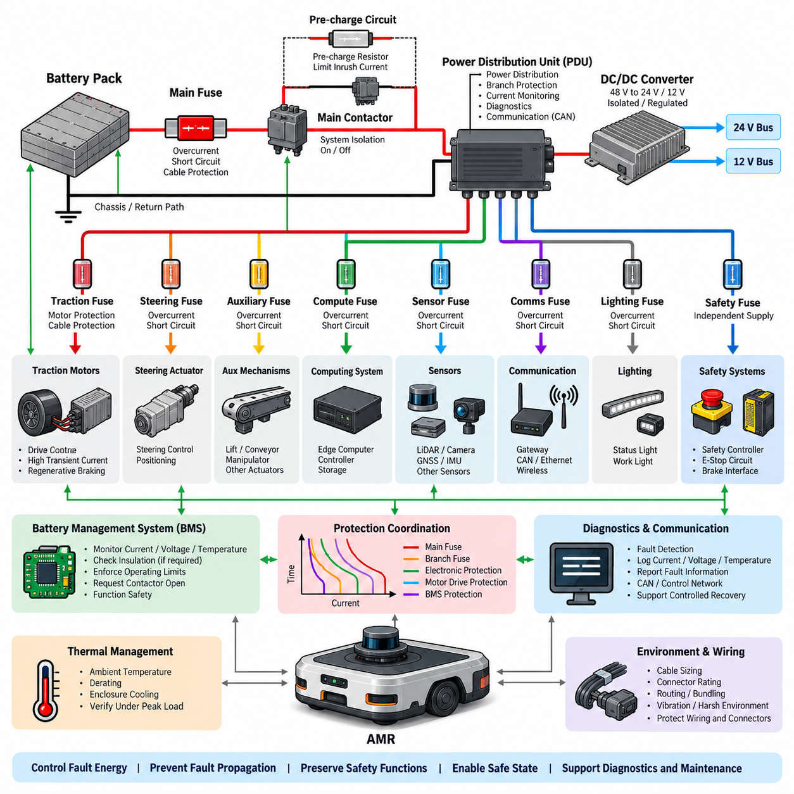
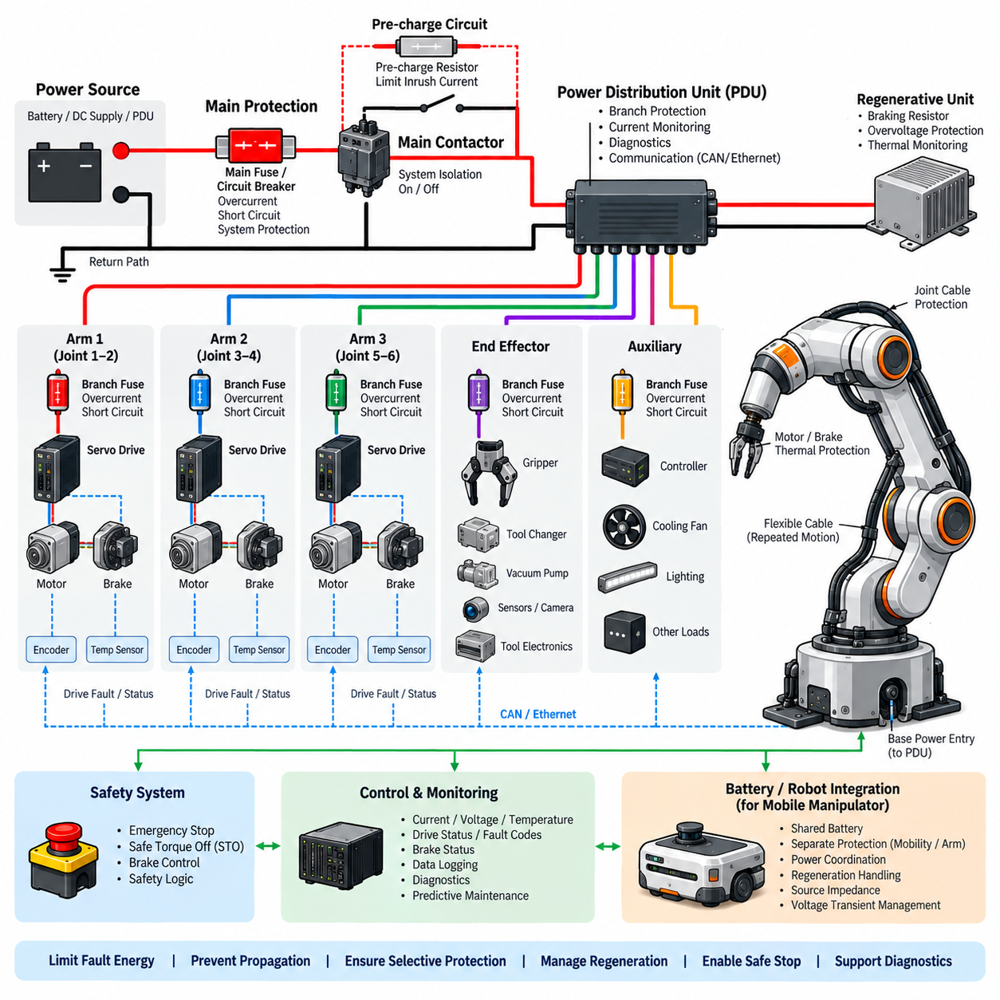
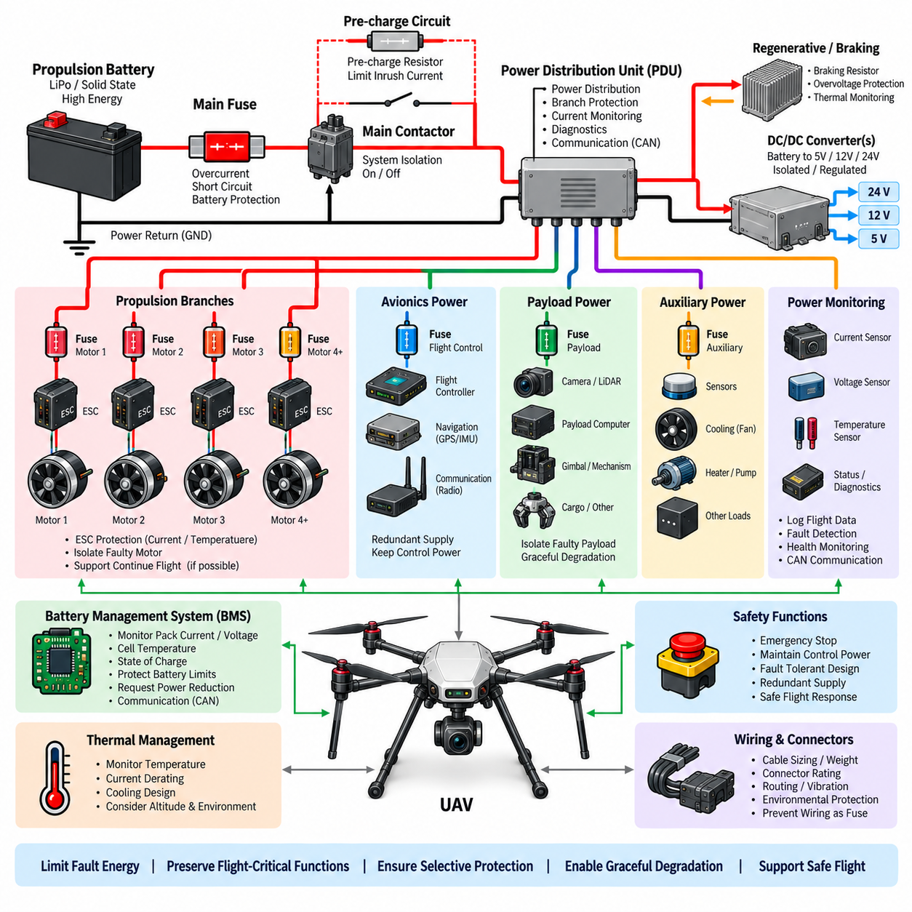
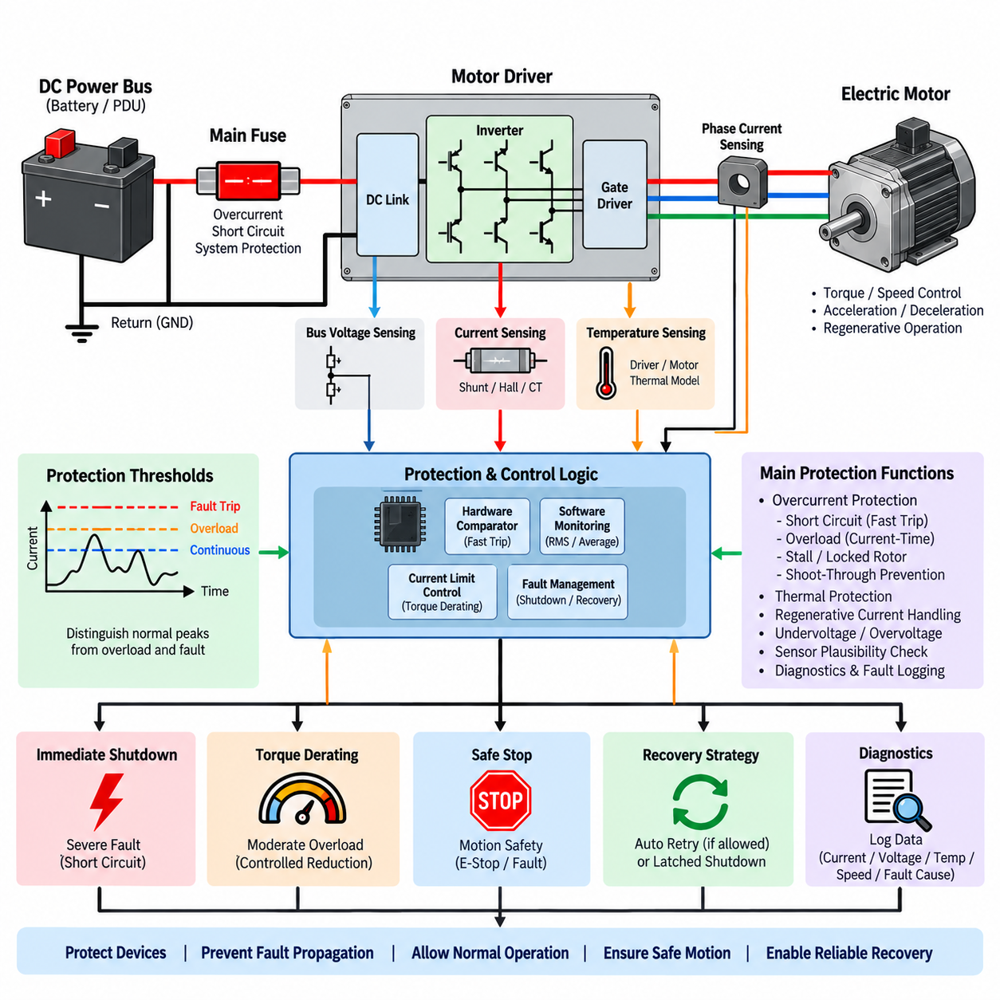
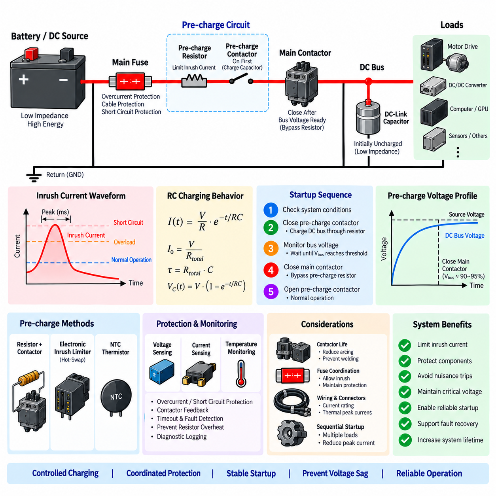

**Volume 04. Fuse, Relay, and Power Distribution Unit**


# Chapter 10. Robot Power Protection

##  

## 10.01. AMR Power Protection Pattern

{width="7.268055555555556in" height="7.268055555555556in"}

An AMR power protection pattern should be designed as a coordinated system rather than as a collection of independent fuses. The electrical architecture typically begins at the battery and progresses through primary isolation, main overcurrent protection, pre-charge or controlled connection, power distribution, branch protection, and individual loads. This layered structure limits fault energy while preserving unaffected functions whenever possible.

The battery interface forms the first protection boundary because it is connected to the system's largest available fault current. A main fuse should therefore be positioned electrically close to the battery positive terminal, with its current rating and interrupting capability selected for the battery chemistry, maximum short-circuit current, cable capacity, and downstream contactor arrangement. Protection of the return path may also be required depending on grounding architecture.

A typical AMR uses a main contactor or equivalent high-current switching device to isolate propulsion and auxiliary power from the battery. The contactor is not normally intended to interrupt severe short-circuit current by itself, so coordination with the main fuse is essential. During startup, a pre-charge path can limit charging current into DC-link capacitors of motor drives and converters before the main contactor closes, reducing contact erosion and nuisance protection events.

Downstream of the main switching stage, the power distribution unit provides the central protection boundary for individual electrical domains. Separate protected branches can supply traction motor drives, steering actuators, DC/DC converters, computing systems, sensors, communication equipment, lighting, and auxiliary mechanisms. This organization corresponds directly to the broader AMR electrical architecture in which power, sensing, computing, communication, and actuation functions coexist.

Traction branches usually require special consideration because motor drives can draw high transient current during acceleration, obstacle negotiation, steering, and regenerative operation. A traction fuse must tolerate legitimate peak current without unnecessary opening while still protecting cables and downstream hardware against sustained overloads and short circuits. Its time-current characteristic should therefore be coordinated with motor-driver electronic protection rather than selected only from nominal motor current.

Electronic motor drives provide a faster local protection layer than conventional thermal fuses for many semiconductor faults. Current sensing can detect phase overcurrent, DC-bus overcurrent, locked-rotor conditions, or abnormal torque demand and command rapid switching shutdown. The upstream fuse remains necessary as an independent energy-limiting device for catastrophic failures such as shorted power semiconductors, damaged busbars, cable faults, or faults that prevent electronic shutdown.

Low-voltage electronic loads require a different protection pattern because their current levels and availability requirements differ from traction loads. A DC/DC converter may generate 24 V, 12 V, or other regulated rails from the main battery bus, after which each critical load group should receive appropriately sized branch protection. Edge computers, controllers, LiDARs, cameras, GNSS receivers, communication gateways, and safety devices should not unnecessarily share one protective element.

Selective protection is particularly important for autonomous operation. A fault in a nonessential accessory should ideally disconnect only that branch rather than removing localization, communication, braking, or safety-control power. Protection zones can therefore be aligned with functional criticality. Safety controllers, emergency-stop circuits, braking interfaces, and essential communication devices may require independently protected supplies so that an auxiliary short circuit does not produce an uncontrolled vehicle state.

Smart PDU technology extends this pattern by combining switching, current measurement, diagnostics, and communication at each protected channel. Electronic load switches or MOSFET stages can detect abnormal current, disconnect individual loads, report fault information through CAN or another control network, and support controlled recovery. Conventional fuses can remain as backup protection for conditions exceeding the electronic switching device's safe operating capability.

Protection coordination must account for the relationship between the main fuse, branch fuses, electronic switches, motor-drive protection, converter protection, and battery management system. For a downstream fault, the device nearest the fault should normally operate first. The upstream device should remain intact unless fault magnitude or duration exceeds the downstream device's clearing capability. Time-current curves and expected fault-current ranges provide the basis for verifying this selectivity.

The battery management system adds another supervisory protection layer by monitoring pack current, cell voltage, temperature, insulation-related conditions where applicable, and battery operating limits. It may request contactor opening when operating conditions become unsafe, while hardware fuses provide protection against fault currents that are too rapid or severe for software-controlled isolation. The resulting architecture deliberately combines electronic supervision with independent passive protection.

Emergency-stop behavior must be considered separately from ordinary electrical fault protection. An emergency stop may command removal of propulsion torque while maintaining power to safety controllers, brakes, communication, and diagnostic functions required to reach or maintain a safe state. Consequently, simply placing all robot loads behind one contactor can create undesirable behavior. The protected power architecture should distinguish energy isolation from safety-related power retention.

Regenerative braking introduces bidirectional energy flow into the protection design. During deceleration, motor drives can return energy to the DC bus and battery, causing bus voltage and current conditions that differ from normal propulsion. Fuse selection, contactor sequencing, DC-link design, BMS limits, and overvoltage handling must therefore be evaluated for both motoring and regeneration. Protection must remain valid across the full operating envelope rather than only during discharge.

Cable and connector protection remains one of the fundamental purposes of the AMR protection system. Fuse ratings should not exceed the safe current capability of the protected conductors after considering ambient temperature, bundling, routing, connector contact resistance, enclosure heating, and duty cycle. A fuse sized only according to load current can leave wiring insufficiently protected, while excessive conservatism can cause nuisance opening during legitimate transient operation.

Thermal behavior should also be evaluated at system level because AMRs often concentrate batteries, PDUs, converters, motor drivers, computers, and harness junctions within compact enclosures. High ambient temperature reduces available current margin and can alter fuse clearing behavior, semiconductor limits, connector temperature rise, and cable ampacity. Protection design should therefore be coordinated with thermal management and verified under representative continuous and peak-load operating conditions.

Fault diagnostics should identify not only that protection has operated but also which electrical domain failed and under what conditions. Current, voltage, temperature, contactor state, branch-switch status, and BMS information can be logged before and after a protection event. Such information enables service personnel to distinguish between genuine short circuits, overloads, inrush problems, degraded connectors, intermittent harness faults, and incorrect protection calibration.

A robust AMR pattern ultimately forms a hierarchy of battery protection, primary isolation, centralized distribution, selective branch protection, intelligent local shutdown, and supervisory diagnostics. The design objective is not merely to prevent component damage but to control fault energy, prevent fault propagation, preserve safety-critical functions, support deterministic transition to a safe state, and provide sufficient diagnostic information for rapid recovery and maintenance.

AMR 전원 보호 패턴(AMR Power Protection Pattern)은 서로 독립적인 퓨즈(Fuse)의 집합이 아니라 상호 협조된 시스템(Coordinated System)으로 설계해야 한다. 전기 아키텍처(Electrical Architecture)는 일반적으로 배터리(Battery)에서 시작하여 1차 절연(Primary Isolation), 주 과전류 보호(Main Overcurrent Protection), 프리차지(Pre-charge) 또는 제어 연결(Controlled Connection), 전력 분배(Power Distribution), 분기 보호(Branch Protection), 개별 부하(Individual Load) 순으로 구성된다. 이러한 계층 구조는 고장 에너지(Fault Energy)를 제한하면서 가능한 경우 고장 영향을 받지 않은 기능을 계속 유지하도록 한다.

배터리 인터페이스(Battery Interface)는 시스템에서 가장 큰 가용 고장 전류(Available Fault Current)에 직접 연결되므로 첫 번째 보호 경계(Protection Boundary)를 형성한다. 따라서 메인 퓨즈(Main Fuse)는 전기적으로 배터리 양극 단자(Battery Positive Terminal)에 최대한 가깝게 배치해야 하며, 정격 전류(Current Rating)와 차단 용량(Interrupting Capability)은 배터리 화학 특성(Battery Chemistry), 최대 단락 전류(Maximum Short-Circuit Current), 케이블 용량(Cable Capacity), 하류 접촉기 구성(Downstream Contactor Arrangement)을 고려하여 선정해야 한다. 접지 아키텍처(Grounding Architecture)에 따라 귀환 경로(Return Path)의 보호가 필요할 수도 있다.

일반적인 AMR은 배터리로부터 구동계(Propulsion)와 보조 전원(Auxiliary Power)을 절연하기 위해 메인 접촉기(Main Contactor) 또는 이에 상응하는 고전류 스위칭 장치(High-Current Switching Device)를 사용한다. 접촉기는 일반적으로 심각한 단락 전류(Short-Circuit Current)를 단독으로 차단하도록 설계되지 않으므로 메인 퓨즈와의 보호 협조(Protection Coordination)가 필수적이다. 기동 과정에서는 프리차지 경로(Pre-charge Path)를 통해 메인 접촉기가 닫히기 전에 모터 드라이브(Motor Drive)와 컨버터(Converter)의 DC 링크 커패시터(DC-Link Capacitor)에 흐르는 충전 전류를 제한하여 접점 열화(Contact Erosion)와 불필요한 보호 동작(Nuisance Protection Event)을 줄일 수 있다.

메인 스위칭 단계(Main Switching Stage)의 하류에서는 전력 분배 장치(Power Distribution Unit, PDU)가 개별 전기 도메인(Electrical Domain)에 대한 중앙 보호 경계(Central Protection Boundary)를 제공한다. 구동 모터 드라이브(Traction Motor Drive), 조향 액추에이터(Steering Actuator), DC/DC 컨버터(DC/DC Converter), 컴퓨팅 시스템(Computing System), 센서(Sensor), 통신 장비(Communication Equipment), 조명(Lighting), 보조 기구(Auxiliary Mechanism) 등에 각각 독립적으로 보호된 분기(Protected Branch)를 구성할 수 있다. 이러한 구성은 전력, 센싱(Sensing), 컴퓨팅, 통신, 액추에이션(Actuation) 기능이 함께 존재하는 전체 AMR 전기 아키텍처와 직접적으로 대응된다.

구동 분기(Traction Branch)는 모터 드라이브가 가속, 장애물 극복, 조향 및 회생 동작(Regenerative Operation) 과정에서 높은 과도 전류(Transient Current)를 요구할 수 있기 때문에 특별한 고려가 필요하다. 구동 퓨즈(Traction Fuse)는 정상적인 피크 전류(Peak Current)를 불필요하게 차단하지 않으면서 지속적인 과부하(Sustained Overload)와 단락으로부터 케이블과 하류 하드웨어를 보호해야 한다. 따라서 퓨즈의 시간-전류 특성(Time-Current Characteristic)은 단순히 모터 정격 전류(Nominal Motor Current)만을 기준으로 선정하지 않고 모터 드라이버 전자 보호(Motor-Driver Electronic Protection)와 협조되도록 설계해야 한다.

전자식 모터 드라이브(Electronic Motor Drive)는 다양한 반도체 고장(Semiconductor Fault)에 대해 기존 열식 퓨즈(Thermal Fuse)보다 빠른 국부 보호 계층(Local Protection Layer)을 제공한다. 전류 센싱(Current Sensing)을 통해 상 과전류(Phase Overcurrent), DC 버스 과전류(DC-Bus Overcurrent), 구속 회전자 상태(Locked-Rotor Condition), 비정상 토크 요구(Abnormal Torque Demand)를 감지하고 신속한 스위칭 차단(Switching Shutdown)을 수행할 수 있다. 그러나 전력 반도체 단락, 버스바(Busbar) 손상, 케이블 고장 또는 전자식 차단이 불가능한 고장과 같은 치명적인 상황에 대비하여 상류 퓨즈(Upstream Fuse)는 독립적인 에너지 제한 장치(Energy-Limiting Device)로 여전히 필요하다.

저전압 전자 부하(Low-Voltage Electronic Load)는 전류 수준과 가용성 요구사항(Availability Requirement)이 구동 부하와 다르므로 별도의 보호 패턴이 필요하다. DC/DC 컨버터는 메인 배터리 버스(Main Battery Bus)로부터 24 V, 12 V 또는 기타 안정화된 전원 레일(Regulated Power Rail)을 생성할 수 있으며, 이후 각각의 중요 부하 그룹(Critical Load Group)에 적절한 크기의 분기 보호(Branch Protection)를 제공해야 한다. 엣지 컴퓨터(Edge Computer), 제어기(Controller), 라이다(LiDAR), 카메라(Camera), GNSS 수신기(GNSS Receiver), 통신 게이트웨이(Communication Gateway), 안전 장치(Safety Device)가 불필요하게 하나의 보호 소자를 공유하지 않도록 설계해야 한다.

선택적 보호(Selective Protection)는 자율 운용(Autonomous Operation)에서 특히 중요하다. 비필수 보조 장치(Nonessential Accessory)의 고장이 위치 추정(Localization), 통신, 제동 또는 안전 제어 전원까지 제거하기보다는 해당 분기만 차단하도록 설계하는 것이 바람직하다. 따라서 보호 영역(Protection Zone)을 기능적 중요도(Functional Criticality)에 따라 구성할 수 있다. 안전 제어기(Safety Controller), 비상 정지 회로(Emergency-Stop Circuit), 제동 인터페이스(Braking Interface), 필수 통신 장치(Essential Communication Device)는 보조 회로의 단락이 제어되지 않은 차량 상태(Uncontrolled Vehicle State)를 발생시키지 않도록 독립적으로 보호된 전원이 필요할 수 있다.

스마트 PDU(Smart PDU) 기술은 각 보호 채널(Protected Channel)에 스위칭(Switching), 전류 측정(Current Measurement), 진단(Diagnostics), 통신(Communication) 기능을 결합하여 이러한 보호 패턴을 확장한다. 전자식 부하 스위치(Electronic Load Switch) 또는 MOSFET 스테이지(MOSFET Stage)는 비정상 전류를 감지하고 개별 부하를 차단하며 CAN 또는 다른 제어 네트워크(Control Network)를 통해 고장 정보를 보고하고 제어된 복구(Controlled Recovery)를 지원할 수 있다. 기존 퓨즈는 전자식 스위칭 장치의 안전 동작 영역(Safe Operating Capability)을 초과하는 조건에 대한 백업 보호(Backup Protection)로 유지할 수 있다.

보호 협조(Protection Coordination)는 메인 퓨즈(Main Fuse), 분기 퓨즈(Branch Fuse), 전자식 스위치(Electronic Switch), 모터 드라이브 보호(Motor-Drive Protection), 컨버터 보호(Converter Protection), 배터리 관리 시스템(Battery Management System, BMS) 사이의 관계를 고려해야 한다. 하류에서 고장이 발생하면 일반적으로 고장 지점에 가장 가까운 보호 장치가 먼저 동작해야 한다. 상류 장치는 고장 크기 또는 지속 시간이 하류 장치의 차단 능력(Clearing Capability)을 초과하지 않는 한 정상 상태를 유지해야 한다. 시간-전류 곡선(Time-Current Curve)과 예상 고장 전류 범위(Expected Fault-Current Range)는 이러한 선택성(Selectivity)을 검증하는 기본 자료가 된다.

배터리 관리 시스템(Battery Management System, BMS)은 팩 전류(Pack Current), 셀 전압(Cell Voltage), 온도(Temperature), 필요한 경우 절연 관련 상태(Insulation-Related Condition), 배터리 동작 한계(Battery Operating Limit)를 감시함으로써 또 하나의 상위 보호 계층(Supervisory Protection Layer)을 제공한다. 위험한 동작 조건이 발생하면 BMS가 접촉기 개방(Contactor Opening)을 요청할 수 있으며, 하드웨어 퓨즈(Hardware Fuse)는 소프트웨어 제어 절연(Software-Controlled Isolation)으로 대응하기에는 지나치게 빠르거나 심각한 고장 전류에 대한 보호를 담당한다. 따라서 전체 아키텍처는 전자식 감시(Electronic Supervision)와 독립적인 수동 보호(Passive Protection)를 의도적으로 결합한다.

비상 정지 동작(Emergency-Stop Behavior)은 일반적인 전기 고장 보호(Electrical Fault Protection)와 별도로 고려해야 한다. 비상 정지는 구동 토크(Propulsion Torque)를 제거하도록 명령하면서도 안전 상태(Safe State)에 도달하거나 이를 유지하는 데 필요한 안전 제어기, 브레이크(Brake), 통신 및 진단 기능의 전원을 유지해야 할 수 있다. 따라서 모든 로봇 부하를 하나의 접촉기 뒤에 단순히 배치하면 바람직하지 않은 동작이 발생할 수 있다. 보호 전원 아키텍처(Protected Power Architecture)는 에너지 절연(Energy Isolation)과 안전 관련 전원 유지(Safety-Related Power Retention)를 구분해야 한다.

회생 제동(Regenerative Braking)은 보호 설계에 양방향 에너지 흐름(Bidirectional Energy Flow)을 도입한다. 감속 과정에서 모터 드라이브는 DC 버스와 배터리로 에너지를 반환할 수 있으며, 이때 버스 전압과 전류 조건은 일반적인 구동 상태와 달라질 수 있다. 따라서 퓨즈 선정, 접촉기 시퀀싱(Contactor Sequencing), DC 링크 설계(DC-Link Design), BMS 한계, 과전압 처리(Overvoltage Handling)는 구동(Motoring)과 회생(Regeneration) 조건 모두에 대해 평가해야 한다. 보호 기능은 단순한 방전 상태가 아니라 전체 운전 영역(Operating Envelope)에서 유효해야 한다.

케이블 및 커넥터 보호(Cable and Connector Protection)는 AMR 보호 시스템의 가장 기본적인 목적 중 하나이다. 퓨즈 정격(Fuse Rating)은 주변 온도(Ambient Temperature), 케이블 번들링(Bundling), 배선 경로(Routing), 커넥터 접촉 저항(Connector Contact Resistance), 인클로저 발열(Enclosure Heating), 듀티 사이클(Duty Cycle)을 고려한 보호 대상 도체의 안전 전류 용량(Safe Current Capability)을 초과해서는 안 된다. 부하 전류만을 기준으로 퓨즈를 선정하면 배선을 충분히 보호하지 못할 수 있으며, 반대로 지나치게 보수적으로 선정하면 정상적인 과도 동작 중 불필요한 퓨즈 차단이 발생할 수 있다.

AMR은 배터리, PDU, 컨버터, 모터 드라이버, 컴퓨터 및 하네스 접속부(Harness Junction)를 제한된 공간에 집중 배치하는 경우가 많으므로 열적 거동(Thermal Behavior) 역시 시스템 수준에서 평가해야 한다. 높은 주변 온도는 허용 가능한 전류 여유(Current Margin)를 감소시키며 퓨즈 차단 특성, 반도체 한계(Semiconductor Limit), 커넥터 온도 상승(Connector Temperature Rise), 케이블 허용 전류(Cable Ampacity)에 영향을 줄 수 있다. 따라서 보호 설계는 열 관리(Thermal Management)와 협조되어야 하며 대표적인 연속 부하 및 피크 부하 운전 조건에서 검증되어야 한다.

고장 진단(Fault Diagnostics)은 보호 장치가 동작했다는 사실뿐만 아니라 어떤 전기 도메인에서 어떤 조건으로 고장이 발생했는지도 식별할 수 있어야 한다. 보호 이벤트(Protection Event)의 전후에 전류, 전압, 온도, 접촉기 상태(Contactor State), 분기 스위치 상태(Branch-Switch Status), BMS 정보를 기록할 수 있다. 이러한 정보는 정비 담당자가 실제 단락, 과부하, 돌입 전류 문제(Inrush Problem), 열화된 커넥터(Degraded Connector), 간헐적인 하네스 고장(Intermittent Harness Fault), 잘못된 보호 보정(Incorrect Protection Calibration)을 구분할 수 있도록 한다.

견고한 AMR 전원 보호 패턴은 궁극적으로 배터리 보호(Battery Protection), 1차 절연(Primary Isolation), 중앙 집중식 전력 분배(Centralized Distribution), 선택적 분기 보호(Selective Branch Protection), 지능형 국부 차단(Intelligent Local Shutdown), 상위 진단(Supervisory Diagnostics)으로 구성되는 계층 구조를 형성한다. 설계 목적은 단순히 부품 손상을 방지하는 데 그치지 않고 고장 에너지를 제어하고, 고장 전파(Fault Propagation)를 방지하며, 안전 필수 기능(Safety-Critical Function)을 유지하고, 안전 상태로의 결정론적 전환(Deterministic Transition to a Safe State)을 지원하며, 신속한 복구와 유지보수에 필요한 충분한 진단 정보를 제공하는 데 있다.

##  

## 10.02. Manipulator Power Protection

{width="7.268055555555556in" height="7.268055555555556in"}

Manipulator power protection must account for a load profile that differs significantly from a mobile base. Multiple servo drives can accelerate, decelerate, hold gravity loads, and reverse direction within milliseconds, creating rapidly changing current demand on a shared DC bus. Protection therefore has to distinguish normal dynamic peaks from genuine overloads while preventing a single joint or drive failure from propagating through the complete manipulator power system.

The power path normally begins with a protected source such as a battery bus, DC supply, or power distribution unit and continues through main isolation, branch protection, servo drives, motors, brakes, and auxiliary loads. The protection hierarchy should match these electrical boundaries. A main protective device limits system-level fault energy, while downstream devices isolate faults associated with individual arms, joint groups, drives, or auxiliary mechanisms.

A manipulator main fuse or circuit breaker must be selected from the maximum continuous operating current, expected simultaneous joint activity, transient servo demand, conductor capacity, and available short-circuit current. Selecting the device simply from the sum of motor nameplate currents can produce excessive protection ratings because joints rarely operate at their individual worst-case values simultaneously. Conversely, aggressive undersizing can cause nuisance interruption during coordinated high-load motion.

Servo drives provide the first fast electronic protection layer for many actuator faults. Their current sensing and control electronics can detect phase overcurrent, DC-bus overcurrent, motor stall, excessive torque, abnormal acceleration, or power-stage faults and disable switching rapidly. This local response protects semiconductor devices and motors much faster than conventional fuses, but it does not eliminate the requirement for upstream hardware protection against catastrophic drive or wiring failures.

Branch protection is particularly valuable in multi-axis manipulators. Instead of supplying every servo drive through a single protected feeder, electrical domains can be separated by arm, joint group, actuator module, or drive cluster. A short circuit in one branch can then be isolated without exposing the entire power distribution network to prolonged fault current. The appropriate segmentation depends on manipulator topology, required availability, wiring architecture, and maintenance strategy.

Time-current coordination between branch fuses and the main protective device determines whether this segmentation actually provides selective protection. A downstream fault should normally clear the corresponding branch device before the main device opens. The coordination study must consider both overload duration and prospective short-circuit current because two devices that appear selective at moderate current may operate nearly simultaneously during a severe low-impedance fault.

Regenerative energy is a major characteristic of manipulator power systems. When a joint decelerates or a gravity-loaded axis moves downward, the servo drive can return electrical energy to the common DC bus. Other drives may consume this energy, but if instantaneous regenerated power exceeds system demand, the DC-bus voltage can rise. Protection must therefore coordinate drive overvoltage limits, regenerative resistors, braking units, energy storage, and source acceptance capability.

A braking resistor or regenerative unit requires its own protection considerations. Repeated high-energy deceleration can thermally overload the resistor even when instantaneous current remains within an acceptable range. Temperature monitoring, thermal switches, drive calculations, and duty-cycle limits can prevent overheating. A failed braking circuit must also be detected because loss of regenerative energy dissipation can lead to DC-bus overvoltage and subsequent drive shutdown.

Electromechanical holding brakes used on vertical or gravity-loaded joints introduce another protected power domain. Brake release power should be designed so that electrical faults do not unintentionally release a load or prevent the manipulator from reaching a safe condition. Brake coils, suppression devices, switching circuits, connectors, and wiring require suitable protection, while the safety architecture determines when power removal should engage the mechanical brake.

Emergency-stop behavior requires coordination between electrical isolation and controlled mechanical stopping. Immediately removing all electrical power may not always provide the safest response because servo control can be required during controlled deceleration before torque is removed. Safety functions such as Safe Torque Off can disable torque generation independently of ordinary branch protection. Power architecture must therefore distinguish fault protection, operational shutdown, emergency stopping, and safety-related torque removal.

Inrush current must also be considered because servo drives contain substantial DC-link capacitance. Simultaneously connecting several drives can generate a charging pulse large enough to stress contactors, connectors, fuses, and power supplies. A pre-charge circuit, sequential drive enable strategy, current-limited supply, or controlled contactor sequence can reduce this stress. Protection devices should tolerate the verified startup profile without sacrificing short-circuit protection.

Manipulator cabling presents additional challenges because conductors repeatedly bend, twist, and move through joints, cable carriers, and hollow shafts. Mechanical fatigue can eventually damage insulation or conductors and produce intermittent shorts, increased resistance, or ground faults. Protection ratings must therefore be coordinated with conductor gauge, connector capability, routing, flex life, ambient temperature, and local thermal conditions rather than being based solely on actuator electrical ratings.

Joint modules may integrate a motor, encoder, brake, temperature sensor, servo electronics, and local controller within a compact enclosure. Such integration creates high local power density and makes thermal protection important. Motor winding temperature, power-semiconductor temperature, brake temperature, and enclosure temperature can supplement electrical overcurrent protection. Derating or controlled shutdown may be preferable to abrupt power removal when temperature rises gradually.

Auxiliary devices such as grippers, tool changers, vacuum pumps, solenoids, force-torque sensors, cameras, and end-effector electronics should normally be separated from high-power servo branches. Tool interfaces are especially exposed to wiring errors, connector damage, and externally attached equipment of uncertain condition. Dedicated fusing or electronic current limiting at the tool interface prevents an end-effector fault from disabling the manipulator's main control and safety functions.

A mobile manipulator introduces an additional coordination problem because the arm and mobile base can share the same battery and PDU. High arm acceleration may coincide with traction demand, while regenerative energy from either subsystem can affect the common DC bus. Separate protected feeders for mobility and manipulation help contain faults, but their combined peak current, source impedance, battery limits, and voltage transients must still be evaluated at the shared power boundary.

Smart power distribution can improve manipulator diagnostics by measuring current independently for servo groups and auxiliary branches. Abnormal current signatures can reveal overloaded joints, damaged cables, stalled mechanisms, degraded brakes, or defective tools before a hard protective trip occurs. Electronic switches can disconnect selected auxiliary loads and report their status, while conventional fuses remain useful as independent protection against high-energy faults.

Protection diagnostics should preserve the sequence of events surrounding a shutdown. Useful records include DC-bus voltage, source current, branch current, joint torque demand, drive fault codes, motor temperature, brake status, contactor state, and emergency-stop status. Time-correlated information makes it possible to distinguish an electrical short circuit from mechanical overload, excessive regeneration, thermal derating, cable degradation, or an incorrect motion command.

The complete manipulator protection architecture therefore combines source protection, main isolation, selective branch protection, servo-drive electronic protection, regenerative energy management, brake protection, thermal monitoring, and safety-related shutdown functions. Its purpose is not simply to disconnect power during a fault, but to limit fault energy, prevent propagation between axes, maintain controlled stopping capability, protect personnel and equipment, and provide deterministic recovery after the fault has been identified.

매니퓰레이터 전원 보호(Manipulator Power Protection)는 모바일 베이스(Mobile Base)와 상당히 다른 부하 프로파일(Load Profile)을 고려해야 한다. 여러 서보 드라이브(Servo Drive)는 수 밀리초 이내에 가속, 감속, 중력 부하 유지, 방향 전환을 수행할 수 있으며, 이로 인해 공통 DC 버스(Shared DC Bus)에 빠르게 변화하는 전류 요구가 발생한다. 따라서 보호 시스템은 정상적인 동적 피크(Dynamic Peak)와 실제 과부하(Overload)를 구분하면서 하나의 조인트(Joint) 또는 드라이브 고장이 전체 매니퓰레이터 전원 시스템으로 전파되는 것을 방지해야 한다.

전원 경로(Power Path)는 일반적으로 배터리 버스(Battery Bus), DC 전원 공급 장치(DC Supply), 전력 분배 장치(Power Distribution Unit, PDU)와 같은 보호된 전원에서 시작하여 메인 절연(Main Isolation), 분기 보호(Branch Protection), 서보 드라이브, 모터(Motor), 브레이크(Brake), 보조 부하(Auxiliary Load)로 이어진다. 보호 계층(Protection Hierarchy)은 이러한 전기적 경계와 일치해야 한다. 메인 보호 장치(Main Protective Device)는 시스템 수준의 고장 에너지(Fault Energy)를 제한하고, 하류 보호 장치는 개별 암(Arm), 조인트 그룹(Joint Group), 드라이브 또는 보조 기구와 관련된 고장을 격리한다.

매니퓰레이터 메인 퓨즈(Main Fuse) 또는 회로 차단기(Circuit Breaker)는 최대 연속 동작 전류(Maximum Continuous Operating Current), 예상되는 동시 조인트 동작, 과도 서보 요구(Transient Servo Demand), 도체 용량(Conductor Capacity), 가용 단락 전류(Available Short-Circuit Current)를 기준으로 선정해야 한다. 단순히 모터 명판 전류(Nameplate Current)의 합으로 보호 장치를 선정하면 각 조인트가 동시에 최악 조건으로 동작하는 경우가 드물기 때문에 지나치게 높은 보호 정격이 적용될 수 있다. 반대로 지나치게 낮은 정격은 협조된 고부하 동작 중 불필요한 차단(Nuisance Interruption)을 발생시킬 수 있다.

서보 드라이브는 많은 액추에이터 고장(Actuator Fault)에 대해 첫 번째 고속 전자식 보호 계층(Fast Electronic Protection Layer)을 제공한다. 내부 전류 센싱(Current Sensing)과 제어 전자회로(Control Electronics)는 상 과전류(Phase Overcurrent), DC 버스 과전류(DC-Bus Overcurrent), 모터 구속(Motor Stall), 과도한 토크(Excessive Torque), 비정상 가속(Abnormal Acceleration), 전력단 고장(Power-Stage Fault)을 감지하여 스위칭을 신속하게 비활성화할 수 있다. 이러한 국부 대응(Local Response)은 기존 퓨즈보다 훨씬 빠르게 반도체 장치와 모터를 보호하지만 치명적인 드라이브 또는 배선 고장에 대비한 상류 하드웨어 보호(Upstream Hardware Protection)의 필요성을 제거하지는 않는다.

분기 보호(Branch Protection)는 다축 매니퓰레이터(Multi-Axis Manipulator)에서 특히 중요하다. 모든 서보 드라이브를 하나의 보호된 피더(Protected Feeder)를 통해 공급하는 대신 암, 조인트 그룹, 액추에이터 모듈(Actuator Module), 드라이브 클러스터(Drive Cluster)별로 전기적 도메인(Electrical Domain)을 분리할 수 있다. 그러면 하나의 분기에서 발생한 단락을 격리하여 전체 전력 분배 네트워크가 장시간 고장 전류에 노출되는 것을 방지할 수 있다. 적절한 분할 방식은 매니퓰레이터 토폴로지(Manipulator Topology), 요구 가용성(Availability), 배선 아키텍처(Wiring Architecture), 유지보수 전략(Maintenance Strategy)에 따라 결정된다.

분기 퓨즈(Branch Fuse)와 메인 보호 장치 사이의 시간-전류 협조(Time-Current Coordination)는 이러한 분할 구조가 실제로 선택적 보호(Selective Protection)를 제공하는지를 결정한다. 하류에서 고장이 발생하면 일반적으로 메인 장치가 개방되기 전에 해당 분기 보호 장치가 먼저 고장을 제거해야 한다. 보호 협조 검토(Coordination Study)에서는 과부하 지속 시간과 예상 단락 전류(Prospective Short-Circuit Current)를 모두 고려해야 한다. 중간 수준의 전류에서는 선택적으로 보이는 두 보호 장치도 심각한 저임피던스 고장(Low-Impedance Fault)에서는 거의 동시에 동작할 수 있기 때문이다.

회생 에너지(Regenerative Energy)는 매니퓰레이터 전원 시스템의 주요 특성이다. 조인트가 감속하거나 중력 부하가 걸린 축(Gravity-Loaded Axis)이 아래쪽으로 이동할 때 서보 드라이브는 전기 에너지를 공통 DC 버스로 반환할 수 있다. 다른 드라이브가 이 에너지를 소비할 수도 있지만 순간 회생 전력(Instantaneous Regenerated Power)이 시스템 소비량을 초과하면 DC 버스 전압이 상승할 수 있다. 따라서 보호 시스템은 드라이브 과전압 한계(Drive Overvoltage Limit), 회생 저항(Regenerative Resistor), 제동 장치(Braking Unit), 에너지 저장 장치(Energy Storage), 전원 측 에너지 수용 능력(Source Acceptance Capability)을 상호 협조해야 한다.

제동 저항(Braking Resistor) 또는 회생 장치(Regenerative Unit)는 자체적인 보호 설계가 필요하다. 반복적인 고에너지 감속(High-Energy Deceleration)은 순간 전류가 허용 범위 내에 있더라도 저항을 열적으로 과부하시킬 수 있다. 온도 감시(Temperature Monitoring), 열 스위치(Thermal Switch), 드라이브 계산(Drive Calculation), 듀티 사이클 제한(Duty-Cycle Limit)을 통해 과열을 방지할 수 있다. 또한 제동 회로(Braking Circuit)의 고장은 회생 에너지 소산(Regenerative Energy Dissipation) 기능의 상실로 DC 버스 과전압과 후속 드라이브 셧다운(Drive Shutdown)을 발생시킬 수 있으므로 반드시 감지해야 한다.

수직축 또는 중력 부하 조인트(Gravity-Loaded Joint)에 사용되는 전자기식 유지 브레이크(Electromechanical Holding Brake)는 또 하나의 보호된 전원 도메인(Protected Power Domain)을 형성한다. 브레이크 해제 전원(Brake Release Power)은 전기적 고장으로 인해 부하가 의도치 않게 해제되거나 매니퓰레이터가 안전 상태(Safe Condition)에 도달하지 못하는 상황이 발생하지 않도록 설계해야 한다. 브레이크 코일(Brake Coil), 억제 장치(Suppression Device), 스위칭 회로(Switching Circuit), 커넥터(Connector), 배선(Wiring)에는 적절한 보호가 필요하며, 안전 아키텍처(Safety Architecture)는 전원 제거 시 기계식 브레이크가 언제 체결되어야 하는지를 결정한다.

비상 정지 동작(Emergency-Stop Behavior)은 전기적 절연(Electrical Isolation)과 제어된 기계적 정지(Controlled Mechanical Stopping) 사이의 협조가 필요하다. 모든 전원을 즉시 제거하는 것이 항상 가장 안전한 대응은 아니며, 토크를 제거하기 전에 제어된 감속을 수행하기 위해 서보 제어(Servo Control)가 필요할 수 있다. 안전 토크 차단(Safe Torque Off, STO)과 같은 안전 기능은 일반적인 분기 보호와 독립적으로 토크 생성을 비활성화할 수 있다. 따라서 전원 아키텍처는 고장 보호(Fault Protection), 운전 정지(Operational Shutdown), 비상 정지(Emergency Stopping), 안전 관련 토크 제거(Safety-Related Torque Removal)를 구분해야 한다.

서보 드라이브에는 상당한 크기의 DC 링크 커패시턴스(DC-Link Capacitance)가 포함되므로 돌입 전류(Inrush Current)도 고려해야 한다. 여러 드라이브를 동시에 연결하면 접촉기(Contactor), 커넥터, 퓨즈, 전원 공급 장치에 스트레스를 줄 만큼 큰 충전 펄스(Charging Pulse)가 발생할 수 있다. 프리차지 회로(Pre-charge Circuit), 순차적 드라이브 활성화 전략(Sequential Drive Enable Strategy), 전류 제한 전원(Current-Limited Supply), 제어된 접촉기 시퀀스(Controlled Contactor Sequence)를 통해 이러한 스트레스를 줄일 수 있다. 보호 장치는 단락 보호 성능을 저하시키지 않으면서 검증된 기동 프로파일(Startup Profile)을 견딜 수 있어야 한다.

매니퓰레이터 케이블링(Manipulator Cabling)은 도체가 조인트, 케이블 캐리어(Cable Carrier), 중공축(Hollow Shaft)을 통과하면서 반복적으로 굽힘과 비틀림을 받기 때문에 추가적인 문제가 발생한다. 기계적 피로(Mechanical Fatigue)는 시간이 지나면서 절연체나 도체를 손상시켜 간헐적 단락(Intermittent Short), 저항 증가(Increased Resistance), 접지 고장(Ground Fault)을 발생시킬 수 있다. 따라서 보호 정격은 단순히 액추에이터 전기 정격만을 기준으로 하지 않고 도체 굵기(Conductor Gauge), 커넥터 용량(Connector Capability), 배선 경로, 굴곡 수명(Flex Life), 주변 온도, 국부 열 조건(Local Thermal Condition)과 협조되어야 한다.

조인트 모듈(Joint Module)은 모터, 엔코더(Encoder), 브레이크, 온도 센서(Temperature Sensor), 서보 전자회로(Servo Electronics), 로컬 제어기(Local Controller)를 하나의 소형 인클로저(Compact Enclosure)에 통합할 수 있다. 이러한 통합은 높은 국부 전력 밀도(Local Power Density)를 발생시키므로 열 보호(Thermal Protection)가 중요하다. 모터 권선 온도(Motor Winding Temperature), 전력 반도체 온도(Power-Semiconductor Temperature), 브레이크 온도, 인클로저 온도 감시는 전기적 과전류 보호를 보완할 수 있다. 온도가 점진적으로 상승하는 경우에는 갑작스러운 전원 제거보다 디레이팅(Derating) 또는 제어된 셧다운(Controlled Shutdown)이 더 적절할 수 있다.

그리퍼(Gripper), 툴 체인저(Tool Changer), 진공 펌프(Vacuum Pump), 솔레노이드(Solenoid), 힘-토크 센서(Force-Torque Sensor), 카메라, 엔드 이펙터 전자장치(End-Effector Electronics)와 같은 보조 장치는 일반적으로 고전력 서보 분기(High-Power Servo Branch)와 분리해야 한다. 특히 툴 인터페이스(Tool Interface)는 배선 오류, 커넥터 손상, 상태가 불확실한 외부 장착 장비에 노출되기 쉽다. 툴 인터페이스에 전용 퓨즈(Dedicated Fuse) 또는 전자식 전류 제한(Electronic Current Limiting)을 적용하면 엔드 이펙터 고장이 매니퓰레이터의 주 제어 및 안전 기능을 비활성화하는 것을 방지할 수 있다.

모바일 매니퓰레이터(Mobile Manipulator)는 암과 모바일 베이스가 동일한 배터리와 PDU를 공유할 수 있기 때문에 추가적인 보호 협조 문제가 발생한다. 암의 높은 가속 요구와 주행 구동 전력(Traction Demand)이 동시에 발생할 수 있으며, 어느 한 서브시스템에서 발생한 회생 에너지가 공통 DC 버스에 영향을 줄 수 있다. 이동 시스템(Mobility)과 매니퓰레이션 시스템(Manipulation)에 별도의 보호 피더를 적용하면 고장을 효과적으로 격리할 수 있지만, 결합된 피크 전류(Combined Peak Current), 전원 임피던스(Source Impedance), 배터리 한계(Battery Limit), 전압 과도현상(Voltage Transient)은 여전히 공유 전원 경계(Shared Power Boundary)에서 평가해야 한다.

스마트 전력 분배(Smart Power Distribution)는 서보 그룹과 보조 분기의 전류를 독립적으로 측정하여 매니퓰레이터 진단 기능을 향상시킬 수 있다. 비정상 전류 특성(Abnormal Current Signature)을 분석하면 보호 장치가 실제로 트립되기 전에 과부하 조인트, 손상된 케이블, 구속된 기구(Stalled Mechanism), 열화된 브레이크(Degraded Brake), 결함이 있는 툴(Defective Tool)을 식별할 수 있다. 전자식 스위치(Electronic Switch)는 선택된 보조 부하를 차단하고 상태를 보고할 수 있으며, 기존 퓨즈는 고에너지 고장(High-Energy Fault)에 대한 독립적인 보호 수단으로 활용할 수 있다.

보호 진단(Protection Diagnostics)은 셧다운 전후의 이벤트 순서(Sequence of Events)를 보존해야 한다. 유용한 기록 정보에는 DC 버스 전압, 전원 전류(Source Current), 분기 전류(Branch Current), 조인트 토크 요구(Joint Torque Demand), 드라이브 고장 코드(Drive Fault Code), 모터 온도, 브레이크 상태(Brake Status), 접촉기 상태(Contactor State), 비상 정지 상태(Emergency-Stop Status)가 포함된다. 시간적으로 동기화된 정보(Time-Correlated Information)를 이용하면 전기적 단락을 기계적 과부하(Mechanical Overload), 과도한 회생(Excessive Regeneration), 열 디레이팅(Thermal Derating), 케이블 열화(Cable Degradation), 잘못된 모션 명령(Incorrect Motion Command)과 구분할 수 있다.

완전한 매니퓰레이터 보호 아키텍처(Manipulator Protection Architecture)는 전원 보호(Source Protection), 메인 절연(Main Isolation), 선택적 분기 보호(Selective Branch Protection), 서보 드라이브 전자식 보호(Servo-Drive Electronic Protection), 회생 에너지 관리(Regenerative Energy Management), 브레이크 보호(Brake Protection), 열 감시(Thermal Monitoring), 안전 관련 셧다운 기능(Safety-Related Shutdown Function)을 통합한다. 그 목적은 단순히 고장 발생 시 전원을 차단하는 것이 아니라 고장 에너지를 제한하고, 축 사이의 고장 전파(Fault Propagation)를 방지하며, 제어된 정지 능력(Controlled Stopping Capability)을 유지하고, 작업자와 장비를 보호하며, 고장이 식별된 이후 결정론적 복구(Deterministic Recovery)가 가능하도록 하는 것이다.

##  

## 10.03. UAV Power Protection

{width="7.268055555555556in" height="7.268055555555556in"}

UAV power protection must address a power system in which propulsion reliability, low mass, rapid current transients, and flight safety are tightly coupled. Unlike ground robots, a complete loss of electrical power can immediately remove thrust and flight-control capability. Protection must therefore isolate electrical faults without unnecessarily disconnecting healthy propulsion, avionics, navigation, communication, and safety functions.

The primary power path normally begins at the propulsion battery or energy-storage system and continues through main overcurrent protection, isolation devices, power distribution, electronic speed controllers, and propulsion motors. Separate regulated power paths typically supply flight computers, sensors, communication equipment, payload controllers, and auxiliary systems. This separation establishes protection zones with different current levels and availability requirements.

The battery represents the highest-energy electrical source and therefore requires protection close to its terminals. Main fuse selection should consider maximum continuous discharge current, propulsion peak demand, battery short-circuit capability, cable ampacity, connector ratings, and expected environmental temperature. The protective device must tolerate legitimate takeoff and maneuvering currents while interrupting dangerous fault current before conductors or downstream equipment suffer severe damage.

Multirotor propulsion produces highly dynamic electrical loading because several motors can change torque almost simultaneously in response to attitude-control commands. Takeoff, gust rejection, aggressive maneuvering, and payload stabilization may produce short-duration current peaks well above steady cruise values. Protection characteristics must distinguish these normal transient demands from sustained overloads so that protective devices do not create a propulsion failure during otherwise valid flight operation.

Individual propulsion branches can be protected separately so that a fault in one electronic speed controller or motor does not directly expose every propulsion channel to the same fault path. The feasibility of continued flight after branch isolation depends on aircraft configuration, control authority, and redundancy. Protection architecture should therefore be coordinated with propulsion topology rather than assuming that electrical isolation alone guarantees safe flight.

Electronic speed controllers provide a fast local protection layer through current sensing, semiconductor protection, temperature monitoring, and control logic. They can respond to motor phase faults, excessive current, stalled or damaged motors, and abnormal power-stage conditions more rapidly than conventional fuses. Upstream hardware protection remains necessary because catastrophic semiconductor shorts, damaged wiring, or connector failures can create fault paths that electronic control cannot reliably interrupt.

Power distribution should separate high-current propulsion from low-voltage avionics wherever practical. DC/DC converters or regulated power modules may generate dedicated rails for the flight controller, navigation sensors, communication modules, payload computers, cameras, and other electronics. A propulsion branch fault should not collapse the avionics rail, while an auxiliary payload short circuit should not remove the electrical power required to stabilize and control the aircraft.

Flight-control power deserves special treatment because continued computation and sensing may be required even when another electrical domain fails. Redundant regulated supplies, independent branch protection, diode or ideal-diode isolation, and separated wiring paths can reduce common-cause failures. The exact level of redundancy depends on UAV size and mission criticality, but protection should preserve essential control functions long enough to execute an appropriate safe-flight response.

Voltage-drop management is closely related to protection design. High propulsion current flowing through batteries, connectors, cables, contactors, and distribution conductors produces temporary bus-voltage reduction. If undervoltage protection thresholds are poorly coordinated, a valid propulsion transient can reset flight computers or communication equipment. Energy-source impedance, conductor resistance, converter hold-up capability, and undervoltage thresholds should therefore be evaluated together.

Short-circuit protection must account for the extremely low impedance of modern high-power battery packs. A severe fault can release very large current before software or supervisory controllers can react. Hardware fuses and appropriately rated switching devices provide an independent protection path. Their interrupting capability must be sufficient for the prospective fault current, while physical placement should minimize the length of unprotected high-energy conductors.

Contactors or high-current electronic switches may be used for battery isolation in larger UAV power systems. These devices must be coordinated with fuses because a contactor is not necessarily capable of safely interrupting the maximum battery short-circuit current. Pre-charge may also be required when large motor controllers, inverters, or DC-link capacitors are connected, limiting inrush current and reducing contact wear during system energization.

Regenerative energy must be considered when the propulsion architecture permits bidirectional power flow. Rapid motor deceleration or certain electric propulsion controllers can return energy toward the DC bus, potentially increasing bus voltage. Battery charge acceptance, controller overvoltage limits, energy absorption, and protection thresholds must be coordinated so that normal dynamic operation does not trigger unnecessary shutdown or damage sensitive power electronics.

Thermal protection is especially important because UAV electrical equipment operates under strict mass and cooling constraints. Batteries, ESCs, converters, connectors, and cables can experience substantial temperature rise during sustained high-power flight. Temperature monitoring and current derating can reduce loading before critical limits are reached. Protection settings should consider altitude, airflow, enclosure design, ambient temperature, and mission duration rather than relying solely on room-temperature ratings.

Wiring protection requires careful coordination with weight optimization. Reducing conductor size lowers aircraft mass but decreases thermal margin and increases voltage drop. Fuse ratings must remain compatible with the actual conductor ampacity after considering bundling, routing, connector resistance, insulation temperature limits, and environmental conditions. Protection should prevent lightweight wiring from becoming the unintended fusible element during an electrical fault.

Payload power should normally be treated as a separate electrical domain. Cameras, LiDARs, communication payloads, computing modules, cargo mechanisms, pumps, heaters, or mission-specific equipment can introduce unpredictable load behavior. Dedicated branch protection or electronically controlled power channels allow a faulty payload to be disconnected while preserving propulsion and flight-control functions, enabling graceful degradation instead of complete vehicle power loss.

Battery management systems can provide supervisory protection by monitoring pack current, cell voltage, temperature, state of charge, and other battery limits. The BMS may request power reduction or isolation when unsafe conditions develop, but flight consequences must be considered before abrupt disconnection. Hardware protection, BMS logic, propulsion control, and flight-control responses should therefore form a coordinated strategy rather than independent shutdown mechanisms.

Protection diagnostics are valuable because electrical faults during flight may be transient and difficult to reproduce after landing. Logging battery voltage, pack current, branch current, ESC status, motor demand, converter voltage, temperature, fuse or switch state, and flight-control events provides a time-correlated fault history. Such records help distinguish genuine electrical faults from overload, thermal limitation, connector degradation, voltage sag, or abnormal propulsion commands.

Larger cargo UAVs require increasingly rigorous protection coordination because battery energy, propulsion power, conductor size, and available fault current increase substantially with vehicle scale. Distributed propulsion may involve multiple battery strings, high-power buses, independent propulsion zones, and redundant avionics supplies. Electrical segmentation should limit the amount of stored energy that any single fault can release while preventing one damaged zone from propagating failure across the aircraft.

The complete UAV power protection architecture therefore combines source protection, selective distribution, propulsion-branch protection, ESC electronic protection, regulated avionics power, thermal supervision, battery management, isolation, and fault diagnostics. Its fundamental objective is to control fault energy while preserving flight-critical electrical functions, preventing cascading failures, enabling graceful degradation, and supporting a predictable transition toward the safest achievable flight state.

UAV 전원 보호(UAV Power Protection)는 추진 신뢰성(Propulsion Reliability), 낮은 중량(Low Mass), 빠른 전류 과도현상(Rapid Current Transients), 비행 안전(Flight Safety)이 밀접하게 결합된 전원 시스템을 고려해야 한다. 지상 로봇과 달리 전력이 완전히 상실되면 추력(Thrust)과 비행 제어 기능(Flight-Control Capability)이 즉시 사라질 수 있다. 따라서 보호 시스템은 정상적인 추진, 항공전자(Avionics), 항법(Navigation), 통신(Communication), 안전 기능을 불필요하게 차단하지 않으면서 전기적 고장을 격리해야 한다.

주 전원 경로(Primary Power Path)는 일반적으로 추진 배터리(Propulsion Battery) 또는 에너지 저장 시스템(Energy-Storage System)에서 시작하여 메인 과전류 보호(Main Overcurrent Protection), 절연 장치(Isolation Device), 전력 분배(Power Distribution), 전자식 속도 제어기(Electronic Speed Controller, ESC), 추진 모터(Propulsion Motor)로 이어진다. 별도의 안정화된 전원 경로(Regulated Power Path)는 일반적으로 비행 컴퓨터(Flight Computer), 센서, 통신 장비, 페이로드 제어기(Payload Controller), 보조 시스템(Auxiliary System)에 전력을 공급한다. 이러한 분리는 서로 다른 전류 수준과 가용성 요구사항(Availability Requirement)을 갖는 보호 영역(Protection Zone)을 형성한다.

배터리는 가장 높은 에너지를 가진 전기적 전원원이므로 단자 가까이에 보호 장치를 배치해야 한다. 메인 퓨즈(Main Fuse)는 최대 연속 방전 전류(Maximum Continuous Discharge Current), 추진 피크 요구 전류(Propulsion Peak Demand), 배터리 단락 능력(Battery Short-Circuit Capability), 케이블 허용 전류(Cable Ampacity), 커넥터 정격(Connector Rating), 예상 환경 온도를 고려하여 선정해야 한다. 보호 장치는 정상적인 이륙과 기동 전류를 견디면서도 도체나 하류 장비가 심각하게 손상되기 전에 위험한 고장 전류를 차단할 수 있어야 한다.

멀티로터 추진(Multirotor Propulsion)은 자세 제어 명령(Attitude-Control Command)에 따라 여러 모터의 토크가 거의 동시에 변화할 수 있으므로 매우 동적인 전기 부하를 발생시킨다. 이륙, 돌풍 보상(Gust Rejection), 급격한 기동(Aggressive Maneuvering), 페이로드 안정화(Payload Stabilization)는 정상 순항 상태보다 훨씬 높은 단시간 전류 피크를 발생시킬 수 있다. 따라서 보호 특성은 정상적인 과도 요구와 지속적인 과부하를 구분하여 정상적인 비행 동작 중 보호 장치가 추진 시스템 고장을 유발하지 않도록 해야 한다.

개별 추진 분기(Propulsion Branch)를 각각 보호하면 하나의 전자식 속도 제어기 또는 모터에서 발생한 고장이 모든 추진 채널에 동일한 고장 경로를 직접 형성하는 것을 방지할 수 있다. 분기 격리(Branch Isolation) 이후에도 비행을 지속할 수 있는지는 항공기 구성(Aircraft Configuration), 제어 권한(Control Authority), 중복성(Redundancy)에 따라 달라진다. 따라서 보호 아키텍처(Protection Architecture)는 단순히 전기적 격리만으로 안전 비행이 보장된다고 가정하지 않고 추진 토폴로지(Propulsion Topology)와 협조되어야 한다.

전자식 속도 제어기(Electronic Speed Controller, ESC)는 전류 센싱(Current Sensing), 반도체 보호(Semiconductor Protection), 온도 감시(Temperature Monitoring), 제어 로직(Control Logic)을 통해 빠른 국부 보호 계층(Local Protection Layer)을 제공한다. ESC는 모터 상 고장(Motor Phase Fault), 과도한 전류, 구속되거나 손상된 모터, 비정상적인 전력단 상태(Power-Stage Condition)에 기존 퓨즈보다 빠르게 대응할 수 있다. 그러나 치명적인 반도체 단락, 손상된 배선, 커넥터 고장은 전자식 제어로 안정적으로 차단할 수 없는 고장 경로를 형성할 수 있으므로 상류 하드웨어 보호(Upstream Hardware Protection)는 여전히 필요하다.

가능한 경우 전력 분배(Power Distribution)는 고전류 추진 시스템과 저전압 항공전자 시스템(Low-Voltage Avionics)을 분리해야 한다. DC/DC 컨버터(DC/DC Converter) 또는 안정화 전원 모듈(Regulated Power Module)을 이용하여 비행 제어기(Flight Controller), 항법 센서(Navigation Sensor), 통신 모듈(Communication Module), 페이로드 컴퓨터(Payload Computer), 카메라 및 기타 전자장치에 전용 전원 레일(Dedicated Power Rail)을 공급할 수 있다. 추진 분기의 고장이 항공전자 전원 레일을 붕괴시켜서는 안 되며, 보조 페이로드의 단락이 항공기의 안정화와 제어에 필요한 전원을 제거해서도 안 된다.

비행 제어 전원(Flight-Control Power)은 다른 전기 도메인(Electrical Domain)에 고장이 발생하더라도 연산과 센싱 기능을 계속 유지해야 할 수 있으므로 특별한 보호가 필요하다. 중복 안정화 전원(Redundant Regulated Supply), 독립적인 분기 보호(Independent Branch Protection), 다이오드 또는 이상 다이오드 절연(Diode or Ideal-Diode Isolation), 분리된 배선 경로(Separated Wiring Path)를 통해 공통 원인 고장(Common-Cause Failure)을 줄일 수 있다. 필요한 중복성 수준은 UAV의 크기와 임무 중요도(Mission Criticality)에 따라 달라지지만, 보호 시스템은 적절한 안전 비행 대응을 수행할 수 있을 만큼 필수 제어 기능을 유지해야 한다.

전압 강하 관리(Voltage-Drop Management)는 보호 설계와 밀접하게 관련된다. 배터리, 커넥터, 케이블, 접촉기(Contactor), 분배 도체를 통해 높은 추진 전류가 흐르면 일시적인 버스 전압 감소(Bus-Voltage Reduction)가 발생한다. 저전압 보호 임계값(Undervoltage Protection Threshold)이 적절히 협조되지 않으면 정상적인 추진 과도현상으로 인해 비행 컴퓨터나 통신 장비가 재시작될 수 있다. 따라서 에너지원 임피던스(Energy-Source Impedance), 도체 저항(Conductor Resistance), 컨버터 홀드업 능력(Converter Hold-Up Capability), 저전압 임계값을 함께 평가해야 한다.

단락 보호(Short-Circuit Protection)는 현대의 고출력 배터리 팩(High-Power Battery Pack)이 갖는 매우 낮은 임피던스를 고려해야 한다. 심각한 고장이 발생하면 소프트웨어나 상위 제어기(Supervisory Controller)가 대응하기 전에 매우 큰 전류가 방출될 수 있다. 하드웨어 퓨즈(Hardware Fuse)와 적절한 정격의 스위칭 장치(Switching Device)는 독립적인 보호 경로를 제공한다. 차단 용량(Interrupting Capability)은 예상 고장 전류(Prospective Fault Current)를 충분히 차단할 수 있어야 하며, 물리적인 배치는 보호되지 않은 고에너지 도체의 길이를 최소화해야 한다.

대형 UAV 전원 시스템에서는 배터리 절연(Battery Isolation)을 위해 접촉기 또는 고전류 전자식 스위치(High-Current Electronic Switch)를 사용할 수 있다. 접촉기가 배터리의 최대 단락 전류를 항상 안전하게 차단할 수 있는 것은 아니므로 이러한 장치는 퓨즈와 협조되어야 한다. 대형 모터 제어기(Motor Controller), 인버터(Inverter), DC 링크 커패시터(DC-Link Capacitor)가 연결되는 경우에는 프리차지(Pre-charge)를 적용하여 돌입 전류(Inrush Current)를 제한하고 시스템 전원 인가 시 접점 마모(Contact Wear)를 줄일 수도 있다.

추진 아키텍처가 양방향 전력 흐름(Bidirectional Power Flow)을 허용한다면 회생 에너지(Regenerative Energy)도 고려해야 한다. 급격한 모터 감속 또는 특정 전기 추진 제어기는 에너지를 DC 버스로 반환하여 버스 전압을 증가시킬 수 있다. 배터리 충전 수용 능력(Battery Charge Acceptance), 제어기 과전압 한계(Controller Overvoltage Limit), 에너지 흡수(Energy Absorption), 보호 임계값(Protection Threshold)을 상호 협조하여 정상적인 동적 운전이 불필요한 셧다운(Shutdown)을 발생시키거나 민감한 전력 전자장치를 손상시키지 않도록 해야 한다.

UAV 전기 장비는 엄격한 중량 및 냉각 제약(Weight and Cooling Constraint) 조건에서 동작하므로 열 보호(Thermal Protection)가 특히 중요하다. 배터리, ESC, 컨버터, 커넥터, 케이블은 지속적인 고출력 비행 중 상당한 온도 상승을 경험할 수 있다. 온도 감시와 전류 디레이팅(Current Derating)을 통해 임계 한계에 도달하기 전에 부하를 감소시킬 수 있다. 보호 설정은 단순히 상온 정격에 의존하지 않고 고도(Altitude), 공기 흐름(Airflow), 인클로저 설계(Enclosure Design), 주변 온도, 임무 지속 시간(Mission Duration)을 고려해야 한다.

배선 보호(Wiring Protection)는 중량 최적화(Weight Optimization)와 신중하게 협조되어야 한다. 도체 크기를 줄이면 항공기 중량은 감소하지만 열적 여유(Thermal Margin)가 감소하고 전압 강하가 증가한다. 퓨즈 정격(Fuse Rating)은 번들링(Bundling), 배선 경로(Routing), 커넥터 저항, 절연체 온도 한계(Insulation Temperature Limit), 환경 조건을 고려한 실제 도체 허용 전류와 일치해야 한다. 전기적 고장 시 경량 배선 자체가 의도하지 않은 퓨즈 역할을 하지 않도록 보호해야 한다.

페이로드 전원(Payload Power)은 일반적으로 별도의 전기 도메인으로 취급해야 한다. 카메라, 라이다(LiDAR), 통신 페이로드(Communication Payload), 컴퓨팅 모듈(Computing Module), 화물 기구(Cargo Mechanism), 펌프(Pump), 히터(Heater), 임무 전용 장비(Mission-Specific Equipment)는 예측하기 어려운 부하 특성을 발생시킬 수 있다. 전용 분기 보호(Dedicated Branch Protection) 또는 전자식 제어 전원 채널(Electronically Controlled Power Channel)을 적용하면 고장난 페이로드를 차단하면서 추진 및 비행 제어 기능을 유지할 수 있어 전체 기체의 전원 상실 대신 점진적 성능 저하(Graceful Degradation)가 가능하다.

배터리 관리 시스템(Battery Management System, BMS)은 팩 전류(Pack Current), 셀 전압(Cell Voltage), 온도, 충전 상태(State of Charge), 기타 배터리 한계를 감시하여 상위 보호(Supervisory Protection)를 제공할 수 있다. 위험한 조건이 발생하면 BMS가 출력 감소(Power Reduction) 또는 절연(Isolation)을 요청할 수 있지만 갑작스러운 전원 차단이 비행에 미치는 영향을 함께 고려해야 한다. 따라서 하드웨어 보호, BMS 로직(BMS Logic), 추진 제어(Propulsion Control), 비행 제어 대응(Flight-Control Response)은 서로 독립적인 셧다운 메커니즘이 아니라 협조된 전략을 형성해야 한다.

보호 진단(Protection Diagnostics)은 비행 중 발생한 전기적 고장이 일시적이며 착륙 후 재현하기 어려울 수 있기 때문에 중요하다. 배터리 전압, 팩 전류, 분기 전류, ESC 상태, 모터 요구값(Motor Demand), 컨버터 전압, 온도, 퓨즈 또는 스위치 상태, 비행 제어 이벤트(Flight-Control Event)를 기록하면 시간적으로 연계된 고장 이력(Time-Correlated Fault History)을 확보할 수 있다. 이러한 기록은 실제 전기적 고장을 과부하, 열 제한(Thermal Limitation), 커넥터 열화(Connector Degradation), 전압 강하(Voltage Sag), 비정상적인 추진 명령과 구분하는 데 도움이 된다.

대형 화물 UAV(Cargo UAV)는 기체 규모가 증가함에 따라 배터리 에너지, 추진 전력, 도체 크기, 가용 고장 전류가 크게 증가하므로 더욱 엄격한 보호 협조(Protection Coordination)가 필요하다. 분산 추진(Distributed Propulsion)은 여러 배터리 스트링(Battery String), 고출력 버스(High-Power Bus), 독립적인 추진 영역(Independent Propulsion Zone), 중복 항공전자 전원(Redundant Avionics Supply)을 포함할 수 있다. 전기적 분할(Electrical Segmentation)을 통해 하나의 고장이 방출할 수 있는 저장 에너지의 양을 제한하는 동시에 손상된 하나의 영역에서 발생한 고장이 항공기 전체로 전파되는 것을 방지해야 한다.

완전한 UAV 전원 보호 아키텍처(UAV Power Protection Architecture)는 전원원 보호(Source Protection), 선택적 전력 분배(Selective Distribution), 추진 분기 보호(Propulsion-Branch Protection), ESC 전자식 보호(ESC Electronic Protection), 안정화된 항공전자 전원(Regulated Avionics Power), 열 감시(Thermal Supervision), 배터리 관리(Battery Management), 절연(Isolation), 고장 진단(Fault Diagnostics)을 통합한다. 근본적인 목적은 고장 에너지를 제어하면서 비행 필수 전기 기능(Flight-Critical Electrical Function)을 유지하고, 연쇄 고장(Cascading Failure)을 방지하며, 점진적 성능 저하(Graceful Degradation)를 가능하게 하고, 달성 가능한 가장 안전한 비행 상태(Safest Achievable Flight State)로 예측 가능한 전환을 지원하는 것이다.

##  

## 10.04. Motor Driver Overcurrent Protection

{width="7.268055555555556in" height="7.268055555555556in"}

Motor driver overcurrent protection is a coordinated set of functions that prevents excessive electrical current from damaging power semiconductors, motors, cables, connectors, and the upstream power network. In robotic systems, normal acceleration and transient torque demand can produce currents far above continuous operating values, so protection must distinguish legitimate short-duration peaks from sustained overloads and destructive fault currents.

The motor driver is typically positioned between a DC power bus and an electric motor, using MOSFETs, IGBTs, or other switching devices to regulate phase current and motor torque. Because semiconductor junctions can be damaged within microseconds under severe overcurrent, driver-level protection must operate much faster than conventional upstream fuses. The fuse provides energy isolation, while electronic protection limits semiconductor stress during rapidly developing faults.

Current measurement is therefore a fundamental element of motor driver protection. Shunt resistors, Hall-effect sensors, current transformers, or integrated semiconductor current-sensing techniques can measure DC-bus or motor-phase current. The sensing method must provide sufficient bandwidth, accuracy, isolation, and dynamic range to detect dangerous current while remaining stable in an electrically noisy switching environment.

Protection thresholds should reflect the difference between continuous current, temporary overload current, and instantaneous fault current. Continuous limits protect the thermal capability of the motor and driver, while higher short-duration thresholds permit acceleration and peak torque. A separate fast-trip threshold can respond to severe short circuits. This multi-level strategy prevents nuisance shutdown while maintaining rapid protection against destructive events.

Hardware overcurrent comparators are commonly used when response time must be independent of processor execution. The sensed current is compared directly with a predefined threshold, and exceeding that threshold can disable PWM switching or gate-drive outputs immediately. This hardware path remains effective even if control software is delayed, overloaded, or malfunctioning, providing an independent protection mechanism for the power stage.

Software protection complements the fast hardware path by evaluating current over longer time intervals. The motor controller can monitor RMS current, average current, torque demand, operating duration, speed, and temperature to identify sustained overload conditions. Instead of immediately disabling the drive, software may first reduce torque or current commands, allowing controlled derating before a protective shutdown becomes necessary.

The power semiconductor safe operating area must be considered when defining protection limits. MOSFET and IGBT current capability depends on junction temperature, bus voltage, switching state, pulse duration, and cooling conditions. A current level that is acceptable for a very short pulse may become destructive when sustained. Protection settings should therefore reflect semiconductor transient capability rather than relying only on nominal device current ratings.

Short-circuit faults require the fastest protection response because current can rise rapidly through a low-impedance path. Possible faults include phase-to-phase shorts, phase-to-ground shorts, damaged motor windings, failed cables, connector faults, and shorted switching devices. The driver should interrupt gate commands before semiconductor energy limits are exceeded, while upstream fuses provide backup isolation if the electronic switching stage cannot clear the fault.

Shoot-through is a particularly severe inverter fault in which the high-side and low-side switching devices of the same bridge leg conduct simultaneously. This creates a very low-impedance path across the DC bus and can destroy power semiconductors rapidly. Gate-driver interlocking, dead-time control, undervoltage lockout, desaturation or current detection, and immediate gate shutdown are important measures for preventing or limiting shoot-through events.

Motor stall and locked-rotor conditions differ from direct short circuits because the current may remain high for a relatively long period without reaching an instantaneous fault threshold. At low or zero speed, reduced back electromotive force allows substantial current to flow while motor cooling may also deteriorate. Current-time monitoring, winding-temperature estimation, and torque limitation are therefore required to prevent gradual thermal damage.

Thermal protection and overcurrent protection are closely related. Conduction losses increase approximately with current squared in resistive elements, while switching and motor losses also rise with operating load. Driver temperature sensors, motor winding sensors, or thermal models can estimate accumulated thermal stress. Current limits may be dynamically reduced as temperature rises, creating thermal derating before a critical shutdown threshold is reached.

Regenerative operation must also be included in the protection strategy because current direction reverses when mechanical energy returns through the motor driver to the DC bus. The current-sensing circuit and protection algorithm should correctly interpret both motoring and regenerative current. Excessive regeneration can create high current or bus overvoltage, requiring coordination among motor control, battery acceptance limits, braking circuits, and DC-bus protection.

The upstream fuse should not be expected to protect semiconductor devices against every overcurrent event. Fuse clearing time is generally too slow for many inverter semiconductor faults, especially at current levels that are dangerous to silicon but insufficient to clear the fuse immediately. Instead, the motor driver handles fast electronic protection, while the fuse protects wiring and isolates catastrophic faults that remain after the electronic protection has operated or failed.

Protection coordination becomes especially important when several motor drivers share a common PDU or battery bus. A fault in one drive should ideally cause that branch to shut down without collapsing healthy motor channels. Separate branch fuses, electronic switches, or contactors can improve fault containment. Their ratings and trip characteristics should coordinate with the main protective device so that downstream protection normally operates first.

Robotic motion safety must be considered when deciding how the driver reacts to overcurrent. Immediate torque removal may be appropriate for a destructive electrical fault, but a moderate overload may allow controlled deceleration or torque reduction before shutdown. Mobile robots, manipulators, and other robotic platforms can have different safe-state requirements, so electrical protection behavior should be integrated with braking, emergency-stop, and safety-control functions.

Current-limit recovery also requires deliberate design. Automatically restarting a motor after every trip can repeatedly energize a short circuit or stalled mechanism and create additional thermal stress. Some transient events may permit controlled retry after a delay, while severe short-circuit or semiconductor faults should require a latched shutdown and diagnostic reset. Recovery policy should therefore depend on fault classification rather than using one restart strategy.

Diagnostic information should capture the electrical and operating conditions that existed when overcurrent protection activated. Useful data include peak current, RMS current, DC-bus voltage, motor speed, torque command, PWM duty, semiconductor temperature, motor temperature, fault source, and trip duration. Time-stamped records help distinguish a genuine electrical fault from mechanical jamming, excessive payload, aggressive control commands, thermal limitation, or degraded wiring.

Sensor plausibility is also important because incorrect current measurements can cause either nuisance shutdown or loss of protection. Offset drift, saturation, open sensing connections, amplifier faults, and calibration errors should be detected where practical. Comparing phase currents, DC-bus current, commanded torque, and motor behavior can provide additional diagnostic confidence and prevent a single faulty measurement channel from silently compromising protection.

A robust motor driver overcurrent architecture therefore combines fast current sensing, hardware trip logic, software current limiting, thermal supervision, semiconductor protection, upstream fusing, selective branch isolation, and fault diagnostics. The objective is to interrupt destructive faults within the required time while allowing legitimate transient torque, preventing fault propagation, preserving healthy electrical domains, and supporting predictable safe recovery of the robotic system.

모터 드라이버 과전류 보호(Motor Driver Overcurrent Protection)는 과도한 전류로 인해 전력 반도체(Power Semiconductor), 모터(Motor), 케이블(Cable), 커넥터(Connector), 상류 전력 네트워크(Upstream Power Network)가 손상되는 것을 방지하기 위한 상호 협조된 기능들의 집합이다. 로봇 시스템에서는 정상적인 가속과 과도 토크 요구(Transient Torque Demand)로 인해 연속 운전 전류보다 훨씬 높은 전류가 발생할 수 있으므로, 보호 시스템은 정상적인 단시간 피크와 지속적인 과부하 및 파괴적인 고장 전류를 구분해야 한다.

모터 드라이버(Motor Driver)는 일반적으로 DC 전력 버스(DC Power Bus)와 전기 모터(Electric Motor) 사이에 배치되며, MOSFET, IGBT 또는 기타 스위칭 장치(Switching Device)를 사용하여 상 전류(Phase Current)와 모터 토크를 제어한다. 심각한 과전류가 발생하면 반도체 접합부(Semiconductor Junction)가 수 마이크로초 이내에 손상될 수 있으므로 드라이버 수준 보호(Driver-Level Protection)는 기존 상류 퓨즈보다 훨씬 빠르게 동작해야 한다. 퓨즈는 에너지 절연(Energy Isolation)을 담당하고, 전자식 보호(Electronic Protection)는 급격히 진행되는 고장에서 반도체 스트레스를 제한한다.

따라서 전류 측정(Current Measurement)은 모터 드라이버 보호의 기본 요소이다. 션트 저항(Shunt Resistor), 홀 효과 센서(Hall-Effect Sensor), 변류기(Current Transformer), 통합 반도체 전류 센싱(Integrated Semiconductor Current-Sensing) 기술을 이용하여 DC 버스 또는 모터 상 전류를 측정할 수 있다. 센싱 방식은 전기적으로 노이즈가 많은 스위칭 환경에서도 안정성을 유지하면서 위험한 전류를 감지할 수 있도록 충분한 대역폭(Bandwidth), 정확도(Accuracy), 절연(Isolation), 동적 범위(Dynamic Range)를 제공해야 한다.

보호 임계값(Protection Threshold)은 연속 전류(Continuous Current), 일시적 과부하 전류(Temporary Overload Current), 순간 고장 전류(Instantaneous Fault Current)의 차이를 반영해야 한다. 연속 전류 한계는 모터와 드라이버의 열적 능력(Thermal Capability)을 보호하고, 더 높은 단시간 임계값은 가속과 피크 토크(Peak Torque)를 허용한다. 별도의 고속 트립 임계값(Fast-Trip Threshold)은 심각한 단락에 대응할 수 있다. 이러한 다단계 전략(Multi-Level Strategy)은 불필요한 셧다운을 방지하면서 파괴적인 고장에 대해서는 신속한 보호를 유지한다.

하드웨어 과전류 비교기(Hardware Overcurrent Comparator)는 응답 시간이 프로세서 실행과 독립적이어야 하는 경우 일반적으로 사용된다. 측정된 전류를 사전에 정의된 임계값과 직접 비교하고, 해당 임계값을 초과하면 PWM 스위칭(PWM Switching) 또는 게이트 드라이브 출력(Gate-Drive Output)을 즉시 비활성화할 수 있다. 이러한 하드웨어 경로(Hardware Path)는 제어 소프트웨어가 지연되거나 과부하 상태에 있거나 오동작하더라도 계속 동작하여 전력단(Power Stage)에 독립적인 보호 메커니즘을 제공한다.

소프트웨어 보호(Software Protection)는 더 긴 시간 구간에서 전류를 평가하여 고속 하드웨어 보호 경로를 보완한다. 모터 제어기(Motor Controller)는 RMS 전류(RMS Current), 평균 전류(Average Current), 토크 요구, 운전 지속 시간, 속도, 온도를 감시하여 지속적인 과부하 상태를 식별할 수 있다. 드라이브를 즉시 비활성화하는 대신 소프트웨어가 먼저 토크 또는 전류 명령을 감소시켜 보호 셧다운(Protective Shutdown)이 필요해지기 전에 제어된 디레이팅(Controlled Derating)을 수행할 수도 있다.

보호 한계를 정의할 때는 전력 반도체 안전 동작 영역(Safe Operating Area)을 고려해야 한다. MOSFET과 IGBT의 전류 처리 능력은 접합 온도(Junction Temperature), 버스 전압(Bus Voltage), 스위칭 상태(Switching State), 펄스 지속 시간(Pulse Duration), 냉각 조건(Cooling Condition)에 따라 달라진다. 매우 짧은 펄스에서는 허용 가능한 전류 수준이라도 장시간 지속되면 파괴적일 수 있다. 따라서 보호 설정은 단순히 소자의 공칭 전류 정격(Nominal Device Current Rating)에 의존하지 않고 반도체의 과도 응답 능력(Transient Capability)을 반영해야 한다.

단락 고장(Short-Circuit Fault)은 저임피던스 경로(Low-Impedance Path)를 통해 전류가 급격히 상승할 수 있으므로 가장 빠른 보호 응답이 필요하다. 발생 가능한 고장에는 상간 단락(Phase-to-Phase Short), 상-접지 단락(Phase-to-Ground Short), 손상된 모터 권선(Damaged Motor Winding), 케이블 고장, 커넥터 고장, 스위칭 소자 단락(Shorted Switching Device)이 포함된다. 드라이버는 반도체의 에너지 한계가 초과되기 전에 게이트 명령(Gate Command)을 차단해야 하며, 전자식 스위칭 단계가 고장을 제거하지 못하는 경우 상류 퓨즈가 백업 절연(Backup Isolation)을 제공해야 한다.

동시 도통(Shoot-Through)은 동일한 브리지 레그(Bridge Leg)의 하이사이드(High-Side)와 로우사이드(Low-Side) 스위칭 소자가 동시에 도통하는 특히 심각한 인버터 고장(Inverter Fault)이다. 이 경우 DC 버스 양단에 매우 낮은 임피던스 경로가 형성되어 전력 반도체가 빠르게 파괴될 수 있다. 게이트 드라이버 인터로킹(Gate-Driver Interlocking), 데드타임 제어(Dead-Time Control), 저전압 잠금(Undervoltage Lockout), 디새추레이션 검출(Desaturation Detection) 또는 전류 검출, 즉각적인 게이트 셧다운(Gate Shutdown)은 동시 도통을 방지하거나 그 영향을 제한하기 위한 중요한 수단이다.

모터 스톨(Motor Stall)과 구속 회전자 상태(Locked-Rotor Condition)는 전류가 순간 고장 임계값에 도달하지 않으면서 비교적 장시간 높은 수준으로 유지될 수 있다는 점에서 직접적인 단락과 다르다. 저속 또는 정지 상태에서는 역기전력(Back Electromotive Force)이 감소하여 상당한 전류가 흐를 수 있으며 모터 냉각 성능도 저하될 수 있다. 따라서 점진적인 열 손상을 방지하기 위해 전류-시간 감시(Current-Time Monitoring), 권선 온도 추정(Winding-Temperature Estimation), 토크 제한(Torque Limitation)이 필요하다.

열 보호(Thermal Protection)와 과전류 보호(Overcurrent Protection)는 밀접하게 연관되어 있다. 저항성 요소(Resistive Element)의 전도 손실(Conduction Loss)은 대략 전류의 제곱에 비례하여 증가하며, 스위칭 손실(Switching Loss)과 모터 손실도 운전 부하가 증가함에 따라 커진다. 드라이버 온도 센서, 모터 권선 센서 또는 열 모델(Thermal Model)을 이용하여 누적 열 스트레스(Accumulated Thermal Stress)를 추정할 수 있다. 온도가 상승하면 전류 한계를 동적으로 낮춰 임계 셧다운에 도달하기 전에 열 디레이팅(Thermal Derating)을 수행할 수 있다.

기계적 에너지가 모터 드라이버를 통해 DC 버스로 반환되는 회생 운전(Regenerative Operation)에서는 전류 방향이 반전되므로 이 조건도 보호 전략에 포함해야 한다. 전류 센싱 회로(Current-Sensing Circuit)와 보호 알고리즘(Protection Algorithm)은 구동 전류(Motoring Current)와 회생 전류(Regenerative Current)를 모두 올바르게 해석해야 한다. 과도한 회생은 높은 전류 또는 버스 과전압(Bus Overvoltage)을 발생시킬 수 있으므로 모터 제어, 배터리 에너지 수용 한계(Battery Acceptance Limit), 제동 회로(Braking Circuit), DC 버스 보호 사이의 협조가 필요하다.

상류 퓨즈(Upstream Fuse)가 모든 과전류 상황에서 반도체 소자를 보호할 것으로 기대해서는 안 된다. 퓨즈의 차단 시간(Fuse Clearing Time)은 일반적으로 많은 인버터 반도체 고장에 대응하기에는 너무 느리며, 특히 실리콘 소자에는 위험하지만 퓨즈를 즉시 차단할 정도로 높지 않은 전류에서 이러한 문제가 발생한다. 따라서 모터 드라이버가 고속 전자식 보호를 담당하고, 퓨즈는 배선을 보호하며 전자식 보호가 동작한 이후에도 남아 있거나 전자식 보호 자체가 실패한 치명적인 고장을 격리한다.

여러 모터 드라이버가 공통 PDU(Power Distribution Unit) 또는 배터리 버스를 공유하는 경우 보호 협조(Protection Coordination)는 특히 중요해진다. 하나의 드라이브에서 발생한 고장은 이상적으로 해당 분기만 셧다운시키고 정상적인 다른 모터 채널은 유지해야 한다. 별도의 분기 퓨즈(Branch Fuse), 전자식 스위치(Electronic Switch), 접촉기(Contactor)를 적용하면 고장 격리(Fault Containment)를 향상시킬 수 있다. 이들의 정격과 트립 특성(Trip Characteristic)은 일반적으로 하류 보호 장치가 먼저 동작하도록 메인 보호 장치와 협조되어야 한다.

드라이버가 과전류에 어떻게 대응할지를 결정할 때 로봇 모션 안전(Robotic Motion Safety)을 고려해야 한다. 파괴적인 전기적 고장에서는 즉각적인 토크 제거(Immediate Torque Removal)가 적절할 수 있지만, 중간 수준의 과부하에서는 셧다운 전에 제어된 감속(Controlled Deceleration) 또는 토크 감소가 가능할 수 있다. 모바일 로봇(Mobile Robot), 매니퓰레이터(Manipulator), 기타 로봇 플랫폼은 서로 다른 안전 상태 요구사항(Safe-State Requirement)을 가질 수 있으므로 전기적 보호 동작은 제동(Braking), 비상 정지(Emergency Stop), 안전 제어 기능(Safety-Control Function)과 통합되어야 한다.

전류 제한 이후의 복구(Current-Limit Recovery) 역시 의도적으로 설계해야 한다. 모든 트립 이후 모터를 자동으로 재시작하면 단락 또는 구속된 기구(Stalled Mechanism)에 반복적으로 전원을 공급하여 추가적인 열 스트레스를 발생시킬 수 있다. 일부 일시적인 이벤트는 일정한 지연 후 제어된 재시도(Controlled Retry)를 허용할 수 있지만, 심각한 단락이나 반도체 고장은 래치 셧다운(Latched Shutdown)과 진단 리셋(Diagnostic Reset)을 요구해야 한다. 따라서 복구 정책(Recovery Policy)은 하나의 재시작 전략이 아니라 고장 분류(Fault Classification)에 따라 결정되어야 한다.

진단 정보(Diagnostic Information)는 과전류 보호가 동작한 시점의 전기적 조건과 운전 조건을 기록해야 한다. 유용한 데이터에는 피크 전류(Peak Current), RMS 전류, DC 버스 전압, 모터 속도, 토크 명령(Torque Command), PWM 듀티(PWM Duty), 반도체 온도, 모터 온도, 고장 원인(Fault Source), 트립 지속 시간(Trip Duration)이 포함된다. 시간 정보가 포함된 기록(Time-Stamped Record)을 이용하면 실제 전기적 고장을 기계적 걸림(Mechanical Jamming), 과도한 페이로드(Excessive Payload), 공격적인 제어 명령(Aggressive Control Command), 열 제한(Thermal Limitation), 열화된 배선(Degraded Wiring)과 구분할 수 있다.

센서 타당성(Sensor Plausibility)도 중요하다. 잘못된 전류 측정은 불필요한 셧다운을 발생시키거나 반대로 필요한 보호 기능을 상실하게 할 수 있기 때문이다. 오프셋 드리프트(Offset Drift), 포화(Saturation), 센싱 연결 개방(Open Sensing Connection), 증폭기 고장(Amplifier Fault), 보정 오류(Calibration Error)는 가능한 경우 감지해야 한다. 상 전류, DC 버스 전류, 명령 토크(Commanded Torque), 실제 모터 동작을 비교하면 추가적인 진단 신뢰성(Diagnostic Confidence)을 확보하고 하나의 잘못된 측정 채널이 보호 기능을 조용히 손상시키는 것을 방지할 수 있다.

견고한 모터 드라이버 과전류 보호 아키텍처(Motor Driver Overcurrent Protection Architecture)는 고속 전류 센싱(Fast Current Sensing), 하드웨어 트립 로직(Hardware Trip Logic), 소프트웨어 전류 제한(Software Current Limiting), 열 감시(Thermal Supervision), 반도체 보호(Semiconductor Protection), 상류 퓨즈 보호(Upstream Fusing), 선택적 분기 격리(Selective Branch Isolation), 고장 진단(Fault Diagnostics)을 통합한다. 그 목적은 정상적인 과도 토크를 허용하면서 요구된 시간 내에 파괴적인 고장을 차단하고, 고장 전파(Fault Propagation)를 방지하며, 정상적인 전기 도메인(Healthy Electrical Domain)을 유지하고, 로봇 시스템이 예측 가능한 방식으로 안전하게 복구(Predictable Safe Recovery)될 수 있도록 지원하는 것이다.

##  

## 10.05. Inrush Current Management

{width="7.268055555555556in" height="7.268055555555556in"}

Inrush current is the short-duration current surge that occurs when an electrical system is first connected to its power source. In robots, AMRs, manipulators, and UAVs, large DC-link capacitors inside motor drives, inverters, DC/DC converters, and computing power supplies initially behave almost like a low-impedance load. Without management, the resulting current pulse can stress batteries, connectors, contactors, fuses, and distribution conductors.

The magnitude of inrush current depends primarily on source voltage, source impedance, wiring resistance, connector resistance, and the effective capacitance connected to the bus. An uncharged capacitor initially has nearly zero terminal voltage, so connecting it directly to a stiff battery can create a very large charging current. The peak may last only milliseconds, but its electrical and thermal effects can still exceed component limits.

A basic approximation treats the startup path as a resistor-capacitor network. Immediately after connection, current is approximately determined by the source voltage divided by total series resistance, while capacitor voltage rises exponentially toward the supply voltage. The time constant is defined by resistance multiplied by capacitance. These relationships provide a useful starting point for estimating peak current, charging time, and pre-charge requirements.

Inrush current must be distinguished from overload and short-circuit current because each condition requires a different protection response. A valid startup surge is expected and temporary, an overload persists because operating demand exceeds design capability, and a short circuit represents an abnormal low-impedance fault. If protection cannot distinguish these conditions, a correctly operating robot may repeatedly trip its fuse or circuit breaker during startup.

Pre-charge is one of the most widely used methods for controlling inrush current in high-power DC systems. A resistor is temporarily inserted between the source and the downstream DC bus before the main contactor closes. The resistor limits capacitor charging current while the DC-link voltage gradually rises. Once the voltage difference across the main contactor becomes sufficiently small, the main contactor closes and bypasses the pre-charge path.

The pre-charge resistor must be selected for resistance, pulse energy, peak power, temperature rise, and repetition rate. Higher resistance reduces peak current but increases charging time, while lower resistance charges the bus faster at the cost of higher current and greater instantaneous stress. The resistor must also tolerate the energy transferred into the downstream capacitance without exceeding its short-duration thermal capability.

Pre-charge timing should not rely solely on a fixed delay when system conditions can vary significantly. Measuring source voltage and downstream DC-bus voltage provides a more robust method. The controller can close the main contactor when the bus reaches a defined percentage of source voltage or when the voltage difference falls below an acceptable threshold. This approach compensates for changes in capacitance, battery voltage, temperature, and load configuration.

A typical startup sequence first verifies system conditions, closes the pre-charge switch or contactor, monitors DC-bus voltage, confirms successful charging, closes the main contactor, and then opens the pre-charge path. If the bus voltage fails to rise as expected, the controller should stop the sequence. Such behavior can indicate a downstream short circuit, excessive connected load, failed resistor, damaged contactor, or incorrect wiring.

Pre-charge circuits require protection against abnormal operating states. If the main contactor fails to close, the resistor may remain continuously connected and overheat. If the pre-charge contactor welds, the resistor can remain electrically active during later switching events. Temperature monitoring, timeout logic, contactor feedback, voltage plausibility checks, and fault latching can prevent a temporary current-limiting element from becoming a new failure source.

Contactors are strongly affected by uncontrolled inrush current. Closing a contactor onto a large uncharged capacitor can create contact bounce, arcing, local heating, erosion, and eventually contact welding. A correctly designed pre-charge sequence substantially reduces the current present when the main contacts close. This improves contactor electrical life and makes switching behavior more predictable over repeated robot power cycles.

Fuses and circuit breakers must also be coordinated with startup current. A protective device selected only from steady-state load current may operate unnecessarily during repeated charging pulses, while excessive oversizing can weaken cable and fault protection. The inrush waveform, pulse duration, repetition frequency, fuse time-current characteristic, and I²t withstand should therefore be considered together when selecting upstream protection.

Electronic inrush limiting provides an alternative to resistor-and-contactor pre-charge. MOSFET-based hot-swap controllers or electronic load switches can regulate current while downstream capacitance charges. These devices can provide programmable current limits, voltage monitoring, fault timers, and controlled turn-on behavior. However, semiconductor safe operating area and thermal dissipation must be verified because substantial energy can be absorbed during startup.

NTC thermistors provide a simpler passive method of limiting startup current. Their resistance is relatively high when cold and decreases as current heats the device, allowing normal operation with lower resistance after startup. This method can be useful for suitable power levels, but rapid power cycling can be problematic because a warm thermistor may not recover enough resistance to limit the next inrush event effectively.

Sequential startup can reduce inrush when multiple high-capacitance loads share one PDU. Instead of energizing every motor driver, converter, computer, and sensor supply simultaneously, the controller enables branches in a defined order. The peak current seen by the battery and main distribution path is thereby reduced. Smart PDU channels can combine sequencing with current monitoring and fault isolation for more controlled power-up behavior.

Motor drives and servo systems are major contributors to robotic inrush because their DC-link capacitors may be relatively large. Multiple drives connected to a common bus can produce a substantial combined charging pulse. Pre-charging the common DC bus before enabling individual drives, or sequentially connecting drive groups, reduces stress on the main contactor, branch protection, connectors, and battery.

Computing systems can also generate significant startup current. Edge computers, GPU systems, communication equipment, and sensor power supplies contain input capacitors and switching regulators that may start simultaneously when auxiliary power is enabled. Although each device may have moderate steady-state consumption, their combined startup surge can cause temporary voltage sag, converter current limiting, or controller resets if the distribution system is not designed for the transient.

Voltage sag is an important secondary effect of inrush current. Source impedance converts a large charging pulse into a temporary reduction in bus voltage, which can disturb already energized electronics. Safety controllers, flight computers, communication devices, and other critical loads may reset even though no protective device trips. Separating critical power rails, sequencing loads, and providing adequate hold-up capacitance can improve immunity to these startup disturbances.

Inrush management should also consider repeated switching and fault recovery. A system that shuts down and immediately retries may repeatedly charge partially discharged capacitors, generating multiple high-energy pulses in a short period. Retry delays, discharge-state monitoring, thermal limits, and controlled restart logic can prevent excessive stress on resistors, switches, fuses, contactors, and the battery during repeated recovery attempts.

Diagnostic monitoring can make startup faults easier to identify. Recording source voltage, DC-bus voltage, charging current, pre-charge duration, contactor states, branch status, and fault codes provides evidence of whether the power-up sequence behaved correctly. Trends such as increasing charging time or abnormal voltage difference may reveal degrading contacts, increased resistance, damaged capacitors, or changes in connected electrical loads.

A robust inrush current management architecture therefore combines controlled charging, correctly coordinated protection, voltage and current monitoring, contactor sequencing, thermal supervision, fault detection, and diagnostic logging. Its objective is to energize high-capacitance robotic loads without damaging components, causing nuisance trips, collapsing critical voltage rails, or creating uncontrolled switching events, while still preserving effective protection against genuine overloads and short circuits.

돌입 전류(Inrush Current)는 전기 시스템이 처음 전원에 연결될 때 발생하는 단시간의 전류 서지(Current Surge)이다. 로봇, AMR, 매니퓰레이터(Manipulator), UAV에서는 모터 드라이브(Motor Drive), 인버터(Inverter), DC/DC 컨버터(DC/DC Converter), 컴퓨팅 전원 공급 장치(Computing Power Supply) 내부의 대용량 DC 링크 커패시터(DC-Link Capacitor)가 초기에는 거의 저임피던스 부하(Low-Impedance Load)처럼 동작한다. 이를 관리하지 않으면 발생하는 전류 펄스가 배터리, 커넥터, 접촉기(Contactor), 퓨즈, 전력 분배 도체(Distribution Conductor)에 큰 스트레스를 줄 수 있다.

돌입 전류의 크기는 주로 전원 전압(Source Voltage), 전원 임피던스(Source Impedance), 배선 저항(Wiring Resistance), 커넥터 저항(Connector Resistance), 버스에 연결된 유효 커패시턴스(Effective Capacitance)에 따라 결정된다. 충전되지 않은 커패시터는 초기 단자 전압이 거의 0이므로 이를 낮은 내부 임피던스를 갖는 배터리에 직접 연결하면 매우 큰 충전 전류(Charging Current)가 발생할 수 있다. 피크 전류는 수 밀리초 동안만 지속될 수 있지만 그 전기적 및 열적 영향은 여전히 부품의 허용 한계를 초과할 수 있다.

기본적인 근사 모델에서는 기동 경로(Startup Path)를 저항-커패시터 네트워크(Resistor-Capacitor Network)로 취급한다. 연결 직후의 전류는 대략 전원 전압을 전체 직렬 저항(Total Series Resistance)으로 나눈 값에 의해 결정되며, 커패시터 전압은 전원 전압을 향해 지수적으로 상승한다. 시정수(Time Constant)는 저항과 커패시턴스의 곱으로 정의된다. 이러한 관계는 피크 전류, 충전 시간(Charging Time), 프리차지 요구사항(Pre-Charge Requirement)을 추정하기 위한 유용한 출발점을 제공한다.

돌입 전류는 과부하(Overload) 및 단락 전류(Short-Circuit Current)와 구분해야 한다. 각각의 상태에는 서로 다른 보호 대응(Protection Response)이 필요하기 때문이다. 정상적인 기동 서지(Startup Surge)는 예상되는 일시적 현상이고, 과부하는 운전 요구가 설계 능력을 초과하여 지속되는 상태이며, 단락은 비정상적인 저임피던스 고장(Low-Impedance Fault)을 의미한다. 보호 시스템이 이러한 상태를 구분하지 못하면 정상적으로 동작하는 로봇이 기동할 때마다 퓨즈나 회로 차단기(Circuit Breaker)가 반복적으로 트립될 수 있다.

프리차지(Pre-Charge)는 고출력 DC 시스템(High-Power DC System)에서 돌입 전류를 제어하기 위해 가장 널리 사용되는 방법 중 하나이다. 메인 접촉기(Main Contactor)가 닫히기 전에 전원과 하류 DC 버스 사이에 저항을 일시적으로 삽입한다. 이 저항은 DC 링크 전압이 점진적으로 상승하는 동안 커패시터 충전 전류를 제한한다. 메인 접촉기 양단의 전압 차이가 충분히 작아지면 메인 접촉기가 닫히고 프리차지 경로(Pre-Charge Path)를 우회한다.

프리차지 저항(Pre-Charge Resistor)은 저항값(Resistance), 펄스 에너지(Pulse Energy), 피크 전력(Peak Power), 온도 상승(Temperature Rise), 반복률(Repetition Rate)을 고려하여 선정해야 한다. 높은 저항값은 피크 전류를 감소시키지만 충전 시간을 증가시키며, 낮은 저항값은 버스를 더 빠르게 충전하지만 더 높은 전류와 순간적인 스트레스를 발생시킨다. 또한 저항은 하류 커패시턴스로 전달되는 에너지를 단시간 열적 능력(Short-Duration Thermal Capability)을 초과하지 않고 견딜 수 있어야 한다.

시스템 조건이 크게 변화할 수 있는 경우 프리차지 타이밍(Pre-Charge Timing)을 단순히 고정된 지연 시간(Fixed Delay)에만 의존해서는 안 된다. 전원 전압과 하류 DC 버스 전압을 측정하는 것이 더욱 견고한 방법을 제공한다. 제어기는 버스 전압이 전원 전압의 정의된 비율에 도달하거나 전압 차이가 허용 가능한 임계값 이하로 감소하면 메인 접촉기를 닫을 수 있다. 이러한 방식은 커패시턴스, 배터리 전압, 온도, 부하 구성(Load Configuration)의 변화에 대응할 수 있다.

일반적인 기동 시퀀스(Startup Sequence)는 먼저 시스템 상태를 확인하고, 프리차지 스위치(Pre-Charge Switch) 또는 접촉기를 닫은 후 DC 버스 전압을 감시하고 정상적인 충전을 확인한다. 이후 메인 접촉기를 닫고 프리차지 경로를 개방한다. 버스 전압이 예상대로 상승하지 않으면 제어기는 기동 시퀀스를 중단해야 한다. 이러한 현상은 하류 단락, 과도하게 연결된 부하, 고장난 저항, 손상된 접촉기 또는 잘못된 배선(Incorrect Wiring)을 나타낼 수 있다.

프리차지 회로(Pre-Charge Circuit)는 비정상적인 운전 상태에 대한 보호도 필요하다. 메인 접촉기가 닫히지 않으면 저항이 계속 연결된 상태로 남아 과열될 수 있다. 프리차지 접촉기가 용착(Welding)되면 이후의 스위칭 과정에서도 저항이 전기적으로 활성화된 상태로 남을 수 있다. 온도 감시(Temperature Monitoring), 타임아웃 로직(Timeout Logic), 접촉기 피드백(Contactor Feedback), 전압 타당성 검사(Voltage Plausibility Check), 고장 래칭(Fault Latching)을 통해 일시적인 전류 제한 요소가 새로운 고장 원인이 되는 것을 방지할 수 있다.

접촉기는 제어되지 않은 돌입 전류의 영향을 크게 받는다. 대용량의 충전되지 않은 커패시터에 접촉기를 직접 연결하면 접점 바운스(Contact Bounce), 아크(Arcing), 국부 발열(Local Heating), 접점 침식(Contact Erosion), 최종적으로 접점 용착(Contact Welding)이 발생할 수 있다. 적절하게 설계된 프리차지 시퀀스는 메인 접점이 닫힐 때 존재하는 전류를 크게 감소시킨다. 이를 통해 접촉기의 전기적 수명(Electrical Life)을 향상시키고 반복적인 로봇 전원 사이클(Power Cycle)에서 스위칭 동작을 더욱 예측 가능하게 만들 수 있다.

퓨즈와 회로 차단기도 기동 전류(Startup Current)와 보호 협조(Protection Coordination)가 이루어져야 한다. 정상 상태 부하 전류(Steady-State Load Current)만을 기준으로 선정된 보호 장치는 반복적인 충전 펄스에서 불필요하게 동작할 수 있으며, 반대로 지나치게 높은 정격을 적용하면 케이블 및 고장 보호 성능이 약화될 수 있다. 따라서 상류 보호 장치를 선정할 때 돌입 전류 파형(Inrush Waveform), 펄스 지속 시간(Pulse Duration), 반복 주파수(Repetition Frequency), 퓨즈 시간-전류 특성(Fuse Time-Current Characteristic), I²t 내량(I²t Withstand)을 함께 고려해야 한다.

전자식 돌입 전류 제한(Electronic Inrush Limiting)은 저항과 접촉기를 이용하는 프리차지 방식의 대안이 될 수 있다. MOSFET 기반 핫스왑 제어기(Hot-Swap Controller) 또는 전자식 부하 스위치(Electronic Load Switch)는 하류 커패시턴스가 충전되는 동안 전류를 조절할 수 있다. 이러한 장치는 프로그래밍 가능한 전류 제한(Programmable Current Limit), 전압 감시, 고장 타이머(Fault Timer), 제어된 턴온 동작(Controlled Turn-On Behavior)을 제공할 수 있다. 그러나 기동 과정에서 상당한 에너지가 반도체에 흡수될 수 있으므로 반도체 안전 동작 영역(Semiconductor Safe Operating Area)과 열 소산(Thermal Dissipation)을 반드시 검증해야 한다.

NTC 서미스터(NTC Thermistor)는 기동 전류를 제한하는 보다 단순한 수동 방식(Passive Method)을 제공한다. NTC 서미스터는 차가운 상태에서 상대적으로 높은 저항을 가지며 전류에 의해 가열되면 저항이 감소하여 기동 이후에는 낮은 저항으로 정상 운전이 가능하다. 이 방법은 적절한 전력 수준에서 유용할 수 있지만 빠른 전원 재인가(Rapid Power Cycling)에서는 문제가 발생할 수 있다. 따뜻한 상태의 서미스터가 다음 돌입 전류를 효과적으로 제한할 만큼 충분한 저항을 회복하지 못할 수 있기 때문이다.

여러 고커패시턴스 부하(High-Capacitance Load)가 하나의 PDU를 공유하는 경우 순차 기동(Sequential Startup)을 통해 돌입 전류를 감소시킬 수 있다. 모든 모터 드라이버, 컨버터, 컴퓨터, 센서 전원을 동시에 인가하는 대신 제어기가 정의된 순서에 따라 각 분기를 활성화한다. 이를 통해 배터리와 메인 전력 분배 경로에서 발생하는 피크 전류를 감소시킬 수 있다. 스마트 PDU(Smart PDU) 채널은 순차 제어(Sequencing), 전류 감시(Current Monitoring), 고장 격리(Fault Isolation)를 결합하여 보다 제어된 전원 기동을 구현할 수 있다.

모터 드라이브와 서보 시스템(Servo System)은 비교적 큰 DC 링크 커패시터를 포함할 수 있으므로 로봇 돌입 전류의 주요 발생원이다. 공통 버스(Common Bus)에 여러 드라이브가 연결되면 상당히 큰 결합 충전 펄스(Combined Charging Pulse)가 발생할 수 있다. 개별 드라이브를 활성화하기 전에 공통 DC 버스를 프리차지하거나 드라이브 그룹을 순차적으로 연결하면 메인 접촉기, 분기 보호 장치(Branch Protection), 커넥터, 배터리에 가해지는 스트레스를 감소시킬 수 있다.

컴퓨팅 시스템(Computing System) 역시 상당한 기동 전류를 발생시킬 수 있다. 엣지 컴퓨터(Edge Computer), GPU 시스템, 통신 장비, 센서 전원 공급 장치에는 입력 커패시터(Input Capacitor)와 스위칭 레귤레이터(Switching Regulator)가 포함되어 있으며 보조 전원이 활성화될 때 동시에 기동할 수 있다. 각 장치의 정상 상태 소비 전력은 중간 수준일 수 있지만 결합된 기동 서지는 전력 분배 시스템이 과도현상에 맞게 설계되지 않은 경우 일시적인 전압 강하(Voltage Sag), 컨버터 전류 제한(Converter Current Limiting), 제어기 리셋(Controller Reset)을 발생시킬 수 있다.

전압 강하는 돌입 전류의 중요한 2차 영향(Secondary Effect)이다. 전원 임피던스는 큰 충전 펄스를 일시적인 버스 전압 감소로 변환하며, 이는 이미 전원이 인가된 전자장치의 동작을 방해할 수 있다. 보호 장치가 트립되지 않더라도 안전 제어기(Safety Controller), 비행 컴퓨터(Flight Computer), 통신 장치, 기타 중요 부하(Critical Load)가 리셋될 수 있다. 중요 전원 레일(Critical Power Rail)의 분리, 부하 순차 기동, 충분한 홀드업 커패시턴스(Hold-Up Capacitance)를 적용하면 이러한 기동 교란(Startup Disturbance)에 대한 내성을 향상시킬 수 있다.

돌입 전류 관리는 반복적인 스위칭(Repeated Switching)과 고장 복구(Fault Recovery)도 고려해야 한다. 셧다운 후 즉시 재시도를 수행하는 시스템은 부분적으로 방전된 커패시터를 반복적으로 충전하여 짧은 시간 동안 여러 번의 고에너지 펄스(High-Energy Pulse)를 발생시킬 수 있다. 재시도 지연(Retry Delay), 방전 상태 감시(Discharge-State Monitoring), 열 한계(Thermal Limit), 제어된 재시작 로직(Controlled Restart Logic)을 적용하면 반복적인 복구 시도 과정에서 저항, 스위치, 퓨즈, 접촉기, 배터리에 과도한 스트레스가 가해지는 것을 방지할 수 있다.

진단 감시(Diagnostic Monitoring)를 적용하면 기동 고장을 보다 쉽게 식별할 수 있다. 전원 전압, DC 버스 전압, 충전 전류, 프리차지 지속 시간(Pre-Charge Duration), 접촉기 상태, 분기 상태(Branch Status), 고장 코드를 기록하면 전원 인가 시퀀스(Power-Up Sequence)가 정상적으로 동작했는지를 판단할 수 있는 근거를 확보할 수 있다. 충전 시간이 점차 증가하거나 비정상적인 전압 차이가 나타나는 추세는 접점 열화(Degrading Contact), 저항 증가(Increased Resistance), 손상된 커패시터(Damaged Capacitor), 연결된 전기 부하의 변화를 나타낼 수 있다.

견고한 돌입 전류 관리 아키텍처(Inrush Current Management Architecture)는 제어된 충전(Controlled Charging), 적절하게 협조된 보호(Correctly Coordinated Protection), 전압 및 전류 감시(Voltage and Current Monitoring), 접촉기 시퀀싱(Contactor Sequencing), 열 감시(Thermal Supervision), 고장 검출(Fault Detection), 진단 로깅(Diagnostic Logging)을 통합한다. 그 목적은 고커패시턴스 로봇 부하(High-Capacitance Robotic Load)에 전원을 인가할 때 부품 손상, 불필요한 보호 트립(Nuisance Trip), 중요 전원 레일의 전압 붕괴(Critical Voltage-Rail Collapse), 제어되지 않은 스위칭 이벤트(Uncontrolled Switching Event)를 방지하는 동시에 실제 과부하와 단락에 대한 효과적인 보호 기능을 유지하는 것이다.
